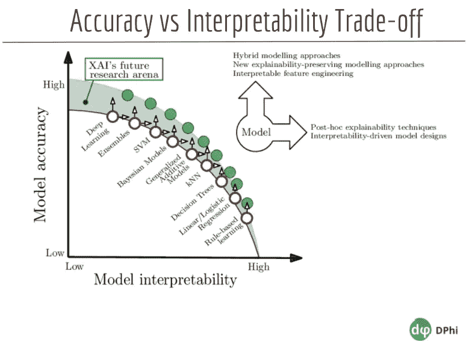
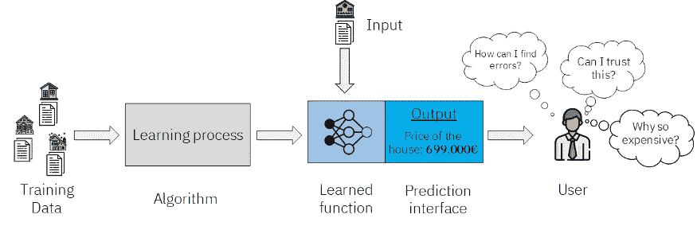
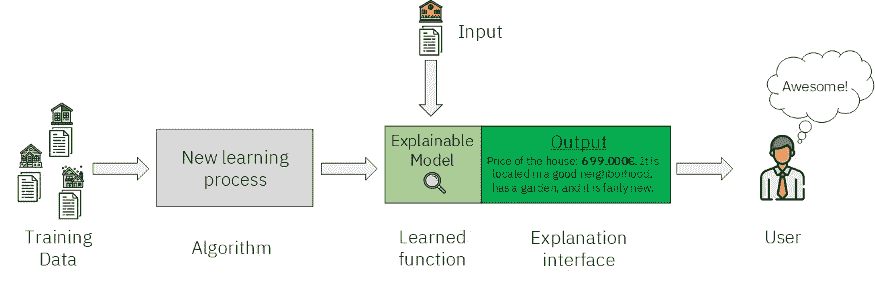

# 可解释的人工智能

> 原文：<https://medium.com/codex/explainable-ai-1d4f6bd1b186?source=collection_archive---------24----------------------->

来源:软网解决方案

> 根据普华永道的一项年度调查，绝大多数(82%)的首席执行官同意，基于人工智能的决策要想得到信任，它们必须是可解释的。

# 什么是可解释的人工智能？

可解释人工智能(XAI)是一种人工智能技术，它使整个决策过程透明、可理解和高效。换句话说，XAI 消除了感知的黑箱，并通过详细展示选择是如何产生的来解释计算、发现或预测。

可解释的人工智能将成为智能应用的基础，允许制造、金融、医疗、保险、供应链管理等行业的组织做出万无一失的判断。然而，当涉及到可解释的医学人工智能时，如果人工智能模型缺乏清晰的思维，它的决定或预测将受到挑战，被忽略，甚至被推翻。因此，预测背后的背景和推理，如临床状况、潜在的治疗方法和自动处方，可能是可疑的、灾难性的和错误的。

# 准确性可解释性权衡:

在市场中，经常听到关键客户喜欢更易解释的模型，如线性模型和树，因为它们简单、易于验证和解释。

这些类型的模型(集成、神经网络等)被称为黑盒模型。随着模型的发展，描述其功能变得越来越困难。

如果我们向利益相关者推荐我们的方法，他们会绝对信任并立即开始使用吗？不。他们会提出这样的疑问，“我为什么要相信你的模型？”为什么模型实现了它做出的决定？哪些因素会影响模型预测？

我们应该考虑提高模型的准确性，同时避免在解释中漫无目的地徘徊。必须有一个合理的平衡。

来源:D-Phi 高级 ML 训练营

探索性数据分析、可视化和模型评估指标是传统方法的例子。在他们的帮助下，我们可以了解模型的方法。然而，它们也有一定的局限性。

帮助我们克服这些限制的一些库如下:

*   **石灰**(本地可解释的模型不可知的解释)
*   **SHAP** (沙普利补充说明)
*   **ELI5** (像我 5 岁一样解释)
*   **溜冰者**

# 举例说明人工智能:

来源:走向数据科学

我们通过应用一些特定的机器学习算法，使用房屋数据训练了一个模型。

在他们学会这种算法后，我们可以为其提供新的数据，在我们的例子中是额外的住宅，它将提供关于输入房屋估价的预测。最后，一个消费者，在这个例子中是一家房地产公司的所有者，检查信息并做出判断或启动特定的操作。

从用户的保留意见可以看出，这里的困难在于预测没有任何依据。我们的模型可以有很低的误差，仍然有一定的偏差，或者时不时做出耐人寻味的预测。

来源:走向数据科学

这表明，这一程序不仅能够作出预测，而且能够证明为什么会产生这种预测。新的解释性界面提供了更多的知识，可能有助于我们的用户理解为什么这样的预测。

> 我们不仅需要拥有高性能模型的能力，还需要理解我们何时不能信任这些模型。—亚历山大·阿米尼