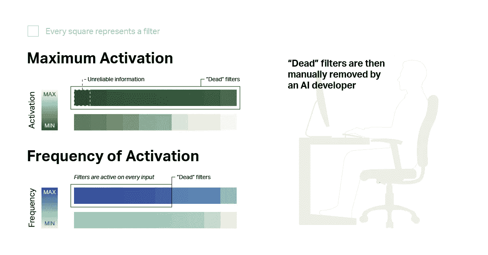
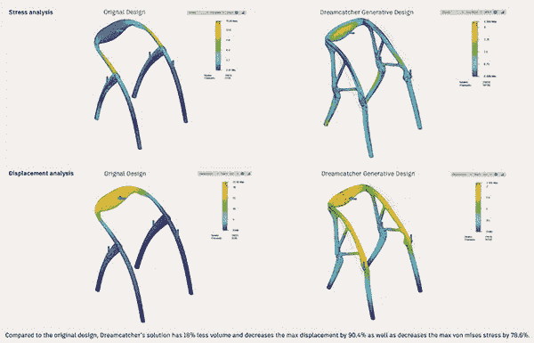
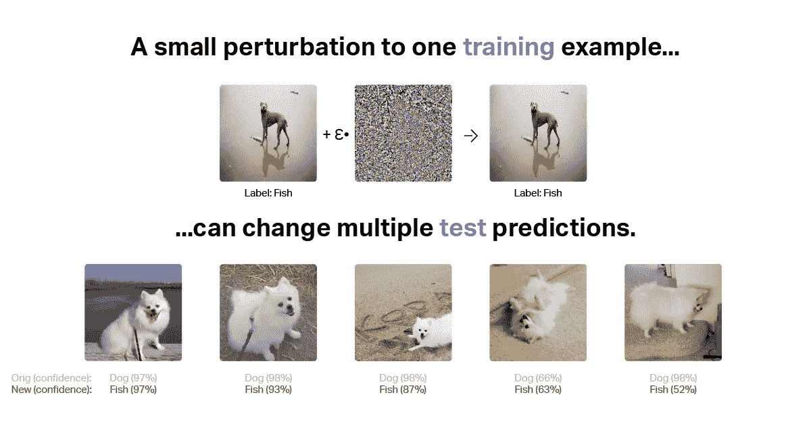
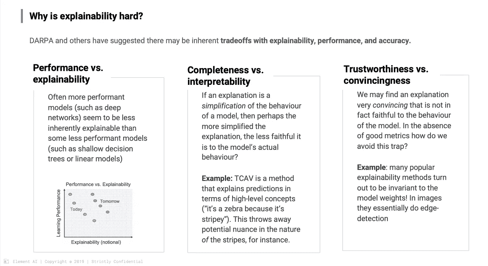
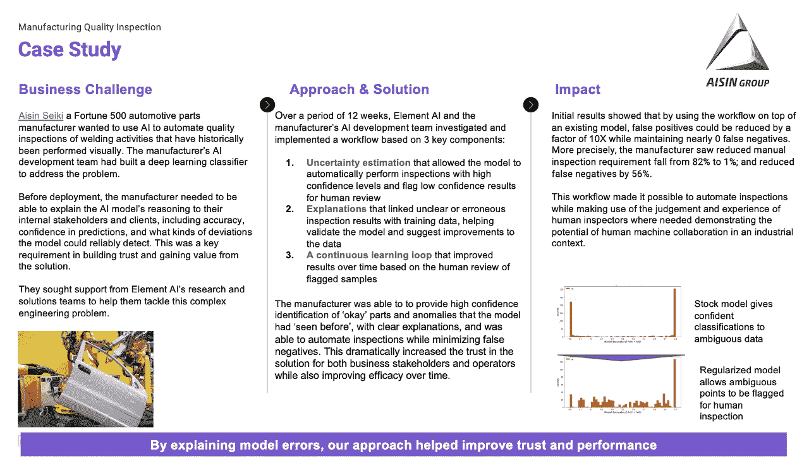
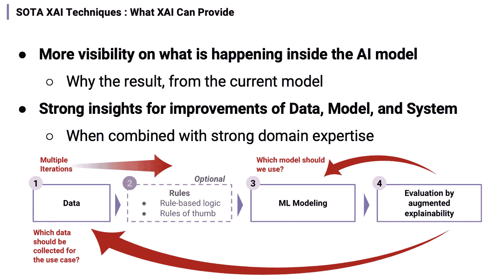

# 可解释人工智能:企业的战略工具

> 原文：<https://medium.com/codex/explainable-ai-a-strategic-tool-for-the-enterprises-7663803887f6?source=collection_archive---------13----------------------->

## 用可解释性预先指导人工智能系统设计的观点

弗拉多·帕诺维奇在 [Unsplash](https://unsplash.com/s/photos/optical-illusion-wall?utm_source=unsplash&utm_medium=referral&utm_content=creditCopyText) 上拍摄的照片

我想你们很多人都会同意 XAI(可解释的人工智能)是过去几年人工智能领域最重要的话题之一，尤其是从企业采用人工智能的角度来看。

“理解和评估人工智能系统查看输入数据和产生输出的机制非常重要，因为它有助于人工智能系统获得‘普遍性’，并成功渗透到我们的日常生活和业务流程中。”“XAI”将在建立信任和建立相互学习机制方面发挥关键作用，最终培育人类和机器之间的自然合作。

从几年前开始，学术界和工业界的各种利益相关者一直在宣扬 XAI 的重要性，不仅 IBM、Google、MS 等大型科技公司，而且 Truera、Fiddler Labs、Kindi 等利基市场的初创公司也在谈论和销售 XAI 解决方案。

在这篇文章中，我想重温一下 XAI 的基本含义是什么，企业目前应用 XAI 的共同目标，以及我们需要考虑的利用 XAI 为企业获得竞争优势的战略观点。

以下是目录:

*   “为什么”问题的复杂性
*   XAI 的本质含义和 6 个实际需要
*   当前主流关于 XAI 讨论的局限性
*   超越“普遍性”:作为战略工具的 XAI 教

2016 年 5 月 7 日，一位名叫约书亚·布朗(Joshua Brown)的四十岁男子在美国佛罗里达州驾驶他的特斯拉 Model S 轿车。这辆特斯拉 S 在美国 27A 高速公路上与一辆穿越其道路的牵引拖车相撞时处于“自动驾驶”模式。约书亚·布朗在这次事故中去世，NHTSA 在特斯拉通知 NHTSA 事故后立即开始了调查。

根据这份报告，当特斯拉 Model S 在高速公路上处于“自动驾驶”模式时，侧面涂有白色的牵引拖车正在左转。理想情况下，应该是驾驶员或者自动驾驶系统激活了刹车系统，但没有发生。司机约书亚·布朗(Joshua Brown)在以 120 公里/小时的速度行驶的 Model S 的前窗与拖车的底部相撞时受了致命伤。NHTSA 在一项初步调查中表示，“事故发生时天空非常晴朗，很难区分白色拖车卡车与背景——天空，因此 Model S 和司机没有认出拖车，因此没有激活制动系统。”

这是特斯拉首次在“自动驾驶”模式下死亡，引起了众多媒体和公众的关注。这可能是一种很自然的反应，想知道为什么会发生这种情况，每个人都对如何防止未来发生类似事件感兴趣，如果发生了，谁应该负责，最重要的是，这些技术在未来应该如何改进。

# “为什么”问题的复杂性

“为什么”这个问题非常复杂，很难回答。也许公平地说，“为什么”这个问题本身有许多不同的上下文。

从人机交互(HCI)设计师的角度来看，关键问题将是“为什么司机会相信自动驾驶系统，以至于他认为即使系统反复警告他，他也不应该看前面的路？。也许设计师会重新设计车辆软件的警告系统，或者创造一种新的机制，让用户向前看(事实上，特斯拉在这次事故后修改了自动驾驶系统，以更严格的标准运行)。

运输系统工程师会对提高各种路标的可见度感兴趣。卡车设计者或交通管理人员会问这样一个问题:如果安装不同的中间带或护栏，是否会防止车辆被拖车压碎，从而防止司机死亡。

在人工智能研究人员的情况下，问题必须是“为什么自动驾驶系统没有识别出人眼可见的拖车？”。事故发生后，特斯拉表示“不仅是自动驾驶系统，就连司机本人也无法将拖车卡车的白色一侧与天空区分开来，当时天空非常明亮。这就是为什么刹车系统在这种情况下没有接合。"随后，特斯拉首席执行官埃隆·马斯克(Elon Musk)表示，"为了防止错误的刹车操作，雷达系统已经被设置为忽略不必要的道路物体或信号。"

我们仍然不知道特斯拉使用什么技术来设计这些系统，或者解释是否真的准确。我们上面看到的所有问题都是需要在人工智能可解释性的主题下解决的问题。

如果我们接受这些不同角度的解释，接下来的问题将是如何改进计算机视觉模型——通过用更多数据进行训练来检测明亮天空中的白色卡车，或者通过某种方式改变模型架构本身。也许有必要改进雷达系统，以防止此类事件，而不产生假阳性信号。

# XAI 的基本含义:“学习”的不同观点

正如你在上面的段落中所看到的，人工智能的可解释性通常是指在识别人工智能系统的(预期的)异常行为为什么会发生的背景下，当然这是 XAI 存在的一个非常重要和合理的原因。

然而，我认为 XAI 在基本层面上的意义是 1)帮助我们人类检查和理解人工智能系统如何以有些不同的方式“识别”物体和现象，以及 2)帮助我们“学习”自己理解世界的新方法，最终超越我们的传统观点。因此，XAI 是我们需要整合到任何人工智能系统中的重要部分之一，这样我们就可以完成双向相互学习的“连续反馈循环”。

正如我在我的另一篇文章中所写的那样([“AlphaGo 与 Lee Sedol 之间的难忘比赛”](/@byoungchaneum/memorable-match-between-alphago-vs-lee-sedol-d32038750579))，如果世界上最伟大的围棋选手之一 Lee Sedol 从 alpha Go 那里获得了关于围棋比赛创造力的新视角，那么我们一定有巨大的潜力从我们日常遇到的各种人工智能系统中学习。

“XAI”应该被视为使人类和机器之间的智能协作成为可能的关键工具之一，其目标是扩展我们长期以来积累的知识和经验。

# 人工智能可解释性的实践原因

“人工智能可解释性”用于调查模型的异常行为或故障，正如我们在上文中看到的自动驾驶汽车事故的情况一样，但我们可以将 XAI 技术应用于许多其他目的。

有许多文章和论文描述了我们为什么需要 XAI 的实际原因，我认为大多数原因可以归为我下面提到的六类中的一类:

> *1。一般化*

人工智能模型训练过程中的一个基本最佳实践是将训练数据分成不同的集合。众所周知，可以有基于“验证数据集”执行相同性能水平的 AI 模型，但与“测试数据集”有显著不同。换句话说，模型在“验证阶段”的表现并不能作为这个人工智能模型在“真实世界”中表现如何的有效指标。

如果一个模型对训练数据很有效，但对真实世界的数据无效，我们称之为“模型不通用”。如果我们能够解释模型在计算过程中关注哪部分数据，模型开发人员将能够选择一个更有可能在验证数据集上具有相同性能的几个模型中进行“归纳”的模型。

【Ribeiro 2016】一个坏模型在“哈士奇 vs 狼”任务中预测的原始数据和解释

让我举一个众所周知的例子。想象一个经过训练可以区分“哈士奇”和“狼”图像的计算机视觉模型。在开发过程中，该模型在区分狼的图像方面表现出较高的性能。但当部署在真实环境中时，该模型重复地将“哈士奇”的图像识别为“狼”，而显示的图像对于人眼来说显然是“狼”的图像。

使用可解释性技术，我们观察 AI 模型正在查看图像的哪些区域以确定它是否是狼的图像，我们发现该模型将图像中的“雪”与其图像是狼的结论强烈关联起来。由于在训练过程中使用的图片中，有许多背景包括“雪”的“狼”的图片，这种关联就发生了。

如果在训练过程中确定了这个因素，那么开发人员就会意识到没有正确收集训练数据集，并且会预测模型不可能“概括”到现实环境中。

在某些情况下，我们会遇到“违背”我们直觉的解释。重要的是，利益相关者——不仅是开发人员，还有人工智能系统的用户——自己调查数据或现象，并应用可解释的技术，以便他们可以确定现象是否实际上很重要或需要拒绝。

> *2。合规性、问责制和公平性*

对于处于强监管环境中的行业(例如，金融服务行业)，通常必须通过人工智能模型提供预测的“解释”。例如，在美国，根据《平等信贷机会法》(ECOA)，申请贷款的客户有权要求贷款人解释申请被拒绝的原因。因此，将人工智能服务引入这些业务领域需要使用“可解释的”人工智能模型。

由于人工智能行业还处于起步阶段，监管环境还不成熟，但正在快速变化。欧盟(EU)最近颁布了通用数据保护条例(GDPR)，使欧盟公民能够“请求与任何自动化决策相关的逻辑的重要信息”。在许多情况下，这被理解为“解释的权利”，所以如果这是一个基于人工智能的决定，可以影响欧盟公民，那么很可能也需要可解释性。

大卫·汉森在推特上谈论苹果卡应用程序算法中的偏见

2019 年的一个事件可能就是一个例子。苹果已经与高盛和万事达合作发布了实体信用卡。有人指出，人工智能模型在对用户施加信用限制方面显示出与性别有关的社会偏见。

2019 年 11 月初，在 Apple Card 发布几个月后，“Ruby on Rails”的开发人员大卫·汉森(David Hansson)在推特上说，苹果的算法说，即使他们提交了相同的税务数据，并在一起生活了很长时间，他妻子的信用卡限额也只有他的二十分之一。

包括史蒂夫·沃兹尼亚克(Steve Wozniak)在内的许多人都经历了类似的情况，并要求纠正 Apple Card 订户信用额度计算算法。而纽约金融服务部也开始调查苹果和高盛的信贷限额设定做法是否违反了纽约州法律。

确定如何处理和找到这些问题的解决办法并不是一件简单的事情。仅仅因为模型从一般公众的角度显示了“歧视性”方面，就简单地“消除”有问题的特征，可能不是最佳解决方案。需要考虑算法运行的具体环境，以深入理解和应用对公共利益和私人自主权之间的紧张关系的适当控制(例如，战略选择)。

如果在一个非常重要的决策过程中出了问题，也需要一个确定责任的方法。如果问题出在人工智能模型的不准确预测上，那么只有我们理解了错误的原因，才有可能确定负有责任的一方。你很容易猜到这是一个非常复杂的领域，它将我们引向人工智能系统开发领域之外的社会和法律讨论。然而，部署在任务关键型商业环境中的人工智能系统在开发时必须考虑到这种“责任”需求。如果我们可以解释错误预测的原因，就可以确定责任的来源，这样我们就可以计划和执行解决方案，以防止将来发生同样的问题。

人工智能模型学习嵌入数据集中的我们自己的偏见和成见。有大量的例子——语音识别系统，如 Siri 或 Alexa 误解了非裔美国人的声音[ [Re: Knight 2017](https://www.technologyreview.com/2017/08/16/149652/ai-programs-are-learning-to-exclude-some-african-american-voices/) ]，或者图像识别系统在女性的性别和厨房空间之间建立了强有力的关联[ [Re: Simonite 2017](https://www.wired.com/story/machines-taught-by-photos-learn-a-sexist-view-of-women/) 。

我们不应该盲目信任一个可以学习偏见的人工智能系统。如果控制不当，这些人工智能系统会再次放大和复制我们的偏见，从而进一步加剧社会经济问题。类似于确定责任在哪里的问题，可解释性可以在确定 AI 模型中可能存在的偏差方面发挥关键作用。

> *3。调试&增强 AI 模型*

虽然人工智能模型可以是非常强大的工具，但不仅训练过程艰难，而且有时不容易概括到我们想要的程度。如果模型仍然是一个黑盒，找到错误的原因并改进模型是困难和费时的。为了决定是增加模型结构中的神经网络层的数量还是在特定类别中获得更多的训练数据集，模型设计者必须检查失败案例，开发假设，并通过包括修改和再训练在内的实验来验证它们。

考虑到一些最新的人工智能模型需要几天、几周或更长时间来训练，并且人工智能模型的开发本身是一个“迭代”过程，很容易假设这个调试过程是一项非常昂贵的任务。可解释性技术，如果应用得当，可以提供为什么模型做出错误预测的线索，并使模型设计者能够识别真正需要更快解决或优先解决的潜在问题。

在人工智能模型的调试过程中，通常使用几种可解释技术，包括:

*   一种提取有助于模型输出的输入元素的方法[Ribeiro 2016，Shrikumar 2017，Hara 2018]'可以帮助我们移除特征或调整它们的权重，以防它们引起过多关注。它还能帮助你确定你的数据中隐含着什么样的“偏见”。
*   通过“在人工智能模型中找到对特定预测影响最大的训练“样本”的方法[Koh 2017]”，我们可以从样本数据中推断出数据集中的问题，或者提供关于数据的提示以及未来需要获得的数据的互补方向。
*   一种在操作过程中发现和可视化构成人工智能模型的每个元素(例如，深度神经网络中的每个层和神经元)的特征的方法[Olah 2018]'帮助我们确定该元素是否从其输入值中找到了重要的概念或特征。例如，DeepEyes 视觉分析系统允许对深度卷积神经网络的各个层进行详细分析，以找到并删除总是启用或很少活动的“死过滤器”。

可解释性:DeepEyes 视觉分析系统

> *4。人在回路设计*

人工智能中“人在回路”的概念通常是一种结构，其中算法提供诸如暗示、建议等信息。“人类工作者”需要根据信息做出判断并采取行动。这些“人在回路”系统的有效部署自然需要可解释的技术，这些技术允许人类工作者理解算法，并在与它交互时预测它将如何反应。

虽然在所有人工智能系统中引入“人在回路中”的概念很重要，但它的重要性似乎已被广泛接受，尤其是在人工智能辅助设计工具中。在许多情况下，这些工具基于创成式模型来设计特定的对象(例如，引擎、船只、车辆)，您可以通过调整虚拟世界中的各种变量来创建这些对象，而无需进行创建真实对象所需的物理工作。

Elbo 椅子的模拟研究结果，这是使用 Autodesk 创成式设计技术确定最佳椅子形状的早期项目

上图是 Autodesk 基于人工智能的设计工具 research concepts 的屏幕之一，它允许系统设计各种椅子，并确定最佳的椅子形状，同时使用创成式模型调整系统提供的潜在空间中的变量。您可以移动图示右侧显示的滑块来更改椅子设计所需的不同元素。

这种方法不限于设计“物理”对象，还可以应用于解决传统运筹学(OR)等问题，例如，通过 skillset 安排医院员工的每小时移动。在这种情况下，排班员会将各种约束输入系统，以优化护士的排班/通道，相应地调整工作路径，或者从系统推荐的各种候选路径中选择最优值。

有些人可能会认为，对于寻找这样一个最佳解决方案的系统，你可以定义一个数学量化的合意性函数，并允许在生成模型上运行的系统找到“最佳”设计值。这意味着在设计过程中可能不需要“人工干预”，或者只有在目标函数的设计完成后才需要这种干预。

然而，这种方法对于解决大多数有趣的优化问题来说可能是不现实的(在许多情况下是不可能的或不可取的)。

让我们看看车辆设计的例子。

首先，车辆设计过程具有各种美学和营销考虑和决策点，很难简单地留给系统。例如，有一个车辆设计术语称为加州耙(也称为加州倾斜或牛仔耙)。这是一种有助于销售汽车的设计，给人一种汽车前部比后部略低的印象。虽然当然可以尝试在“车辆线倾斜度”的名称下量化该元素并将其纳入目标函数，但这些美学元素的趋势会随着年龄、世代等而变化，并需要根据设计目标进行调整。在这种情况下，建议在“人在回路”的设计中重视该特性，并由人来监控这些要素和其他要素之间的相关性，并做出最终的设计决策。

此外，我们需要考虑产品本身之外的外部约束——这些约束通常来自制造过程的复杂性。想象一下这样一种情况，工厂的装配工人必须以非常艰难和不自然的角度焊接用 AI 系统设计的车辆的某些部件。必须有一些反馈过程来改变车辆的设计，反映装配工人的意见。

最终，仅由人工智能辅助设计工具计算的“最佳”设计可能不是最佳的，因此不应该在没有任何干预或控制的情况下盲目接受。过程和中间结果应该容易被人或设计者获得，用工具集帮助他们在整个设计过程中前进。那么设计者如何与算法交互，调整算法的输出呢？在我们所看到的车辆设计例子中，如果你已经部署了滑块，甚至没有显示它们的能力，你改变它们并希望设计师能产生良好的设计结果，这就太过分了。我们需要为设计者提供“直观”的工具，让他们能够容易地理解每个滑块的作用，并且总体来说，开发一个设计工具在改变设计输出时操作逻辑的心智模型，以便设计者能够更好地预测他们需要进行的活动的顺序，以实现最佳的设计结果。

幸运的是，随着大量研究的完成，交互设计和人机交互(HCI)已经相当成熟，所以你可以在人工智能系统的背景下找到或创建适当的指南。加州大学圣地亚哥分校设计实验室主任唐·诺曼(Don Norman)在他的代表作《日常事物的设计》中总结了七个关键的设计原则如下:

*   可发现性:应该很容易理解目标的当前状态，此时你能做什么，位置，时间。
*   反馈:由特定动作产生的新状态中的信息应该被充分地和有上下文关系地提供。
*   概念模型:系统的结构和功能作为一个整体应该容易和直观地理解。
*   启示:你应该从服务/产品使用场景中自然地引出用户想要的行为。
*   符号:设计元素需要以加强启示的方式展开，并帮助用户自然地识别所需的动作。
*   映射:用户应该能够理解两个不同元素之间的关系，而不需要特殊的解释或帮助。
*   约束:应该提出适当的行动方针，以尽量减少不必要的行为。

所有七个原则都与可解释性密切相关。“好的解释”的一个重要元素——也许是最重要的——是帮助用户理解系统的“概念模型”。“映射”与“可解释的表征(参见[https://www.youtube.com/watch?v=N8ClViZqJTQ](https://www.youtube.com/watch?v=N8ClViZqJTQ))或“解开的表征(参见[https://towards data science . com/this-Google-experiment-destroyed-of-some-of-the-assumptions-of-of-of-presentation-learning-f 430334602 a 9](https://towardsdatascience.com/this-google-experiment-destroyed-some-of-the-assumptions-of-representation-learning-f430334602a9)”直接相关，“解释”本身就是一个使用多个“符号”交换“反馈”的过程。

> *5。防御恶意攻击*

在人工智能系统的背景下，“对抗性攻击”是以人类无法识别的方式操纵模型的输入，从而使模型的预测结果无效或误导。

引入人类无法理解的噪音导致错误预测的例子

以上是对抗性攻击如何运作的一个例子。一个 CNN 模型，虽然在识别几种狗的图像为“狗”方面表现良好，但当输入图像中加入一点噪声时，会突然将狗误认为鱼。如你所见，噪声引入之前和之后的图像对于人眼来说并不混乱。

相反，“对抗性防御”旨在保护和加强模型免受此类攻击或操纵。多年来，对抗性机器学习一直是最具侵略性的研究领域之一，因为在现实世界环境中部署人工智能模型需要这种鲁棒的模型。

XAI 和对抗性机器学习密切相关。可解释性技术也可以用于为攻击创建训练样本([通过影响函数](https://arxiv.org/pdf/1703.04730.pdf)理解黑盒预测)或为防御找到这些数据([攻击符合可解释性:敌对样本的属性导向检测](http://papers.nips.cc/paper/7998-attacks-meet-interpretability-attribute-steered-detection-of-adversarial-samples.pdf))。同样众所周知的是，用于使模型反向更加稳健的几种方法会产生“更具可解释性”的模型([通过调整深度神经网络的输入梯度](https://www.aaai.org/ocs/index.php/AAAI/AAAI18/paper/view/17337/15866)来提高其对抗性稳健性和可解释性)。

有些人甚至认为，人工智能模型之所以能够在只有一点噪音的情况下轻松做出错误预测，根本原因是因为“非鲁棒特征”，这些特征具有很高的预测性，但来自输入数据的分布信息的不稳定和不可理解的特征。([对抗性例子不是 bug，是特性](https://arxiv.org/pdf/1905.02175.pdf))。换句话说，要制作一个强大的模型，你需要构建一个强大的特征表示，它比普通的机械表示更能引起人类的理解和感知。

> *6。基于假设的新知识发现*

解释人工智能模型预测结果的任务通常被理解为通过与基于领域知识和常识的先前趋势或模式进行比较来解释模型背后的“思维过程”。

然而，在一些科学领域，如生物学、物理学，由于没有先验知识，实验方法受到重视，试图“解释”本身在创造新假设中起着重要作用。在制药行业，我们通过实验室的基础实验和随后的临床试验来评估新的假设。如果这个假设被证实，这是一个新的科学发现。【乱弹 2016，Schütt 2017】。所以在这个科学领域，可解释性成为应用人工智能的一个更重要的要求。

另一方面，在强化学习领域，模型预测的政策描述被认为不仅仅是潜在的假设，更接近于真实的“理论”。这是因为我们可以假设代理在与模拟环境交互时已经对假设进行了隐含的实验评估。

# XAI 主流讨论的局限性:关于 XAI 作为“普遍采用人工智能”工具的观点

虽然关于 XAI 的讨论背后的大多数实际原因都属于我前面提到的六个类别，但所有这些原因通常都是为了同一个目标——将 XAI 作为一种工具，支持人工智能系统的安全和广泛采用。

但是，这是 XAI 的最终目标吗？

在人工智能的背景下,“普遍性”意味着商业、社会和我们日常生活中接受人工智能的最低条件和基础结构，作为基于信任的合作元素。使用 XAI 作为获得“普遍性”的工具当然意义重大，因为人工智能仍处于采用的早期阶段，尤其是在企业技术栈的背景下。

但 XAI 有着巨大的潜力，它不仅仅是一个确保安全和普遍采用人工智能的工具。让我们来看看汽车行业的早期发展，以获得一些见解。

1924 年福特 T 型车宣传册(国家汽车历史收藏)

谁也不能否认，以 T 型车为代表的福特一体化生产流程，在普及汽车，让大家都上路方面起到了非常大的作用。当 T 型车开始生产时，福特的生产方式和以前没有太大的区别，仍然依靠操作者的手工劳动。然而，从 1910 年高地公园工厂的运营开始，该流程进行了重组，并于 1913 年出现了使用传送带的一体化生产流程。生产的效率和速度迅速提高，随着零件采购量的增加，车辆的价格越来越低，导致车辆的价格从 1910 年的每辆 900 美元下降到 1925 年的 260 美元。以这种‘实惠’的价格为武器，T 型车开启了汽车普及的时代，创下了历史上第一个 1500 万辆的产量。

但随后，随着标准化汽车和可承受的价格，汽车“普及”到普通大众，消费者很快失去了购买汽车的兴趣，销售增长直线下降。更糟糕的是，竞争对手在其工厂采用集成生产流程的运动导致了激烈的竞争，福特不久后就将最高市场份额拱手让给了通用雪佛兰。

在这里，自 1923 年以来一直领导通用汽车的阿尔费雷德·斯隆用一种新的管理哲学推动了汽车行业的下一代增长，这种哲学现在被称为“斯隆主义”。阿尔费雷德·斯隆是商业史上具有传奇色彩的领导者之一，他不仅为通用汽车设计并引入了现代分权公司结构，还以“适合各种钱包和用途的汽车”为口号，奠定了当今细分和差异化营销战略的基石。

厄尔和概念车“火鸟 II”

自从担任总裁以来，斯隆在价格、颜色和设计上追求差异化，使通用汽车不断壮大。他对“以设计为导向的汽车设计”充满热情，并与负责通用汽车设计部门的厄尔密切合作。斯隆与哈雷的合作经常被比作苹果公司的史蒂夫·乔布斯和乔纳森·伊夫的关系。不可否认，斯隆和厄尔在开启“汽车造型时代”的过程中共同发挥了关键作用，加强了“艺术和色彩”部门的地位——以前经常被其他人称为“发廊”——领导工程和销售部门。

事实上，随着 T 型车的出现，直到第二次世界大战，除了一些提高驾驶便利性的技术外，量产车的基本结构和技术没有太大变化。阿尔费雷德·斯隆坚信，汽车公司的根本不在于“制造汽车”，而在于“创造利润”，他花了很多心思和精力“在利用通用技术的同时，将设计作为差异化因素的核心——这些技术与竞争对手的最佳技术处于同一水平。”。

我们所知的“有计划的淘汰”——一种规划或设计产品的政策，人为地限制产品的使用寿命或故意设计脆弱的设计，使其在某个预先确定的时间段后变得过时，在该时间段内其功能递减或突然停止，或可能被认为不时尚——来自斯隆的哲学，这是我们今天认为理所当然的“整容”的开始。

我之所以谈论汽车行业的成长史，乍看起来似乎与“XAI 的作用”无关，是因为在新技术被引入市场并变得“可及”后，它们必须处理“差异化”的问题——如何在特定行业和公司的背景下，将技术作为竞争的武器。从这个角度来看，除了需要 XAI 的一般原因之外，我们还需要一种战略方法和考虑，即“如何利用 XAI 来增强企业的能力，并使自己从竞争对手中脱颖而出”。

# 超越“普遍性”:作为战略差异化工具的可解释人工智能

从以下两个角度来看，将 XAI 作为“获得竞争优势的战略工具”是有意义的:

> *XAI 研究和采用所需投资的论证*

原则上，从公司决策的角度来看，将一个额外的“可解释性”层放在一个“看似工作”的人工智能模型上，或者将模型本身改变为“可解释的”，需要相当大的投资。

解释困难的三个主要原因

通常，你可能不得不处理诸如“性能下降”这样的问题，因为更新现有的人工智能模型是可以解释的。在许多情况下，这种“权衡”的考虑是不可避免的，因为为了充分发挥机器学习模型的潜力，最终用户或关键利益相关者需要能够理解机器学习模型如何工作及其操作边界。

(注意:虽然我们今天使用的大多数机器学习模型被认为在模型性能和可解释性之间有一种权衡，但不清楚这种权衡是否是“机器学习”技术本身固有的。虽然麻省理工学院在 2019 年 9 月发布的论文表明，机器学习模型中的鲁棒性和准确性之间存在内在的权衡，但一些最新的论文却表明，权衡并不是机器学习技术整体固有的。)

因此，将 XAI 定位为“战略投资”和“有助于公司竞争优势和业绩的任务”对于证明和积极引入 XAI 非常重要，而不是仅仅被认为是公司由于外部压力因素(例如，应对监管政策或客户投诉)而不得不采取的措施。

> *针对特定行业和公司的差异化目标优化的机器学习系统的实施*

仅仅“检查”和“理解”为什么当前人工智能模型输出某些值的方法不足以最大化人工智能系统的商业影响。通常情况下，当您实际上必须在更广泛的层面上(包括内部和外部的利益相关者)查看用例，并应用 XAI 技术来满足特定需求以提高该人工智能系统的商业价值时，您最终会以孤立的方式或千篇一律的方式使用 XAI 技术。

如果你将 XAI 技术应用于商业目标的背景中，XAI 可以成为一个很好的工具(而不是负担),不仅可以获得“信任”,还可以同时获得“商业绩效”。

让我们来看看 Element AI 与其客户的案例研究:

爱信精机案例研究—可解释性

日本汽车制造巨头丰田公司拥有多家一级供应商。其中之一是爱信精机，一家非常大的汽车零部件供应商，如动力总成、底盘和车门。

2017 年，爱信精机组建了一个由数据科学家、机器学习工程师和研究人员组成的团队，建立了一个基于视觉(使用 U-Net)的深度学习系统，以确定其产品的焊缝是“正常”还是“有故障”。虽然实验室表现不错，模型准确率超过 90%，但是爱信精机的客户端丰田发现 FN(假阴性；被爱信精机确认为“正常”产品并交付给丰田，但后来在丰田工厂发现“故障”)这是一个重要问题，使丰田难以信任爱信精机的人工智能系统，也难以优化丰田与爱信精机汽车零部件相关的营运资金。因此，爱信精机主动大幅减少了 FN 的数量，并建立了持续质量改进体系。

通过与爱信精机(Aisin Seiki)和 Element AI 的联合研究项目，我们回顾了大量的 XAI 技术，以及将这些技术纳入公司质量检测系统的流程。

这里值得注意的是，对 XAI 技术的“审查”和“选择”是专门基于在丰田和爱信精机之间建立“信任”并对两家公司的账目产生“营运资本减少”影响的战略要求。

联合团队得出结论，“影响函数”和“决策不确定性”技术的结合是满足团队要求的合适工具，并在现有人工智能模型上建立了一个额外的可解释层。因此，联合团队能够改善爱信精机的焊接零件质量管理体系，为爱信精机和丰田的“战略使命”做出贡献。

XAI:在业务绩效背景下持续升级深度学习产品的系统

# 结束语

众所周知，许多公司已经做了，还在做许多人工智能技术的实验，以改善业务流程，开发新产品和服务。我认为公平地说，在许多情况下，这些实验的重点是确保人工智能模型的“性能”从“简单衡量”的角度来看能够达到“可接受”的水平。

在未来，XAI 作为“人工智能的普遍采用”的工具的作用将越来越大，以帮助我们理解人工智能模型内部工作的“为什么”和“如何”。

此外，意识到 XAI 作为战略差异化工具的潜在用途并将其领域知识和能力与 XAI 技术相结合以推动业务绩效改善的公司，将能够将自己转变为“真正的人工智能优先”公司，在人工智能时代领先于竞争对手。