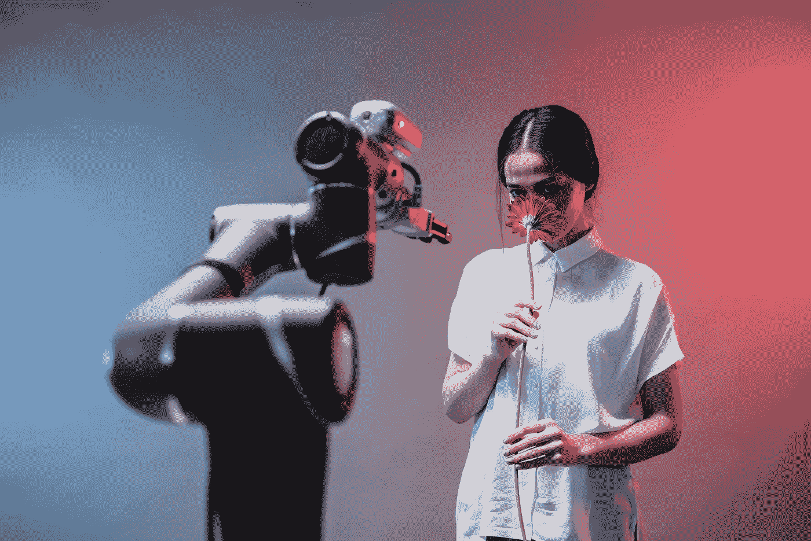

# 解释 AGI 和 open ai——技术的未来

> 原文：<https://medium.com/codex/explaining-agi-openai-the-future-of-technology-cf7952c0d3ba?source=collection_archive---------4----------------------->

## 未来技术

## 埃隆·马斯克的创新

照片由来自[佩克斯](https://www.pexels.com/photo/man-in-white-button-up-shirt-holding-red-and-black-corded-headphones-8438982/?utm_content=attributionCopyText&utm_medium=referral&utm_source=pexels)的[帕维尔·丹尼柳克](https://www.pexels.com/@pavel-danilyuk?utm_content=attributionCopyText&utm_medium=referral&utm_source=pexels)拍摄

# AGI——人工智能的进步

W 帽子如果有人告诉你，世界上最强大的人工智能已经不在科幻小说的范畴了？