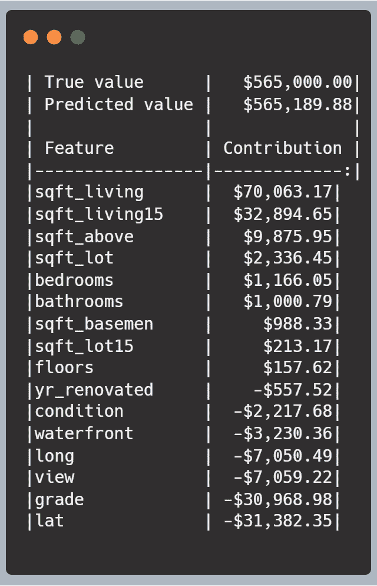
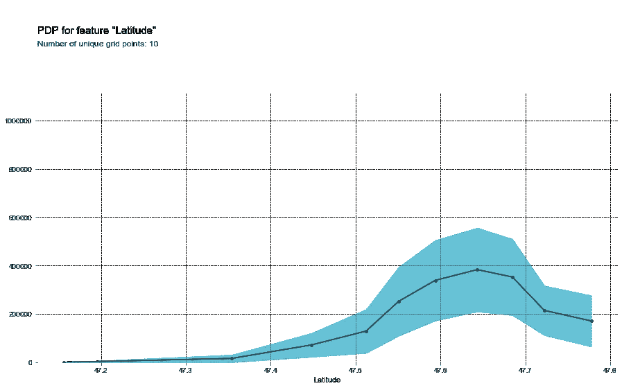

# 解释生产中的复杂模型:SHAP 演练

> 原文：<https://medium.com/codex/explaining-complex-models-in-production-shap-walkthrough-5c3f69a85456?source=collection_archive---------22----------------------->

机器学习正在成为我们商业和个人生活中越来越重要的一部分。ML 模型有助于使业务运营更快、更可靠、更具可扩展性和成本效益。然而，随着我们将更多的责任移交给 ML 驱动的过程，理解我们的模型如何做出决策的需求变得越来越重要。

更简单的模型可能更容易理解，但在许多情况下，它们的性能可能会受到限制。例如，在线性回归中，系数告诉我们每个特征对预测贡献的大小和方向。此外，它们主要用于要素与目标具有线性关系(或者可以变成线性关系)的情况。但在其他情况下，我们可能希望使用更复杂的模型来提高准确性。

这些更复杂的模型通常是简单线性模型的非线性组合，决策树的集合，甚至是其他复杂模型的集合。它们可能具有许多许多系数(或权重)和非线性，在不同的情况下贡献不同的量。通常有如此多的权重，以至于基本上不可能手动/精神上理清所有不同的效果来了解模型在做什么。因此，随着模型变得越来越复杂和精确，它们变得越来越不透明，诊断它们如何以及为什么做出某些预测变得越来越困难。

理解和解释我们想要在生产中使用的这些更复杂的模型不仅出于法律和道德原因是至关重要的，而且在我们将重要决策交给自动化系统之前具有坚实的商业意义。对于这些更复杂的模型，我们必须尝试一些间接的方法。两种更常见和有用的方法是 [Shapley 值](https://en.wikipedia.org/wiki/Shapley_value)，这是一种估计特定特征对特定预测的影响的方法，以及[部分相关和个体条件期望图](https://scikit-learn.org/stable/modules/partial_dependence.html)，这两种方法用于可视化特征和预测值之间的相互作用。

# 沙普利值

Python [SHAP](https://github.com/slundberg/shap) 包非常有用，常用于分析模型。SHAP“解释”了模型对给定输入的预测，方法是根据模型中各种功能组合的影响，估计模型的每个输入对该预测的贡献。

例如，我们可以使用 King County (华盛顿州西雅图地区)的[房屋销售数据集来创建预测价格的模型。这个特定的数据集有 17 个特征，其中包括您可能期望的生活空间的平方英尺数、纬度、经度、卧室数量等。](https://www.kaggle.com/datasets/harlfoxem/housesalesprediction)

我们可以使用 SHAP 软件包来检验这些特征对个体预测的影响。在本例中，真实销售价格为$565，000.00，而模型预测的价格为$565，189.88。SHAP 分析告诉我们，sqft_living 贡献了大约 70k 美元，而经度和纬度(位置)分别扣除了大约 7k 美元和大约 31k 美元。将这些值添加到基础(平均)预测值$536，992.23，以得出最终预测的解释。

# 部分相关和个体条件期望图

除了解释不同特性对特定预测的影响，我们还经常想知道某个特性的值如何影响整体预测。部分相关图(PDP)和相关的个体条件期望(ICE)图是可视化特征和预测值之间的相互作用的有用方法。在每个图中，感兴趣的特征的值是变化的，而其他的保持不变。然后用 PDP 的标准偏差对预测值进行平均，或者单独绘制 ICE 图。这使我们能够估计改变不同变量的值如何改变模型的预测。

下面是我们模型的 Latitude 的 PDP，根据数据样本计算得出。它显示了在保持所有其他值不变的情况下，各种纬度值对预测的预期影响和方差。注意西雅图的纬度大概是 47.6 度。我们可以看到，平均而言，随着房子越来越靠近西雅图，纬度对价格的积极影响越来越大，位于 47.6 度以北比位于以南对价格的积极影响更大。

这是一个特征对预测的非线性影响的明显例子。

# 在生产中使用 SHAP 的挑战

我们已经看到这些方法对于理解我们的模型是有用的。特别是 SHAP 软件包可以分析 Shapley 值并创建 PDP/ICE 图；对于个体数据科学家来说，使用 Python 检查他们的模型是非常有用的。

然而，能够解释模型在生产中真实数据上的行为也很重要。这种能力可以帮助数据科学家在模型运行的实际环境中快速有效地诊断奇怪的模型行为。它可以很好地补充高级模型可观测性特性，如[漂移检测](https://www.wallaroo.ai/blog/delivering-ai-value-with-wallaroo-observability-and-model-insights)。在要求关键决策过程透明的行业中，生产模型的易理解性是必须的。

在 Wallaroo，我们正致力于在我们的平台内提供基于 SHAP 的模型解释能力，为数据科学家和分析师提供良好的用户体验和有用的信息。为了使 SHAP 模型可解释性成为生产系统中的常规工具，我们希望能够:

*   根据需要或定期对特定模型或模型管线运行 SHAP 分析。
*   对生产中做出的预测进行分析，而不仅仅是对我们的培训和测试数据进行分析。
*   解释特定特征的效果，无论是总体效果还是对特定预测的效果。
*   拥有一个直观的用户界面，用于提交 SHAP 工作请求和分析/可视化结果。
*   在尽可能减少对生产系统的影响的同时，完成以上所有工作。

但是在生产环境中运行 SHAP 比在数据科学家的个人环境中运行要复杂一些。

我们不会在这篇文章中深入讨论 SHAP 如何工作的细节(这里有对沙普利值[的很好解释](https://christophm.github.io/interpretable-ml-book/shapley.html)，这里有 SHAP 方法[的很好解释](https://christophm.github.io/interpretable-ml-book/shap.html)，除了说要估计给定特征对个体预测的贡献，SHAP 必须考虑很多假设的情况。回到我们的房屋示例，如果我们想要解释 sqft_living 对房屋 A 的预测价格的影响，那么 SHAP 算法必须考虑模型对其他假设房屋的预测，这些房屋的 sqft_living 值与房屋 A 相同，但卧室、浴室等的值不同。它还必须考虑与房子 A 有相同的平方英尺和卧室数量，但有不同数量的浴室、楼层等的房子。假设情况的数量可能会变得很大，尤其是随着功能数量的增加。因此，SHAP 的计算量非常大。

此外，SHAP 必须能够访问运行模型的输入和推理日志，以便生成具有适当分布的合成数据，并正确估计边际效应。该算法还必须使用与生产模型管道相同的模型管道来生成综合推断:也就是说，输入不仅要经过模型，还要经过任何必要的预处理和后处理步骤。

因此，要在生产环境中运行 SHAP，我们必须找到一种方法，而不会对模型管道上的服务质量保证产生负面影响。我们不想引起资源争夺。我们不想用合成数据污染推理日志。

找到最佳解决方案将是一个建筑和工程挑战，但我们认为回报是值得的。这是沿着 ML 最后一英里旅程的下一个合乎逻辑的步骤。