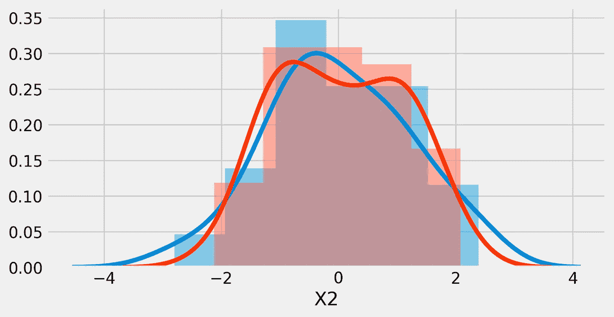
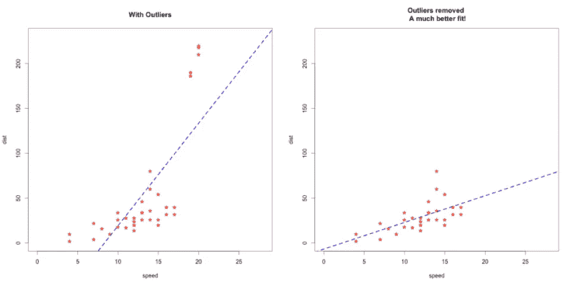
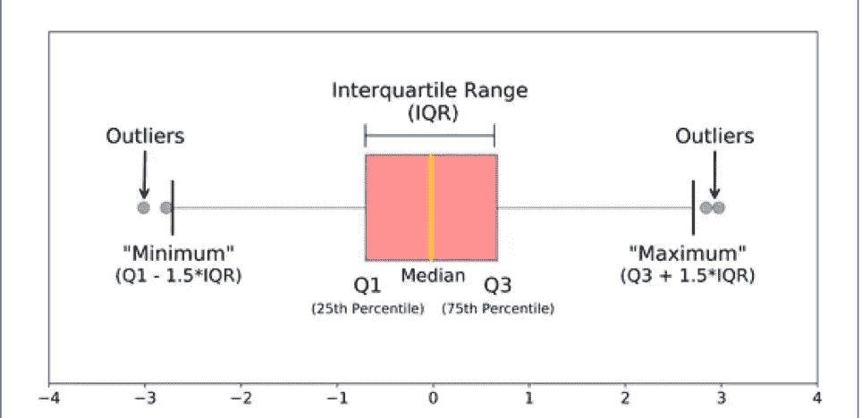
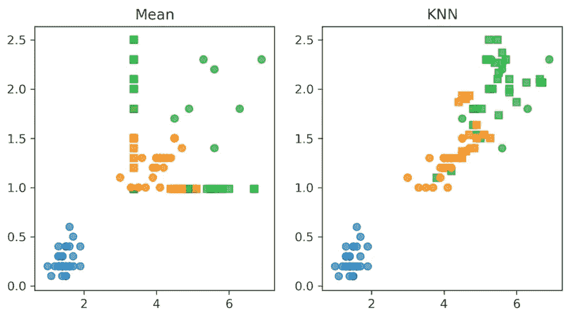
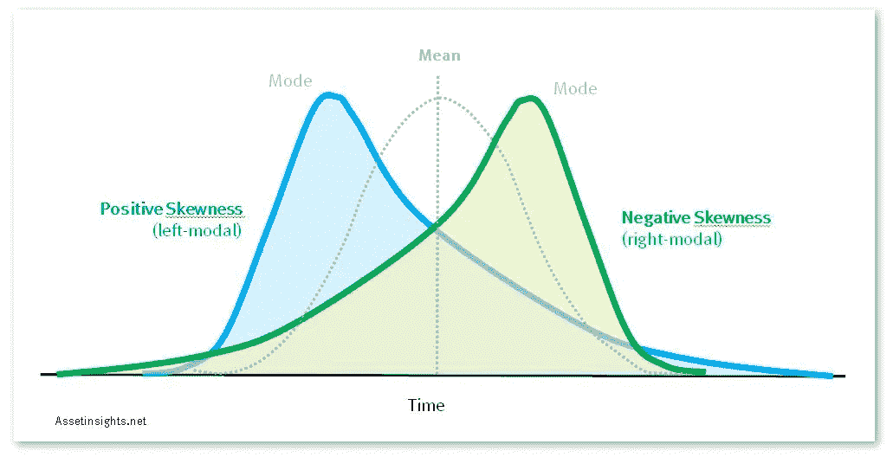
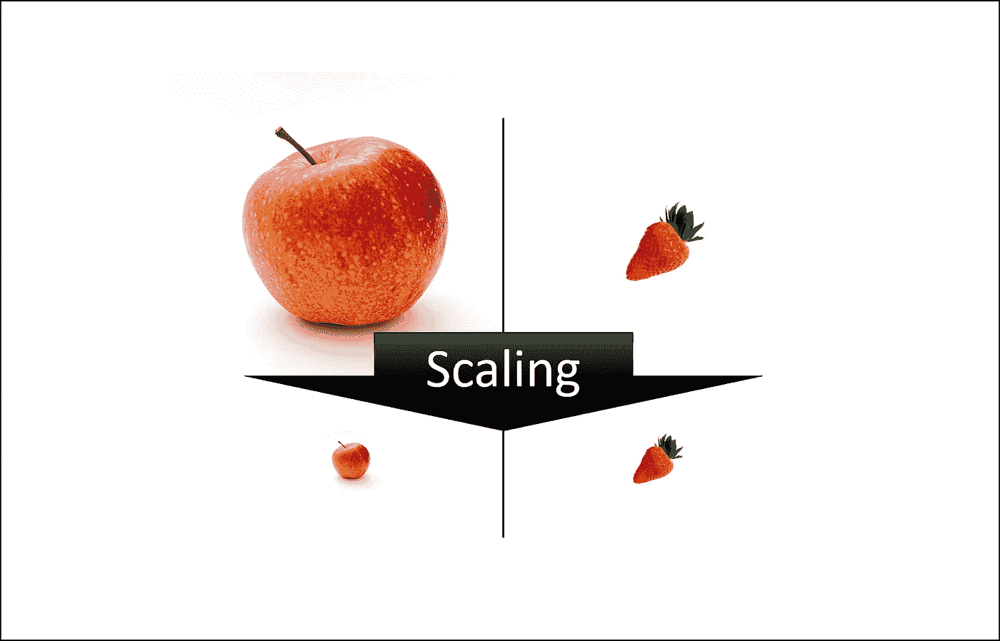
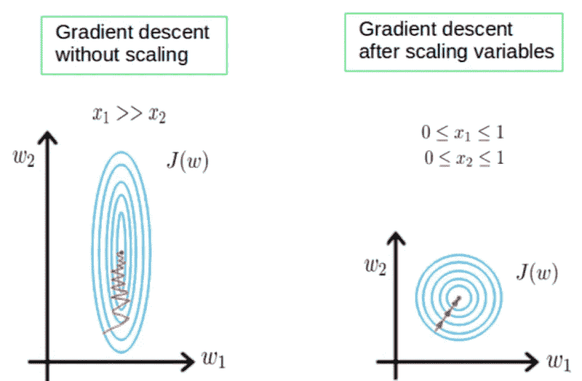

# 探索性数据分析(EDA):清理数据的完整路线图

> 原文：<https://medium.com/codex/exploratory-data-analysis-a-roadmap-for-cleaning-3e01a0d694?source=collection_archive---------1----------------------->


卢卡·布拉沃在 [Unsplash](https://unsplash.com?utm_source=medium&utm_medium=referral) 上的照片

有人可能会想，EDA 的目的是什么，当最终关系在建模期间确定时，清理、多变量和双变量分析的目的是什么。

嗯，这幅画比它所在的画框大得多。简而言之，数据分析和预处理本质上是 EDA 的全部内容，它决定了你的模型性能如何，或者你的模型预测群体行为的能力如何。

为了节省时间，我们将只关注 EDA 的清洗和预处理部分，这对于一个数据科学家来说本质上是最重要的部分。

在我们深入这个对话之前，我们需要明白，机器学习算法力求泛化，不是捕捉每个小细节，而是将数据作为一个整体进行分析，并预测一般行为。你可能会想，预测一般行为有什么意义，如果我遵循这种逻辑，我永远不会知道一个人会做什么。这就是概率发挥作用的地方。

在综合分析中，概率/预测将基于那个人最有可能做的事情或在特定情况下的一般行为，这样你获得更准确预测的概率就会增加。让我们更深入地了解这个概念，看看 EDA 如何帮助我们实现这一点。让我们首先在 EDA 中规划步骤，看看它们的含义:

## **1。分布分析**



分布分析是你在 EDA 中应该采取的第一步，它告诉你每个特征/变量的分布，它们有多偏斜，有多薄。您一定在想，空值和重复值分析以及它们的处理怎么样，难道不应该在分布分析之前完成吗？为了理解这一点，我们必须更深入地研究集中趋势的度量。

对中心趋势的测量实质上是找出什么样的度量标准可以解释/给我们一个关于数据中心的想法。对于分类变量，通常是众数，也就是在特征中最频繁出现的类别/类，例如，如果一个特征有三个类别，即低、中和大，它们各自的计数分别是 15、20 和 11，我们会说中等是我们的众数，因为它在我们的数据集中出现得最频繁。对于数值变量，我们有两个衡量标准，均值和中值，均值是数据的数值中心，中值是位置。在一个理想化的世界中，我们数据的中心应该是均值=中值=众数，但是在偏斜数据的情况下，中心趋势的最佳度量是中值，因为均值取决于实际数据点，而中值取决于数据点的位置。例如，如果我们的数据是 10，5，23，25，37，我们的数据的平均值将是(10+5+23+25+37)/5= 20，但我们的中值将是 23，因为这是我们的数据在具有 5 个数据点的特征中的第三个位置的位置中心。

基于同样的逻辑，中位数将是一个更好的集中趋势的衡量标准，因为它受离群值的影响较小。比方说，如果我们给先前存在的数据加上一个值，现在我们的新数据是 10，5，23，25，37，450，我们的平均值从 20 变为(10+5+23+25+37+450)/5 = 110，而中位数从 23 变为(23+25)/2 = 24。在这种情况下，中位数更符合手头的数据。

我之所以对集中趋势的最佳衡量指标感到焦虑，是因为它是我们一般数据所在的地方，如果你还记得之前我们谈论机器学习算法时，我们讨论过我们试图捕捉/预测一般行为。因此，知道中心倾向的正确度量将对你的项目大有帮助。

## **2。异常值分析和处理**

离群值是指在数值上远离其余数据的数据点。就像我们上面讨论的例子一样，如果 10，5，23，25，37，450 是我们的数据，那么 450 就是异常值。异常值通常是由于数据输入错误或极端异常引起的。我们删除这些数据点，因为将这些数据点保留在我们的数据中会导致我们的机器学习算法试图以某种方式捕捉它们，并远离泛化。正如我们在下图中看到的，在左边我们有一个回归直线拟合有异常值的数据集，在右边我们看到它拟合没有异常值的数据。我们可以看到，当数据中没有异常值时，线性回归算法可以更好地预测一般行为。右图中的飞度比左图中的飞度具有更强的展开能力。



在这一点上，你可能会想，我们如何从数字上检测异常值，我们如何知道极值和异常值之间的区别。

我们有两种方法来检测异常值，一种是 IQR 方法，另一种是 Z 分数方法，IQR 方法比 Z 分数方法更突出，所以我们将集中讨论它。



可视化异常值的一个很好的方法是箱线图，就像上面的图一样。箱线图是基于 IQR 的，IQR 帮助我们捕捉到中心 50%的数据，这是我们希望我们的算法捕捉到的。因此，IQR 只不过是 Q3(第 75 个百分点)——Q1(第 25 个百分点)。如上图所示，IQR 包含在 Q1 和 Q3(红框)之间。任何低于 Q1-(1.5*IQR)或高于 Q3+(1.5*IQR)的都被认为是异常值，一个远离一般行为的点。超出此范围的任何内容都应删除，以获得更好的结果。如果数据中的异常值没有影响太多的观察值，那么您可以删除所有存在异常值的观察值。如果在许多特征中有异常值，并且它们影响了大量的观察，我们可以从每个特征中单独丢弃这些异常值，当应用后者时，nan 值将替换该异常值，这将我们带到下一步。

## **3。空值处理**

空值处理的主要目的是让我们的算法能够处理数据。如果一个数据集有空值，而你通过一个算法传递它，它会抛出一个错误，告诉你“数据中存在空值”。这样做的原因是，空值基本上是空的，观测值中的空值需要被填充/丢弃，否则，做出与 n an 所在的特征相关的预测将是不可能的，并且该特征将不得不被一起丢弃。如果列中的空值百分比非常高，比如说大于 60%，那么在大多数情况下删除该列是最佳选择，如果您的要素中的空值少于 5%，那么在大多数情况下删除具有这些空值的行是我们的最佳选择。5–60%的范围是真正工作完成的地方，在这里我们可以考虑用一些约定的值来输入那些空值。
插补方法有很多种，我们将讨论最著名的方法和另外两种在数据科学界迅速流行的方法。

第一种也是最著名的方法是用该列的集中趋势的度量来输入空值，对于倾斜的数字列，它将是中值，对于对称的列，它将是平均值。不管偏斜与否，我们通常采用对称的中间值

均值=中位数=众数。对于分类列，我们通常使用模式。
另外两种正在数据科学界迅速获得认可的方法是 KNN 插补方法和迭代插补方法。KNNimputer 基于 K-最近邻算法，使用欧几里得距离查找相似的观察值，根据您想要的相似观察值(邻居)的数量，它决定插补的最佳数量。

邻居 n 处 y 的插补将是(n1+n2+..+nn)/n.
迭代估算器通过将除空值之外的每个观测值作为训练集，并将具有空值的观测值作为测试和预测，对数据训练回归模型来估算空值。

我们可以在下图中看到，KNN 插补在概括数据以获得更好的预测方面更有效。



如果你要问我，我会说 KNN 或迭代插补是你 100 次中有 90 次应该做的事情，甚至更多。

## **4。相关性分析和多重共线性减少**

空值插补后，下一步是分析独立变量之间的相关性(用于清理)。如果一个自变量与一个或多个变量高度相关，我们说该变量是多重共线性的。
我们需要从数据集中删除这些变量，因为它们可能会误导我们的算法。

多重共线性-违反没有独立变量是一个或多个其他独立变量的完美线性函数的假设。
β1 是在所有其他因素保持不变的情况下，X1 对 Y 的影响。如果 X1 与 X2 相关，那么β1 也将反映 X2 变化的影响。换句话说，参数的解释变得困难。

在我们获得相关矩阵并绘制热图后，如果我们决定了一些违反多重共线性假设的变量，我们将进入通过方差膨胀因子(VIF)进行过滤的步骤。

VIF 的过程实质上是将每个自变量作为目标变量一次，将所有其他自变量作为预测变量，并计算它们的 R2。因此，特性的 VIF 将是 1/(1-R2)，现在根据您的域，您可以设置接受和拒绝的阈值，但通常是 5、9 或 10，即 Vif 高于这些值的列将被拒绝/删除。例如，假设我们有 3 个独立变量 X1、X2 和 X3，我们的阈值是 9。VIF 基本上会做的是，

```
X1 = β0 + β1*X2 + β2*X3, VIF = 65X2 = β0 + β1*X1 + β2*X3, VIF = 5X3 = β0 + β1*X1 + β2*X2, VIF = 8
```

在这种情况下，我们将拒绝 X1 并将其从数据集中删除。

## **5。特征变换**

在清理和准备数据集时，并不总是需要转换，但确实需要，这是应该采取的最重要的步骤之一。为了理解我们为什么需要转换特性，我们需要理解偏斜度的概念，即对称性的度量。



偏斜度基本上是找出你的数字特征是否遵循正态分布。在上图中，中间的点状图是对称的/遵循正态分布。回到一般化的概念，一个正态分布曲线基本上确认了你的数据是一般的。如果你的分布看起来像蓝色或绿色曲线，这是一个信号，你需要转换你的变量。你也可以用数字计算偏斜度，如果你的偏斜度大于 1 或小于-1，这是一个信号，你需要转换你的变量，使其对称。有许多方法可以转换变量，但我们将讨论两种最常用的方法，第一种是对要素中的每个 Xi(值)取 log(x ),或者如果要素的值小于 1，则对每个 Xi 取 log(x+1)。另一种方法是求特征中每个值的平方根。你可以两种都试试，看看哪种方法效果更好。

## **6。缩放**



这是 EDA 过程中的最后一种方法，通常只应在您以所有必要的方式清理、处理数据集并准备好开始建模过程时使用。你需要缩放变量的原因是你的所有特征可能不包含在一个设定的范围内，比如身高和薪水。不同范围的变量可能会影响您的预测，范围较大的变量可能会开始支配其他预测值，即使这种关系可能没有较小范围内的变量那么强。在不改变任何功能属性(如偏度和峰度)的情况下，将所有变量放在相同的范围内，从而实现公平竞争，即在建模过程中展现真实的关系。
有两种最常见的方法，标准化和规范化。

标准化只不过是特征中每个值的 Z 值，计算为每个数据点的`Z = (Xi — μ)/std`。归一化基于特征的最小值和最大值，并在 0-1 的范围内缩小整个特征，对每个数据点计算为
`X_scaled = (Xi — Xmin)/(Xmax — Xmin)`。



根据您的偏好和性能，您可以选择其中任何一个，它们都不会改变特征的偏斜度或峰度。

# **结束语**

所有这些步骤与双多变量分析一起执行后，您现在就可以开始建模过程了。如果您正确地执行了上述步骤，那么由于您的模型没有给出您想要的结果而一次又一次地追溯您的步骤并返回到预处理的机会就会大大减少。我希望这个路线图对你的 EDA 过程有帮助！