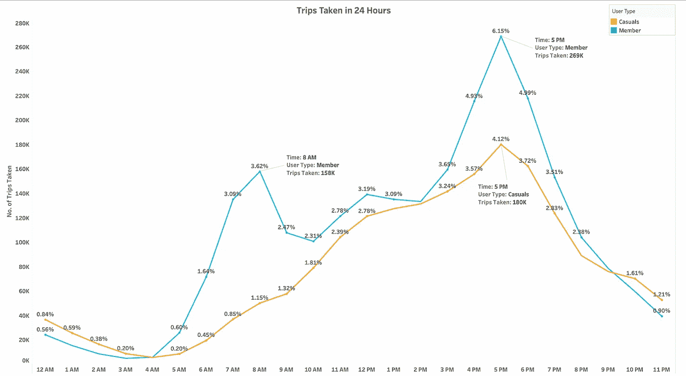

# 探索性数据分析:周期性自行车共享分析案例研究

> 原文：<https://medium.com/codex/exploratory-data-analysis-cyclistic-bike-share-analysis-case-study-1b1a00475a4f?source=collection_archive---------0----------------------->

## 使用营销数据分析设计营销策略，将芝加哥的休闲骑手转化为骑自行车的会员。

云门——芝加哥千禧公园美国电话电报公司广场的中心|图片来自 [Unsplash](https://unsplash.com/s/photos/chicago?utm_source=unsplash&utm_medium=referral&utm_content=creditCopyText) 上的 [Sawyer Bengtson](https://unsplash.com/@sawyerbengtson?utm_source=unsplash&utm_medium=referral&utm_content=creditCopyText)

# 介绍

芝加哥是交通、科技、文化和其他领域的国际中心。拥有 270 万 的密集人口，是美国第三大人口密集城市，仅次于纽约和洛杉矶。

芝加哥及其不同类型的交通工具|照片由 Johannes Krupinski 在 Unsplash 上拍摄

多年来，芝加哥一直被评为美国对自行车最友好的城市之一。该市通过投资自行车基础设施和促进教育、意识和宣传实现了这一壮举。今天，芝加哥拥有超过 200 英里**的受保护的缓冲共享自行车道，许多英里的路外小路(包括 18.5 英里的湖滨小道)，超过 13，000 个自行车架**，以及许多 CTA 火车站的隐蔽的大容量自行车停车区。这种基础设施允许企业探索并进入运输领域。一个这样的商业轮廓是**周期性**。

## 一、背景——公司简介

自行车共享的标志

yclistic 是一家总部位于美国芝加哥的自行车共享公司。2016 年，他们推出了一项计划，在整个芝加哥市提供短期租赁服务。总体目标是为当地人和游客提供一个有趣、健康、低成本的交通选择。从那时起，该计划已经扩展到拥有超过 5800 辆自行车和 600 个停靠站的车队。通过地理跟踪技术，自行车可以随时从系统中的一个站点解锁到另一个站点。

驻扎在芝加哥的自行车|[divy](https://divvybikes.com/)

Cyclistic 通过提供倾斜自行车、货运自行车和手动三轮车使自己从竞争对手中脱颖而出，从而迎合了残疾人和不能使用标准两轮摩托车的骑手的需求。然而，大多数骑手选择传统自行车，只有 8%的骑手使用辅助选项。此外，骑自行车的人更可能是为了休闲而骑自行车，但大约 30%的人每天骑自行车上下班。

## 二。业务任务——营销战略

Cyclistic 的营销策略是建立普遍的意识，吸引更广泛的消费者群体。引入灵活的定价计划是帮助实现这些目标的一种方法。定价方案从单骑和全天通行证到年度会员资格不等。购买单程票或全天票的顾客称为 ***散客*** 。购买年度会员资格的客户称为 ***周期会员*** *。*

虽然价格的灵活性帮助 Cyclistic 吸引了比平时更多的顾客，但市场总监 Lily Moreno 认为扩大年度会员的数量对未来的增长至关重要。Cyclistic 的财务分析师也得出结论，年度会员比临时会员更有利可图。莫雷诺认为，这是一个将休闲骑手转化为会员的好机会，而不是创建一个针对全新客户的营销活动。她指出，休闲骑手已经知道了 cyclic istic 计划，并选择了 cyclic istic 来满足他们的移动需求。

> **场景:**本 [**顶点项目**](https://www.coursera.org/learn/google-data-analytics-capstone?specialization=google-data-analytics) 涉及一名在营销分析团队为 Cyclistic 工作的数据分析师。它将遵循数据分析过程的六个阶段:询问、准备、处理、分析、分享和行动。每个阶段都包含一些步骤，这些步骤应该形成一个使决策和解决问题更容易的结构。最终分析的评估得出一个利益相关者可以利用的结论。由于该项目有许多方面需要考虑，**它在**公开讨论，并针对**企业家**和**利益相关者。**

# 方法学

## 一、提问——理解问题

行动中的分析团队|照片由 [Next Pathway](https://blog.nextpathway.com/5-reasons-why-data-cleaning-matters) 拍摄

Moreno 要求营销分析团队设计有效的策略，通过将骑自行车的临时工转化为年度会员，最大限度地增加年度会员的数量。三个问题将指导营销分析团队:

1.  年度会员和休闲骑行者在自行车使用方面有何不同？
2.  为什么休闲骑手会购买周期性年度会员资格？
3.  数字媒体如何影响 Cyclistic 的临时骑手成为年度会员？

## 二。准备——我们需要什么？

## A.数据描述

为了确保项目的成功，团队需要洞察周期性的 [**历史自行车出行数据**](https://divvy-tripdata.s3.amazonaws.com/index.html) 来分析和识别趋势。从【2020 年 4 月 **到****2022 年 6 月**共有 28 个数据集可用。每个数据集都是一个 **CSV(逗号分隔值)**文件，其中包含自行车运动客户记录的每次骑行的详细信息。然而，本项目仅使用前十二个月的数据，即从 2021 年 7 月**到 2022 年 6 月**的数据。

下载源文件后，第一步是用适当的文件名创建一个文件夹。每个数据集都是一个 **CSV(逗号分隔值)**文件。但是，数据导入和导出的首选格式是**UTF-8(8 位 Unicode 转换格式)**编码的 CSV 格式。这种编码支持许多特殊字符，如象形文字和重音字符，并向后兼容 ASCII。因此，我们将把每个文件保存为单独文件夹中的 **CSV UTF-8(逗号分隔)**文件。将原始数据集和我们将使用的文件放在不同的文件夹中是一种预防措施，不要混淆数据集。

> 注意:由于 Cyclistic 是一个虚构的公司，数据集有一个不同的名称。但是，这些数据集适用于本案例研究，并将回答业务问题。该数据已由 Motivate International Inc .根据本 [**许可**](https://ride.divvybikes.com/data-license-agreement) 公开用于本案例研究。

## B.数据的可信度

使用 **ROCCC 系统**可以确定我们数据的可信度和完整性。

*   数据是可靠的——它有一个大的样本量，反映了人口规模。
*   数据是原始的——我们可以找到原始来源。
*   数据是**全面的** —它是可理解的，不包含任何回答问题或找到解决方案所需的缺失的关键信息，也不存在人为错误。
*   数据是**当前的—** 它是相关的和最新的，因此表明源定期刷新其数据。
*   数据是**引用的**——来源已经审核过了。

**数据的完整性和可信度**足以为团队的分析提供可靠和全面的见解。

## C.数据的局限性

数据隐私问题禁止使用骑手的个人身份信息，如性别和年龄。不幸的是，这意味着我们无法将购买的通票与信用卡号码联系起来，也无法确定一些标识符，例如，临时乘车者是否居住在提供自行车服务的地区，或者他们是否购买了多张单程通票。

## 三。过程—从脏到干净

处理数据是质量决策的重要步骤。这个阶段包括清理和转换数据，以便有效地使用数据。洞察力和分析的质量取决于手头数据的质量。有错误或缺少计算指标的数据集将产生不准确的见解。

各种各样的工具都可以处理数据集——电子表格程序如 **Excel** 和编程语言如 **SQL、Python 或 R** 。这取决于用户的偏好和对每个程序的熟练程度。只要结果是**干净的数据**，大家都是赢家。

由于周期性的历史自行车旅行数据是一个大型数据集，我们将继续使用 **Python** 。Python 库是有用的函数，它消除了从头编写代码的需要。目前，Python 中有超过 137，000 个库。

> 本案例研究中使用了 Anaconda ，这是一个用于执行科学计算的流行数据科学平台。他们的知识库由超过 8000 个开源数据科学和机器学习包组成。你可以从 [**这里**](https://www.anaconda.com/products/distribution) 下载它，然后启动 **JupyterLab** 使用 Python 3 notebook 完成接下来的几个步骤。

## A.数据清理

数据清理的过程包括识别数据集中的错误，然后修复或删除它。数据错误可能包括不正确、重复或不完整的数据。

数据分析师花费大约 60–80%的时间清理数据|图片由 [Scottie Todd](https://www.inzata.com/the-7-most-common-data-analysis-mistakes-to-avoid/) 提供

我们的任务只需要**四个**库——**熊猫**、 **NumPy** 、 **Datetime** 、**T9、**OS 模块**。将这些库导入我们的笔记本:**

导入相关库的代码片段

导入我们的库后，我们将使用 **Pandas 库**中的 ***read_csv()*** 函数将每个 CSV 文件导入笔记本。

将每个 CSV 文件导入笔记本的代码片段

既然笔记本已经包含了所有的月度数据集，接下来的任务就是使用 **Pandas 库中的***contact()****函数将它们整合到一个全年视图中。***

*上面是将每月数据集合并成一个数据集的代码片段*

*数据集包含 **13 列**和**5900385****条目**。*

*让我们从 **Pandas 库中使用***info()****函数来看看数据类型。****此函数返回每列数据类型的序列。**

**显示存储在每个变量中的数据类型的代码片段**

**下一个任务涉及使用函数 ***isnull()检查数据集的空值总数。sum()* 来自**熊猫库**。此函数返回特定数据集中缺失值的数量。****

**显示数据集中的空值的代码片段**

**数据集在六列中共有 **3466987** 个空值。这是一大堆空值！为了移除它们，我们将使用来自 **Pandas 库**的函数 ***dropna()*** 。要了解该功能如何工作的更多信息，请单击此处的**。****

****删除数据集中的空值的代码片段****

****完美！第二个任务是使用函数 ***duplicated()检查数据集中是否存在重复值。*任意()**。在检查数据集之后，该函数返回一个布尔值，如果存在重复值，则为真；如果不存在，则为假。****

****上面是一段代码，表明数据集中存在重复值。没有。****

****因为没有重复或空值，所以这个数据集是干净的，可以进入处理数据的转换阶段。****

## ****B.数据转换****

****每个周期性历史自行车旅行数据集文件包含 **13 个变量**:****

1.  ******游乐设备 id:** 每次游乐设备分配的唯一 id****
2.  ******骑行类型:**每次骑行使用的自行车类型——经典、停靠或电动****
3.  ******started_at:** 每次行程开始的日期和时间****
4.  ******ended_at:** 每次行程结束的日期和时间****
5.  ******起点站名称:**每次旅程的起点站名称****
6.  ******start_station_id:** 每次旅程的起点站的 id****
7.  ******end_station_name:** 每次行程结束的车站名称****
8.  ******end_station_id:** 每次行程结束的站点的 id****
9.  ******start_lat:** 每个起点站的纬度****
10.  ******start_lng:** 各首站经度****
11.  ******end_lat:** 各终点站的纬度****
12.  ******终点 lng:** 各终点站的经度****
13.  ******member_casual:** 每位骑手的会员类型****

****了解每次骑行的长度和距离，并计算用户在一周中的哪一天和一天中的哪一时间骑行，对于从我们的数据集获得更好的洞察力至关重要。因此，让我们创建这些指标。****

*   ******trip_duration:** 从 ***ended_at*** 减去变量 ***started_at*** 计算。然而，这两个变量都在**对象类型**中。所以第一步是使用**熊猫库**中的函数***to _ datetime()***将它们转换成**日期和时间格式**。第二步是从 ***ended_at 中减去变量 ***started_at*** 。*******

***转换两个变量的数据类型的代码片段***

***一段代码从*中减去变量 ***started_at*** 形成 **trip_duration******

****提供 trip_duration 统计信息的代码片段****

*******trip _ duration***变量中存在不一致的值，即一些变量的开始时间晚于或等于结束时间。例如，当质量控制使自行车退出流通时，就会发生这种情况。其他值超过 4 小时。****

****过滤掉 trip_duration 中异常值的代码片段****

****我们将使用函数 ***drop()*** 从 **Pandas 库**中删除这些冲突的值。****

****删除不一致值的代码片段****

****既然我们的第一个指标是一致的，我们就可以创建其他指标了。****

*   ******trip_distance:** 由起点站和终点站的 GPS 坐标组合计算。第一步是使用 **NumPy 库**中的函数 ***np.sqrt()*** 。第二步是将经度和纬度的分离度乘以 **111.139** 得到相应的直线距离，单位为米。****

****计算每次旅行距离的代码片段****

*   ******start_hour** :使用 **Datetime 库**中的 ***dt.hour*** 函数，由变量***start _ at***计算得出。****

****计算每次旅行开始时间的代码片段****

*   ******start_day:** 使用变量 ***started_at*** 结合字典和函数计算；**日期时间库**中的 ***dt.dayofweek*** ，以及 **lambda** 。要了解 lambda 函数如何工作的更多信息，请单击此处的**。******

******计算每次乘坐开始时一周的第**天**的代码片段******

******一段代码添加了一个额外的变量，用于标识 **start_day** 是否是周末。******

******为了有更多的机会聚合数据，让我们使用 ***dt.month*** 和 *dt.year* 函数从 **Datetime 库**中添加几个列，例如 ***start_month*** 和 ***start_year*** 。******

******计算每次骑行开始时的**月份**的代码片段******

******一段代码添加了一个额外的变量，其中包含每个月的名称******

******一段代码计算了每次乘坐开始时的**年********

******为了更好地理解，将 **member_casual** 变量重命名为 **user_type** 的代码片段******

******让我们来看看数据集。******

******以升序显示按 **started_at** 排序的数据集的片段******

******数据集的转换已经完成——删除了空值、重复项、异常值，并添加了新的指标。所以适合项目后期。为了将它导出为一个 **CSV** 文件，我们将使用 **Pandas 库**中的函数 ***to_csv()*** 来导出我们的数据集。******

******将数据集导出为 CSV 文件的代码片段******

******此外，这结束了该项目的第三阶段。尽管如此，人们总是可以继续处理数据，以便更好地熟悉数据，甚至可以确定回答业务问题的新方法。******

## ******四。分析——找到线索******

******这个阶段包括根据观察得出结论。因此，这一阶段的基本技能是批判性、创造性和好奇心。作为一名数据分析师类似于一名侦探——试图理解模式，并将这些点联系起来，找到罪魁祸首。答案就在我们面前，一个必须展开的故事。******

******我们导入 CSV 文件并在 Tableau 上进行分析。******

## ********A .用户活动分析********

******识别骑自行车的成员和临时骑手之间的模式和趋势的数据探索过程包括以下变量:******

*   ********出行总次数********
*   ********使用的自行车类型********
*   ********一年中的旅行次数********
*   ********一周内出行次数********
*   ********一天的行程********
*   ********平均出行时长&全年距离********
*   ********平均行程持续时间&一周的距离********

## ******旅行总次数******

******自行车共享服务的用户分为两类:自行车会员和临时骑手。下面的饼状图显示了从 2021 年 7 月**到 2022 年 6 月**每类用户的总出行次数。******

************

*   ******Cyclistic 成员记录了总体较高的活动，大约有**249 万**次旅行。占总出行次数的 56.89%。******
*   ******然而，临时骑手已经记录了大约**188 万**次的活动。占总出行次数的 43.11%。******

## ******使用的自行车类型******

******Cyclistic 有各种不同的自行车。它们可以分为经典型、停靠型和电动型。下面的条形图显示了从 2021 年 7 月**到 2022 年 6 月**每个用户乘坐三种不同**类型的自行车**的**总次数。********

> ********注意:**我们的数据集不包含关于使用躺椅自行车、手推三轮车和货运自行车的信息。也不包含会员停靠自行车的信息。******

************

*   ******骑自行车的人更喜欢经典自行车，而不是电动自行车——在一年的总出行次数中，**183 万**人骑过经典自行车。即**占总出行量的 41.97%** 。另一方面，只有**65 万**次出行是电动自行车。占总出行次数的 14.92%。******
*   ******休闲骑行者也表现出对经典自行车的更高偏好——在一年的总出行量中，**114 万**骑过经典自行车。占总出行次数的 26.12%。另一方面，电动自行车出行仅 **0.51 万次**。占总出行次数的 14.92%。******
*   ******休闲骑手也使用停靠的自行车，24 万次出行。占总出行次数的 5.40%。******

## ******一年中的旅行次数******

******一年总共有**437 万**次乘坐，了解哪个月的用户活动最多对于确定 Cyclistic 的目标人口统计数据至关重要。下面的条形图显示了从 2021 年 7 月**到 2022 年 6 月**的 12 个月内，每个用户的总出行次数。******

************

*   ******Cyclistic 成员在 2021 年 8 月**记录了他们的最高活跃度，在**7.20%****的 **314，711 次出行**，在**2022 年 1 月****的 **60，639 次出行**的 **1.39%** 。************
*   ******休闲车友在 2021 年 7 月**记录了他们的最高活跃度，在**8.01%****处**350052 次**，在**2022 年 1 月****处**11343 次**在 **0.26%** 处最低。************
*   ******从 5 月**到 8 月**，骑自行车的会员的用户活跃度为 **27.24%** ，高于休闲骑行者的用户活跃度 **26.42%** 。******

## ******一周内的旅行******

******由于之前创建的指标，更容易理解组合的数据布局，并获得关于一周**内**的**日常用户活动**的见解。例如，下面的条形图显示了每个用户每周旅行的总次数。******

************

*   ******周而复始的成员在**周三**经常光顾，在**8.97%****大约有**39.2 万**次，在**周日**最少，在 **6.72%** 大约有**29.4 万**次。********
*   ******休闲骑手在**周五**最频繁，约**41.1 万**次 **9.39%** ，，最少在**周一，**约**19.7 万**次 **4.50%** 。******
*   ******在**工作日(周一至 Fri)** 、**、**骑自行车的会员使用 **42.5%** 的比例高于休闲骑手，后者使用 **29.9%** 。******
*   ******在**周末(周六至周日)**，骑自行车的会员的使用率为 **13.21%** ，高于使用 **14.74%** 的休闲骑手。******

## ******一天中的行程******

******下面的线形图显示了每个用户在 24 小时内的**总日出行量**。******

************

*   ******在**下午 5 点**周期性成员最频繁，在 **6.15%** 、大约有**26.9 万**次，在**凌晨 3 点**最少，在 **0.12%** 大约有**5000**次。******
*   ******散客在**下午 5 点**最频繁，在**4.12%****约有 **18 万**次，在**凌晨 3 点**最少，在 **0.13%** 约有**6000**次。********
*   ******Cyclistic 成员在 **8 AM** 也有很高的使用活跃度，在 **3.62%约**15.8 万**次。********
*   ****从晚上 9 点到凌晨 4 点，休闲骑手的使用活跃度较高。****
*   ****骑自行车的会员和休闲骑手在**凌晨 4 点、**有相同的用户活动，在 **0.14%** 有大约**6000**次出行。****

## ****年内的平均旅行时长和距离****

******现在我们知道了用户活动何时最高或最低，我们可以用关于每次旅行的距离和持续时间的见解来补充它。例如，下面的条形图显示了从 2021 年 7 月**到 2022 年 6 月**的 12 个月内，每个用户的**平均出行时长和出行距离**。******

************

*   ******Cyclistic 成员的平均行程持续时间为 **12.59 分钟**，每次行程的平均行程距离为 **2.33 公里**。******
*   ******散客平均行程时长 **25.05 分钟**，平均行程距离 **2.48 公里每趟**。******
*   ******休闲骑手有更高的年平均旅行时长和旅行距离。******

## ********平均行程持续时间&一周的距离********

******下面的条形图显示了每个用户在一周内的**平均旅行持续时间**。******

************

*   ******单车会员平均出行时长最高为周六**的 **14.38 分钟**，最低为周一**的 **11.74 分钟**。**********
*   ******散客周六**平均行程时长最高 **28.65 分钟**，周二**平均行程时长最低 **21.53 分钟**。**********
*   ******在一周中，休闲骑手的平均行程时间更长。几乎翻倍。******

******下面的条形图显示了每个用户在一周内的**平均行驶距离**。******

************

*   ******循环成员在周五**的平均距离最高 **2.43 公里**，周一和周四的平均距离最低 **2.29 公里**。********
*   ********周五**散客平均距离最高 **2.60 公里**，周一**平均距离最低 **2.37 公里**。************
*   ******在一周中，休闲骑手的平均行程时间更长。******

## ******动词 （verb 的缩写）分享——可视化见解******

******数据可视化是数据的图形化表示。通过洞察将我们的目标与我们的数据联系起来，这对于良好的数据故事讲述至关重要。一种方法是开发仪表板。******

******仪表板是不同视图或可视化的集合，其中每个图片同时展示另一种类型的数据。创建仪表板就是从工作表中拖动信息，在一个地方为用户提供所有数据的整体视图。仪表板应该具有最相关的洞察力，可以帮助用户做出更明智的决策。******

************

******我的 [**Tableau 个人资料**](https://public.tableau.com/app/profile/usmankayy) 中提供的 Tableau |上制作的交互式仪表盘的片段******

## ******观察******

******该公司的客户群分为两种用户类型:骑自行车的会员和休闲骑手。因此，人们可以观察到用户使用自行车共享服务的差异。******

*   ******从 2021 年 7 月**到 2022 年 6 月**，骑自行车的会员比休闲骑手有更多的行程。******
*   ******在一周中的任何一天，休闲骑手的平均旅行持续时间和平均旅行距离都比自行车骑手的平均旅行持续时间和**要高。由此可以得出结论，大多数骑自行车的成员更喜欢自行车共享服务，以便更有目的地骑行，如工作或出差。相比之下，休闲骑手可能会把它们用于娱乐、休闲活动和锻炼。********
*   ******两个用户都在下午 5 点记录了**最多的活动。由此可以推断，随着天气变得宜人，两个用户都倾向于乘坐更多的车。然而，Cyclistic 成员还记录了上午 8 点的最活跃活动，表明使用自行车共享服务上下班。********
*   ******两个用户在周末都有最繁忙的活动**。它表明自行车共享服务用于娱乐目的。然而，休闲骑手在周末表现出较高的活动量，而骑自行车的人则一周都坚持使用。********
*   ******在这两类用户中，**经典自行车**是最著名的**。然而，值得注意的是**对接自行车**在休闲骑手中更为普遍**。**********
*   ******这两个用户在 5 月至 8 月的夏季出行次数最多。然而，从九月的**到二月的****开始减少。因此，人们可以假设自行车共享服务的下降是由于天气变化，因为我们正在接近天气降温。********

## ********不及物动词行动——解决问题********

********分析的最后一部分是根据问题陈述和结果，通过推荐解决方案得出结论并采取行动。所以不一定是分析的指挥者来做决定；这还可能意味着为更高的管理层(如利益相关者)提供基于调查结果的建议，以便他们能够做出数据驱动的决策。********

## **********建议**********

********Moreno 要求营销分析部门设计有效的策略，通过将骑自行车的临时工转化为年度会员来最大限度地增加年度会员的数量。根据我们的分析，以下是一些建议:********

*   ********在工作日**为散客提供**促销，这样他们可以在一周内更加统一地使用自行车共享服务。此外，更多地接触自行车共享服务将增加他们转化为会员的机会。************
*   ********在繁忙时段提供**优先使用权**，在非繁忙时段提供**折扣价格**，仅针对**自行车运动会员**——这将鼓励休闲骑手申请年度会员。********
*   ********介绍**为期一周**和**为期一个月**的**会员选项**。然而，对它们进行定价，使年度会员计划比 12 个月内的费用更便宜，从而鼓励更多的临时骑手选择年度会员计划。********
*   ********创建一个**移动应用**并引入一个**常客计划**和一个**积分奖励系统**用于以会员形式乘坐更多的旅行。在这个项目中，Cyclistic 可以为其成员提供不同种类的**折扣**和**奖励积分。积累这些奖励积分有助于确保免费乘车。**********
*   ********由于休闲骑手在周末更活跃，cyclic istic 可以根据他们的喜好和骑行习惯为 cyclic istic 会员推出**额外奖励**和**周末个性化折扣**，从而鼓励休闲骑手申请年度会员。********
*   ********使用固定自行车提供室内骑行体验将允许使用 Cyclistic 进行锻炼的用户在气温较低的月份仍然可以从这项服务中获得价值。********
*   ********从五月到八月的夏季，休闲骑手的活动量最高。由于许多游客参加活动和节日，这几个月芝加哥非常繁忙。****可以专注于热门旅游景点周围的**前 10 站**和**通过与当地商家合作提供折扣**。************
*   ********通过**与谷歌**和**微软**搜索引擎合作，利用**搜索引擎优化**。此外，Cyclistic 可以**与著名博主**和 **YouTubers** 合作，扩大覆盖范围，并在会员计划上提供**附属折扣**。********
*   **********与**组织**和**公司**合作，通过提供**各种会员计划**来促进自行车的使用，例如针对年度会员购买的 **12+1 个月的促销**。**********
*   ******让现有会员**分享他们的故事**，讲述 Cyclistic 的自行车共享系统如何方便了他们的日常工作。这将有助于鼓励新的骑手加入该计划。此外，收集**用户对其旅行目的的反馈**,将有助于进一步了解在加入会员时的任何犹豫。******
*   ******进行**调查**以收集当前休闲骑手的数据，并了解他们在考虑订阅年度会员时期待什么**功能或好处**。******
*   ******设计一个**活动，通过在**移动应用**中添加一个可以显示燃烧的卡路里和减少的碳排放的功能，突出**健康**和**环境效益**，定期推广自行车的使用**。******
*   ******为**朋友、学生和家人提供**折扣**年度会员计划**以鼓励客户获得团体会员资格。******
*   ******将**横幅**或特定折扣**广告**放在显著位置，针对那些可能影响他们成为会员的临时骑手。它可以是展台、自行车上的平面媒体或锁定站区域，或者是从最受欢迎的站开始的比赛的社交媒体帖子。******

# ******结论******

******由于许多不确定性，找到吸引和说服用户投入业务的最佳方法可能是一项艰巨的任务。这个案例研究对每个人都有帮助；企业家、企业主和利益相关者根据研究和事实做出决策。******

******谢谢你，******

******[**乌斯曼·阿夫塔汗**](https://www.linkedin.com/in/usmankayy/)******

******这个项目使用的代码记录在我的 [**GitHub**](https://github.com/usmankayy/Cyclistic-Bike-Share-Dataset) 资源库中。同样，为这个项目创建的仪表板也可以在我的 [**Tableau**](https://public.tableau.com/app/profile/usmankayy) 配置文件中找到。******