# 初学者使用 Python 进行探索性数据分析

> 原文：<https://medium.com/codex/exploratory-data-analysis-using-python-for-beginners-7e2ac66f5fdb?source=collection_archive---------7----------------------->

## PYTHON 的片段

ABC 黑色星期五销售的简单 EDA 来确定他们的最高付费客户

这一次，我将分享我使用 Kaggle 的[黑色星期五销售数据集进行 EDA 的尝试。作为参考，包含代码的笔记本可以在](https://www.kaggle.com/datasets/rishikeshkonapure/black-friday-sales-eda)[这里](https://www.kaggle.com/code/wolvezero/black-friday-sales-eda)找到。

分析的目标是增加 ABC 的高付费客户，因此，让我们深入数据集，看看我们能发现什么！

1.  绘制数据集的信息以查看列、空值和数据类型。这里我们可以看到有些字段为空:Product_Category_2 和 Product_Category_3，这意味着一个产品至少有一个产品类别。

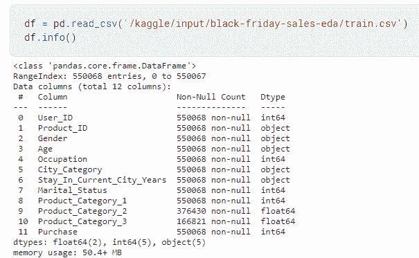

按作者分类的数据集信息

2.查看示例数据以确定列是数值型还是分类型，然后将列数据类型转换为 object(分类型)或 int(数值型)。

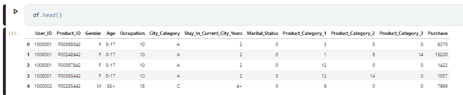

按作者分类的示例数据

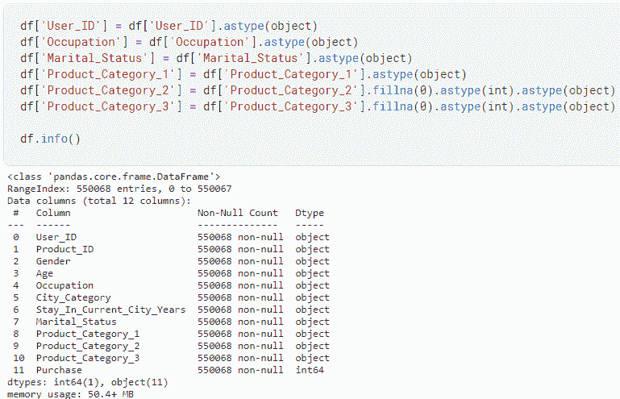

按作者转换列数据类型

3.查看分类字段的唯一值。好像有些字段值被屏蔽了(职业，产品类别)。

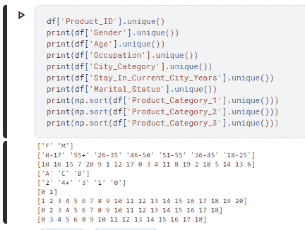

按作者划分的分类字段唯一值

4.接下来，我们来看看购买的统计汇总，目标变量；最小值和最大值离平均值很远，但平均值和中值彼此相差不远。嗯，那些离群值是不是不正确的数据点？

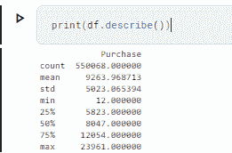

按作者列出的购买统计摘要

5.让我们检查一下 12 是否是不正确的数据输入。我不这么认为，因为离它有 101 排。

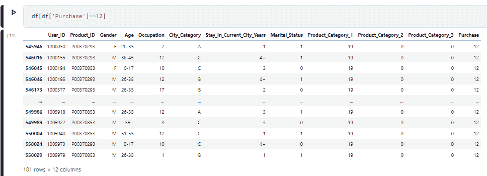

按作者检查是否有不正确的数据点

6.这个数据集的粒度是多少？一个 Product_ID 只有一个购买价格吗？没有。好像是每个 User_ID 的每个产品的总购买量**。从这里我们知道，数据集对于每个 User_ID 不是唯一的，因为没有购买时间，所以对于每次购买也不是唯一的。**

**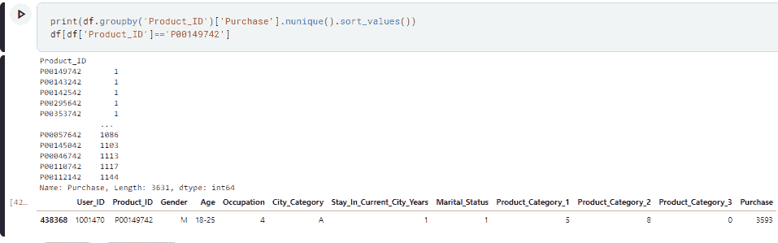**

**按作者统计的 Product_ID 唯一值**

**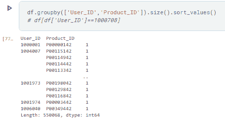**

**按作者检查数据集粒度**

**7.好了，现在我们知道了数据集的粒度，我们可以确定是否需要删除远离中位数或离群值的数据。因为它们不是不正确的数据，我们只是在做探索性分析，所以没有必要删除它们。**

**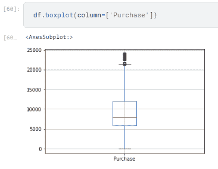**

**按作者分类的购买数据分布**

**8.该分析希望关注商店的客户，而不是基于产品，因此，由于该数据在每个 User_ID 上并不明显，所以我认为，当我们希望统计人口时，使其明显会使分析更加可靠。为此，需要首先删除与产品相关的列，然后按照 User_ID 对购买进行汇总。**

**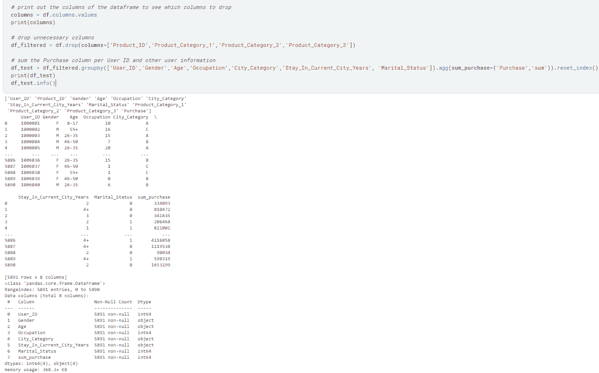**

**数据操作，使作者的每个用户 ID 都不同**

**9.因为目标变量 Sum_Purchase 是一个数字变量，其余的是分类变量，所以让我们尝试使用直方图来说明性别和 Sum_Purchase 之间的关系。我们可以看到，大多数记录的购买量在 0–0.1 E7(1，000，000)之间，男女都是如此，尽管男性的记录比女性多得多。男性顾客也比女性顾客多得多。**

**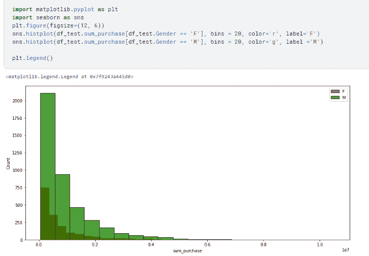**

**按作者分列的性别直方图**

**10.接下来让我们试着画一个分布图，看看 Sum_Purchase 和性别之间的概率密度。对于女性来说，购买总额为 0-530，000 英镑的概率高于男性。但对于更高的购买金额(53 万英镑以上)，两性之间有很大的差异，男性放弃购买的概率更高**。**因此，高收入顾客很可能是男性。**

**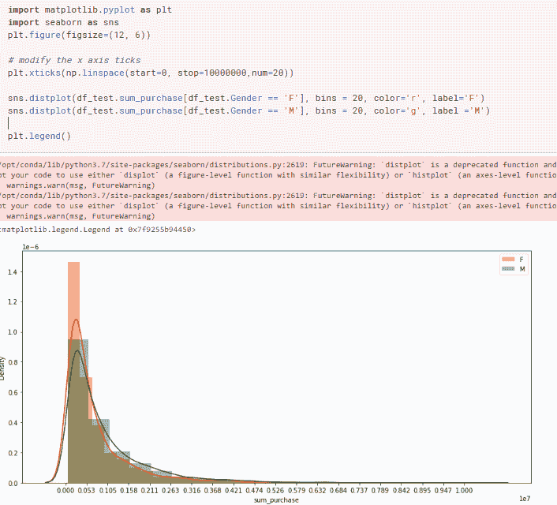**

**按作者分列的性别分布图**

**11.让我们为 City_Category 做同样的事情。这里我们可以看到，B 类城市贡献了最多的客户，而**C 类城市的购买力较低，而 A 类城市的购买力较高。****

**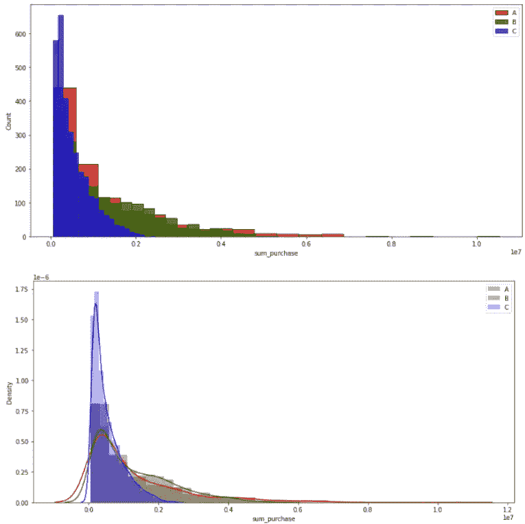**

**作者的城市类别可视化**

**12.因为年龄有相当多的组(' 0–17 ' ' 55+' ' 26–35 ' ' 46–50 ' ' 51–55 ' ' 36–45 ' ' 18–25 ')，所以我决定先画一个饼图，看看哪个组的客户多。从饼图中，我们可以看到 26-35 岁、36-34 岁和 18-25 岁年龄段的顾客占了 78%,这表明该商店的目标市场可能是大学生和在职成年人。此外，组**26–35 比其他两组具有更低的购买金额< 600，000 的倾向。****

**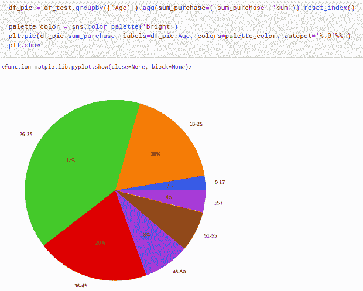**

**作者年龄饼图**

**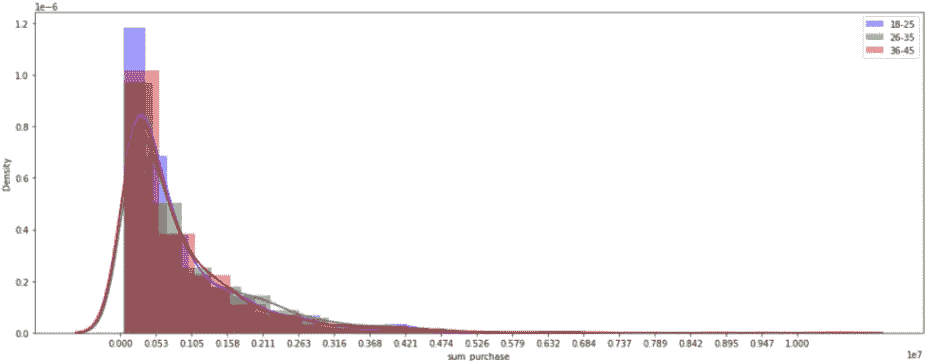**

**作者年龄分布**

**13.接下来，我们来看看职业。在职业 4、7、0 中，**职业 4、0 似乎有更大概率拥有更高付费的客户。****

**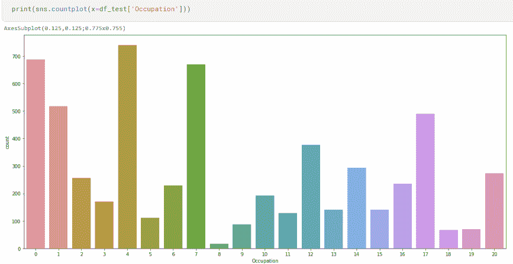**

**按作者列出的占用计数图**

**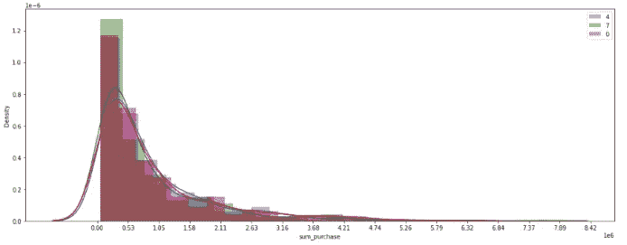**

**作者年龄分布图**

**14.最后，即使大多数客户没有结婚(0)，婚姻状况似乎对 sum_purchase 没有任何显著影响。**

**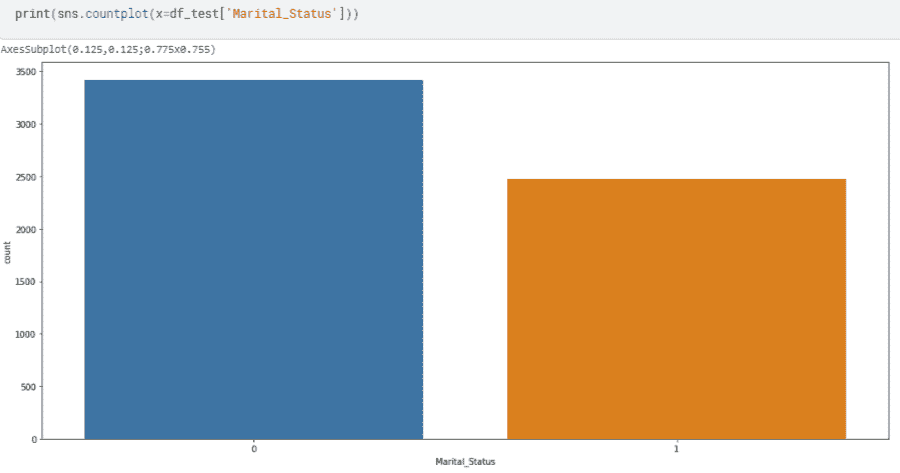**

**按作者列出的婚姻状况计数图**

**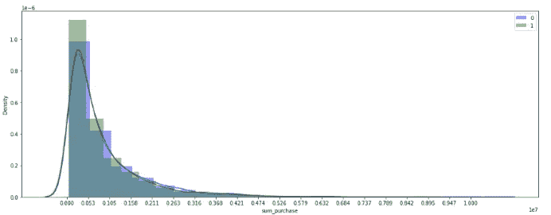**

**按作者划分的婚姻状况分布图**

**总之，从商店的黑色星期五销售数据来看，如果商店想增加他们的高收入顾客，他们应该瞄准来自 A 类城市的 26-35 岁男性，职业为 4 或 0。**

**这是我第一次尝试使用 Python 在数据集上做 EDA，我想在这里分享我的发现:D，因此，任何建议，评论或建设性的批评都是热烈欢迎的！**

***如有任何疑问，可通过*[*LinkedIn*](https://www.linkedin.com/in/sharon-regina/)*联系我。希望这篇文章可以作为你的 EDA 实践的入门！***