# 探索伯明翰的城市热岛与蟒蛇和脸书先知

> 原文：<https://medium.com/codex/exploring-birminghams-urban-heat-island-with-python-and-facebook-prophet-abbad255b5ee?source=collection_archive---------10----------------------->

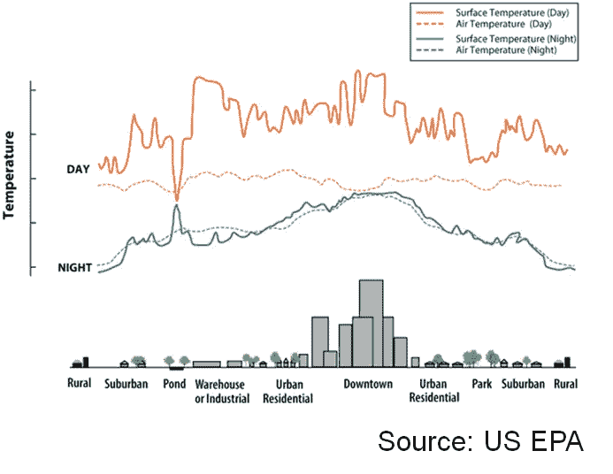

城市热岛的表现

# 什么是城市热岛？

城市比它们周围的城区更热，这可能不足为奇。问题是，这种差异大多发生在白天和晚上。你可能会惊讶的是为什么会有温差。这不仅仅是因为你不太可能在城市里找到一个阴凉的地方。事实上，农村地区比附近的城市更凉爽，即使这两个地区都没有太多的树木。城市更热的真正原因是因为它们整天吸收太阳辐射，导致建筑物、路面和其他人类改造的城市景观部分升温，然后在下午晚些时候和晚上释放到周围的空气中。相比之下，路面较少的农村地区白天的温度往往与较发达的城市地区相似，但在白天的晚些时候，尤其是晚上，温度会低得多，因为地面和植被不会再辐射任何积累的热量。这种城市温度高于周边地区的现象被称为城市热岛(或 UHI)效应。UHIs 通常形成于人口超过 20 万左右的城市，在某些地方可能相当密集。例如，目前的美国纪录保持者是新奥尔良，那里的城市温度比周围的农村温度高出近 9 华氏度。有很多资源可以探索 UHIs，包括气候中心的人们提供的一个非常有用的页面。

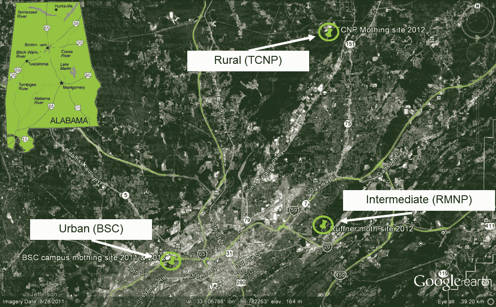

阿拉巴马州伯明翰的谷歌地球图像，显示了我们放置温度记录仪的三个位置。探测器被放置在每个地点的森林地带，所以除了它们相对于城市的位置之外，它们尽可能地相似。

作为研究 UHIs 对当地昆虫影响的一部分，我们在三个不同的地点放置了温度记录仪，从城市景观到更偏远的地方。从 2013 年到 2015 年，这些温度记录器每小时记录所有三个位置的空气温度和土壤温度。鉴于伯明翰本身的人口徘徊在 20 万多一点，而大都会区的人口超过 140 万，我们想知道我们是否能在这座城市中发现一个 UHI。完整的结果将在其他地方报告，但在这里，我想展示使用 Python 中的一些工具对一些数据进行的时间序列分析，包括脸书提供的一些最新的预测工具。

# 查看温度数据

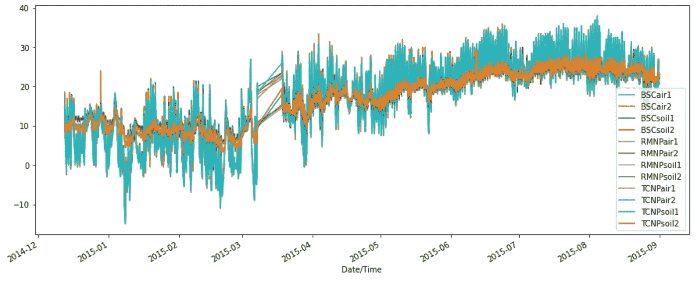

伯明翰三个地点的空气和土壤温度。每个地点有 2 台空气伐木机和 2 台土壤伐木机。三月下旬有一些遗漏的观测，导致了直线。

温度记录器运行时间最长的是从 2014 年 12 月到 2015 年 9 月，所以这是我们将在这里处理的数据。由于一些技术问题，我们错过了 3 月下旬的一些温度，但我们仍然有来自每个记录器的超过 6000 个每小时的温度观测。从上图可以看出，气温日波动很大，但土壤波动较小(这是有道理的)。由于数据中存在这些噪音，很难看出模式和差异。

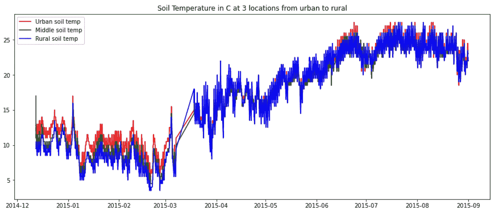

当只看三个伐木工人时，仍然有很多变化，但是可以看出一些差异，特别是在冬天和早春，那里城市位置的土壤温度似乎有点高。

即使我们从每个地方只看一个土壤探针，我们仍然看到许多变化。消除这种差异的一种方法是对这些地点的温度进行滚动平均。

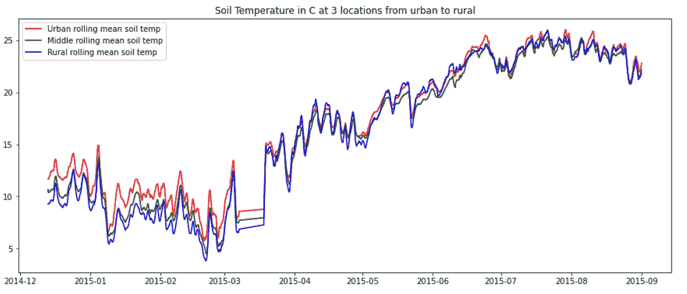

三个位置的土壤温度的 24 小时滚动平均值。这消除了一些每小时的波动。

一旦我们开始消除一些短期变化，就更容易看到滚动平均温度在城市地区最高，在农村地区最低。这种影响似乎在冬天和春天最大。在四月到六月，似乎没有太多的不同，但是在仲夏到夏末，城市地区似乎比其他地区有更高的高点。

# 更广泛温度趋势的时间序列模拟

如果我们现在把这三个地方的比较放在一边，从上面的数字可以清楚地看出，伯明翰的气温呈现出一些广泛的、不令人惊讶的趋势。当然，冬天更凉爽，夏天更暖和。秋天的气温虽然仍然很热，但在八月份的高峰过后开始下降。显然，这些**温度数据不是稳定的**，这意味着它们的平均值不随时间稳定。但是温度数据还有其他问题。

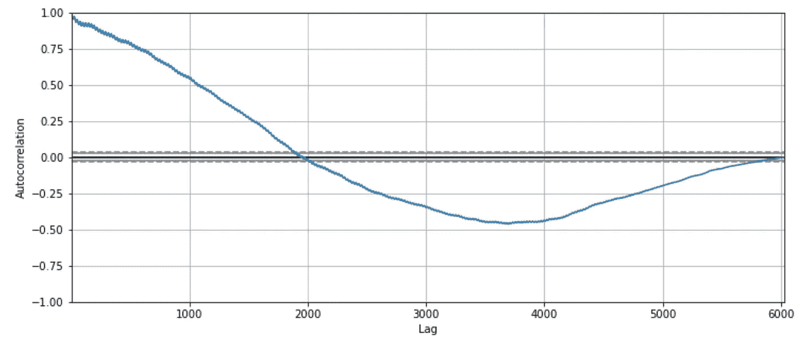

城市土壤温度显示出很强的自相关性，随时间缓慢衰减。

第一个问题是温度数据高度自相关，这意味着一个小时的温度很可能与前一个小时的温度相似。这些自相关发生的时间跨度很大，从几小时到几周。这很有意义，因为虽然可能会有一些每小时的波动，但当前的温度往往是非常可预测的，并且与先前的温度非常相似(并且依赖于先前的温度)。

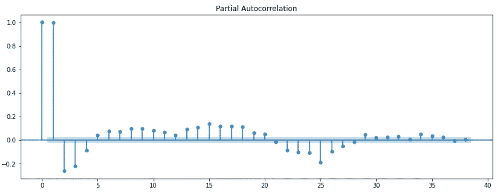

城市土壤温度的偏自相关

这些温度数据的另一个问题是存在很强的部分自相关。偏相关函数(PACF)控制着具有较低滞后的自相关，因此任何其他仍然存在的大的偏相关表明了数据中的一些潜在趋势。要阅读该图，可以忽略第一个尖峰，因为它只是在时间 0 时与自身相关的温度值。时间 1 处的正相关(左起第二个尖峰)表明 1 小时的温度可能与前一小时的温度非常相似(即，存在大约 1 小时的滞后)。小时= 2 及以上的大负值表明，当我们控制自相关中的 1 小时滞后时，仍有一些强烈的季节性需要在后续模型中加以控制。如果我们要更深入地对这些温度数据建模，我们必须应用一些差分和滞后来使所有序列平稳，以便进一步建模和比较。现在，我将把它留给未来的项目。

# 脸书先知(非盈利)

每个人都清楚脸书赚了很多钱。他们赚大钱的一个方法是记录时态数据，并对这些时间序列数据的未来行为做出准确预测。虽然有些人可能害怕我们的蓝色霸主，有人可能会说，他们确实提供了人们想要的服务，因此利润。脸书还为时间序列建模社区提供了一个额外的(讽刺的是，免费的)产品，名为“先知”。你可以在这里阅读先知[的介绍，在这里](https://research.fb.com/prophet-forecasting-at-scale/)阅读快速入门指南[，在这里](https://facebook.github.io/prophet/docs/quick_start.html)阅读几篇不错的中型文章，其中有应用先知[的示例代码。当我使用 Prophet 探索我的温度数据时，它们都很有帮助。](https://towardsdatascience.com/time-series-forecasting-predicting-stock-prices-using-facebooks-prophet-model-9ee1657132b5)

使用 Prophet 有一些奇怪的地方(比如安装 Prophet 和设置初始数据格式)，还有很多可以调整的参数。在这里，我只想快速应用一下这些温度数据的开箱即用行为。一次只处理一个时间序列是最简单的，所以我选择了城市土壤温度。

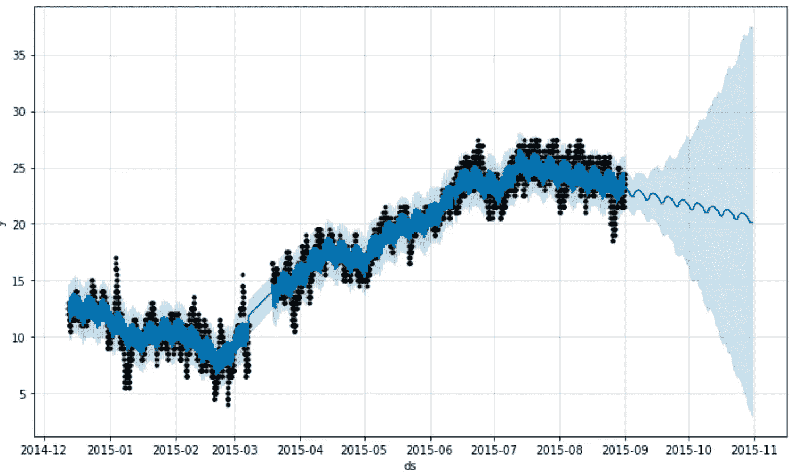

Prophet 绘制了城市土壤温度时间序列的观测值(黑点)、预测值(蓝线)和我们预测的不确定性区间(蓝色阴影区域)。

第一个情节制作起来相当简单。它显示了观察数据和后向预测(基本上是根据观察数据进行的预测)之间的比较。更有趣的是对未来的预测(深蓝色线)，以及相关的误差(浅蓝色包络)。在这里，我只要求它预测未来 3 个月，也就是从 9 月到 11 月。它的预测可能相当合理，但大量的误差是相当大的，并且在未来呈指数增长。这是有道理的，因为它没有训练足够的数据来理解年气温的完全季节性，加上它被夏季气温上升而秋季气温开始下降的事实所误导。我猜，如果用全年的数据进行训练，误差预测会小得多。

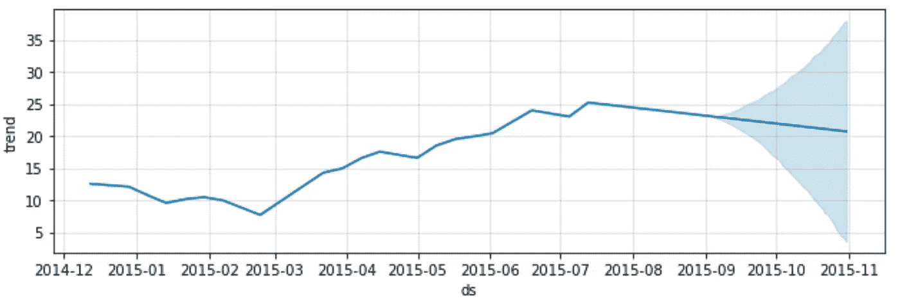

整个时间序列的总体趋势

现在是我最喜欢的先知部分:将趋势分解成不同的时间尺度。基本上，Prophet 从您的时间序列数据中提取子集，并将其分解成更小时间的成分——有点像方差分析中的分割方差。在上图中，总体趋势显示冬季气温凉爽，春季和夏季气温上升，在 8 月达到顶峰，然后开始下降。在这一点上，Prophet 预测未来趋势将开始下降，但不确定性真的很高——可能反映了上面针对整个数据指出的问题。

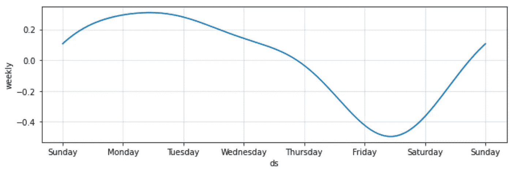

气温的每周趋势

该数据集中的下一个更精细的尺度是查看一周中的每一天。根据 Prophet 的说法，周五是最凉爽的，一周中的其他时间都比较暖和。我不知道这种模式有多强或多可靠，也不知道我是否相信它，但它可能是值得研究的东西。也许这反映了城市环境的温度？

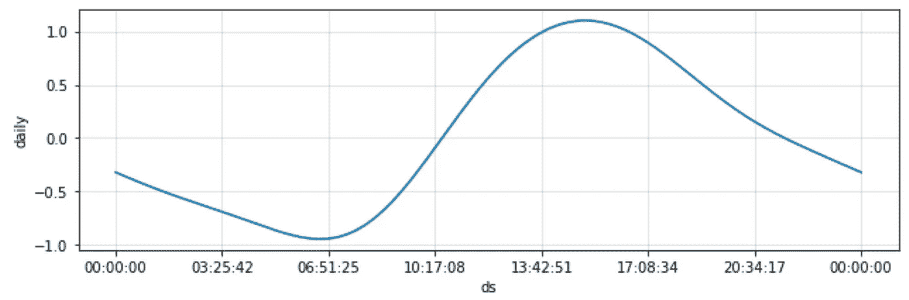

由 Prophet 确定的每日温度循环。

现在这个更可信了——温度在黎明前最低，在早上上升，在 3:00 到 4:00 达到峰值，然后下降。经典！令人欣慰的是，这种趋势出现得如此清晰。Prophet 在这里没有做任何新的或神奇的事情，因为这种分解成更小规模的组件也可以通过 statsmodels 的 seasonal_decompose 来实现(例如，参见本文的 [post](https://timeseriesreasoning.com/contents/time-series-decomposition/) )。但是，一旦你发现了最初的古怪之处，这个界面非常好，也很容易使用。

就是这样！对伯明罕的 UHI 进行了简短的探索，并使用脸书先知进行了一些模式搜索。在未来，我将会把这个系列固定下来，在三个站点之间做一些统计比较，并尝试在每日、每周和每年的温度循环中发现更多有趣的模式。很想听听大家对未来的评价和建议。