# 使用数据探索国际象棋游戏

> 原文：<https://medium.com/codex/exploring-chess-games-using-data-f300882fd21b?source=collection_archive---------10----------------------->


费利克斯·米特迈尔在 [Unsplash](https://unsplash.com?utm_source=medium&utm_medium=referral) 上的照片

C 赫斯是一款已有近 1500 年历史的棋盘游戏，但自从著名的网飞秀《女王的策略》发布后，它达到了受欢迎的顶峰。该剧上映后,[棋盘在美国的销量增长了 87%](https://www.npd.com/wps/portal/npd/us/news/press-releases/2020/sales-spikes-for-chess-books-and-sets-follow-debut-of-queens-gambit/) 。不仅如此，与之前的 11 个月的平均值相比，11 月份每月[的国际象棋搜索量增加了 189%。随着“女王的策略”，Twitch 和 YouTube 上的平均国际象棋观众人数大幅增加，这要感谢像“PogChamps”这样的活动和这些平台上的国际象棋内容创作者聚集了一个巨大的社区。](https://trends.google.com/trends/explore?date=2020-01-01%202021-01-01&q=chess)

随着国际象棋的普及，越来越多的人开始学习、玩和享受这项运动。在 Chess.com 和 Lichess.org 这样的网站上玩游戏的平均数量已经达到了历史最高点。人们已经开始深入研究错综复杂的游戏，并正在探索象棋在其历史、旧游戏和文学中所包含的美。

国际象棋是一种游戏，其中玩游戏的基本原则很容易学习，但很难掌握。大多数国际象棋大师都是从神童开始的，他们一生都在下棋和学习，以达到并保持国际象棋大师的地位。棋手学习战术、战略、位置、残局和其他与象棋相关的概念和细节，并试图掌握那些技术，成为更好的棋手。玩家们学习的一件事情就是[象棋开局](https://en.wikipedia.org/wiki/Chess_opening)。国际象棋开局基本上是棋手用白棋和黑棋进行的初始棋步。有一本[象棋开局百科](https://en.wikipedia.org/wiki/Encyclopaedia_of_Chess_Openings#:~:text=The%20Encyclopaedia%20of%20Chess%20Openings,%C5%A0ahovski%20Informator%20(Chess%20Informant).)，专门分析象棋流行的开局招式。那么，问题来了，为什么棋局开局如此重要？这是我们将在这个博客中探讨的问题。

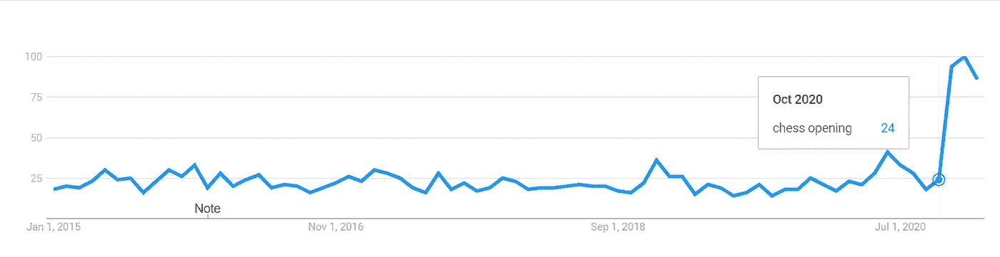

对术语“象棋开局”的兴趣。十月是《女王的策略》上映的月份。资料来源:trends.google.com

随着文章介绍阶段的结束，我们将正式陈述核心目的和我们将在博客中调查的问题。首先，我们要准备我们的象棋数据集。接下来，我们要清洁它。最后，我们将分析和可视化我们的数据。

我们的论文问题和子问题是:

## 空缺真的很重要吗？

1.  有哪些最受欢迎的开场演奏？
2.  任何一方(黑和白)的开局成功率是多少？
3.  开局对游戏形式有影响吗(比如快棋或慢棋)？
4.  在分析空缺时，可以考虑球员的等级吗？
5.  在不同的游戏格式中，游戏最常见的最终结果是什么？

# 准备我们的数据集:

我们要做的第一件事是准备我们自己的国际象棋数据集。国际象棋游戏被记录为 PGN(便携式游戏符号)。PGN 包括所有必要的信息，如玩家的游戏，移动，最终结果和所有其他关于游戏的必要信息。我们将阅读这些国际象棋游戏的原始形式作为 PGN。看完之后，我们会处理那些游戏。最后，我们将把这些游戏导出为一个. csv 文件，以便于阅读和处理我们下一部分的数据清理和可视化。

## **数据集来源:**

我们的原始形式的国际象棋游戏的来源是 FICS 游戏数据库。FICS 允许我们下载基于不同过滤器的游戏 pgn。我准备下载 2019 年 6 月到 9 月所有评分和游戏格式的游戏。为了我们的博客，这么多游戏就足够了。

## 我们的数据单位:

下载的文件扩展名为. pgn，我们可以把扩展名改为。txt 并将其作为文本文件打开。让我们快速浏览一下原始数据。

```
[Event "FICS rated blitz game"]
[Site "FICS freechess.org"]
[FICSGamesDBGameNo "453184368"]
[White "wellthoughtplan"]
[Black "thirtythree"]
[WhiteElo "1524"]
[BlackElo "1580"]
[WhiteRD "32.2"]
[BlackRD "29.4"]
[TimeControl "180+0"]
[Date "2019.06.30"]
[Time "23:56:00"]
[WhiteClock "0:03:00.000"]
[BlackClock "0:03:00.000"]
[ECO "B22"]
[PlyCount "49"]
[Result "1-0"]1\. e4 c5 2\. d4 cxd4 3\. c3 d5 4\. exd5 Qxd5 5\. cxd4 g6 6\. Nc3 Qa5 7\. Be3 Bg7 8\. Bc4 Nf6 9\. Nf3 O-O 10\. O-O Bf5 11\. Qd2 Nc6 12\. b4 Nxb4 13\. Rab1 Bxb1 14\. Rxb1 Rac8 15\. Ne5 Nc6 16\. Rb5 Qc7 17\. Bf4 Nh5 18\. Nxf7 Ne5 19\. Nxe5+ Kh8 20\. Nxg6+ hxg6 21\. Bxc7 Rxc7 22\. Rxh5+ gxh5 23\. Be6 Rd8 24\. Ne2 Bxd4 25\. Nxd4 {Black resigns} 1-0
```

这是一个单一的游戏。我们的一个数据单位就是一个游戏。现在，我将解释我们最感兴趣的属性:

*   **WhiteElo:** Elo 是一种计算棋手相对技能水平的方法。白棋是玩白棋的玩家的白棋。
*   **黑棋:**玩黑棋的玩家的黑棋。
*   **WhiteRD:** RD 代表评级偏差。如果一个玩家的 elo 是 1500，RD 是 50，说明这个玩家的实力在 1400 到 1600 之间。WhiteRD 是玩白色棋子的玩家的 RD。
*   **黑棋:使用黑棋的玩家的第三名。**
*   **时间控制:**这是游戏格式。时间控制建立游戏时钟。在这里，时间控件是以秒为单位编写的。180+0 表示开始时间为 180 秒(3 分钟)，每次移动的增量为 0 秒。600 + 10 意味着开始时间是 600 秒，每次移动增加 10 秒。
*   **ECO:** 这是象棋百科中的象棋开局编码。例如，这里 B22 编码为“西西里防御:阿拉宾变奏曲”(我们将在文章的后续章节中看到许多空缺)。
*   **回合数:**游戏持续的总回合数。
*   **结果:**比赛的最终结果。1–0 表示白棋赢，0–1 表示黑棋赢，1/2–1/2 表示和棋。
*   **走法:**最后几行是游戏的走法。棋步以棋盘坐标和国际象棋游戏符号的形式书写。最终，我们有了游戏的地位。

现在，我们将在我们的 PGN 处理游戏。

## 处理和导出我们的数据:

读取文件的方法很简单。由于这些只是文本文件，我们将读取这些文本文件并逐行处理它们。下面是我们如何逐行处理文件的示例:

```
white_elo = []
def read_white_elo(line):
    if line.startswith('[WhiteElo "'):
                self.white_elo.append(line)
```

在这个例子中，非常简单，我们将创建一个空列表，其中包含所有游戏的 WhiteElo。每当传递的文本行以“'[WhiteElo '”开头时，该行将被追加到我们的列表中。现在，我们将拆分这条线，并从中提取值。下面是该流程的一个实例:

```
def extract_elo(elo_list):
    elos = []
    for l in elo_list:
        elos.append(l.rsplit('"', 2)[1])

    return elos
```

因此，通过这个分割过程，我们将从我们的列表中提取玩家的 elo。从评论中提取信息(比如游戏的状态)有点复杂，但是本质上仍然涉及到在某个字符处分割字符串，就像我们在上面的函数中所做的一样。此外，我们读取和处理的所有内容都来自文本文件，因此所有内容的数据类型都是字符串(单词)。我们还需要改变一些基于数字的属性的数据类型。这很简单，只需在像 WhiteElo 这样基于数字的列表上使用 int()就可以了。

在处理完所有行之后，我们准备使用 [pandas](https://en.wikipedia.org/wiki/Pandas_(software)) 将所有列表导出为一个. csv 文件。下面的代码片段给出了将两个列表导出为. csv 数据集的示例。

```
import pandas as pd
def to_dataframe(white_elo, black_elo):
    zipped = list(zip(white_elo, black_elo))
    cols = ['White Elo', 'Black Elo']
    df = pd.DataFrame(zipped, columns = cols)
    return dfdf = to_dataframe(white_elo, black_elo)
df.to_csv("chess_games_csv\chess_games.csv", index=False)
```

生成的数据集如下所示:

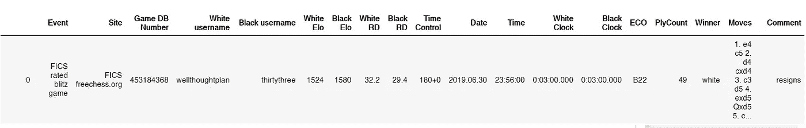

我们数据框的一个单元

我们已经成功创建了自己的数据集。我们成功提取了 935，362 个游戏。有了这个简单的程序，我们可以随心所欲地处理许多游戏。接下来，我们将清理我们的数据。

# 数据清理

数据清理是替换、修改和删除粗糙和脏数据的过程。这不仅有助于我们有效地可视化和分析我们的数据，而且有助于我们建立一个强大的机器学习模型。对于我们的数据集，我们将通过一些步骤来清理它。

## 整体外观

首先，我们将大致了解一下数据集。我们已经了解了上图中每个数据框像元的外观以及列的名称。现在，让我们先来看看行数和列数。我们的数据框架命名为 df。

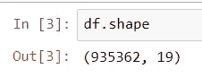

因此，我们目前有 935，362 行和 19 列。现在，我们将处理一些列中的空值。

## 处理空值

接下来，我们将管理列中存在的空值。

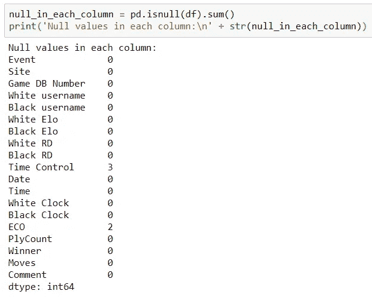

数据框中的空值

ECO 不是我们感兴趣的栏目，但 Time Control 是。幸运的是，在我们的时间控制列中只有三个空值。这个数字可以忽略不计，而且我们的数据集很大，我们可以删除这三个条目。因此，我们将删除这些行。下面的代码片段将为我们做到这一点。本质上，代码只是删除了“时间控制”为空的行，并将新的数据帧存储在 df 中。

```
df = df.dropna(subset=['Time Control'])
```

## 检查数据类型

在数据准备部分，我们将这些值转换为它们各自的数据类型，以便对它们进行正确的编码。为了验证这一点，我们可以检查数据列的数据类型。(这里的对象只是字符串)

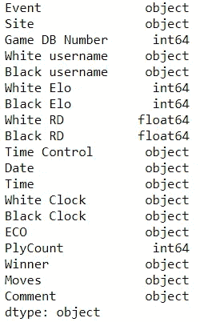

数据框的数据类型。

## 删除不必要的列

有许多列我们不会以任何方式使用，还有一些列我们将在后面的部分中添加，这将帮助我们对数据进行分类和可视化。因此，我们可以安全地删除那些不必要的列。删除这些列后，我们只剩下:

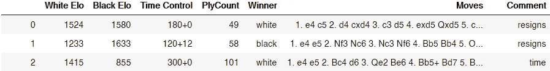

删除不必要的列后

可能缺少列，但是我们将在数据清理和可视化的后续部分中添加一些列。

## 通过分级差异来规范游戏

在一些游戏中，玩家的 elo 差异会非常大，这意味着在这种情况下不需要进行开放分析，因为 elo 较高的玩家已经非常强大，这将在我们的数据中产生偏差。为了迎合这种情况，我们必须在我们的数据中可视化评级差异的趋势。

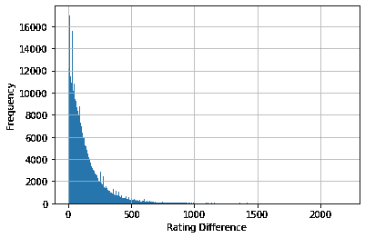

有一些游戏的 elo 差很高(600+左右)。我们希望删除那些球员之间的 elo 差距非常大的条目。

下面的代码将为我们做到这一点:

```
df['rating_difference'] = abs(df['White Elo'] - df['Black Elo'])
df = df.drop(df[df.rating_difference > 600].index)
```

## 按 PlyCount 调整数据

正如前面在数据准备中解释的，PlyCount 是游戏中进行的总回合数。可能有些游戏在 3 到 4 步后就结束了。像这样的游戏在我们的开场分析中没有用，所以我们想从我们的数据框中删除这样的条目。让我们先来想象一下所有游戏的总数。

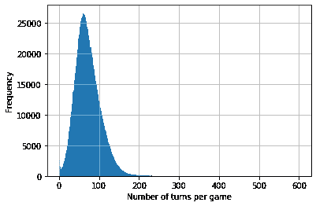

所有游戏的总数

很明显，确实存在一些以 3 到 4 步结束的游戏。我们也必须将它们从我们的数据集中删除。我们将删除结束次数少于 6 的游戏。下面的代码片段将为我们解决这个问题:

```
df = df.drop(df[df.PlyCount < 6].index)
```

## 使列一致

*   **时间控制:**

我们数据集的来源大部分是计算机化的，而不是手写或打字。因此，我们可以期望属性的大部分值是一致的。但是，查看每列有多少不同的值总是一个好主意。如果确实存在一些在我们的数据中很少出现的值，我们可以删除它们。

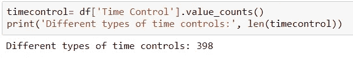

首先，我们要看一看时间控制列。该列有一些相关的问题。我们可以看到有 398 种不同类型的游戏格式。分析每一个都将是一场灾难。此外，一些游戏格式是自定义的(非标准的)，很少或没有代表性。为了迎合这个问题，我们将创建我们自己的时间控制专栏，我们称之为“游戏格式”。该列将有四个可能的值:子弹、闪电、快速、经典。Bullet 将是那些开始时间小于或等于 3 分钟的游戏，Blitz 在 3 到 10 之间，超过 10 分钟的游戏将处于 Rapid 之下(经典游戏不是我们数据中的一个类别，因为它们在我们数据中的代表性可以忽略不计。而且，正规的古典游戏并不是因为时间长而在一个网站上举办的。这样的游戏总是在物理板上适当地举行)。将实现所需输出的代码编写如下:

```
import numpy as np
def game_format(tc): #tc: time control
    starting_time = tc.split('+', 1)[0]
    starting_time = int(starting_time)

    if starting_time <= 180:
        return 'Bullet'
    elif starting_time <= 600:
        return 'Blitz'
    else:
        return 'Rapid'df['game_format'] = np.vectorize(game_format)(df['Time Control'])
```

现在，我们的游戏格式只有 3 个值:

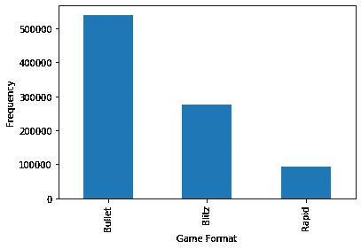

*   **评论**

评论是游戏的结束状态。结束状态意味着结局是怎样的。要么是僵持不下，要么是任何一方辞职，要么是将死。现在，我们提取这些评论的方法是通过拆分，提取句子中的最后一个单词。这种方法含糊不清，我们不知道最后一个词意味着什么。

让我详细解释一下。以下是我们数据中不同类型评论的数据:

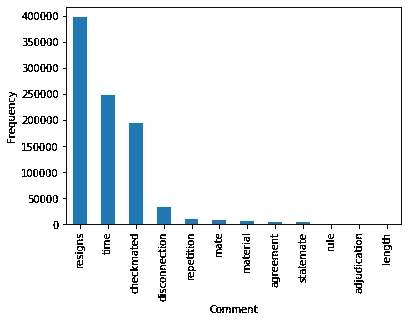

不同类型的评论

让我解释一些评论:

*   **辞职:**游戏中一方(黑或白)辞职。
*   **时间:**一方时间用完。
*   将死游戏以将死告终
*   **断开:**一侧断开。
*   **重复:**游戏采用三重重复(双方各重复三次招式)抽签。
*   **Mate:** 如前所述，我们只提取了评论中的最后一个单词，这个‘Mate’单词映射为“一方没有时间，但另一方没有足够的材料来交配”。这样的场景是一个平局。
*   **物资:**双方都没有足够的物资将死对方。所以，结果是平局。
*   协议:比赛以协议平局结束。
*   **相持:**这是一个位置，其中一个玩家没有被检查，但没有合法的移动。所以，最后的结果是平局。
*   其他的是规则，这意味着游戏由于一个特定的规则而结束(可以是任何像公平竞赛等)。)，裁决大多是在较长的游戏中，游戏尚未完成，结果根据最终位置宣布为赢或平，长度意味着游戏持续的时间更长，并被宣布为平。

我们可以看到一些注释在我们的数据中没有表示，所以我们将删除这样的行。此外，一些像“伴侣”这样的评论是令人困惑的，因为它们没有描述清楚。关于“队友”的评论，我们将添加“材料”这样的条目(原因是，如果一个玩家有甚至一个以上的棋子，而另一个玩家失去了他/她的所有时间，那么拥有该棋子的那个玩家仍然会赢。所以，间接的，第一个玩家没有足够的材料按时获胜，由于这个原因，比赛以平局告终)。

规范“评论”栏后，我们有了一个更加简洁的评论版本:

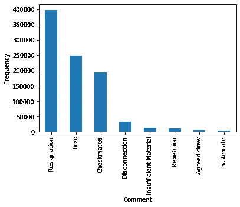

在使评论一致之后

## 收尾

我们几乎完成了数据清理。最后，我们将使列名一致。我们将使用 snake case(风格化为 snake_case)来编写我们的列名，并使它们保持一致。此外，我们将重置数据框的索引。

```
df.columns = [i.replace(' ', '_').lower() for i in df.columns]
df = df.reset_index(drop=True)
```

数据清理后，我们的数据如下所示:


在数据清理之后，我们接下来将可视化不同参数的数据，如技能水平、游戏格式和游戏中的开局。

# 可视化和分析

[假设一个典型的**国际象棋**游戏的分支因子约为 35，持续 80 步，可能的步数是巨大的，约为 35⁸⁰(或 10)，又名“香农数”](https://www.scientificamerican.com/article/how-the-computer-beat-the-go-master/#:~:text=Given%20that%20a%20typical%20chess,on%20how%20to%20program%20a)。我们不会分析每一步棋，我们只是看一下游戏的开局。即使在这么小的深度分析所有的动作也太全面了。取而代之的是，我们将在一定的深度看一看一些最受欢迎的动作。

## 所需工具

*   最重要的工具是我们将用于所有调查的数据集。
*   我想添加的另一栏是“技能水平”。本专栏将根据玩家的平均评分对游戏进行分类。这将帮助我们更容易地对数据进行分类。我们要用的技能等级是初级(< 1350)，中级-1(1350–1650)，中级-2(1650–1800)，高级-1(1800–2025)，高级-2 (2025

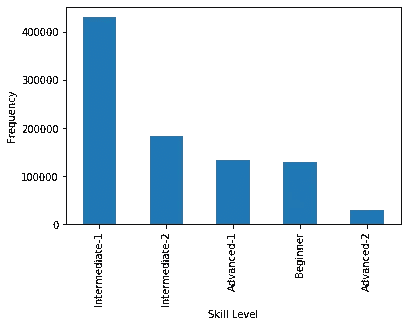

技能级别类别

*   我们需要的另一个工具是计算特定深度的最常见移动的工具。这两个函数将为我们完成这项工作:

```
from collection import Counterdef move_array_maker(move, depth):
    depth_str = str(depth) + '. '
    (_, needed_moves) = move.split(depth_str, 1)
    (white_move, black_move, _) = needed_moves.split(' ', 2)

    return white_move, black_movedef reverse_sort_dict(move_list):
    d = Counter(move_list)
    sorted_d = dict( sorted(d.items(),key=operator.itemgetter(1),reverse=True))
    return sorted_d
```

第一个函数获取游戏中的所有走法和我们正在寻找的走法的深度，并返回玩白棋和黑棋的玩家所走的走法。第二个函数接收列表并返回一个字典，字典中的键表示移动，值表示移动的次数。字典是降序排列的。这些函数对我们的分析很有帮助。

*   我们希望拥有的最后一个工具是根据不同的游戏格式对我们的数据集进行分类。

```
def game_grouper(df):
    skill_level_branch_df = df.groupby(by = ['winner','skill_level']).size()
    total_games_played = df.groupby(by = ['skill_level']).size()

    percentages_win_df = (skill_level_branch_df/total_games_played)*100
    temp_df = pd.DataFrame(percentages_win_df)
    temp_df.columns = ['Result percentages']

    game_format_branch_df = df.groupby(by = ['winner','game_format']).size()
    total_games_played2 = df.groupby(by = ['game_format']).size()

    percentages_win_df2 = (game_format_branch_df/total_games_played2)*100
    temp_df2 = pd.DataFrame(percentages_win_df2)
    temp_df2.columns = ['Result percentages']

    return temp_df, temp_df2
```

上面的函数将返回两个数据集，第一个将我们的数据集分类在不同的技能水平下，第二个将根据游戏格式分组。根据输入数据框，数据集将给出黑白图像的获胜百分比。

## 方法

我们大部分时间将遵循的程序如下:

1.  使用 move_array_maker 函数提取黑白在特定深度的移动。
2.  将移动内容追加到现有数据框的新列中。
3.  使用 reverse_sort_dict 检查最受欢迎的移动。
4.  过滤出你要分析的最受欢迎的动作的数据集。
5.  使用 game_grouper 函数获得基于技能水平和游戏格式的结果数据帧。
6.  绘制这些数据框。

您可以使用这种方法来分析任何深度。这里，我们将在一些最受欢迎的开场白中使用这种方法。

有了我们的数据集和所有的工具，我们可以开始我们的分析。

## 常见的第一步

在这一节中，我们将深入了解一些最常见的问题。应用上述功能后的所有结果如下:

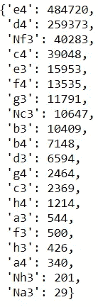

最常见的第一步棋

我们可以看到 e4(国王的棋子)和 d4(王后的棋子)是一些最常见的开局棋步。因此，与其他游戏相比，我们将更深入地想象这些游戏。还有 Nf3 (Reti 开场)和 c4(英文开场)也是相当常见的。然而，其他动作并不常见。所以，我们不打算分析它们。你可以使用上面提到的方法自行研究它们。让我们先从 e4 开始分析。

## 第一个——E4:国王的爪牙

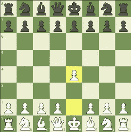

棋盘上国王的棋子开口(e4)

最受欢迎的开局，费舍尔的最爱，e4 是国际象棋中最常用的开局棋步之一。为什么玩的最多？因为它控制了棋盘的中心，并为光平方的象打开了对角线。大多数时候，由 e4 产生的头寸是爆炸性的和未平仓的。它不同于 d4，因为 d4 相对于 e4 来说更为平稳，而 E4 则更具攻击性。总的来说，白色是一个非常坚实的选择。现在，我们将看看这次开放所取得的总体成果。

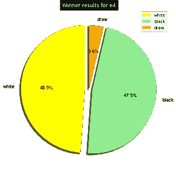

e4 的总体结果

e4 对于黑色和白色都产生了相当稳定的结果，白色有 1.4%的小边缘。由于这只是一步棋，我们将根据黑棋的下一步进一步展开分析。现在，让我们根据技能水平和游戏形式对数据进行分组。

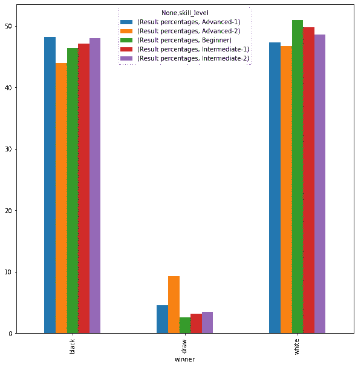

不同技能水平的 e4 结果百分比

如果我们根据技能水平对我们的结果进行分类，我们可以看到 e4 对于使用白色棋子的初学者产生了非常好的结果。因此，我们可以自信地说，e4 是初学者友好的举动。这就是为什么，当有人开始下棋时，这是一步棋。其他技能等级的结果也非常一致，黑人和白人的胜率都在 47%左右。但是在最高级，我们可以看到黑棋的胜率稍低，而和棋的百分比比其他技能等级高。我们现在不能对此说太多，因为我们也必须分析黑棋的反应。但有一点是肯定的，这是一个真正的初学者友好的举动，是一个非常坚实的选择白色。现在，让我们根据游戏形式对结果进行分类。

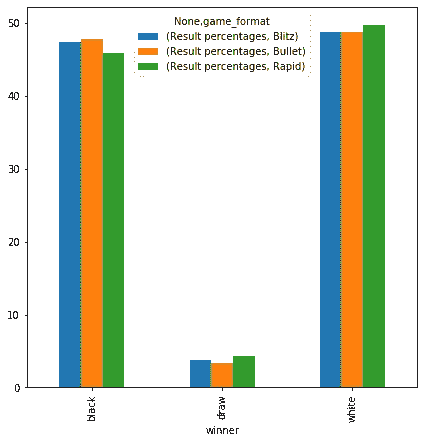

不同游戏形式的 e4 结果百分比

在我们对 e4 的游戏格式分析中，我们可以看到它在所有可能的游戏格式中都是一个可行的选项。然而，在快速时间格式中，它对白色有轻微的优势，但这是一个小优势。总的来说，e4 是 1500 多年来国际象棋中走得最多的一步棋，并且经受住了时间的考验。如果你是初学者，e4 是最好的选择。让我们看看布莱克方面对 e4 最常见的反应是什么。以下是对 e4 的一些最常见的回答。

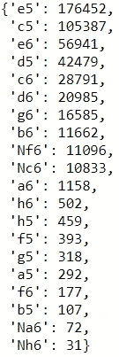

对 e4 的答复

这些是布莱克对 e4 最常见的回应。e5 是开放式比赛，c5 是西西里防御，e6 是法国防御，d5 被称为斯堪的纳维亚防御，c6 被命名为 Caro-Kann 防御。这 5 个开头是对 e4 最常见的反应。现在，我们将深入了解 e5 和 c5。

## e4-e5:开放式游戏


板上的 e4-e5

这叫开局(或双王走卒开局)。此举的目的是通过将棋子向前推两格来对抗白棋棋盘中心的控制。同时，它打开了黑方象的对角线。对 e4 的这种回应也是一种非常标准和坚实的游戏方法。

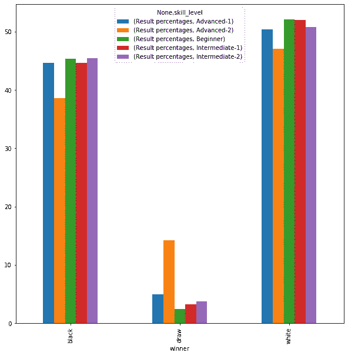

按技能水平分列的 e4-e5 的结果百分比

基于不同的技能水平，在一个非常高级的水平上，黑棋获胜的百分比更低，并且在高级水平上有更多的平局。此外，它在所有技能等级中都偏爱白色。通过查看此图，我们可以得出结论，如果你想用黑棋下一盘实棋，但没有赢，你可能会选择 e4-e5。但是如果你正在寻找更多更好的结果，你可能想要寻找对黑色有更好结果的其他武器。

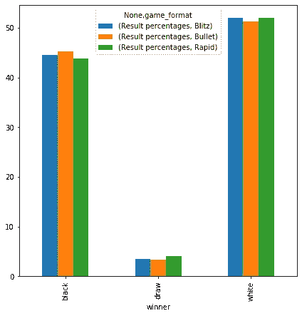

按游戏形式划分的 e4-e5 的结果百分比。

如果我们根据游戏格式对结果进行分类，那么所有格式的结果都是一样的，并且不支持任何特定的时间格式。我们可以观察到的一个现象是游戏的形式比较慢，黑棋的结果不太好。因此，总而言之，e4-e5 只是所有时间格式的一个简单、可靠的开端。它适用于所有级别，是一种非常标准、可靠的游戏方式。

e4-e5 最常见的变体是 Ruy Lopez(西班牙游戏)、意大利游戏和苏格兰游戏。所有提到的变化都有各自的优点。让我们继续我们对 e4 的下一个共同反应，西西里防御。

## 西西里防御:e4-c5

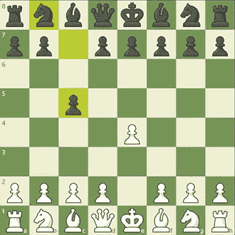

西西里防守在黑板上

现在我们在黑板上有西西里防御。在这里，不像 e5 那样在棋盘的中心争夺白，黑试图在旁边获得一点空间，但仍然保持它在中心的存在。这是对 e4 的最积极的反应之一，因为它是不对称开盘，不像 e4-e5，由于 E4-E5，出现的位置是令人兴奋和混乱的。白棋大部分时间试图在王侧(棋盘右侧)进攻，而黑棋大部分时间试图在后侧(棋盘左侧)产生反打法。在我们的数据集中，这是对 e4 的第二个最受欢迎的回答。现在，让我们开始分析它。

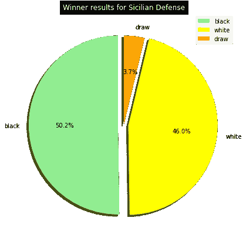

西西里防御的总体结果

饼图显示黑色是西西里防御的最爱。从历史上来说，在国际象棋的早期，人们总是玩 e4，西西里防御不是深入分析的东西。但随着时间的推移，人们发现这是对白人更具对抗性的回应，从那时起，它对黑人产生了更成功的结果，这从饼状图中可以明显看出。因为西西里防御的成功，顶级棋手开始多下一点 d4(皇后卒)以避开西西里防御。西西里岛的整体防御对 e4 产生了最成功的结果。

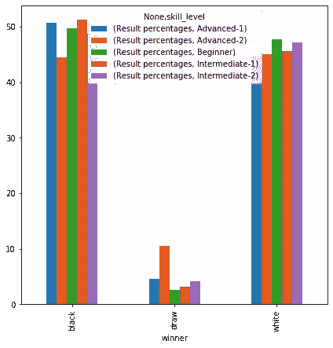

基于所有的技能等级，西西里防御在所有的技能等级中都偏爱黑色，除了在高级-2 中结果更加平衡。我们注意到的一件事是，除了高级-2，所有其他技能水平大多数时候都遵循类似的结论。这表明，如果你是一个初学者或中级玩家，而不是一个非常强大的玩家，跟随高级水平的东西不是一个好主意，因为如果它对高级玩家有效，并不意味着它会对你有效。此外，平局的百分比低于 e4-e5 开局，这显示了西西里防守的侵略性。

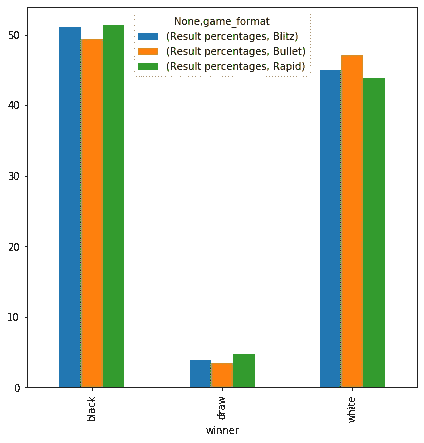

基于游戏格式的分类，与较慢时间格式相比，较快时间格式(项目符号)的结果更加平衡，在较慢时间格式中，黑色是明显的最爱。到目前为止，游戏模式的趋势相当相似:时间模式越慢，整体结果越差的一方越不利。让我们在接下来的章节中看看这种趋势是否会继续。

西西里防御最常见的变化是开放的西西里和封闭的西西里。在开放的西西里，白棋选择打 d4 打开中心，而在封闭的西西里，白棋不打开中心。我们已经看到了对 e4 最常见的反应。现在，是时候检查一下 d4 位置的结果了。

## D4-皇后的棋子

通过对 e4 头寸的分析，让我们开始 d4 的开局。

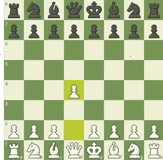

棋盘上的 d4

我们在板上有 d4。这一举动在过去被认为是不寻常的，但现在开始变得越来越普遍。这更像是无声的移动，游戏会导致更安静、更封闭的游戏。从我们的数据集中可以清楚地看出，e4 游戏的平均回合数(游戏回合数)是 70，而 d4 游戏是 74。

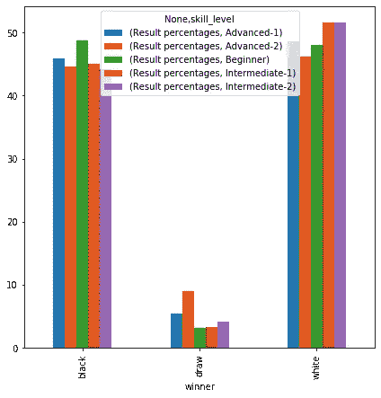

女王的棋子结果按技能等级排列

这些是根据不同技能水平分组的结果。初学者和高级-2 的结果几乎是平衡的(黑人和白人的胜率几乎相等)。在中级水平上，白棋的胜率相当高，这告诉我们黑棋面对 d4 是最不舒服的。针对 d4 的最佳对策是什么？接下来我们会知道的。现在，我们将看到按游戏形式分组的结果。

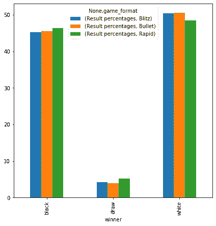

按游戏格式排列的皇后棋子结果

这些是按游戏形式分类的结果。我们可以做一个小小的观察。在 e4 游戏中，较慢的时间格式有利于颜色，颜色有更好的结果。在这里，情况正好相反。在较慢的时间格式(快速)中，白棋和黑棋的胜率几乎相等，而在较快的格式中，黑棋的结果更差。让我们调查一下对 d4 的一些常见反应。也许我们会为布莱克找到一些有趣的东西，就像我们找到西西里防御一样。

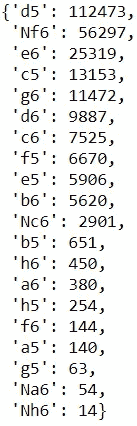

这些都是白棋玩 d4 时黑棋的常见反应。第一个是对称 d5。第二个是 Nf6(印度防守)，第三个是 e6(霍维茨防守)。前两个更常见，所以我们要看看它们。

## d4-d5:双皇后棋子开局

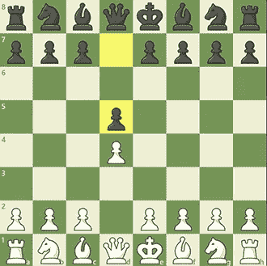

板上的 d4-d5

现在我们在板上有 d4-d5。这也称为封闭游戏(与 e4-e5 相反，称为开放游戏)。这被称为封闭的游戏，因为这种开放产生的位置的本质，这是封闭的，因为在 e4 中，白色的棋子是不设防的，更容易打破东西开放。而在 d4-d5 中，卒已经被女王保护，对任何一方来说都很难打开东西。

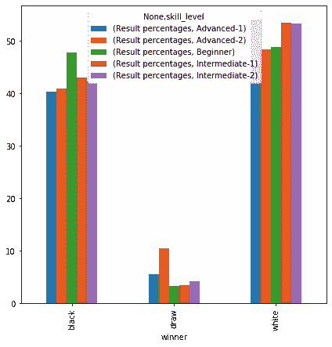

按技能水平分列的 d4-d5

这些是 d4-d5 的结果百分比。在初级水平，黑人和白人的胜率相当。但是当我们爬上技能阶梯时，事情对布莱克来说变得非常艰难，因为中级和高级水平的胜率更低。总之，如果你是初学者，可以随意玩 d4-d5，但是如果你爬得更高，你可能想要尝试一些不同的工具来对付 d4，这些工具已经为黑棋带来了更多的成功。

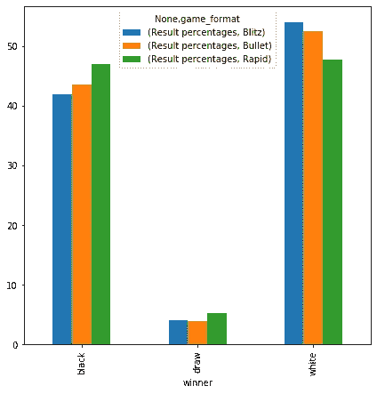

游戏格式的 d4-d5

这些是根据 d4-d5 的不同游戏形式分组的结果。更快的格式(blitz 和 bullet)非常喜欢白色。这与 e4-e5 的趋势相反，在 E4-E5 中，所有格式的结果都更加平衡。在进一步的调查中，我发现在所有黑棋输掉的游戏中，有 24.5%的游戏是准时输掉的。然而，在 e4-e5 游戏中，23%的游戏是准时输掉的。因此，也许是因为 d4-d5 位置的封闭性，黑棋在以更快的游戏模式进行游戏时面临困难，并在时间上失败。可能还有其他因素，但对我来说这个因素更明显。

最常见于 d4-d5 的变化是 QGD(女王的策略被拒绝)、QGA(女王的策略被接受)和斯拉夫防御。所有的变化都有自己的优点和缺点，你可以自己去发现它们。我们现在将转到国王的印第安人辩护。

## d4-Nf6:印度国防

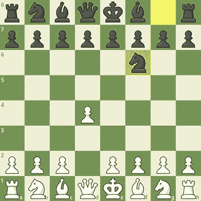

印度队防守在黑板上

这里我们有印度队的防守。在过去，黑棋不在棋盘中央与白棋竞争被认为是非常糟糕的，所以 d4-d5 和 e4-e5 是最常被使用的棋步。但是一些属于“超现代主义”流派的玩家提出了另一种为黑人演奏的想法。这个想法是让白棋用棋子占据中心，但黑棋会用它的棋子争夺中心，并在游戏后期释放它们来对抗白棋的延伸中心打法。这种类型的戏剧经受了时间的考验，直到今天都非常成功。印度防守是黑方的超现代防守之一。

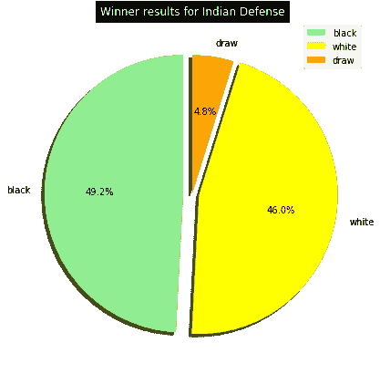

印度国防的总体结果

这是印度国防的总体结果。我们有了另一种武器，在这一点上，黑棋比白棋略胜一筹。到目前为止，第二个最受欢迎的来自黑人的回答导致了黑人比白人更好的统计。就像我们在 e4 游戏中有西西里防御一样，在 d4 游戏中，印度防御对黑棋来说非常成功。现在，让我们根据技能水平和游戏形式对结果进行分类。

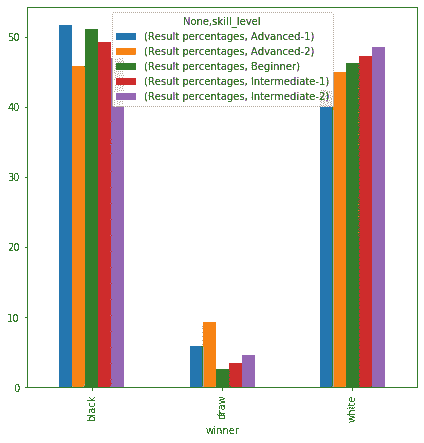

按技能等级划分的印度防守

在这里，我们将印度的防守分为不同的技术等级。在高级 2 水平上，结果相当平衡。除此之外，它在初级、中级和高级-1 水平上对黑人产生了非常好的效果。总的来说，印度防守在几乎所有技能水平上对 d4 都是最成功的。

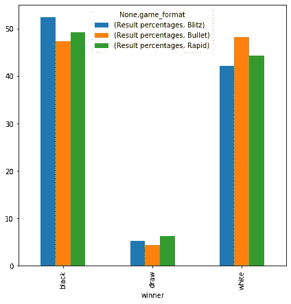

在不同的游戏模式下，尤其是在闪电战游戏中，印度的防守也为黑棋带来了非常好的统计数据。这表明，在时间不多的情况下为黑棋比赛要舒服得多。由于这一发现，我个人决定在我的游戏中更多地使用黑色棋子进行印度防御，因为它对不同的技能水平和游戏模式都有好处。

最常见的变化，从印度国防是国王的印度国防，尼姆佐印度国防，格伦菲尔德国防，和加泰罗尼亚开幕。请随意研究这些变化。

## 进一步分析

我绝对会喜欢调查更多的开放像法国国防，卡罗-卡恩国防，英国开放等。但是因为这篇文章已经很长了，所以您可以使用文章中提到的工具和方法自由地探索这些空缺。所以，在这里我想结束我的文章。

# 意见和结论:

1.  国王的棋子和王后的棋子很容易成为白棋最受欢迎的开局棋步。应对王卒，e5 和 c5 最受欢迎，对抗皇后卒，d5 和 Nf6 从黑最受欢迎。
2.  开放游戏(e4-e5)一直有利于白色，而西西里防御(e4-c5)有更好的结果为黑色。封闭游戏(d4-d5)对白棋产生了更好的统计数据，但印度防御(d4-Nf6)对黑棋产生了更好的结果。
3.  根据不同的开局，技能水平肯定会有所不同。例如，对于两种颜色(黑色和白色)的初学者来说，d4-d5 的胜率几乎相等，而对于黑色，中级玩家在 d4-d5 中的结果更差。
4.  游戏形式对开局的影响取决于开局的本质。例如，在 e4 游戏中，不同游戏格式的颜色没有明显的边缘。而在 d4 游戏中，游戏格式的影响更加明显。
5.  其他有趣的观察包括一场游戏持续的平均回合数(d4 游戏持续 74 回合，而 e4 游戏平均持续 70 回合)，评论(d4-d5 游戏中黑棋在时间上损失更多)。