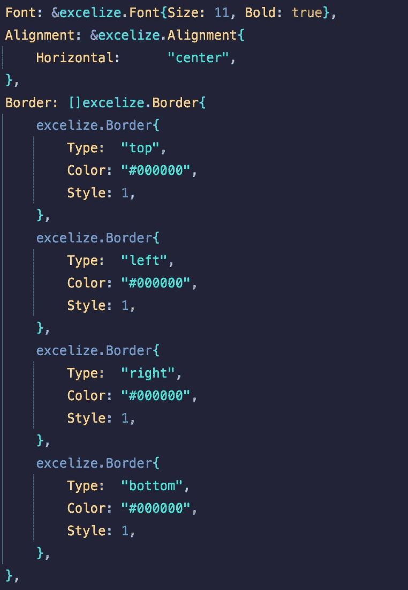
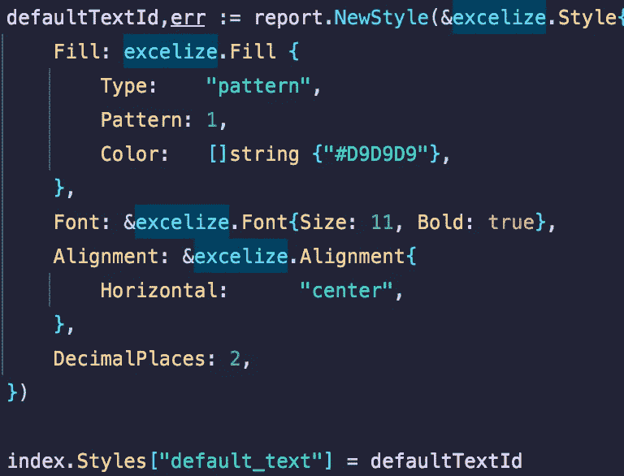

# 用围棋探索极限

> 原文：<https://medium.com/codex/exploring-excelize-with-go-88ce3712a5?source=collection_archive---------2----------------------->

一旦数据是 CSV 或 XLSX 格式，公式、数据透视表和插件都提供了转换或操作数据的方法。但是，如果您对将数据持续加载到共享报告中感兴趣，而其他团队成员可以更容易地在 Excel 或 Google Sheets 中利用这些数据，该怎么办呢？

Excelize 是一个 Go 库，用于生成与 Excel 兼容的电子表格，支持嵌入公式、样式、图表等。我最近一直在做一个自动化项目，在这个项目中，我利用 Go 和 Excelize 对目录结构进行编目，并将这些信息转换成自动更新的电子表格。

利用 Go 处理这种轻量级“ETL 式”工作负载是一种令人兴奋的体验，我想分享一些我在使用 Excelize 时获得的见解。

# 风格定义

毫不奇怪，当您更改单元格的背景、文本或边框属性时，Excel 会在电子表格中嵌入一个样式系统。理解 Excelize 如何处理样式花了我不愿意承认的时间。具体来说，许多文档示例都以 JSON 字符串的形式提供了一个样式对象。

这不是您想要的样式结构，因为您会失去所有的类型检查，并且必须手动处理转义字符和 JSON 格式。原来，`NewStyle`函数支持一个`interface{}` 参数，当你拉开盖子时，这个函数只是将你的字符串解组成一个`Style`对象。

如果我们在上面的例子中更进一步，你可以内联定义`Style`结构。现在，您不必担心手动编写 JSON 或弄乱单个属性的类型。

关于样式的最后一个注意事项是，一些属性(如边框)被输入以接受一部分字符串。如果你像我一样，这看起来好像你可以有任何数量的边框样式定义，这是没有意义的。

事实证明，与 CSS 类似，期望为单元格的四个边(上、左、右、下)定义四个边界结构。在左边的例子中，你会注意到你通过设置一个`Type`属性来指定每一边。

对于这种数据结构，利用地图上的切片似乎是一个有趣的选择，但可能有一些隐藏的好处。如果你对此有任何想法，我很乐意在评论中听到。

# 样式索引

Excelize 构建嵌入电子表格的样式索引；不幸的是，它只通过一个增量 id 来公开索引。我假设这是 Excel 内部处理跟踪这些信息的方式，但是我发现随着我添加更多的样式，这有点容易出错。我选择通过预先注册来建立这些风格的集中索引，然后利用一个`map[string]int`将一个名称附加到一个风格的内部 ID 上。

这让我可以将样式索引注入到各种函数中，并通过名称检索样式。我还在`StyleIndex`结构上编写了包装器方法，以提供更好的自动完成功能，并在将来需要更改时抽象出底层键。

# 单元形状

Excelize 提供了单独设置单元属性的函数，但缺少将标准配置组合在一起的高级函数。对于整个库来说，这可能是正确的调用，但是导致了很多重复的代码，每次都执行相同的动作。我写了几个助手函数，如下例所示，在这个例子中，我对合并多个单元格进行了分组，并设置了样式和值。

您还应该注意到被注入到函数中的`StyleIndex`结构。我来回考虑是传递索引还是从上一层传入样式 ID。我不确定我更喜欢哪个选项，因为每个选项在可重用性方面都有自己的权衡。

*   让每个函数调用都指定自己的样式 ID 使它更加通用和可重用。
*   为每种风格定义一个独立的功能意味着最终用户不需要了解所使用的底层风格。

你对这个权衡有什么想法吗？也许，你在另一个造型系统中遇到过这个问题。

# 迭代数据时生成单元格和行偏移量

在某些时候，您需要以编程方式确定需要将一段数据写入哪一行和哪一列。下面是我如何通过利用`ColumnNumberToName`函数和一个偏移值来实现这一点的例子。这允许我计算多条数据的列位置，而不用做任何 ASCII 计算来计算列`AX1`之后的内容。

# 结论

我喜欢利用 Excelize 来自动生成嵌入了丰富内容的电子表格。这很像是 Excel 文件格式之上的一个低级 API，这意味着您必须花一些时间为自己创建高级函数。你以前使用过 Excelize 或者其他不同语言的 excel 库吗？

在下面留言或在 [Twitter](https://twitter.com/peytoncasper) 上联系我；我很乐意继续这个话题。