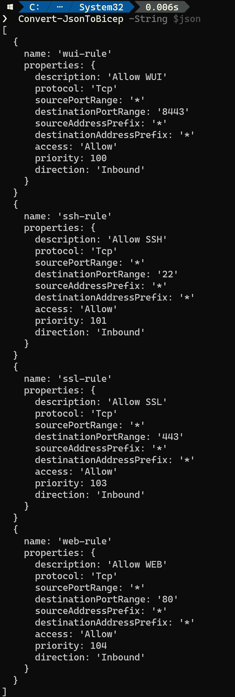
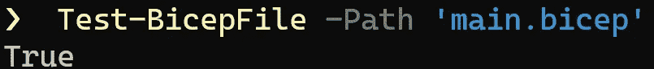

# 💪探索 Azure Bicep PowerShell 模块

> 原文：<https://medium.com/codex/exploring-the-azure-bicep-powershell-module-897db613d2e8?source=collection_archive---------1----------------------->

了解 PowerShell 中 Azure Bicep 提供的功能。


探索 Azure Bicep PowerShell 模块

如果您熟悉用于自动化系统管理、构建、测试和部署解决方案的 PowerShell，那么有一个 PowerShell 模块可以用于 Bicep 并简化 Bicep 创作体验。

在本文中，我们将探索 Bicep PowerShell 模块的一些功能，并使用几个示例。

# 装置

您有两种选择来安装 Bicep PowerShell 模块:您可以尝试稳定版或预发布版。该模块可通过 PowerShell Gallery 获得:[https://www.powershellgallery.com/packages/Bicep/](https://www.powershellgallery.com/packages/Bicep/)

要安装 PowerShell 模块，您可以使用下面的 cmdlet:

```
Install-Module -Name Bicep
```

如果您更喜欢尝试预发布版本，请使用下面的 cmdlet:

```
Install-Module -Name Bicep -AllowPrerelease
```

*根据您的环境，您可能需要将执行策略设置为无限制:

```
Set-ExecutionPolicy -ExecutionPolicy Unrestricted
```

# Bicep PowerShell 模块中可用的 Cmdlets。

以下是 Bicep PowerShell 模块中一些可用的 cmdlets 列表:

*   [练二头肌](https://github.com/PSBicep/PSBicep/blob/main/Docs/Help/Build-Bicep.md)
*   [肱二头肌](https://github.com/PSBicep/PSBicep/blob/main/Docs/Help/ConvertTo-Bicep.md)
*   [Get-BicepVersion](https://github.com/PSBicep/PSBicep/blob/main/Docs/Help/Get-BicepVersion.md)
*   [Get-BicepApiReference](https://github.com/PSBicep/PSBicep/blob/main/Docs/Help/Get-BicepApiReference.md)
*   [安装-BicepCLI](https://github.com/PSBicep/PSBicep/blob/main/Docs/Help/Install-BicepCLI.md)
*   [更新-BicepCLI](https://github.com/PSBicep/PSBicep/blob/main/Docs/Help/Update-BicepCLI.md)
*   [卸载-BicepCLI](https://github.com/PSBicep/PSBicep/blob/main/Docs/Help/Uninstall-BicepCLI.md)
*   [更新-双概念类型](https://github.com/PSBicep/PSBicep/blob/main/Docs/Help/Update-BicepTypes.md)
*   [Convert-JsonToBicep](https://github.com/PSBicep/PSBicep/blob/main/Docs/Help/Convert-JsonToBicep.md)
*   [新-BicepParameterFile](https://github.com/PSBicep/PSBicep/blob/main/Docs/Help/New-BicepParameterFile.md)
*   [更新-BicepParameterFile](https://github.com/PSBicep/PSBicep/blob/main/Docs/Help/Update-BicepParameterFile.md)
*   [测试-BicepFile](https://github.com/PSBicep/PSBicep/blob/main/Docs/Help/Test-BicepFile.md)

# 练二头肌。

这个 cmdlet 相当于 Bicep CLI 命令“Bicep *build* ，并且包括一些附加功能。

您可以在工作目录中编译一个 bicep 文件:

```
Build-Bicep -Path storage.bicep
```

您还可以指定输出目录:

```
Build-Bicep -Path 'c:\bicep\modules\storage.bicep' -OutputDirectory 'c:\armtemplates\storage.bicep'
```

现在想象一个场景，其中你有多个二头肌文件。下面的 cmdlet 允许您将所有 Bicep 文件编译到一个目录中

```
Build-Bicep -Path 'c:\bicep\modules\'
```

也可以进行例外处理，可以编译工作目录中除其中一个以外的所有 Bicep 文件。

```
Build-Bicep -Path 'c:\bicep\modules\' **-ExcludeFile storage.bicep**
```

你可以在这里查阅最新的文档[。](https://github.com/PSBicep/PSBicep/blob/main/Docs/Help/Build-Bicep.md)

# 转体二头肌

这个 cmdlet 将帮助你把 ARM 模板反编译成 Bicep 文件。这相当于“ *bicep 反编译*”，并且它有额外的特性。

要反编译单个 ARM 模板文件，可以使用下面的 cmdlet:

```
ConvertTo-Bicep -Path storage.json
```

反编译工作目录中的所有 ARM 模板:

```
ConvertTo-Bicep -Path 'c:\armtemplates\'
```

cmdlet ConverTo-Bicep 允许以下参数:

*   *-路径*
*   *-输出目录*
*   *-辅助字符串*
*   *-强制*

此 cmdlet 还支持常用参数: *-Debug、-ErrorAction、-ErrorVariable、-InformationAction、-InformationVariable、-OutVariable、-OutBuffer、-PipelineVariable、-Verbose、-WarningAction 和-WarningVariable* 。

# Get-BicepVersion

此 cmdlet 将帮助您验证 Bicep CLI 的已安装版本和最新可用版本。

```
Get-BicepVersion
```

# Get-BicepApiReference

此 cmdlet 将帮助您在浏览器中获取所提供资源类型的 ARM 文档。例如，要获取资源类型的最新 ARM 模板参考，请使用下面的 cmdlet:

```
Get-BicepApiReference -ResourceProvider Microsoft.Storage -Resource storageAccounts
```

使用上面的 cmdlet，您将被重定向到“ *Microsoft”的 ARM 文档。存储*‘资源提供者，资源’*存储账户*‘使用最新 API 版本。

# 安装-BicepCLI 和卸载-BicepCLI

这些 cmdlets 将允许您安装或卸载特定版本的 Bicep CLI。

安装特定的 Bicep CLI 版本:

```
Install-BicepCLI -Version '0.2.328'
```

卸载 Bicep CLI

```
Uninstall-BicepCLI -Force
```

# 更新-BicepCLI

此 cmdlet 允许您获得最新版本的 Bicep CLI 版本。

```
Update-BicepCLI
```

# Convert-JsonToBicep

这个 cmdlet 帮助您将任何有效的 JSON 对象转换为 Bicep 语言格式。

在下面的例子中，我们将 JSON 数组转换为 Bicep 语言:

```
$json = @'
[
          {
            "name": "wui-rule",
            "properties": {
              "description": "Allow WUI",
              "protocol": "Tcp",
              "sourcePortRange": "*",
              "destinationPortRange": "8443",
              "sourceAddressPrefix": "*",
              "destinationAddressPrefix": "*",
              "access": "Allow",
              "priority": 100,
              "direction": "Inbound"
            }
          },
          {
            "name": "ssh-rule",
            "properties": {
              "description": "Allow SSH",
              "protocol": "Tcp",
              "sourcePortRange": "*",
              "destinationPortRange": "22",
              "sourceAddressPrefix": "*",
              "destinationAddressPrefix": "*",
              "access": "Allow",
              "priority": 101,
              "direction": "Inbound"
            }
          },
          {
            "name": "ssl-rule",
            "properties": {
              "description": "Allow SSL",
              "protocol": "Tcp",
              "sourcePortRange": "*",
              "destinationPortRange": "443",
              "sourceAddressPrefix": "*",
              "destinationAddressPrefix": "*",
              "access": "Allow",
              "priority": 103,
              "direction": "Inbound"
            }
          },
          {
            "name": "web-rule",
            "properties": {
              "description": "Allow WEB",
              "protocol": "Tcp",
              "sourcePortRange": "*",
              "destinationPortRange": "80",
              "sourceAddressPrefix": "*",
              "destinationAddressPrefix": "*",
              "access": "Allow",
              "priority": 104,
              "direction": "Inbound"
            }
          }
        ]
'@
Convert-JsonToBicep -String $json
```

下图显示了上述 cmdlet 的输出。



将 JSON 数组转换成 Bicep 语言

# New-BicepParameterFile

如果您喜欢将参数文件中的值传递给 Bicep 文件，这将有助于您基于 Bicep 文件创建 ARM 模板参数文件。

```
PS C:\> Update-BicepParameterFile -Path .\storage.parameters.json
```

更新-BicepParameterFile

此 cmdlet 基于 Bicep 文件更新现有的 ARM 模板参数文件。

```
PS C:\> Update-BicepParameterFile -Path .\storage.parameters.json
```

# 测试-BicepFile

这个 cmdlet 将帮助您验证 Bicep 文件。默认情况下，它返回 true/false，并且可以生成 JSON 输出。

```
PS C:\> Test-BicepFile -Path 'MyBicep.bicep'
```



测试-BicepFile

此 cmdlet 允许以下参数:

*   -AcceptDiagnosticLevel
*   -ignoredignosticoutput
*   -输出类型
*   表示“使用…疗法的医生”:homeopath

希望这能让您更好地理解 Bicep PowerShell 模块的功能。

[*在此加入****azin sider****邮箱列表。*](http://eepurl.com/gKmLdf)

*-戴夫·r·*