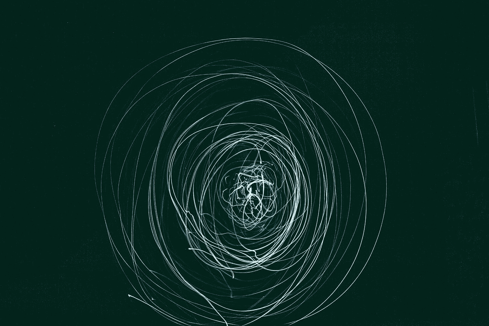

# 探索卷积神经网络的力量

> 原文：<https://medium.com/codex/exploring-the-power-of-convolutional-neural-networks-739f416282c7?source=collection_archive---------5----------------------->

## 人工智能

Gert RDA valasevi it 在 [Unsplash](https://unsplash.com?utm_source=medium&utm_medium=referral) 上拍摄的照片

## 介绍

CNN 是一种神经网络，可以非常有效地分析和分类图像。他们使用过滤器来识别图片中的模式，这使它们适用于物体检测和图像分类(识别图像中发生的事情)。在这个…