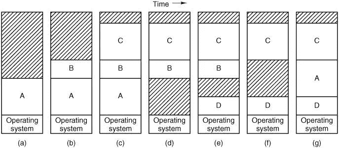
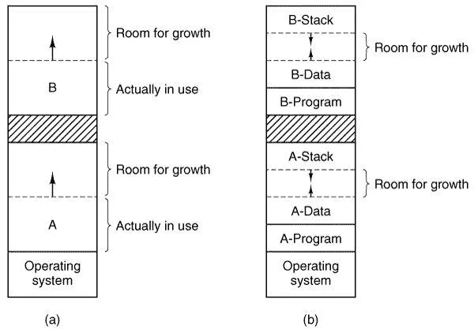
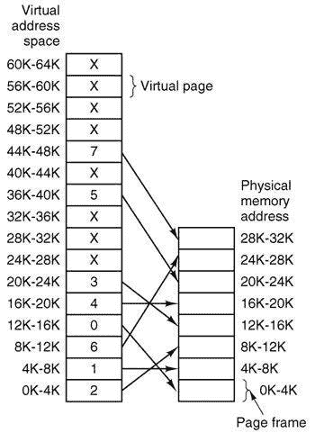
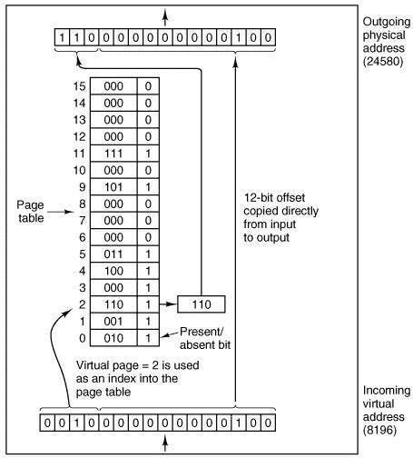
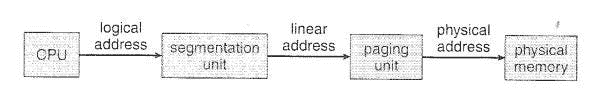

# 探索 Windows 内存管理—交换和虚拟内存

> 原文：<https://medium.com/codex/exploring-windows-memory-management-virtual-memory-712fee0def31?source=collection_archive---------2----------------------->

亚历山大·安德鲁斯在 [Unsplash](https://unsplash.com?utm_source=medium&utm_medium=referral) 上拍摄的照片

## [抄本](http://medium.com/codex)

我曾经很好奇我的窗户里发生了什么。我想和你分享我在这个话题上的探索。有两种内存管理方法:交换和虚拟内存。它们之间的区别在于进程加载到主存的方式。

# 交换

下图说明了交换系统的操作。最初，只有进程 A 在内存中。然后，进程 B 和 C 被创建或从磁盘换入。在(d)中，A 被换出到磁盘。然后 D 进来，B 出去。终于，A 又进来了。因为 A 现在位于不同的位置，所以其中包含的地址必须重新定位，或者在换入时由软件重新定位，或者(更有可能)在程序执行期间由硬件重新定位。

当交换在内存中产生多个洞时，可以通过尽可能向下移动所有进程，将它们合并成一个大洞。这种技术被称为内存压缩。通常不这样做，因为它需要大量的 CPU 时间。例如，在能够以 2gb/秒(0.5 纳秒/字节)的速度复制的 1gb 机器上，压缩所有内存大约需要 0.5 秒。这看起来时间不多，但对于观看视频流的用户来说，这显然会造成干扰。

值得关注的一点是，当一个进程被创建或换入时，应该为它分配多少内存。如果创建的进程大小固定不变，那么分配就很简单:操作系统准确分配所需的大小，不多也不少。

但是，如果进程的数据段可以增长，例如，通过从堆中动态分配内存，就像在许多编程语言中一样，那么每当进程试图增长时就会出现问题。如果某个孔与该进程相邻，则可以分配该孔，并允许该进程生长到该孔中。另一方面，如果该进程与另一个进程相邻，则要么必须将正在增长的进程移到内存中一个足够大的空间中，要么必须换出一个或多个进程来创建一个足够大的空间。如果一个进程不能在内存中增长，并且磁盘上的交换区已满，该进程将不得不等待或被终止。

如果预计大多数进程将随着运行而增长，那么每当换入或移动一个进程时，分配一点额外的内存可能是一个好主意，这样可以减少与移动或交换不再适合其分配的内存的进程相关的开销。然而，当将进程交换到磁盘时，应该只交换实际使用的内存；交换额外的内存也是一种浪费。在下图中，我们看到一个内存配置，其中增长空间已分配给两个进程。

如果进程可以有两个不断增长的段，例如，数据段用作动态分配和释放的变量的堆，而堆栈段用于正常的局部变量和返回地址，则另一种安排是显而易见的，即图(b)中的安排。在这个图中，我们看到每个进程在其分配的内存顶部有一个向下增长的堆栈，而在程序文本之外有一个向上增长的数据段。它们之间的内存可用于任一段。如果它用完了，要么将该进程移到一个有足够空间的洞，换出内存直到可以创建一个足够大的洞，要么终止该进程。

# 虚拟内存

虚拟内存背后的基本思想是，程序、数据和堆栈的总大小可能会超过可供它使用的物理内存量。操作系统将当前正在使用的程序部分保存在主存中，其余部分保存在磁盘上。例如，一个 512 MB 的程序可以在一台 256 MB 的机器上运行，方法是仔细选择每一时刻在内存中保留哪 256 MB，并根据需要在磁盘和内存之间交换程序片段。

虚拟内存也可以在多道程序系统中工作，一次在内存中存储许多程序的片断。当一个程序在等待它自己的一部分被引入时，它在等待 I/O 而不能运行，所以 CPU 可以给另一个进程，就像在任何其他多道程序系统中一样。

## 分页

大多数虚拟内存系统使用一种叫做分页的技术，我们现在将描述这种技术。在任何计算机上，都存在一组程序可以产生的内存地址。当一个程序使用像

> *MOV 注册，1000*

它这样做是为了将内存地址 1000 的内容复制到 REG(反之亦然，具体取决于计算机)。可以使用索引、基址寄存器、段寄存器和其他方式生成地址。

这些程序生成的地址被称为虚拟地址，形成虚拟地址空间。在没有虚拟内存的计算机上，虚拟地址被直接放到内存总线上，并导致具有相同地址的物理内存字被读取或写入。当使用虚拟内存时，虚拟地址不会直接到达内存总线。相反，它们会进入一个 MMU(内存管理单元),将虚拟地址映射到物理内存地址上。

下图显示了一个非常简单的映射工作原理的例子。在这个例子中，我们有一台计算机可以生成 16 位地址，从 0 到 64K。这些是虚拟地址。然而，这台计算机只有 32 KB 的物理内存，所以尽管可以编写 64kb 的程序，但它们不能全部装入内存并运行。但是，一个程序的内存映像的完整副本(最大 64 KB)必须存在于磁盘上，以便可以根据需要引入片段。

虚拟地址空间被分成称为页面的单元。物理内存中相应的单元称为页帧。页面和页面框架的大小总是相同的。在本例中，它们是 4 KB，但是实际系统中使用了从 512 字节到 1 MB 的页面大小。使用 64 KB 的虚拟地址空间和 32 KB 的物理内存，我们得到了 16 个虚拟页面和 8 页的框架。RAM 和磁盘之间的传输总是以页为单位。当程序试图访问地址 0 时，例如，使用指令

> MOV 区，0

虚拟地址 0 被发送到 MMU。MMU 发现该虚拟地址位于页面 0 (0 至 4095)，根据其映射，该页面是页面帧 2 (8192 至 12287)。因此，它将地址转换为 8192，并将地址 8192 输出到总线上。存储器对 MMU 一无所知，只看到一个读或写地址 8192 的请求，它接受这个请求。因此，MMU 已经有效地将 0 到 4095 之间的所有虚拟地址映射到物理地址 8192 到 12287 上。类似地，一个指令

> MOV 区，8192

被有效地转化为

> MOV 区，24576

因为虚拟地址 8192 在虚拟页面 2 上，并且该页面被映射到物理页面帧 6 上(物理地址 24576 到 28671)。作为第三个例子，虚拟地址 20500 距离虚拟页面 5(虚拟地址 20480 到 24575)的开始有 20 个字节，并且映射到物理地址 12288 + 20 = 12308。

这种通过适当设置 MMU 的映射将 16 个虚拟页面映射到任何 8 页帧的能力本身并不能解决虚拟地址空间大于物理内存的问题。因为我们只有八个物理页框，所以只有八个虚拟页被映射到物理内存上。其他的，在图中显示为十字，没有被映射。在实际的硬件中，存在/不存在位跟踪哪些页面实际存在于内存中。

如果程序试图使用一个未映射的页面，例如，通过使用指令，会发生什么

> MOV 区，32780

哪一个是虚拟页面 8(从 32768 开始)中的字节 12？MMU 注意到该页面未被映射(在图中用叉号表示),并使 CPU 捕获操作系统。这个陷阱被称为页面错误。操作系统挑选一个很少使用的页框，并将其内容写回磁盘。然后，它将刚刚引用的页面提取到刚刚释放的页面框架中，更改映射，并重新启动被捕获的指令。

例如，如果操作系统决定驱逐页帧 1，它将在物理地址 4K 加载虚拟页 8，并对 MMU 映射做出两个改变。首先，它会将虚拟页面 1 的条目标记为未映射，以捕获将来对 4K 和 8K 之间的虚拟地址的任何访问。那么它将用 1 替换虚拟页面 8 的条目中的叉号，以便当被捕获的指令被重新执行时，它将把虚拟地址 32780 映射到物理地址 4108 上。

现在让我们看看 MMU 的内部，看看它是如何工作的，以及为什么我们选择使用 2 的幂的页面大小。在下图中，我们看到了一个虚拟地址 8196(二进制为 0010000000000100)的示例，它是使用上一个示例的 MMU 映射进行映射的。传入的 16 位虚拟地址被分成 4 位页号和 12 位偏移量。用 4 位作为页码，我们可以有 16 页，用 12 位作为偏移量，我们可以寻址一页内的所有 4096 个字节。

页号被用作页表的索引，产生对应于该虚拟页的页框号。如果存在/不存在位为 0，则导致操作系统陷入陷阱。如果该位为 1，则页表中的页帧号与 12 位偏移一起复制到输出寄存器的高 3 位，该偏移是从传入虚拟地址不加修改地复制而来的。它们一起构成了一个 15 位的物理地址。然后，输出寄存器作为物理存储器地址放在存储器总线上。

## 分割

这是另一种基于虚拟内存概念的内存管理方案。这样，虚拟地址空间就是段的集合。每段都有名称和长度。因此，地址指定了段名和该段内的偏移量。因此，用户用两个量来指定每个地址:段名和偏移量。将这种方案与分页方案进行比较，在分页方案中，用户只指定一个地址，这个地址被硬件分成一个页号和一个偏移量，所有这些对程序员都是不可见的。

为了简化实现，对段进行编号，并通过段号而不是段名来引用。这就是分段方法中逻辑地址由两个元组组成的原因:

虽然用户可以通过二维地址引用程序中的对象，但是实际的物理地址当然仍然是一维的字节序列。因此，段表被定义为从二维用户定义地址到一维物理地址的映射。段表中的每个条目都有一个段基和一个段限。段基址包含段在内存中驻留的起始物理地址，而段限制指定了段的长度。

## **英特尔架构的战略**

分页和分段各有利弊。事实上，有些架构两者都提供，英特尔就是其中之一。它支持纯分段和带有分页的分段。

在 Pentium 系统中，CPU 产生一个逻辑地址给分段单元。分段单元为每个逻辑地址产生一个线性地址。然后线性地址被提供给分页单元，分页单元又在主存储器中产生物理地址。因此，分段单元和分页单元相当于内存管理单元，如下所示:

奔腾架构允许一个段为 4GB，每个进程的最大段数为 16KB。逻辑地址空间被分成两个分区。第一个由该进程专用的多达 8KB 的数据段组成。第二个由所有进程共享的高达 8KB 的数据段组成。关于分页，页面大小可以是 4 KB 或 4 MB。

*最初发表于*[*【https://emerging-it-technologies.blogspot.com】*](https://emerging-it-technologies.blogspot.com/2021/01/exploring-windows-memory-management.html)*。*