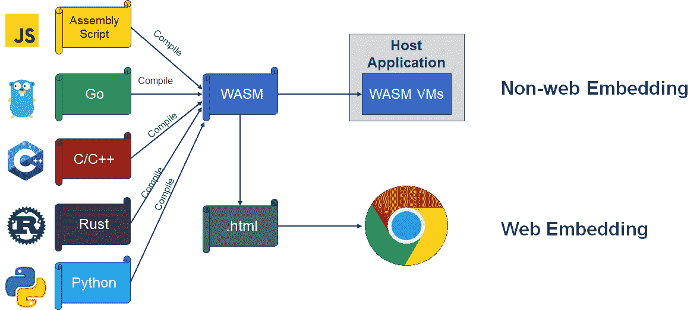

# 使用 WebAssembly 扩展后端应用程序

> 原文：<https://medium.com/codex/extend-backend-application-with-webassembly-ba19c17016d3?source=collection_archive---------2----------------------->

# 1.WebAssembly 简介

随着互联网的演进，越来越多的应用借助 JavaScript 迁移到 web 上，但人们也注意到，下载、解析、编译 JavaScript 需要耗费大量时间，导致页面加载时间过长，最终造成用户流失。

为了解决这些问题，来自 Mozilla 的工程师 Alon Zakai 在 2012 年提出了 Asm.js。经过几年的发展，终于在 2015 年演变成了 WebAssembly。

> WebAssembly(缩写为 Wasm)是基于堆栈的虚拟机的二进制指令格式。Wasm 被设计为编程语言的可移植编译目标，支持客户端和服务器应用程序在 web 上的部署。

这是 webassembly.org 官方对 WebAssembly 的定义。从这个定义可以看出，WebAssembly 是一种二进制指令格式。但是 WebAssembly 文本格式也经常被称为 WebAssembly，而事实上，这种文本格式是一种编程语言。

在官方宣布之后，WebAssembly 得到了快速发展。到 2017 年 11 月，Mozilla 宣布所有主流浏览器包括 Chrome、Firefox、Safari 等。支持 WebAssembly。并且根据 2021 年 7 月的数据，正在使用的浏览器中，94%已经支持 WebAssembly。

在得到浏览器的广泛支持后，一些重量级的应用也逐渐移植到了 Web 上，包括:

*   [谷歌地球](https://earth.google.com/web/)——一款主要基于卫星图像呈现地球三维图像的软件。
*   [AutoCAD](https://web.autocad.com/) —计算机辅助设计和绘图软件应用。这是一个运行在带有内部图形控制器的微型计算机上的桌面应用程序。
*   毁灭——一款由第一人称射击游戏组成的视频游戏
*   [tensor flow](https://blog.tensorflow.org/2020/03/introducing-webassembly-backend-for-tensorflow-js.html)——机器学习和人工智能的免费开源软件库。

这些案例也表明 WebAssembly 已经达到了它的设计目标——支持桌面应用程序在 web 上的部署。

WebAssembly 的快速发展源于其特殊的特性:

*   **近乎本机的性能**:基准测试显示，它只比本机代码慢 10%左右。
*   **尺寸小，加载快**，WebAssembly 是一种紧凑的二进制格式，通常比同等的 Javascript 代码小得多。
*   **安全稳妥**，WebAssembly 代码运行在沙箱中，默认不允许外部访问。
*   **支持多种语言**。WebAssembly 不限制用户用于开发的语言。只要有相应的编译器，任何语言都可以编译成 WebAssembly。

# 2.后端的 web 程序集

在 WebAssembly 的官方定义中，短语“*for a stack-based virtual machine*”也值得关注，因为它引领了 WebAssembly 这种原本是为 Web 而设计的技术，并且名称中包含“Web”一词，最终进入后端领域。

这是因为，从早期的 VMWare WorkStation 和 VirtualBox 到今天的 Docker，虚拟化技术一直是云计算的基础。因此，WebAssembly 作为一种具有诸多优势的虚拟机代码格式，进入后端应用领域是必然趋势。Docker 的创始人 Solomon Hykes 在 2019 年表示，“*如果 WASM+WASI 在 2008 年就存在，我们就不需要创建 Docker* ”，这显示了后端应用采用 WebAssembly 的前景。

当然，Solon Hykes 说的并不是指“WebAssembly 会在稍晚的时候取代 Docker”。这也是当今业界的普遍观点:WebAssembly 和 Docker 各有优势，互为补充。具体来说:

*   WebAssembly 程序的大小通常在 1M 左右，而 Docker 镜像往往轻松超过 100M，因此 WebAssembly 的加载速度要快得多。
*   WebAssembly 程序的冷启动速度比 Docker 容器快大约 100 倍。
*   WebAssembly 运行在沙盒中，任何与外界的交互都要获得显式的权限后才能进行，安全性极佳。
*   WebAssembly 模块只是一个二进制程序，不包含操作系统环境，所以不能像我们在 Docker 中可以做的那样，在编译后执行。

接下来，让我们通过例子来了解 WebAssembly 在后端的用法。

# 2.1.在应用程序中嵌入 WebAssembly

如下图所示，无论是 web 应用还是非 web 应用，我们都需要在宿主程序中嵌入 WebAssembly 运行时来使用 WebAssembly。唯一不同的是，在 web 应用中，宿主程序是浏览器，而在非 web 场景中，宿主程序是我们自己的应用，具体到本文重点讨论的后端应用，宿主程序是我们的后端服务。

目前可用的 WebAssembly 运行时包括 [Wasmtime](https://wasmtime.dev/) 、 [WasmEdge](https://wasmedge.org/) 、 [WAVM](https://wavm.org/) 、 [Wasmer](https://wasmer.io/) 等。，各有利弊。本文将以 Wasmtime 为例，介绍如何在用 Go 语言开发的宿主程序中嵌入 WebAssembly。

嵌入 WebAssembly 运行时和实例化 WebAssembly 模块非常简单，下面几行代码完成了所有这些工作(如果忽略错误处理的话)。

但这段代码片段涉及几个重要概念，简单介绍如下:

*   **引擎**:wasm 模块编译和管理的全局上下文。
*   **模块**:编译后的 WebAssembly 模块。这个结构表示在被实例化后准备执行的内存中 JIT 代码。
*   **存储**:所有的 WebAssembly 对象和主机值都将“连接”到一个存储。
*   **实例**:一个实例化的 WebAssembly 模块，在这里你可以实际获取一个函数，比如调用。在实例化的时候，模块的启动函数被调用。
*   **链接器**(仅限 Wasmtime):将 wasm 模块/实例链接在一起的助手结构。

虽然上面的代码创建了一个 WebAssembly 模块的实例，并且根据 WebAssembly 规范，会执行 start 函数。但是由于安全限制，执行结果无法输出，所以“执行”是没有用的。因此，我们需要实现宿主程序和 WebAssembly 程序之间的互操作性，并为 WebAssembly 程序提供输入/输出接口。

# 2.2.宿主调用 WebAssembly

假设我们的 WebAssembly 程序有一个名为 sum 的函数，它接收两个整数变量作为参数并返回它们的和，宿主程序可以使用以下代码来调用此函数:

虽然具体的调用方法与宿主程序的编程语言和所使用的 WebAssembly 运行时不同，但是运行时的文档通常都有相关的说明，所以按照文档就可以了。

这里的难点是如何从 WebAssembly 程序中导出 sum 函数，以便宿主程序可以找到并调用它。如前所述，只要有编译器，任何语言都可以编译成 WebAssembly，但大多数语言的设计都没有考虑 WebAssembly 的需求，也没有办法导出 WebAssembly 中的函数。所以这个问题只能通过特定编译器的非标准扩展来解决。换句话说，找到这个非标准的扩展是解决问题最关键的一步。但是，也由于“不规范”，相关信息往往不容易获得。

下面举例说明如何在 C/C++(使用 Emscripten 作为编译器)和 AssemblyScript 中导出函数:

# 2.3.WebAssembly 调用主机

类似于宿主调用 WebAssembly，WebAssembly 运行时的文档通常描述宿主如何将函数导出到 WebAssembly 程序。

问题的难点还在于如何使用语言的非标准扩展在 WebAssembly 程序中导入这个函数。以下是 C/C++和 AssemblyScript 中的具体方法:

# 2.4.非原始参数

当宿主和 WebAssembly 程序调用对方的函数时，也需要传递参数和返回值。如果是整数之类的原语数据类型，直接传递就好了。但是，当参数或返回值是非原始类型(如字符串)时，我们会遇到新的问题:

*   宿主程序和 WebAssembly 程序的编程语言一般不一样，所以非原语参数的内存布局也不一样。如果直接传递，接收者根本无法理解，更不用说使用了。
*   由于安全设计，主机程序和 WebAssembly 程序的内存是隔离的，WebAssembly 程序无法访问主机的内存。

因为宿主程序可以访问 WebAssembly 的内存，所以第二个问题的解决方案是 WebAssembly 程序导出内存管理函数，使宿主能够操纵其内存，例如:

之后，我们可以利用这些内存管理函数通过相关数据类型的封送/解封来传递参数/返回值。例如，下面的 WebAssembly 函数调用一个主机函数，参数和返回值最初都是字符串，但是在封送/解封之后，我们将字符串转换为 WebAssembly 内存中的地址(整数):

# 2.5.软件开发工具包(Software Development Kit)

在经历了宿主程序和 WebAssembly 程序互操作的过程后，相信你已经发现它和 RPC 调用的过程非常相似。不同的是，在 RPC 调用中，枯燥的封送/解封操作是由相关工具自动生成的代码完成的，用户根本不需要关心

在 WebAssembly 应用程序的开发中，用户也不希望处理这么多的细节。因此，作为主机程序的开发者，我们需要为用户提供相关的 SDK 来隐藏底层细节，以便用户可以专注于业务逻辑的开发。

由于用户可以用多种语言开发 WebAssembly 应用程序，我们需要为不同的语言提供 SDK，或者至少为用户使用的主要语言提供 SDK。

# 2.6.宿主处理 WebAssembly 中的错误

和其他程序一样，WebAssembly 程序也会有各种 bug。虽然，作为一个主机程序开发者，我们无法预测一个具体的 bug，但是我们必须限制这些 bug 对 WebAssembly 虚拟机的影响，防止它们影响主机。

宿主程序必须防止的第一类错误是无限循环。实际上，宿主程序没有办法知道是否存在无限循环。因此，折衷的解决方案是为 WebAssembly 程序设置一个超时持续时间。一旦超过这个持续时间，我们就认为存在一个无限循环，并终止 WebAssembly 程序的执行。终止执行的代码如下:

**ih，_ := store。中断句柄()
ih。中断()**

# 3.Easegress 中的 WebAssembly

[Easegress](https://github.com/megaease/easegress) 是由 [MegaEase](https://github.com/megaease) 开发的下一代流量网关，是云原生的、高可用的、可观察的、可扩展的。在 Easegress 之前，市场上已经有很多成熟的网关产品，包括 Nginx。然而，MegaEase 认为网关不仅仅是一个反向代理，还需要能够协调和调度流量。此外，还涉及到各种业务逻辑入侵，因此它也必须具有高度的可扩展性。

基于以上观点，MegaEase 从 Easegress 开发的第一天起就把可扩展性作为一个重要的需求，并在几个方面进行了相关的设计。

首先，是开发语言的选择。

*   使用 C/C++或者 Rust 肯定会给 Easegress 带来最好的性能，但是这些语言太硬，用户很难掌握，所以如果选择了这些语言，他们是不可能通过修改代码来扩展业务逻辑的。
*   Java 易学易用，生产力非常好。但其尺寸和性能不能满足要求；
*   相对来说，Go 简单易学，性能更好，尤其是在 Easegress 针对的网络应用领域，因为设计优秀，Go 和 C++的性能差距往往可以忽略不计。所以 Easegress 选择 Go 作为开发语言。但是不管使用什么语言，源代码级的扩展都不可避免地会将用户限制在特定的语言上，并且会涉及重新编译、重新部署和重新启动，从而导致服务中断。

第二种提供可扩展性的方法是 FaaS，Easegress 已经支持 FaaS。FaaS 不限制用户的开发语言，也具有良好的可扩展性。缺点是严重依赖 Kubernetes 等外部依赖，带来了操作的复杂性。

第三种方法是嵌入一个解释器。起初，我们把重点放在 Lua 上，这是一种为嵌入到其他程序中而设计的语言，但是在详细评估之后，我们认为 Lua 有两个弱点。一个是表达能力不够，不适合写复杂的业务逻辑；另一个就是人气不够，很难找到有相关经验的程序员。因此，Easegress 决定嵌入 WebAssembly，主要基于两点考虑:一是近乎原生的性能；二是它不限制用户的开发语言，用户可以使用自己喜欢或熟悉的语言来开发业务逻辑。

作为用 WebAssembly 扩展业务逻辑的例子，我们发布了“[用 Easegress 和 WebAssembly](https://github.com/megaease/easegress/blob/main/doc/cookbook/flash_sale.md) 处理闪购”。如果您有任何反馈，请随时告诉我们，并欢迎向我们提供更多的用例。

正如我上面提到的，选择 WebAssembly 意味着我们需要为多种语言开发 SDK。我们已经完成了汇编脚本的 [SDK 的开发。我们相信，通过 MegaEase 和整个开源社区的努力，我们可以在不久的将来支持越来越多的语言。](https://github.com/megaease/easegress-assemblyscript-sdk)