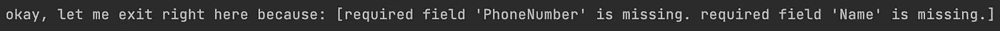
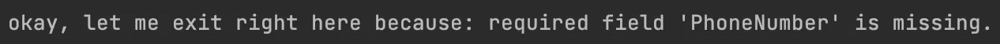

# 扩展 Go Struct 标记而不变得(太)脏

> 原文：<https://medium.com/codex/extending-go-struct-tags-without-getting-too-dirty-8bf14cd61d1f?source=collection_archive---------2----------------------->

作为软件开发人员，有时我们希望扩展内置的语言特性，但通常我们会得出这样的结论:无缝地添加这些特性会非常痛苦和费力。

在这里，我们将看到如何扩展 Go 现有的 Struct 标签，而不会有太多的痛苦，同时仍然得到我们想要的回报！

[吉利](https://unsplash.com/@gillyberlin?utm_source=medium&utm_medium=referral)在 [Unsplash](https://unsplash.com?utm_source=medium&utm_medium=referral) 上拍摄的照片

# 什么是结构标签？

结构标记是一种“表示特定范围内结构字段的预期行为”的方式。

这不是有史以来最好的解释，但通过一个例子会变得很清楚:

在上面的结构中，我们使用 json 标记来描述每个结构字段的预期行为，即:当转换为 json 时它将具有的名称，以及如果该字段没有值(omitempty)该怎么办。

这意味着，在将上述结构的一个实例编组到 json 之后，输出将类似于以下内容:

如您所见，这些字段采用了我们在 json 标记中指定的名称。此外，因为没有提供电子邮件，并且电子邮件字段有“omitempty”关键字，所以它不会显示在结构的 json 表示中。

# 如何扩展功能

现在，回到核心主题:“我们怎样才能不太费事地扩展标签的功能？”。让我们使用 json 标记作为测试主题。

有一个显而易见的功能，如果能得到支持就太好了，那就是“required”关键字。

**必需的**关键字将通过在结构声明中指定哪些字段必须有一个值才能使 json 主体符合该结构，从而使 json 摄取更加干净。

不幸的是，目前还不支持它，这意味着必须对摄取的 json 进行额外的验证。通常通过某种验证功能。

照片由[你好我是 Nik](https://unsplash.com/@helloimnik?utm_source=medium&utm_medium=referral) 上 [Unsplash](https://unsplash.com?utm_source=medium&utm_medium=referral)

也就是说，有几种方法可以增加这个功能，而不需要为每个结构使用我们自己的验证函数:

1.  创建我们自己的 Go 的[解组器接口](https://pkg.go.dev/encoding/json#Unmarshaler)的实现，并使用它代替默认的接口→ *太多的工作*。
2.  使用 json 模式验证器，比如[这个](https://github.com/xeipuuv/gojsonschema) → *很棒的东西，但是对于我们想要的一件小事来说，它仍然是你的项目的一个依赖。*
3.  使用反射来检测您的新关键字，并在当前支持的行为之上支持它们→😎🥳

# 履行

我们的*工作方式*基本上是包装 Go 已经提供的东西，并通过反射处理我们的新标签。

我们希望**尽可能做到无缝**，因此:

*   像当前支持的所有其他关键字一样，required 关键字将在 json 标记中使用。
*   目前支持的一切都将一如既往地继续工作。

我们处理 json 摄取方式的唯一变化是，从现在开始，我们将使用这个新函数:

**总结一下这个功能**中发生的事情:

1.  我们用 Go 的默认 json 包进行解组，如果一切顺利，我们继续开发我们自己的新东西；
2.  我们遍历每个字段并获取 json 标签；
3.  我们深入那个标签，检查它是否包含“required”关键字；
4.  如果它包含所需的关键字，并且该字段的值是该类型的“零值”,那么我们就遇到了问题，应该会失败并显示一条有意义的消息。

# 用法:之前与之后

下面你可以看到生活是如何与常见的方法*“JSON。“解组+验证函数”*与我们的新方法*“标签+改进的解组函数”*。

*   **新关键字+改进的编组函数**

*   **json。解组+验证功能**

从上面的两个例子中可以看出，通过使用我们新的关键字和函数，我们现在有了一个**可重用平台**来验证 json 主体中的必填字段，而不是必须为我们希望包含必填字段的每个结构编写验证函数。

# 进一步的改进

我们在这一点上已经很酷了…但我们可以有更多😈。如果我们不知道在验证自定义标签时遇到的第一个问题，而是知道 json 主体中存在的每个问题，这不是很好吗？

我们现在已经掌握了这种能力:不是在发现第一个问题时返回，而是将所有问题附加到一个片上，并返回它而不是一个错误。

查看下面的完整示例。

上面的代码将返回:

我们以前的实现只返回发现的第一个错误:

# 主要要点

*   我们可以通过包装现有流程和使用反射来轻松扩展 Go 中的标签。
*   我们可以很容易地使我们的代码更加紧凑，可重用和可读。
*   除了扩展现有的标签，我们还可以为除 json 处理之外的场景添加对我们自己的新标签的支持。明确的用例将是格式化、修订 PII、可空性检查等。
*   这很容易(只是增加了一个功能)，也不痛苦(我们编写代码的方式几乎是一样的)，而且我们确实获得了好处😎
*   除了增加功能之外，我们还可以通过丰富典型的操作方式来改善现状:我们不返回第一个错误，而是返回 json 主体中关于新标签验证的所有错误。😈