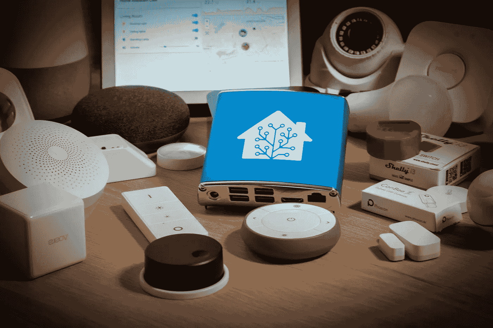

# 使用 Alexa 功能扩展我的物联网门铃

> 原文：<https://medium.com/codex/extending-my-iot-doorbell-with-alexa-features-db6517fd6f41?source=collection_archive---------12----------------------->

Homeassistant(来自 home assistant 主页)

在我关于[我如何让我的门铃变得智能](https://blog.bajonczak.com/how-to-make-your-doorbell-smart/)的帖子中，我想…是的，我现在如何用一些方便的功能来扩展它？

所以，事实上，门铃很响，但是当我在我的花园里，我的门关着，送货员必须拿着一个沉重的包裹，试图按门铃时，我没有开门，因为我没有听到铃声。这对每个人来说都是令人沮丧的，最终可能会变成这样