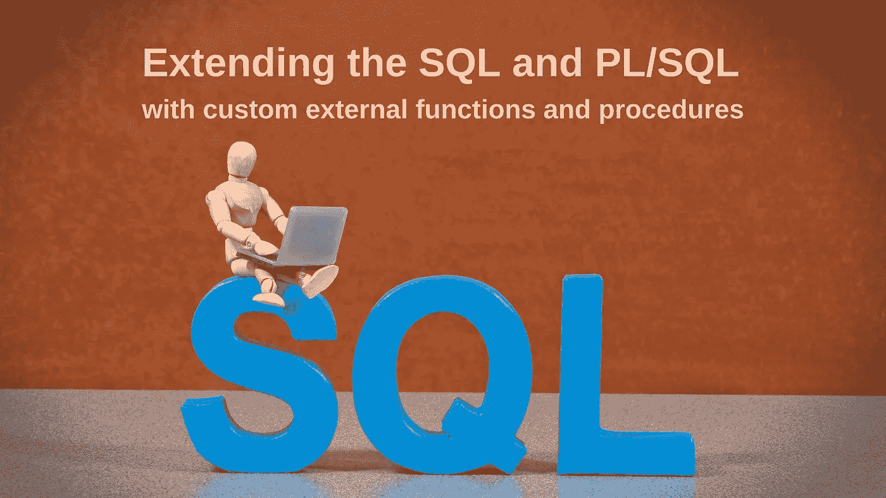
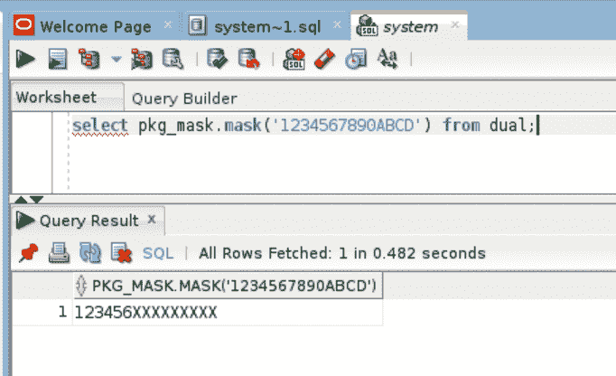
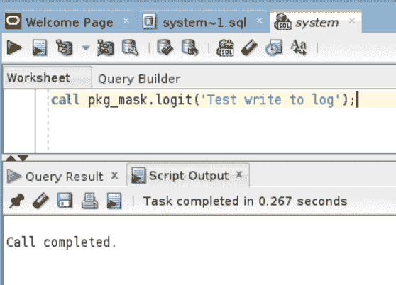

# 使用自定义外部函数和过程扩展 SQL 和 PL/SQL

> 原文：<https://medium.com/codex/extending-the-sql-and-pl-sql-with-custom-external-functions-and-procedures-214067761061?source=collection_archive---------9----------------------->



许多数据库管理系统都有独特的功能。例如，可以使用自定义函数进行扩展，这些函数既可以在过程中使用，也可以直接在 SQL 查询中使用。

我们什么时候需要自定义函数？例如，当我们需要实现非标准计算、编码、加密、转换时。这种功能也有助于与外部系统进行交互。

它看起来会像这样:

我不得不在不同的 DBMSs 中以这种方式重复扩展。今天，我将告诉您如何在 Oracle 中实现这一点。事实证明，它可以在 11g 到 19c 的 Oracle 版本中工作。

> 我想指出的是，它不是一个隐藏函数。它是合法的，由甲骨文公司开发。此外，Oracle 自己也建议在某些情况下应用它。

# 如何用自定义函数扩展 SQL 和 PL/SQL

整个过程相当简单，你只需要遵循四个步骤:

1.  编写并编译一个实现这个函数的库。
2.  设置 Oracle，以便它可以检测库。
3.  在 Oracle 中创建一个将引用我们库的库对象。
4.  在 Oracle 中创建一个过程\函数包装器，用于在 SQL 查询中访问编写的库。

对于实验，我通常使用现成的虚拟机实例，它们已经有了一个配置好的 Linux、一个 Oracle 数据库和工作所需的一切。在此下载映像[，将其导入 VirtualBox(在此](https://www.oracle.com/downloads/developer-vm/community-downloads.html)下载[)，5 分钟后我们就可以使用 Oracle 19c 得到一个现成的虚拟机。](https://www.virtualbox.org/)

首先，让我们来看看我们的虚拟机。

# 步骤 1:编写库

这可能是我们必须做的所有事情中最困难的部分。但是如果你按照我的指示去做，一切都会好的。

这个例子中的库是用 C 语言为 Linux 平台编写的，因为我们有一个运行 Linux 的虚拟机。

> 注意:Oracle 允许您包含用 C、C++、COBOL、Java 编写的库。网等。

航站楼已经为我们开放了，我们开始吧。

我们检查我们是否在/home/oracle 目录中:

```
[oracle@localhost ~]$ pwd/home/oracle
```

创建一个目录来放置我们的库。我们姑且称之为，比如，面膜。然后打开它:

```
[oracle@localhost ~]$ mkdir mask[oracle@localhost ~]$ cd mask[oracle@localhost mask]$
```

创建一个扩展名为“c”的文件—这是一个用 c 语言编写源代码的文件。让我们称它为简单的文件— mask.c:

```
[oracle@localhost mask]$ nano mask.c
```

编辑器将打开。然后你可以输入你的文本或者粘贴我的。我的代码可能并不优雅，但它是如何实现两个函数和一个过程的示例:

**echo** 函数只是返回传递给它的字符串。在将它包含到 Oracle 中之前，我们将使用它来检查该函数是否工作。

**mask** 函数获取一个字符串并将其屏蔽，用字符“X”替换第 7 个到最后一个字符。

**logit** 过程会将传递的字符串写入 log.txt 文件。是的，你不应该这样做。我们这样做是为了示范。

插入后，关闭编辑器(按 Ctrl-X，然后 Y，Enter)并同意以此名称保存它(按 Enter)。

创建另一个 mask.h 文件:

```
[oracle@localhost mask]$ nano mask.h
```

和以前一样，键入您自己的文本或复制下面的文本并保存:

确保两个文件都已创建:

```
[oracle@localhost mask]$ ls -ltotal 8-rw-r — r — . 1 oracle oinstall 456 Jan 20 09:46 mask.c-rw-r — r — . 1 oracle oinstall 141 Jan 20 09:57 mask.h[oracle@localhost mask]$
```

将源文件编译成动态库:

```
[oracle@localhost mask]$ gcc -shared -o libmask.so -fPIC mask.c[oracle@localhost mask]$
```

没有错误，太好了！确保库已创建。应该命名为 **libmask.so** :

```
[oracle@localhost mask]$ ls -ltotal 20-rwxr-xr-x. 1 oracle oinstall 8416 Jan 20 10:02 **libmask.so**-rw-r — r — . 1 oracle oinstall 458 Jan 20 10:02 mask.c-rw-r — r — . 1 oracle oinstall 143 Jan 20 10:02 mask.h[oracle@localhost mask]$
```

现在我们需要检查我们编写和编译的库是否运行。为此，我们将编写一个调用我们的库的小程序:

```
[oracle@localhost mask]$ nano testlib.c
```

粘贴此代码:

关闭、保存、编译:

```
[oracle@localhost mask]$ gcc -Wall -L/home/oracle/mask -o testlib testlib.c -lmask[oracle@localhost mask]$
```

到目前为止还可以。我们确保已经创建了我们需要的文件:

```
[oracle@localhost mask]$ ls -ltotal 36-rwxr-xr-x. 1 oracle oinstall 8416 Jan 20 10:02 libmask.so-rw-r — r — . 1 oracle oinstall 458 Jan 20 10:02 mask.c-rw-r — r — . 1 oracle oinstall 143 Jan 20 10:02 mask.h-rwxr-xr-x. 1 oracle oinstall 8472 Jan 20 10:14 **testlib**-rw-r — r — . 1 oracle oinstall 83 Jan 20 10:11 testlib.c[oracle@localhost mask]$
```

不要忘记设置环境变量:

```
[oracle@localhost mask]$ export LD_LIBRARY_PATH=/home/oracle/mask:$LD_LIBRARY_PATH[oracle@localhost mask]$
```

接下来，运行:

```
[oracle@localhost mask]$ ./testlib[oracle@localhost mask]$
```

检查执行结果。应该已经创建了一个 log.txt 文件，其中包含“echo testing…”一行:

```
[oracle@localhost mask]$ ls -ltotal 40-rwxr-xr-x. 1 oracle oinstall 8416 Jan 20 10:02 libmask.so-rw-r — r — . 1 oracle oinstall 16 Jan 20 10:18 **log.txt**-rw-r — r — . 1 oracle oinstall 458 Jan 20 10:02 mask.c-rw-r — r — . 1 oracle oinstall 143 Jan 20 10:02 mask.h-rwxr-xr-x. 1 oracle oinstall 8472 Jan 20 10:14 testlib-rw-r — r — . 1 oracle oinstall 83 Jan 20 10:11 testlib.c[oracle@localhost mask]$ cat log.txt**echo testing…**[oracle@localhost mask]$
```

在这里。这意味着我们的库工作了，我们现在可以开始安装 Oracle 了。

# 步骤 2:设置 Oracle，以便它可以检测库

为此，在一个特殊的配置文件 extproc.ora 中写入我们库的路径。

```
[oracle@localhost mask]$ nano $ORACLE_HOME/hs/admin/extproc.ora
```

在打开的窗口中，在末尾添加一行到我们库的路径:

```
SET EXTPROC_DLLS=ONLY:/home/oracle/mask/libmask.so
```

关闭并保存。

现在，您可以直接在 Oracle 数据库中创建必要的对象。

# 步骤 3:在数据库中创建对象

为了清楚起见，我们将使用已经安装在虚拟机上的 Oracle SQL Developer 应用程序。让我们运行它。

> 密码是标准的“甲骨文”。

打开一个空白的 SQL 工作表(Alt-F10 ),粘贴命令以创建库:

执行(Ctrl-Enter)。我们会看到库已创建的消息:

```
Library LIB_MASK compiled
```

# 步骤 4:创建 PL\SQL 函数和过程，我们将用它们来调用用 c 编写的函数和过程。

为此，我们创建了 pkg_mask 包，其中描述了一个函数和一个过程。将代码粘贴到工作表中并执行:

检查包是否已创建:

```
Package PKG_MASK compiled
```

现在我们可以检查一切是如何工作的。为此，我们执行普通的 select，它调用包函数:

```
select pkg_mask.mask(‘1234567890ABCD’) from dual;
```

这是结果—一个屏蔽的字符串。



一切正常))

> *注意:如果突然出现错误，请尝试关闭 sql developer 并再次打开它。*

让我们看看第二个 logit 过程是如何工作的，它将文本写入文件:

```
call pkg_mask.logit(‘Test write to log’);
```



该程序已成功完成。让我们检查是否有日志条目。为此，请返回终端并查看:

```
[oracle@localhost mask]$ cat log.txt‘Test write to log’
```

所以我们得到了预期的结果。太好了！

# 结论

我们已经与您讨论了一个示例，说明如何创建外部库并将其包含到 Oracle 中，以及如何在查询和过程中轻松使用它们。如果您决定自己用这种方法实现某些东西，那么一定要查看 Oracle 文档——在不同的版本中可能会有细微的差别。

我喜欢帮助组织用数据来增强他们的业务，所以我很乐意在评论中听到你对上述内容的想法，并随时通过 [LinkedIn](https://www.linkedin.com/in/yevgeniysamoilenko/) 与我联系。