# 用 Rvest 从 HTML 表格中提取数据

> 原文：<https://medium.com/codex/extract-data-from-html-tables-with-rvest-export-table-data-to-a-csv-in-r-28ff329a8c07?source=collection_archive---------16----------------------->

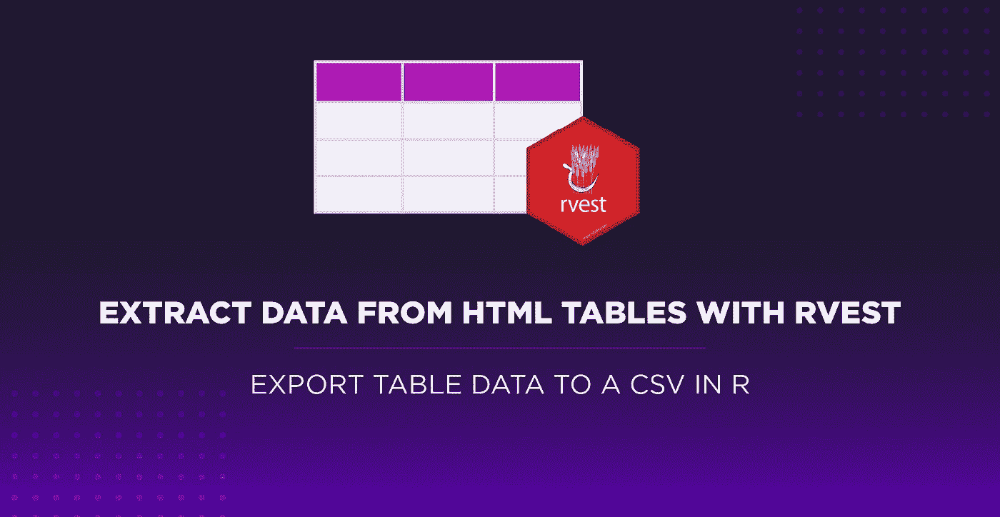

最初发布于:

Scraper API - [用 Rvest 从 HTML 表格中提取数据【导出表格数据到 R 中的 CSV】](https://www.scraperapi.com/blog/scrape-html-table-rvest/)

抓取表格数据这是数据科学家在大规模收集相关信息时所拥有的最强大的技能之一。

如今，互联网上显示的几乎每一组数据都使用 HTML 表格，以更容易理解的格式组织和显示复杂的数据集。

在今天的文章中，我们将使用 Rvest 包从 HTML 表中提取数据，并将其发送到 dataframe 进行进一步分析，然后将其导入 CSV 文件。

**注意:**如果这是你第一次使用 R，按照我们的[网页抓取在 R 初学者教程](https://www.scraperapi.com/blog/web-scraping-with-r/)中的安装和设置说明。您还将学习如何使用我们将在本教程中使用的 Rvest 包进行基本的抓取。

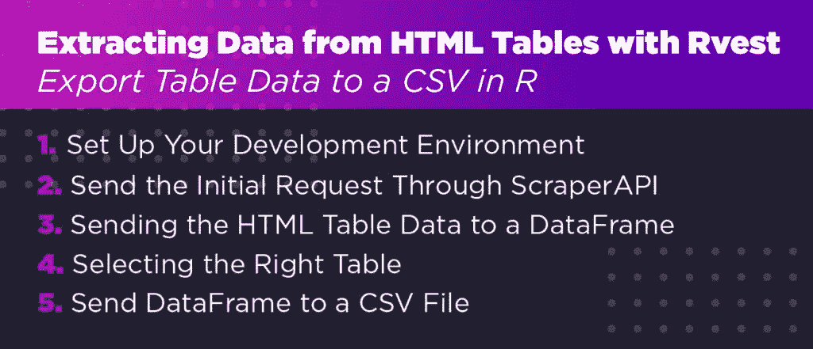

# 1.设置您的开发环境

我们需要做的第一件事是为我们的项目创建一个新目录。打开 Rstudio，点击“创建项目”。

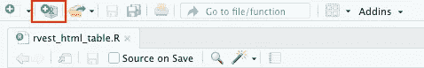

在新文件夹中，点击“新建文件”并创建一个新的 R 脚本。我们称之为 rvest_html_table(它会自动保存为. R 文件)。

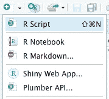

在我们的新文件中，我们将使用以下命令安装 Rvest 和 Dplyr 包:

安装可能需要几分钟的时间，但是在最后一步，我们已经准备好创建我们的刮刀了。

首先，让我们看看我们的目标站点:

# 2.通过 ScraperAPI 发送初始请求

对于本教程，我们将抓取[https://datatables . net/examples/basic _ init/multiple _ tables . html](https://datatables.net/examples/basic_init/multiple_tables.html)。这是一个伟大的网站来测试你的刮知识，并了解一切表格。

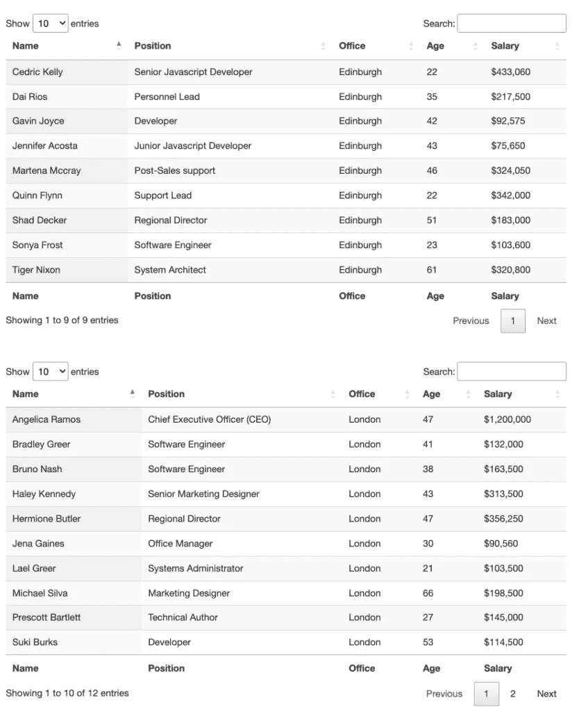

正如我们所看到的，这一页上有两个表格。如果我们想的话，我们可以把它们都刮下来，但是为了这个指南，让我们试着只选择第一个。

开始时，我们需要做的就是向服务器发送一个 HTTP 请求并下载 HTML 文件，然而，随着数据变得越来越有价值，很多网站都在收紧他们的反抓取技术，这可能会使你的脚本无用。

为了让我们的 web 抓取器有足够的弹性来完成工作，我们需要确保在抓取表数据时尽可能地模仿人类的有机行为。

ScraperAPI 是一个强大的解决方案，它只需向我们的目标 URL 添加一个字符串，就可以自动处理这些复杂问题。它使用机器学习，多年的统计数据，第三方代理，和巨大的浏览器农场，以确保你永远不会被反刮技术阻止。

要使用 ScraperAPI，我们需要做的就是创建一个[新的 ScraperAPI 帐户](https://www.scraperapi.com/signup)来生成我们的 API 密钥并兑换 5000 个免费 API 调用。

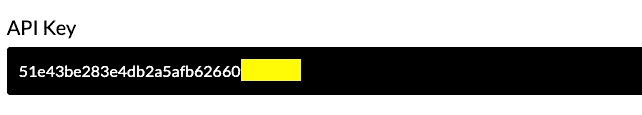

让我们回到 Rstudio:

1.  将 Rvest 和 Dplyr 导入到我们的项目中，在文件顶部添加`library("rvest")`和`library("dplyr")`(如果您愿意，现在可以删除之前的安装命令)
2.  接下来，我们将创建一个名为 response 的新变量，并使用`read_html()`方法下载 HTML 表格。

因为我们将使用 ScraperAPI 来发送请求，所以我们需要以以下格式构造我们的 URL:

将所有内容放在一起，我们的代码看起来是这样的:

**注意:**如果您遇到类似“read_html function not found”的错误，请使用以下两个命令安装并导入 XML2 包:install . packages(“XML 2”)和 library(“XML 2”)。

如果一切顺利，在控制台中键入 view(response ),它会向您显示从 URL 中检索到的数据。

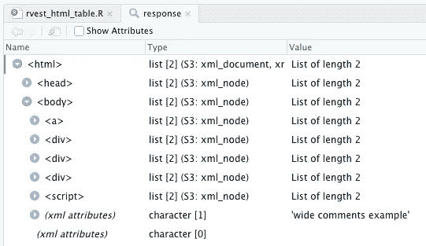

# 3.将 HTML 表格数据发送到数据帧

对于表格数据，Rvest 有一个优雅的函数，它接受 HTML 响应并检测文档中的 HTML 表格。要使用它，让我们创建一个名为 tables 的新变量，并使用管道操作符(%>%)对响应变量使用 html_table()函数:

这将使用表中的数据自动创建一个数据框架。

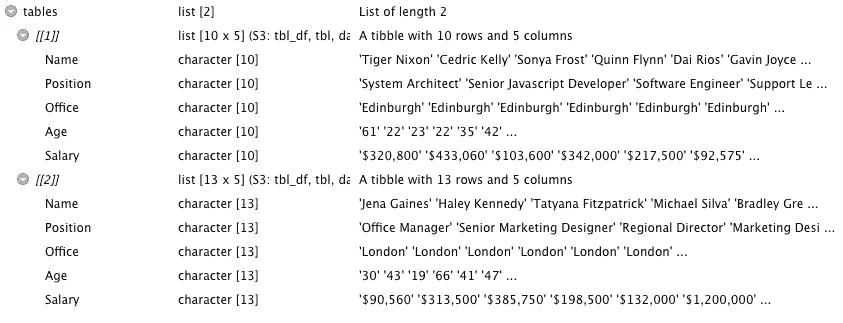

一些注意事项:

*   当表格缺少单元格中的数据时，您需要向`html_table()`函数添加一个`fill = TRUE`参数，但是现在已经没有必要了。
*   在这个表的例子中，标题的行是使用`<th>`标签构建的，所以不需要在`html_table()`函数中使用 headers 参数。

# 4.选择正确的表格

当应用于文档时，`html_table()`函数返回一个[tibles](https://www.educative.io/answers/what-is-tibble-versus-data-frame-in-r)的列表(“R 编程语言中的一个包，用于操作和打印数据帧”)。如果你仔细观察，数据帧中的每个表都有一个指定的数字，我们可以用它来选择我们需要的表。

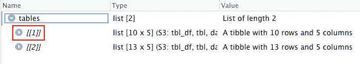

它将只返回第一个表数据，并将其放入 dataframe 中。在下图中，您可以看到只有 table_one 在右侧有 dataframe 图标。

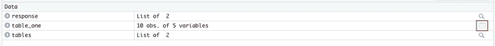

单击 table_one 或在控制台上键入`View(table_one)`打开它——请记住，View 命令区分大小写，因此请确保 V 是大写的。

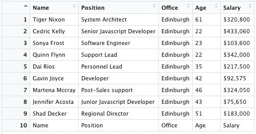

# 5.将数据帧发送到 CSV 文件

因为我们的数据框架已经创建好了，所以将这些数据导入 CSV 文件非常容易。首先，让我们[用`install.packages("writexl")`安装 Writexl 包](https://datatofish.com/export-dataframe-to-excel-in-r/)，然后将其导入到我们的项目`library("writexl")`中。

为了创建我们的文件，我们将使用`write_xlsx()`函数，并向它传递我们的数据帧(table_one)和引号之间的文件路径。

的。/告诉我们的脚本在当前目录下(从我们的项目中)创建文件，然后创建文件名。

**注意:**您可以为文件使用不同的扩展名，如. xlsx。

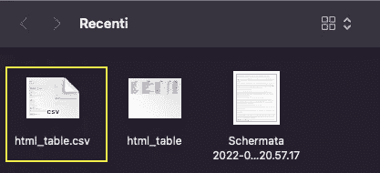

仅此而已。恭喜你，你只用了几行代码就完成了整个 HTML 表格。

我们的脚本是这样结束的:

多亏了 html_table()函数，用 Rvest 抓取 HTML 表格变得非常容易。如果你从一个网站上抓取了几个表格，将每个表格分配给它们的 our 变量，这样你就可以为每个表格创建一个数据框架，并根据你的喜好导出它们。

如果你想从分页的页面中抓取 HTML 表格，看看我们的[高级 Rvest web 抓取教程](https://www.scraperapi.com/blog/how-to-scrape-etsy/)，在那里我们将更详细地介绍抓取多个页面并将它们合并成一个数据帧。

下次见，刮刮快乐！