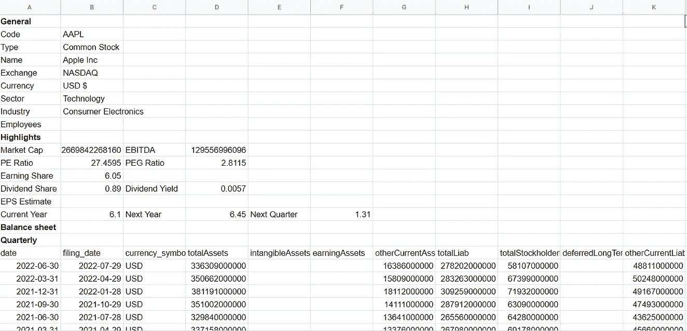

# 使用 Google Sheets 插件提取财务数据

> 原文：<https://medium.com/codex/extracting-financial-data-using-google-sheets-add-in-d664fda639ed?source=collection_archive---------10----------------------->

## 获得历史、当日、基本面和期权数据的无代码解决方案


马体·米罗什尼琴科拍摄的 Pexels 图片

# 介绍

在使用财务 API 时仍然存在的一个突出的困难是，对于那些刚刚开始尝试 API 的人来说，存在编程障碍。有经验的开发人员或程序员可以很容易地使自己习惯于财务 API 的变化环境，并有能力轻松使用 API，但对于初学者来说可能是不可能的。

然而，目前的情况有利于业余爱好者，因为金融 API 市场日益创新。没有一种代码解决方案能够以指数级的速度出现，来填补经验丰富的程序员和初学者之间的差距。

今天，我们将探索一个无代码特性，帮助新手获得他们想要的金融信息和在 Google Sheets 中完成的所有事情。事不宜迟，让我们进入文章吧！

# EODHD 的 Google Sheets 插件


EOD 历史数据 API([EODHD API](https://eodhistoricaldata.com/?utm_source=medium&utm_medium=post&utm_campaign=extracting_financial_data_using_google_sheets))是一家领先的金融数据提供商，提供大量各种用途的 API。他们最新的创新之一包括一个在 Google Sheets 内部获取市场数据的无代码解决方案。

有一些无代码平台允许他们的用户提取数据而无需编码，但每个人都使用 Google Sheets，能够在环境本身中获得任何类型的市场数据是一个巨大的安慰。

在本文中，我们将通过提取不同类型的数据，如历史数据、当天数据、基本面数据和期权数据，来看看这个特定的[插件](https://workspace.google.com/marketplace/app/google_sheets_financial_addin/258473626842)的工作情况。

> **注**:本文根据 [EOD 史料](https://eodhistoricaldata.com/?utm_source=medium&utm_medium=post&utm_campaign=extracting_financial_data_using_google_sheets)提供的服务精雕细琢而成。因此，为了顺利跟进即将到来的内容，请确保您拥有自己的帐户，因为它使您能够访问您的私有 API 密钥(这是本文的重要部分)。您可以使用 [**这里的**](https://eodhistoricaldata.com/register?utm_source=medium&utm_medium=post&utm_campaign=extracting_financial_data_using_google_sheets) 链接创建一个账户。此外，本文中提到的特性不是免费提供的，而是需要订阅的。点击 查看所有套餐的价格，并选择最适合您的套餐。

# 提取数据

本文的这一部分可以分为两个部分:安装插件和注册 API 键，并使用插件获取历史数据、当天数据、基本面数据、ETF 数据和大宗基本面数据。

## 安装和注册

从安装开始，有多种方法可以完成。我更倾向于从 Google Workspace Marketplace 安装插件。首先，进入 Google Workspace Marketplace 网站，搜索 EOD 金融插件并下载下图中突出显示的插件:


作者图片

你可以点击这个[链接](https://workspace.google.com/marketplace/app/google_sheets_financial_addin/258473626842)直接在 Google marketplace 上安装应用。现在我们已经成功地安装了插件，是时候注册 API 密匙来使用它了。首先，去 Google Sheets，创建一个新的工作表(你可以随意命名)。然后，单击页面右下方的 EODHD APIs 徽标，该徽标仅在安装外接程序时才会显示。


作者提供的图片

在上面的图像面板中，左边的是点击 EODHD APIs 图标后弹出的界面，右边的图像是注册 API 密钥后出现的实际插件界面。

要注册 API 密钥，请选择上面图像(左侧)中带有“在此插入您的 API 密钥”标签的文本输入框，然后输入创建 EODHD APIs 帐户后提供给您的 API 密钥。提及您的 API 密钥后，单击“获取数据”按钮继续。如果指定的 API 密钥无效，则会显示一条错误消息，提醒您注意该问题。

如果您没有帐户，您可以在输入框中键入“demo”来测试这些功能，但只能使用有限范围的报价器(可用报价器:AAPL。我们 TSLA。我们 VTI。美国，AMZN。美国、BTC 对美元、欧洲对美元)。因此，强烈建议创建一个免费帐户(每天限制 20 个 API 调用)或根据您的需要升级软件包，以获得插件的完整体验。

至此，安装和注册过程结束。现在我们都设置好了，是时候提取一些数据了！

## 使用加载项获取数据

使用该插件可以提取六种类型的数据:历史数据、当日数据、基本面数据、ETF 数据、大宗基本面数据和期权数据。所有类型的数据都可以轻松提取，并且每一种数据都需要遵循几乎相同的步骤。为了更好地理解插件的工作原理，让我们用它来提取苹果公司当天的历史数据。


右侧的图像显示了加载项的参数，左侧的图像是相应输入的结果输出。参数没有那么复杂，只包括从`Ticker`(股票的符号)`Period`(数据点之间的时间间隔)`From and To`(数据帧的起止日期)开始的基本参数。

最后，您可以选中“图表”复选框，用您的数据制作一个漂亮的蜡烛图。该功能适用于日终历史数据和日内历史数据功能。您可以预期该图表如下所示:


作者图片

填写完必要的信息后，点击“获取”按钮，所需的结果将在一个新的工作表中打开。

同样的程序也适用于所有其他类型的数据，但是参数的微小变化是可能的。例如，基本数据只有 Ticker 参数，而期权数据需要额外的信息，比如`Trade Date From`和`Trade Date To`参数。下面给出了日内、基本面、ETF 和大宗基本面数据的例子及输出:

**1。日内历史数据:**


作者提供的图片

**2。基础数据:**



作者提供的图片

**3。ETF 数据:**


作者提供的图片

**4。大宗基础数据:**


作者提供的图片

除了使用参数接口，还可以使用原生的 Google Sheets 函数`IMPORTDATA`从 EOD 历史数据 API 端点检索数据。例如，为了获得 MCD 的最后交易价格，您只需在任何一个电子表格单元格中键入以下命令:

```
=IMPORTDATA("https://eodhistoricaldata.com/api/eod/MCD.US?api_token={YOUR_API_KEY}&fmt=json&filter=last_close")
```

上面的命令将显示 MCD 的最后交易价格，但是要确保您已经用您的私有 EODHD API 密钥替换了`{YOUR_API_KEY}`。

# 结束语

除了本文中提到的特性，还有其他吸引人的特性。首先，EODHD APIs 与 Apipheny 的集成允许用户从 Google Sheets 内部的 API 端点自动提取数据。然后是与 Cryptosheets 的集成，crypto sheets 几乎提供与 Apipheny 相同的服务，但需要订阅。

总的来说，这个工具非常适合那些努力编写代码同时又想节省编程时间的初学者。金融应用编程接口曾经只为独家机构和对冲基金保留，现在变得对任何感兴趣的人都更加开放，这是非常了不起的，只有通过像这样的创新项目才有可能实现。

话虽如此，你已经到了文章的结尾。希望你学到了新的有用的东西。此外，如果您想查看原始文档以了解更多信息，请使用以下链接查看:[https://eodhistoricaldata . com/financial-APIs/Google-sheets-financial-add-in-for-EOD-fundamentals-data/](https://eodhistoricaldata.com/financial-apis/google-sheets-financial-add-in-for-eod-fundamentals-data?utm_source=medium&utm_medium=post&utm_campaign=extracting_financial_data_using_google_sheets)