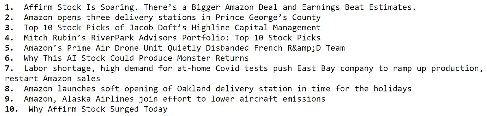
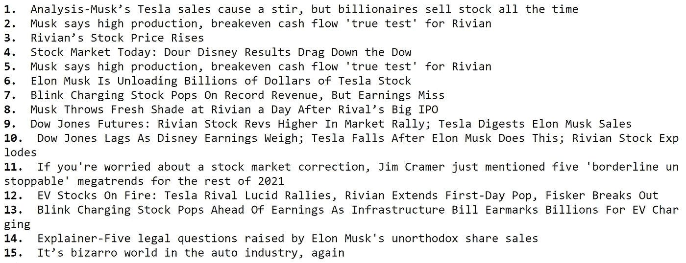

# 使用 Python 无缝提取金融新闻

> 原文：<https://medium.com/codex/extracting-financial-news-seamlessly-using-python-4dcc732d9ff1?source=collection_archive---------0----------------------->

## 关于使用 EOD 历史数据的 API 进行金融新闻的实践教程


罗马卡夫在 [Unsplash](https://unsplash.com?utm_source=medium&utm_medium=referral) 上拍摄的照片

```
**Table of Contents:
-** [Introduction](#0cfe)
**-** [Extracting Financial News with Python](#ab29)
    -- [Importing Packages](#c4f8)
    -- [Basic Program for Extracting Financial News](#2685)
    -- [Advanced Program for Extracting Financial News](#6be7)
**-** [Closing Notes](#3ebe)
```

对投资者来说，为了获得最大的利益，保持对市场的了解是很重要的。专门从事金融和投资的标准报纸是一个很好的来源，对于长期投资者或投资于市场的人来说绰绰有余。但是，在激烈的竞争环境下，日内交易者必须实时了解周围发生的事情。

尽管有很多实时新闻资源，但要么价格昂贵，要么缺乏定制。因此，在我看来，最好的方法是使用 API 用 Python 来自动化这个过程，但问题是，所有的 API 都不可靠。但是 EOD 历史数据公司用他们强大的金融新闻 API 来拯救我们，这些 API 是灵活的，更重要的是可靠的。在这篇文章中。我将向您展示使用 EOD 历史数据公司的 API 和 Python 提取金融新闻的整个过程。让我们开始吧！

> **注**:本文强烈基于 [EOD 史料](https://eodhistoricaldata.com/?utm_source=medium&utm_medium=post&utm_campaign=extracting_financial_news_seamlessly_using_python)提供的 API。因此，为了顺利地跟进即将到来的内容，请确保您拥有自己的帐户，因为它使您能够访问您的私有 API 密钥。您可以在 处使用 [**链接创建账户。此外，并非本文中提到的所有 API 都是免费提供的，但需要订阅。点击**](https://eodhistoricaldata.com/register?utm_source=medium&utm_medium=post&utm_campaign=extracting_financial_news_seamlessly_using_python) 查看所有套餐的价格，并选择最适合您的套餐。

# 用 Python 提取金融新闻

## 1.导入包

让我们首先将所需的包导入到我们的 python 环境中，因为这是任何编程项目中最重要的过程。本文中我们需要的唯一包是进行 API 调用的请求和用于字体或文本定制的 Termcolor。如果您尚未安装这两个软件包，请在命令行中输入以下代码行:

```
pip install requests
pip install termcolor
```

安装完包后，我们现在可以使用下面的代码将它们导入到我们的 python 环境中:

```
import requests
from termcolor import colored as clapi_key = 'YOUR API KEY'
```

现在，我们已经成功地将基本包导入到我们的环境中，并将 API 键存储到`api_key`变量中。

## 2.提取金融新闻的基本程序

在本节中，我们将构建一个非常简单的 Python 程序来提取金融新闻，本节的目标不是构建完美的程序，而是了解 EOD 历史数据提供的金融新闻 API。以下代码片段是一个基本程序，它将根据给定的输入提取新闻:

```
def get_stock_news(stock, api_key):
    url = f'https://eodhistoricaldata.com/api/news?api_token={api_key}&s={stock}'
    news_json = requests.get(url).json()

    news = []

    for i in range(10):
        title = news_json[-i]['title']
        news.append(title)
        print(cl('{}. '.format(i+1), attrs = ['bold']), '{}'.format(title))

    return news

amzn_news = get_stock_news('AMZN', api_key)
```

在上面的代码中，我们首先定义了一个名为`get_stock_news`的函数，该函数将我们想要获取新闻的股票的符号(`symbol`)和 API 键(`api_key`)作为参数。在函数内部，我们基于给定的输入(股票的符号和 API 键)创建 API URL，并将其存储到`url`变量中。现在让我们花一些时间来分解 API URL 的结构。以下是网址:

```
https://eodhistoricaldata.com/api/news?api_token={api_key}&s={stock}
```

上述 URL 的第一个参数是`api_token`参数，我们在这里指定 API 键，下一个参数是`s`，它将股票的符号作为输入。这两个参数是主要的或强制的参数，但是仍然有许多辅助参数可用于调优和定制。

接下来是代码，在存储了 API URL 之后，我们使用 Requests 包提供的`get`函数来调用 API，最后将 API 响应以 JSON 格式存储到`news_json`变量中。接下来的几行代码主要是以一种有意义的方式表示提取的数据，这是可选的，但是非常有用。

因此，在提取了金融新闻之后，我们创建了一个 for 循环，其基本思想是打印出最近十条关于股票的新闻的标题，并将标题附加到`news`列表中。最后，我们返回`news`并调用创建的函数来提取关于亚马逊的十条最新新闻，输出如下:



作者图片

## 3.提取金融新闻的高级程序

在上一节中，我们的目标只是创建一个基本程序，但现在让我们向前迈出这一步，构建一个高级程序来定制 API 以满足我们的需求。与前一节相比，除了 API URL 的变化之外，代码不会有太大的不同。也就是说，代码应该是这样的:

```
def get_customized_news(stock, start_date, end_date, n_news, api_key, offset = 0):
    url = f'https://eodhistoricaldata.com/api/news?api_token={api_key}&s={stock}&limit={n_news}&offset={offset}&from={start_date}&to={end_date}'
    news_json = requests.get(url).json()

    news = []

    for i in range(len(news_json)):
        title = news_json[-i]['title']
        news.append(title)
        print(cl('{}. '.format(i+1), attrs = ['bold']), '{}'.format(title))

    return news

tsla_news = get_customized_news('TSLA', '2021-11-09', '2021-11-11', 15, api_key, 0)
```

就像我之前说的，代码的结构或多或少类似于上一节，但是这里我们在玩 API 的其他参数。在上面的代码中，我们定义的函数有五个主要参数，分别是股票的符号(`symbol`)、新闻提要的开始日期(`start_date`)、新闻提要的结束日期(`end_date`)、我们希望输出的新闻数量(`n_news`)、API 键(`api_key`)和一个可选参数(`offset`)。

就像我们在上一节中如何检查 API URL 一样，让我们在这一节中也做同样的事情，因为我们已经做了一些修改。以下是网址:

```
https://eodhistoricaldata.com/api/news?api_token={api_key}&s={stock}&limit={n_news}&offset={offset}&from={start_date}&to={end_date}
```

URL 的前两个参数与我们之前看到的相同，分别是`api_token`和`s`参数。然后我们有了`limit`参数，这里我们必须提到输出的长度(最小值为 1，最大值为 1000)。接下来是`from`和`to`参数，它们的名称不言自明。在这两者之间是`offset`参数，其默认值为 0，但如果需要可以更改。

回到代码中，我们使用 for-loop 来表示提取的数据，我们正在做与之前相同的事情，最后，我们将返回值并调用创建的函数来获得 Tesla 的定制新闻提要。代码的输出是如下所示的列表:



作者图片

**注意:**财经新闻 API 的输出可能会有一些延迟。

# 结束语

在本文中，我们已经了解了 EOD 历史数据公司的金融新闻 API，以及如何使用它来创建基本程序和定制的高级程序，以便根据我们的需求在 Python 中提取新闻。

现在我们来谈谈需要改进的地方。这篇文章只能被认为是 EOD 历史数据的金融新闻 API 的应用的一瞥，可以通过几种不同的方式进入下一个层次。一种有趣的方法是构建一个情感分析应用程序，该应用程序将分析使用 API 提取的新闻提要，并揭示其状态是好、坏还是中性。人们可以使用这个应用程序来记录股票的当前趋势，并据此做出投资决策。

总之，新闻是市场最大的影响者之一，拥有强大优势的人只能在其他人中取得成功。令人欣慰的是，过去人们不可能获得大量股票的实时新闻，但由于 EOD 历史数据公司提供的金融新闻 API 等资源，现在任何地方的任何人都能够做到这一点。也就是说，你已经阅读完了这篇文章，希望你能从中学到一些新的有用的东西。

> 完整文档:[https://eodhistoricaldata . com/financial-APIs/financial-news-API/](https://eodhistoricaldata.com/financial-apis/financial-news-api?utm_source=medium&utm_medium=post&utm_campaign=extracting_financial_news_seamlessly_using_python)