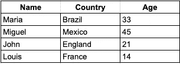

# 从非结构化数据中提取价值

> 原文：<https://medium.com/codex/extracting-value-from-non-structured-data-2293c74111b3?source=collection_archive---------11----------------------->

## 数据概念指南，了解从非结构化数据中提取价值的一些可能方法

[斯科特·格雷厄姆](https://unsplash.com/@homajob)在 [Unsplash](https://unsplash.com/photos/5fNmWej4tAA) 上拍照

目前，**的非结构化数据代表了现有数据****的 80%。要开始一篇谈论为什么你应该更加关注你的数据的文章，我相信用有影响力的数据来说服潜在客户的最好方法。**

**在本文中，我们的目标是解释什么是非结构化数据，处理这种类型数据的优势，假设为什么它还不是一个探索的领域，并给出如何处理这种类型数据的示例(通过真实项目的示例)。**

**非结构化数据是指不包含表的数据(即结构化数据，如数据库表)，也不是半结构化数据(如 JSON、XML)。因此， **pdf 报告、电子邮件、HTML 网页、音频和照片都是非结构化数据的例子**。**

**我认为现在很明显为什么这些类型的数据比结构化数据多——因为它们比 CSV 表占据了我们日常生活的更大部分。然而，目前许多数据计划主要由基于已经结构化的数据或者由一些数据仓库提供的商业智能产品(仪表板、分析报告、摘要、图形面板)组成。**

**与结构化数据不同，非结构化数据可以存储在称为数据湖的结构中。这些结构可以支持结构化和非结构化数据。尽管这种结构存在，而且数据是一种宝贵的信息来源，但由于下面将要探讨的原因，它们经常被忽略。**

## **为什么非结构化数据的优先级降低了？**

**首先，理解表格(甚至半结构化)数据比非结构化数据简单得多，因此产生价值所需的时间更少。为了使这一点更清楚，请看下面的三个(虚构的)例子，试着在每个例子中找出四个地名。**

****

**结构化数据(作者截图)**

**半结构化数据**

****

**非结构化数据(作者截图)**

## **理解概念**

**第一种是结构化数据(表)，第二种是半结构化数据(JSON)，第三种是非结构化数据(email)。我相信，越来越清楚的是，在存在大数据的情况下，理解多种类型的非结构化数据的困难是一个较慢的过程，因此成本也更高。**

**使这种分析/数据提取更加困难的另一点是缺乏专业人员。这是因为目前已经非常缺乏结构化数据分析领域的人才。在非结构化数据分析的情况下，该人员必须具备知道如何应用文本分析(自然语言处理— NLP，情感分析)、图像分析和音频分析的技能。**

**这样，我们就进入了一个场景，在不同的上下文中有很多有价值的信息。然而，在一个要求快速传递价值的世界里，这是知道投资回报的唯一方法。此外，需要很多技能，而这些技能需要一个人花费很长时间才能有效地为客户带来价值。非结构化数据的优势**

## **非结构化数据的优势**

**示例将更清楚地展示处理非结构化数据的优势。第一个是关于文本分析，例如，电子邮件正文。利用机器学习和自然语言处理算法，可以验证例如文本中引用的位置，以及命名和验证语言。此外，还可以进行情感分析，可以看出说话者在传递信息时声音中有一种紧迫感和压力。尽管这对我们人类来说是显而易见的，但算法却很难检测到。**

**第二个例子是关于一些音频，例如，消息的相同上下文，但是是口头的。音频算法的主要焦点是将音频(即波)分解到单个音素的级别，因此，将这些音素的书面形式与单词组合，转录音频。在这种情况下，可以从转录的文本中提取一些特征。**

****

**在 [Unsplash](https://unsplash.com/photos/o-bc8wuY29c) 上由[Kelly reprza](https://unsplash.com/@kellyrepreza)拍摄的照片**

**至于图像，可以提取像素集合的许多特征(算法检查图像的每个像素以整体理解其内容)。例如，该算法可以为图像分配一个位置，上面是里约热内卢市。另一个例子是人的面部识别或面部表情的识别，以及这些人在所讨论的照片中表现出的感受。**

**这些示例只是其中每种数据都可以分析的几个场景，还有更多类型的非结构化数据。非结构化数据是可以以多种方式用于增加价值、更好地理解上下文，甚至个性化体验的来源。**

## **如何处理这些非结构化数据**

**如前所述，每个专家(可能是一个团队)都需要花费数年时间来培养技能，以便能够应用复杂的算法来高质量地分析这些数据。**

**然而，如今有了专门处理非结构化数据的**云服务。例如，通过微软、谷歌和 AWS 提供的 API，文本分析(如搜索、情感分析、音频、视频和图像)已经变得更加有形。****

**一个真实的案例应用在我参与的一个项目中，该项目需要一个在文档(PDF 文件)中更精确的搜索系统，提取每个文档中出现的政治名称。我们创建了一个解决方案，在这个解决方案中，这些数据被自动地从源中提取、转换，并且通过 Azure 认知搜索 API，应用基于相关性的搜索，并提取文档的个人姓名。**

**这样，不仅实现了搜索系统，而且提取了每个文件的名称，使阅读标题的人更容易通过政治名称链接信息。**

**在本文中，我介绍了结构化、半结构化和非结构化数据的基本概念，并举例说明了每种类型的复杂性。此外，还探讨了一些如何处理非结构化数据以提取其价值的示例。**

***我是 Aline，这篇文章的作者。找到我* [*这里*](/@alinerguio) *和* [*这里*](https://www.linkedin.com/in/alinerguio/) *！***