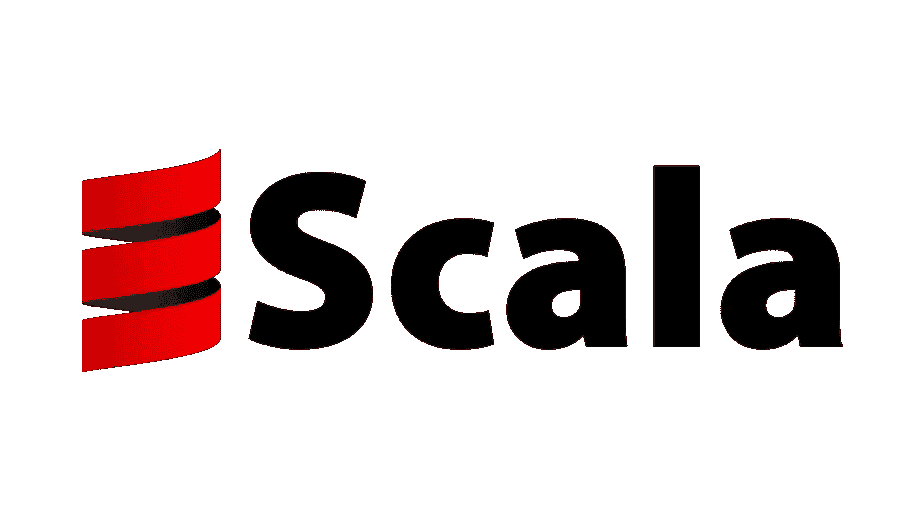

# Scala 中的提取器

> 原文：<https://medium.com/codex/extractors-in-scala-fb0b7949562b?source=collection_archive---------10----------------------->



如果你是一个 scala 开发者，你可能习惯于在模式匹配中使用 **case 类**。例如，Some(x)是一个有效的模式，因为 Some(x)是一个 case 类，让我们看一个提取电子邮件地址的 case 类的例子。

```
case class Email(User: String, domain: String)
```

包含用户和域的案例类**电子邮件**。如果字符串包含嵌入的 *'@'* 符号，则模式匹配。

```
def pattern(email: Email) = {
    email match {
      case *Email*(user, domain) => *println*(user, domain)
      case _ => *println*("Not a valid email")
    }

  }

}
```

提取器提供了一种创建模式的方法，而不需要提供 case 类。

**提取器**

Scala 中的 Extractor 是一个对象，它有一个 **unapply** 方法与之相关联，这个 unapply 方法的目的是匹配一个值并将其分离。

使用提取器提取电子邮件地址。

```
object EMail {
  // The injection method (optional)
  def apply(user: String, domain: String) = user + "@" + domain
  // The extraction method (mandatory)
  def unapply(str: String): Option[(String, String)] = {
    val parts = str split "@"
    if (parts.length == 2) *Some*(parts(0), parts(1)) else None
  }
}
```

对象 email 有两个关联的方法 apply 方法和 unapply 方法。

*   apply 方法接受两个字符串并将其转换成电子邮件。
*   unapply 方法与 apply 方法正好相反，它接受一个字符串并分成两部分，但与 apply 方法不同，unapply 必须处理字符串不是电子邮件的情况，这就是 unapply 返回一个**选项**而不是一对字符串的原因。

```
*println*(EMail.*unapply*("someone@example.com"))
*println*(EMail.*unapply*("someone"))Some((someone,example.com))
None
```

**具有零个或多个变量的模式**

提取器模式也可能不绑定任何变量，在这种情况下，unapply 方法返回 true 或 false。

```
object UpperCase {
  def unapply(s: String): Boolean = s.toUpperCase == s
}
```

如果字符串是大写的，上面的函数将返回 true，否则返回 false。

**可变参数提取器**

在前面的示例中，电子邮件地址都返回固定数量的值。有时这不够灵活。例如

*tom@java.org*

对于上述电子邮件地址，您可能希望域名是一个字符串序列。

```
object ExpandedEMail {
  def unapplySeq(email: String)
  : Option[(String, Seq[String])] = {
    val parts = email split "@"
    if (parts.length == 2)
      *Some*(parts(0), parts(1).split("\\.").reverse)
    else
      None
  }
```

上述方法将返回字符串形式的用户和字符串序列形式的域。

```
val *email1*="tom@java.example.org"
*println*(ExpandedEMail.*unapplySeq*(*email1*))Some((tom,WrappedArray(org, example, java)))
```

**提取者对案件类别**

尽管它们非常有用，但是它们有一个缺点，就是暴露了数据的具体表示。提取器打破了数据表示和模式之间的联系，模式与所选对象的数据类型无关。这种特性被称为表述独立性。