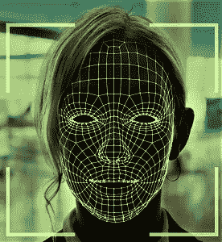

# 人脸识别简介

> 原文：<https://medium.com/codex/face-recognition-25f7421a2268?source=collection_archive---------2----------------------->

人脸识别是人工智能研究带给世界的众多奇迹之一。这是许多技术人员好奇的话题——他们希望对事物如何工作有一个基本的了解。让我们深入探讨一下这个问题，看看事情是如何运作的。

# 直觉

为了理解机器如何识别人脸，我们可以从问自己开始——我们是如何…