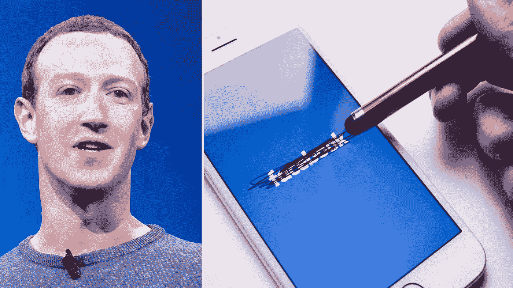

# 脸书和 Instagram 从欧洲撤出？谢天谢地。

> 原文：<https://medium.com/codex/facebook-and-instagram-pulled-from-europe-good-riddance-719e4c68cea6?source=collection_archive---------0----------------------->

## 扎克伯格不可能相信有人会相信他的谎言。

马克·扎克伯格来自 F8 的照片 2019 年主题演讲由[安东尼·金塔诺](https://www.flickr.com/people/22882274@N04)和 iPhone 的照片由[思想目录](https://www.pexels.com/@thought-catalog-317580?utm_content=attributionCopyText&utm_medium=referral&utm_source=pexels)来自 [Pexels](https://www.pexels.com/photo/silver-iphone-2228555/?utm_content=attributionCopyText&utm_medium=referral&utm_source=pexels) 。

因此，Meta Platforms Inc .年度收益报告的这一具体细节被一个事实所掩盖，即[2300 亿美元的市值](https://www.theverge.com/2022/2/3/22916007/facebook-meta-stock-drop-history-invest)在上周四被完全抹去——股票在开始时下跌超过 25%……