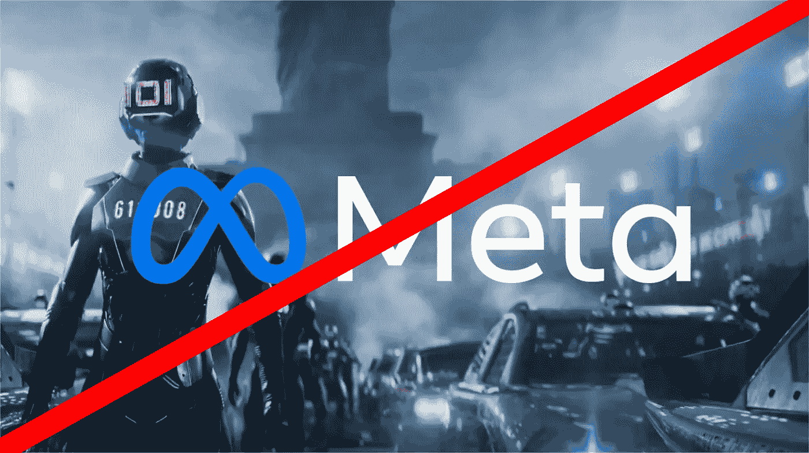

# 脸书的元宇宙不是未来

> 原文：<https://medium.com/codex/facebooks-metaverse-is-not-the-future-16dd36c09eeb?source=collection_archive---------14----------------------->

自从 Meta(脸书)宣布决定转向新的方向，集中资源打造元宇宙以来，已经过去了好几个月。这个决定现在慢慢被证明是一个错误的决定。

元宇宙的概念已经存在很长时间了，它有各种各样的定义。一些人将其定义为人们可以闲逛的数字场所，这意味着元诗句已经存在很长时间了。其他人把它定义为一个你可以工作、社交和娱乐的数字世界。

虽然第二个定义听起来很新鲜，但事实并非如此。像 Roblox 这样拥有完整角色扮演社区的游戏也已经存在了很长时间，Meta 只是第一个称之为元宇宙的游戏。

最初，当脸书宣布元宇宙的愿景时，许多人都很兴奋，希望看到像电影《一号玩家》中那样的元宇宙。但是，当脸书推出虚拟现实版的 Horizon Worlds 机器人克隆版时，他们除了失望之外什么也没做，因为你必须有一个 Oculus 虚拟现实耳机才能玩。

我们不能复制 Ready Player One 的原因是，我们不能给每个人免费的虚拟现实耳机，我们也不能让成千上万的人一起与数字世界互动。这就是为什么地平线世界最终只是一个没人玩的无聊 VR 游戏。

要让元宇宙成为可能，你必须让它对等化和去中心化。它必须能够在大多数设备上运行，最重要的是，它必须由我们所有人所有，而不是一家中央公司。

总之，我认为脸书的元宇宙不是未来，甚至可能导致脸书作为主要科技巨头的终结。

我希望你喜欢这篇文章，如果你想支持我，留下一个赞，关注我，或者给我买杯咖啡([https://www.buymeacoffee.com/ccm7676](https://www.buymeacoffee.com/ccm7676))。如果你不喜欢这篇文章，不同意，或者有一些反馈，请在评论中告诉我。