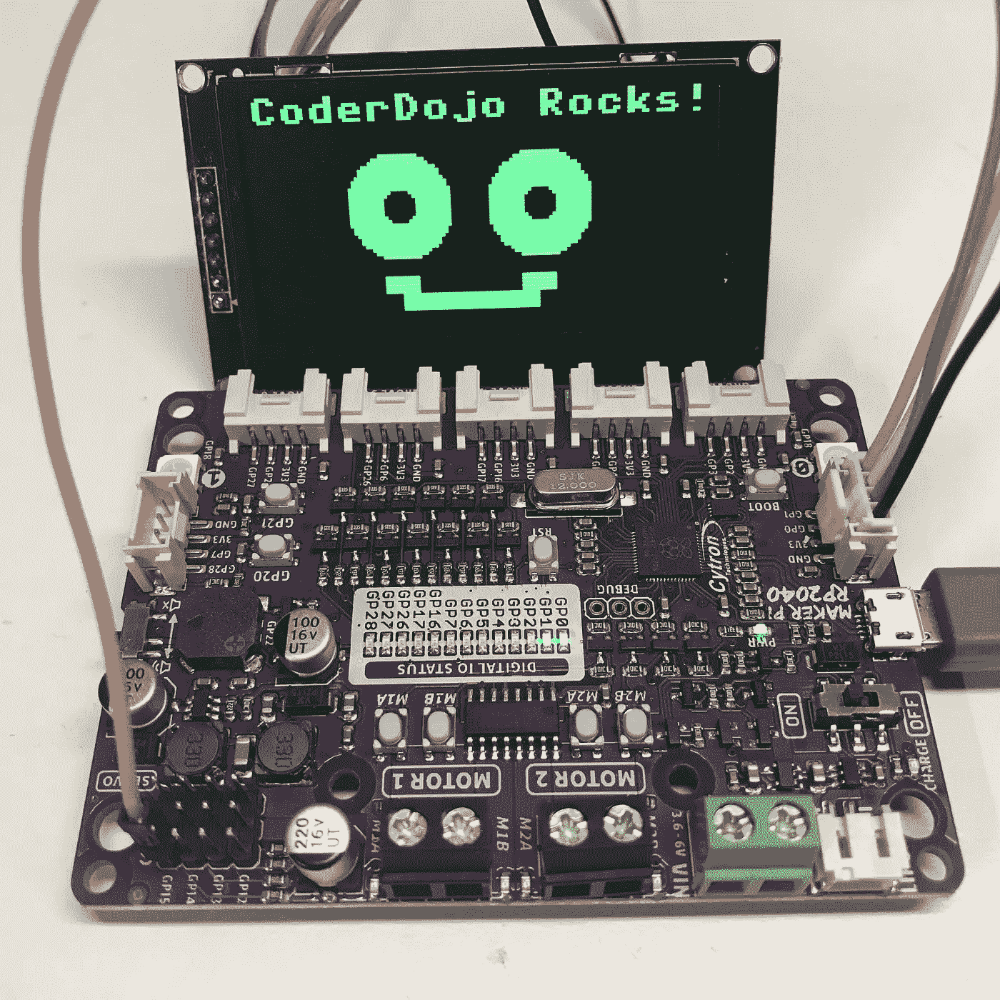
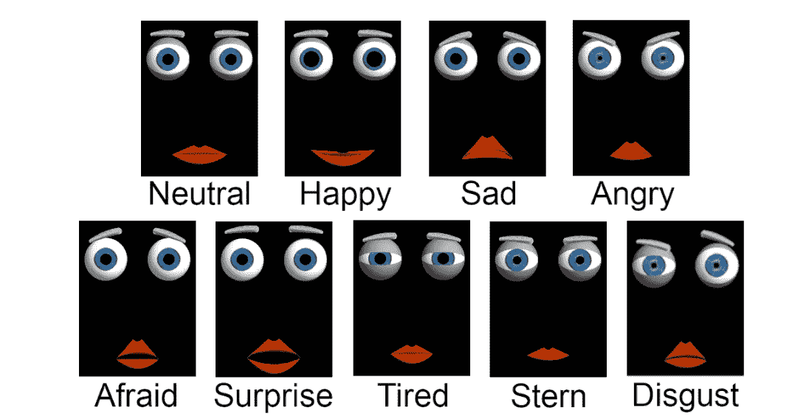
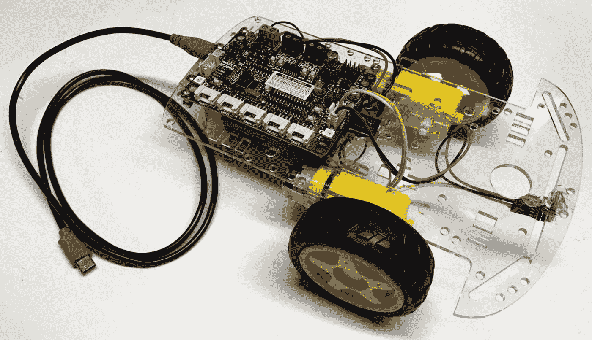
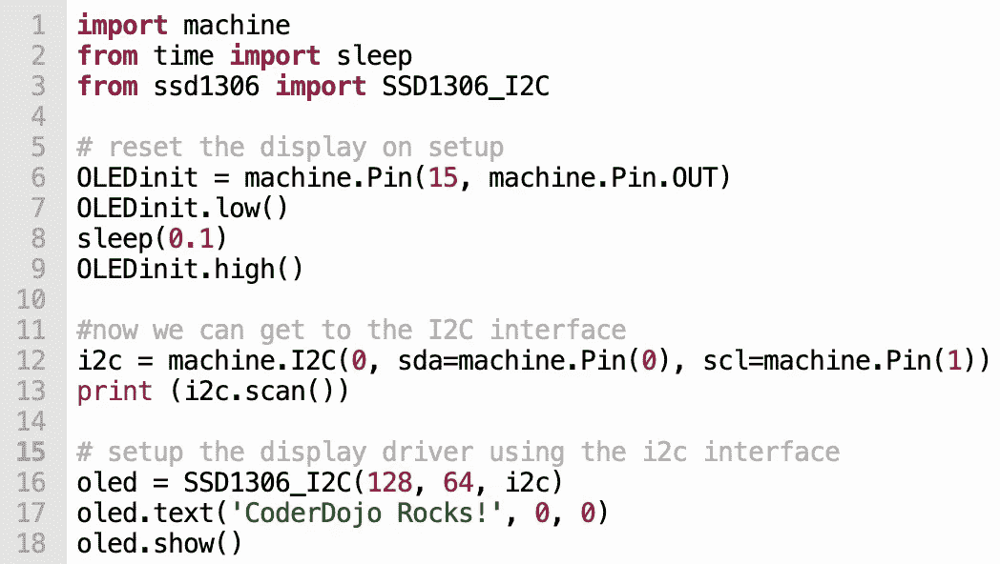
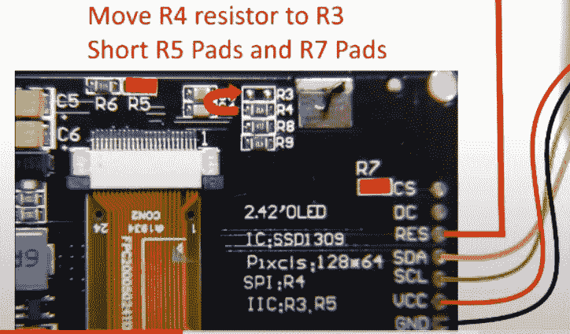

# FaceBot 2.0 —在 I2C 上使用 2.42 英寸 OLEDs 和 MicroPython

> 原文：<https://medium.com/codex/facebot-2-0-using-2-42-oleds-over-i2c-with-micropython-923230fc2472?source=collection_archive---------8----------------------->

## 我们的新一代 STEM 教学机器人配有大显示屏，更容易连接，功能更强大。

2.42 英寸有机发光二极管显示器由一个 4 线 I2C 接口驱动，带有一根额外的复位线。作者照片。

在 2019 年 1 月的[日，我们当地的 CoderDojo 俱乐部发布了我们的第一款低成本(40 美元)机器人，它可以在明亮的有机发光二极管显示器上绘制人脸。然而，这些机器人很难安装和编程。这篇博客将向您展示我们的下一代 Python 驱动的 FaceBot 如何使用一个 Grove 连接器和一根额外的复位线来工作。](https://www.instructables.com/FaceBot/)

## FaceBot 1.0 的背景

我们的学生喜欢机器人！他们非常擅长让学生在无意中学习计算思维的同时获得乐趣。尽管市场上有数百种机器人，但很少有足够强大和足够低成本的机器人来驱动一个完整的 128X64 有机发光二极管显示器。他们较旧的 Arduino 处理器受到 2K 内存的限制，无法满足图形编程的需求。

虽然我们确实让 FaceBot 1.0 工作了，但它有几个挑战:

1.  **有限的内存**—Arduino Nano 只有微不足道的 2K 内存，这意味着图形帧缓冲区占用了大部分内存。
2.  **有限的 CPU 能力**——我们旧的 Arduinos 只有一个单核 CPU，运行速度缓慢，为 16 Mhz。
3.  **古老的 C 编程—** 学生被要求学习历史上重要但现在不受欢迎的 C 语言。
4.  **缓慢的编译/链接/测试周期** —每次学生想要测试他们的代码时，都必须编译和下载 C 程序。这对小程序来说没问题，但是随着我们的程序越来越大，开发周期会变慢。
5.  **小型 OLED 太难阅读** —小型 0.96 英寸低成本(4 美元)OLED 太小，无法近距离阅读。当你的机器人在地板上，而你是站着的时候，显示可读性是一个问题。
6.  **更大的 OLED 太难连接**——可爱的 [2.42 英寸 OLED](https://www.ebay.com/sch/i.html?_from=R40&_trksid=p2334524.m570.l1313&_nkw=2.42%22+oled+128*64+ssd1309+display+SPI+I2C&_sacat=0&LH_TitleDesc=0&_odkw=2.42%22+oled+128*64+ssd1309+display&_osacat=0)价格约为 18 美元，需要七根电线使用 [SPI](https://en.wikipedia.org/wiki/Serial_Peripheral_Interface) 连接。这些占用了我们微控制器上的大量 I/O 引脚。

我们了解到我们的学生喜欢这些机器人，喜欢在机器人上画脸，尽管有这些缺点。我们经常故意给他们非常沉闷的脸，并挑战他们用新的创造性的方式来画这些脸。

这里有一个简单的机器人面部图像样本，来自 2021 年的一篇研究论文:

九种情绪的面部结构样本。这张图片取自《对混合面孔机器人的情感反应》一文，并翻译成《消费者社交机器人》。我们的“快乐”机器人倾向于在没有碰撞的情况下向前行驶。即将与墙壁相撞的机器人可能会表现出“惊讶”的表情。

## FaceBot 2.0 的目标

考虑到这些限制，我们希望设计我们的下一代儿童友好型低成本 FaceBot，使其具有以下特征:

1.  它必须 100%用 Python(微控制器的技术 MicroPython)编程。这是我们的孩子喜欢的流行编程语言。
2.  它应该限制焊接和连接的数量。
3.  它应该有足够的内存来支持 128X64 单色显示器的帧缓冲区。
4.  它应该支持可爱的有机发光二极管显示器，并尽量减少电线的数量。

## Raspberry Pi Pico 和 Cytron Maker Pi RP2040

这张照片是 Cytron 制造商 Pi RP2040，带有七个 Grove 连接器，没有显示屏。这个机器人是我们面部机器人的基础。我们面临的挑战是连接 SPI 显示器占用了三个完整的连接器，并导致未使用的连接。

2021 年 1 月，我们惊讶地发现 Raspberry Pi 基金会发布了他们的 RP2040 处理器和 Pico 板。它不仅有足够的内存(264K)，而且可以直接用 Python 编程。这些处理器也快得多(比旧的 16 MHz Arduino Nano 快 133 MHz)，使它们有足够的能力在脸上绘制复杂的图形。双核还提供了专用整个内核的可能性，以便在不中断传感器读数的情况下保持显示最新。它非常适合我们的 FaceBot 2.0。

几个月后，Cytron 推出了一款基于 RP2040 的机器人控制器板，将电机驱动器和电源管理直接集成在一块板上，成本仅为 9.99 美元。我回顾了 2021 年 8 月在[的这块板。看到价格不到 10 美元、完全集成、功能丰富的主板真是太棒了。任何在机器人控制器上花费超过 10 美元的人都需要看看这个板！](https://dmccreary.medium.com/the-cytron-maker-pi-rp2040-robotics-board-b1dc7f0eab34)

## 将 SPI 连接到 Cytron 板 Grove 连接器

我们确实将 OLEDs 连接到了这个主板上，但是有一个大问题——DIY more 提供的主板的默认连接器。CC 所需**七根**电线！一根用于 GND，一根用于 VCC，五根数据线。这导致我们用光了三个 Grove 连接器。这是低效的，并且限制了我们留在机器人上的自由连接器的数量。我们很沮丧！如此接近，但还远远没有实现我们的 FaceBot 2.0 的愿景！

## 失败的企业向 I2C 转化

有机发光二极管显示器的背面有将板从默认 SPI 转换为使用更简单的 4 线 I2C 接口的说明。但是，尽管我努力了几个小时，我还是无法让 SPI 接口与我们的 Raspberry Pi Pico 或 Cytron Maker Pi RP2040 板配合工作。我会严格按照说明进行操作，但每次我这样做时，基本的 i2c 扫描仪都会空空如也。我尝试将 CS、DC 和 RES 信号连接到不同的位置，但没有成功。我不知道是我的硬件坏了，还是我的电线没有正确连接，或者是 I2C 的 Python 驱动程序与主板不兼容。当我将逻辑分析仪连接到线路上时，我可以看到数据和时钟信号都进入显示器，但我无法显示任何内容。

## 一个朋友的小小帮助

然后在三月初，我向一个我称之为 WP 的朋友表达了我的沮丧。WP 也有一个兄弟有一些不错的调试能力。他们订购了类似的零件，有一天我收到一封电子邮件，告诉我他们终于让它工作了！虽然他们不能像我们其他较小的有机发光二极管显示器一样使用标准的 4 线 Grove 连接器，但他们可以通过向显示器添加一条额外的复位线来让它工作。

## 解决方案:I2C + 1

我们使用该设备的问题是，当显示器通电时，我们没有重置显示器驱动程序。这是因为大多数其他 I2C 设备只需要四根线:GND、VCC、数据和时钟。当设备通电时，它们是“智能”的，因为它们在通电后仅几毫秒就将自己复位到已知的开始。DIYMORE 有机发光二极管设备要求我们总是在上电后和显示器使用前拉高复位引脚。完成这项工作的 MicroPython 代码如下所示。

启动有机发光二极管显示的示例 MicroPython 代码。第 6–9 行用于在显示器醒来接收 I2C 数据流之前复位显示器。图片由作者提供。

虽然我们可以使用另一个 Grove 连接器来完成这一重置，但我们还有另一个选择。也就是说，只需将 RESET 引脚连接到 Maker Pi RP2040 板角落的伺服跳线。我们只需要一件简单的女性套衫！只要你的机器人没有使用所有四个伺服电机，我们就可以了！

## 关于如何移动电路板背面电阻的详细信息

这个项目的一个挑战是移动 DIYMORE 板后面的跳线需要烙铁、精细的运动技能和稳定的手。以下是我们需要做出的更改的摘要:

我们对 DIYMORE 有机发光二极管显示器进行了三项更改，将其从 SPI 转换为 I2C。这张图片取自 YouTube 上 [retrofriends](https://www.youtube.com/channel/UCjVos-XiTG6qZL4bPPRLEsA) 提供的视频。

YouTube 上的用户 retrofriends 提供了一段视频，展示了这些步骤:

视频显示了如何更改跳线设置，将有机发光二极管从 SPI 出厂设置转换为使用 I2C 接口。感谢 YouTube 频道 retrofriends 提供指导。

我们现在终于实现了我们对 FaceBot 2.0 的低成本和易于连接的界面的愿景。

## 以对朋友的感激结束

回顾这个项目，我意识到，如果我更有耐心，花时间阅读 SSD1309 芯片的数据手册，我可能已经从理论上解决了这个问题。但是，也许我永远也想不出来！这件事教会我的是，在你的人际网络中拥有一群拥有正确技能和经验的好朋友来补充你自己的技能，会比试图自己做所有事情让你在实现目标的道路上走得更远。

我只想对 WP 和他的兄弟表示衷心的感谢和感激，感谢他们帮助了我们的小 CoderDojo 俱乐部。我希望其他教孩子如何编码的人能从这项工作中受益。

## 更多探索

你可以在 CoderDojoTC 微型网站上找到更多关于我们的[初级 Python](https://www.coderdojotc.org/python/trinket/00-introduction/) 、 [MicroPython](https://www.coderdojotc.org/micropython/) 和我们新一代低成本[机器人](https://www.coderdojotc.org/micropython/robots/01-intro/)的信息。请在 LinkedIn 或我的博客上关注我，关注我们未来的 FaceBot 2.0 课程。