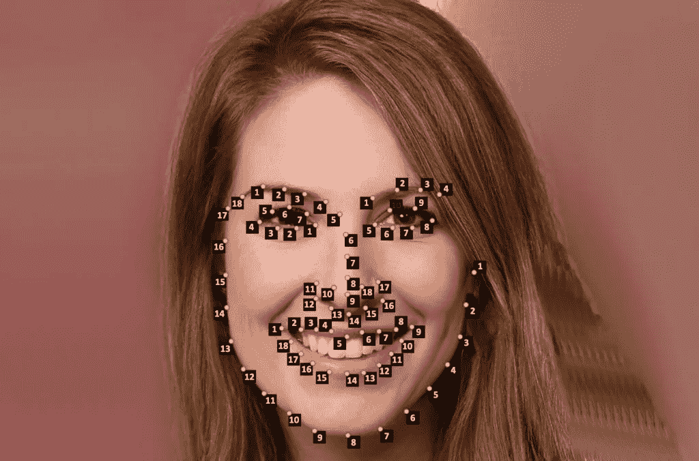
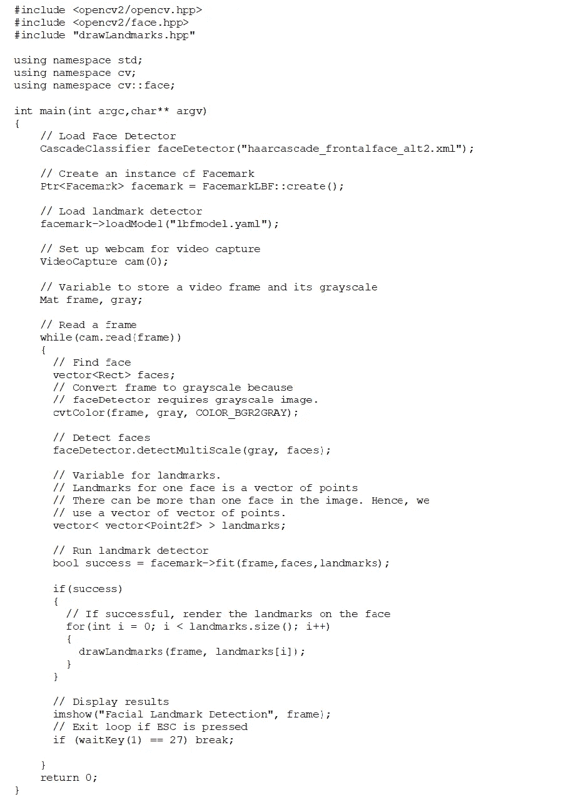
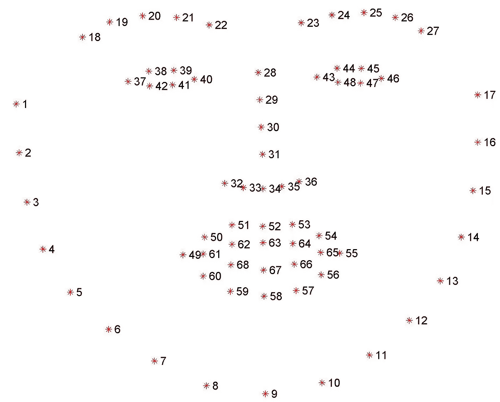
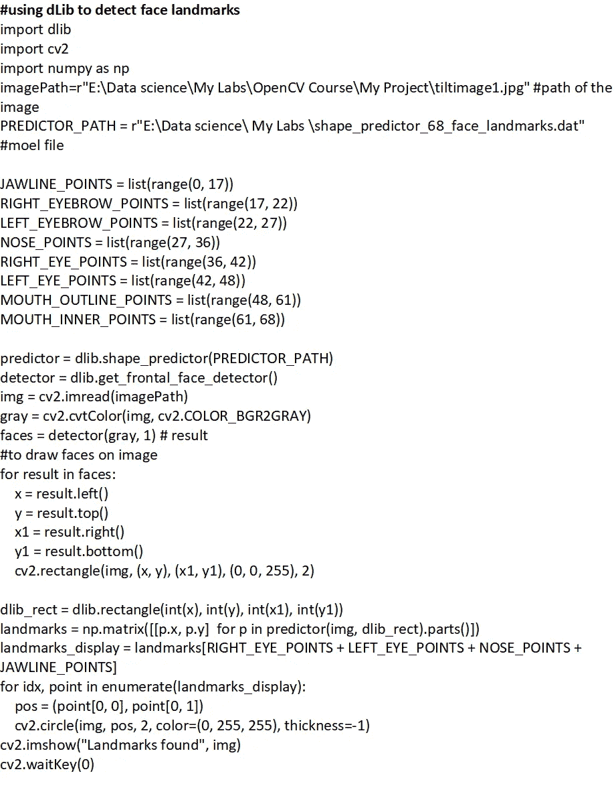
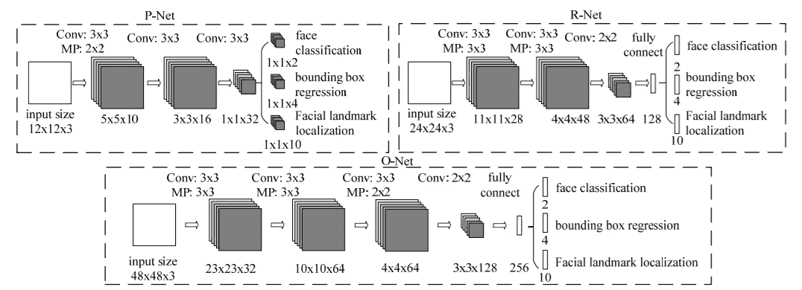
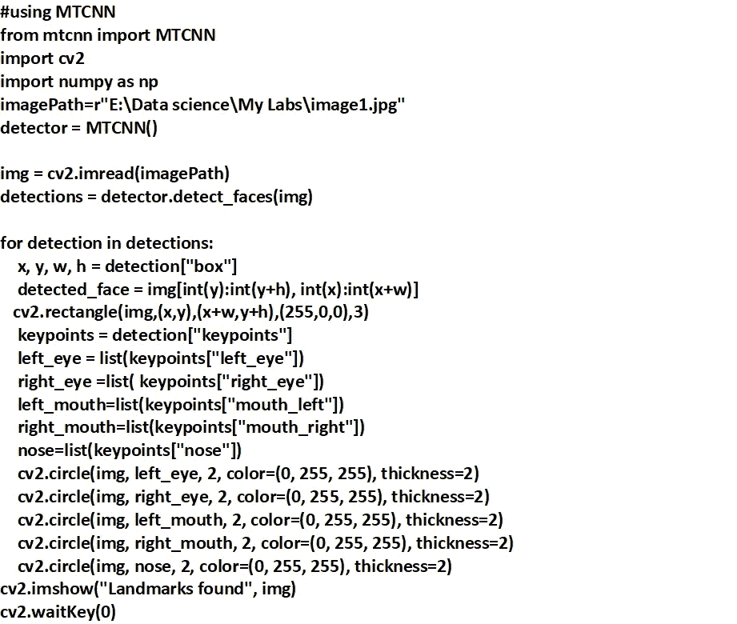
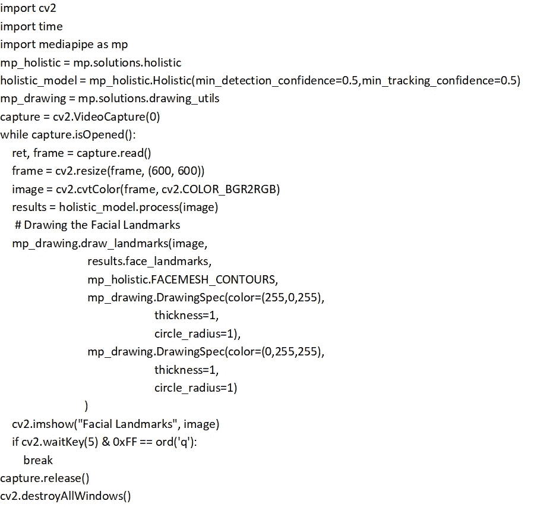

# 面部标志检测算法

> 原文：<https://medium.com/codex/facial-landmark-detection-algorithms-5b2d2a12adaf?source=collection_archive---------0----------------------->

来源:latesttechnicalreviews.com

面部标志检测算法有助于自动识别面部图像上或视频中的面部关键标志点的位置。关键标志点通常包括像鼻尖、眼角、眉毛和下巴尖这样的面部区域。面部标志检测的一些应用是面部交换、头部姿态检测、检测面部姿态、注视方向等。

地标检测分两步进行。

1.  **人脸检测**

人脸检测从图像中定位人脸，并根据检测到的人脸的边界矩形的坐标返回一个值。

2.**地标检测**

在检测到人脸后，我们已经遍历了包围矩形内的关键点。

# 算法的分类

根据面部外观和面部形状模式，面部标志检测算法分为三种。

这里，面部外观指的是面部标志周围或整个面部区域中的独特像素强度模式，而面部形状模式指的是由标志位置及其空间关系定义的面部形状的模式。

地标检测算法的三个主要类别是:

1.  整体方法
2.  约束局部模型(CLM)方法
3.  回归方法

整体方法明确地对整体面部外观和整体面部形状模式进行建模。

clm 依赖于明确的局部面部外观和明确的全局面部形状模式。

基于回归的方法使用整体或局部外观信息，并且它们可以隐含地嵌入全局面部形状模式用于联合界标检测。

一些最近的方法结合了深度学习模型和全局 3D 形状模型用于地标检测。

# **热门车型**

在本文中，我们将讨论一些用于面部标志检测的流行模型。OpenCV 的面部地标 API 叫做 Facemark。它有三种不同的实现:FacemarkKazemi(回归树的集成模型)、FacemarkAAM(主动外观模型)和 FacemarkLBF(局部二元特征)。但是，目前，我们只有一个可用的训练模型(FacemarkLBF ), python 支持还不支持这些模型。

## LBF 模型

FacemarkLBF 模型从每个面返回 68 个地标，这些地标存储在点的向量中。因为我们可以在一帧中找到多张脸，所以我们必须传递一个点的向量来存储界标。下面给出了使用 LBF 模型进行地标检测的示例 C++代码。

源代码:learnopencv.com

**Dlib 型号**

Dlib 库中包含人脸检测和地标检测功能。DLib 人脸检测使用直方图导向方法(HOG ),地标检测基于卡泽米模型。它从一张脸上返回不同的 68 个特征点。下图展示了一张脸上这 68 个点的位置。

DLib 面部标志点。(来源:PyImageSearch)

Dlib 包括一个预先构建的人脸标志检测模型，名为 shape _ predictor _ 68 _ face marks . dat。我们只是直接访问该模型并创建一个对象。下面分享使用 Dlib 模型进行面部地标检测的样例代码。

源代码:DLib 面部标志检测

**MTCNN 型号**

MTCNN 代表多任务级联卷积网络。它是一个使用深度学习架构的联合人脸检测和地标检测模型。该结构由 P-Net、R-Net 和 O-Net 三个卷积神经网络组成。

P-Net 的名字来源于提议网络。它在 12×12 大小的框架中寻找人脸。这个网络的任务是快速产生结果。

R-Net 的名字来源于 refine network。它的结构比 P-Net 更深。所有来自前一个网络 P-Net 的候选人都被馈送到 R-Net。P-Net 在这里拒绝了大量的候选人。

输出网络或简称 O-Net 返回边界框(面部区域)和面部标志位置。

MTCNN 的架构如下图所示。

MTCNN 架构(参考文献:[1])

MTCNN 模型检测五个面部标志，即左眼、右眼、鼻子和两个嘴角。与其他模型相比，MTCNN 模型的人脸检测得分较高，但速度较低。下面给出了 MTCNN 的一个示例实现。

基于 MTCNN 的地标检测

**Mediapipe 型号**

Mediapipe 是 Google 为计算机视觉任务开发的跨平台库。Mediapipe python 库使用整体模型来检测面部和手部标志。这个整体模型产生 468 个面部标志、21 个左手标志和 21 个右手标志。可以通过指定所需地标的索引来访问各个地标。不幸的是，mediapipe 库现在只支持视频流元素，不支持静态图像。示例代码附在下面。

媒体管道面部标志检测

相当多的软件包是为人脸检测而构建的。其中一些用于探测和地标定位。但是仍然没有一个出色的性能模型。面部检测和地标定位的挑战如下:

1.  不同的面部表情和头部姿势
2.  照明等各种环境条件
3.  其他物体造成的面部遮挡或极端头部姿势造成的自遮挡

考虑到这些因素，这方面的研究工作正在取得进展。让我们等待…

# 参考

特别鸣谢 pyimagesearchUniversity，learnopencv

1.  基于多任务级联卷积网络的人脸检测和对齐算法张，，，IEEE 高级会员，于桥，IEEE 高级会员

2.Python 中的 MTCNN 深度人脸检测