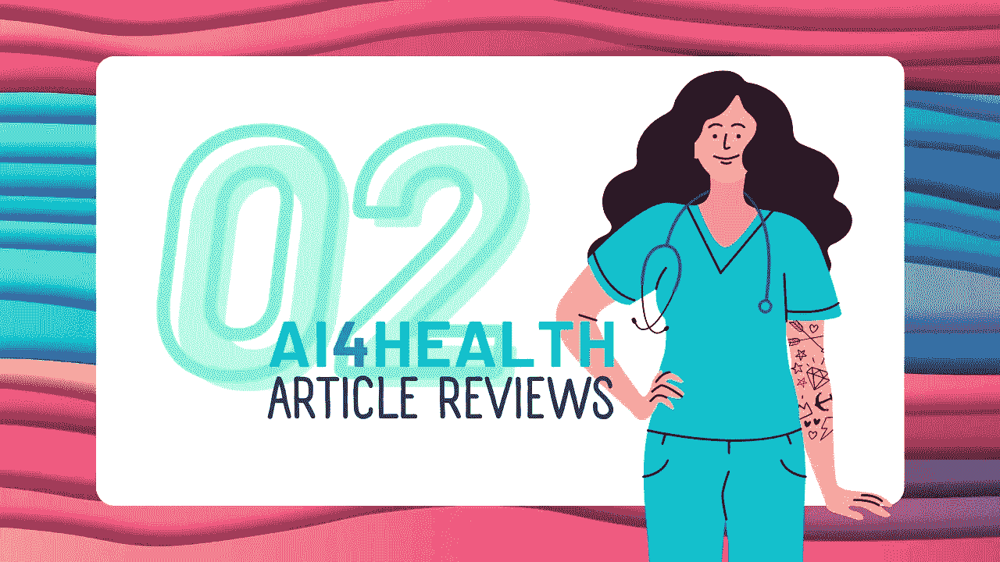
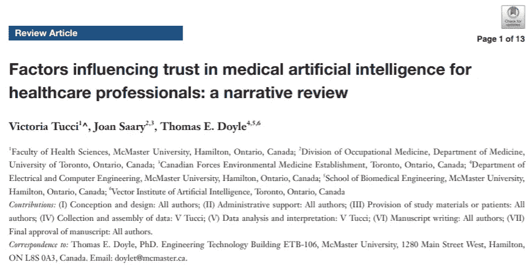
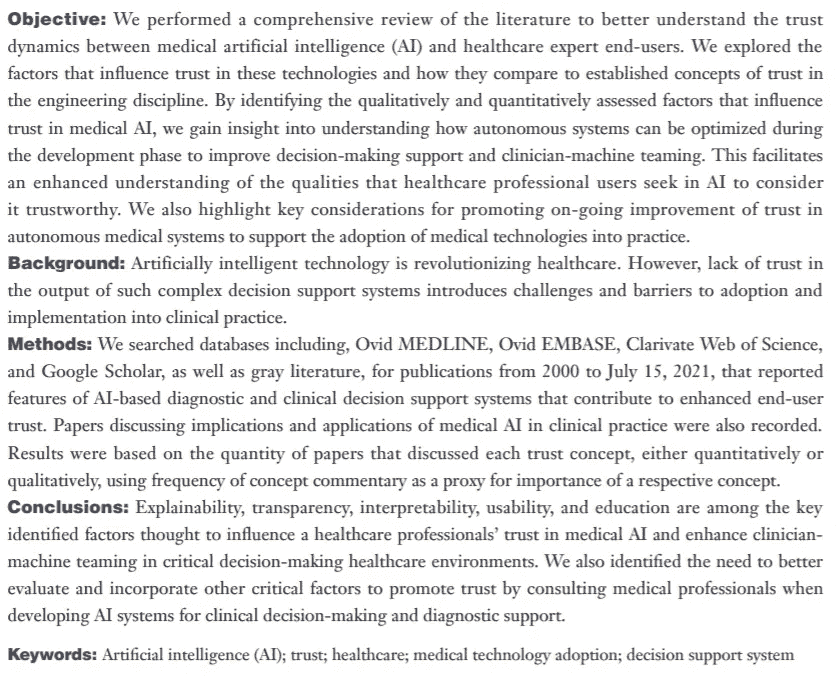

# 医护人员对医学人工智能信任的影响因素

> 原文：<https://medium.com/codex/factors-influencing-trust-in-medical-artificial-intelligence-for-healthcare-professionals-ff61c6aba4bd?source=collection_archive---------31----------------------->

## ai4 健康文章评论#02

在医疗保健领域开发人工智能应用时，最不可预测的部分之一是最终用户使用了多少人工智能。有时，即使在开发阶段从最终用户那里得到的评价是‘你正在开发一个真正能帮助我们的产品！’，该产品即使可用也可能无法持续使用。虽然这有许多不同的原因，但其中一个主要原因是信任。

为了促进人工智能技术在医疗实践中的应用，必须在人工智能系统和健康专家终端用户之间建立重要的信任。

以下是我读过的一篇关于这个主题的评论，以及我认为重要的推论:

✅在工程学科中建立了几个概念，这些概念被很好地理解为有助于增加终端用户对人工智能系统的信任，包括但不限于可解释性、可解释性、健壮性、透明性、可问责性、公平性和可预测性。然而，与工程文献形成对比的是，在医疗文献中，在探索有助于增强医疗保健提供商对医疗人工智能的信任的具体因素方面，似乎存在差距。

✅总的来说，**可解释性**在 23 篇被纳入的文章中被一致地讨论，并且是被检查最多的因素。这表明这是医学人工智能中信任的最重要的概念之一。**透明**、**可解释性**和**教育**跟随**。**

✅Among:那些只从数量上探索人工智能信任概念的文章，**教育**和**可用性**被讨论得最多。定量确定的增强最终用户对医疗人工智能信任的其他主要因素是**可解释性**、**隐私**、GP 参与工具设计和传播以及**感知有用性。**

✅作家认为，在开发用于临床决策和诊断支持的人工智能系统时，需要更好地评估和整合其他重要因素，以促进信任的增强，并咨询医疗专业人士的观点。

# 信任因素

通过定性和定量方法一致确定了九个信任概念，但是更频繁地进行定性分析，包括:

*   复杂性(占已识别文章总数的 5.3%)
*   准确度(5.3%)
*   持续更新证据库(7.0%)
*   公平性(8.8%)
*   可靠性(10.5%)
*   教育(10.5%)
*   可解释性(14.0%)
*   透明度(28.1%)
*   可解释度(45.6%)

仅进行定性分析的 16 个信任因素包括:

*   数据代表性(1.8%)
*   标准化绩效报告标签包含(1.8%)
*   忠诚度(1.8%)
*   道德性(1.8%)
*   合法性(1.8%)
*   数据的可发现性和可访问性(1.8%)
*   合规性(1.8%)
*   知识表示(1.8%)
*   计算可靠性(1.8%)
*   相关性/洞察力(1.8%)
*   一致性(3.5%)
*   可导致性(3.5%)
*   可预测性(5.3%)
*   可靠性/能力(5.3%)
*   验证(7.0%)
*   稳健性(7.0%)

通过定量方法分析的*和*另外 10 个因素包括:

*   可用性(1.8%)
*   努力预期(1.8%)
*   其他全科医生的认可(全科医生(1.8%)
*   AI 与医生的怀疑一致(1.8%)
*   信息安全(3.5%)
*   性能预期(3.5%)
*   对患者背景的敏感度(3.5%)
*   与临床工作流程保持一致(3.5%)
*   感知有用性(5.3%)
*   全科医生参与工具设计和传播(5.3%)

感谢这篇有价值的文章:
[维多利亚·图奇](https://www.linkedin.com/in/ACoAACXc7QQB7Or3okMMTxWsnkZXJL6Q_Sc-bbk)[琼·莎莉](https://www.linkedin.com/in/ACoAAADiXDYB7_0FPvY-OHA-OOPUlpMbho3J8SE)[托马斯·e·道尔](https://www.linkedin.com/in/ACoAAAAufIMBlNv-g5vVjpa3owi_T5e3r40xZjU)

📑Tucci V，Saary J，Doyle TE。影响医护人员对医学人工智能信任的因素:一项叙述性综述。J Med Artif Intell 20225:4.
📑[点击此处获取文章](https://jmai.amegroups.com/article/view/6664/pdf)的 PDF