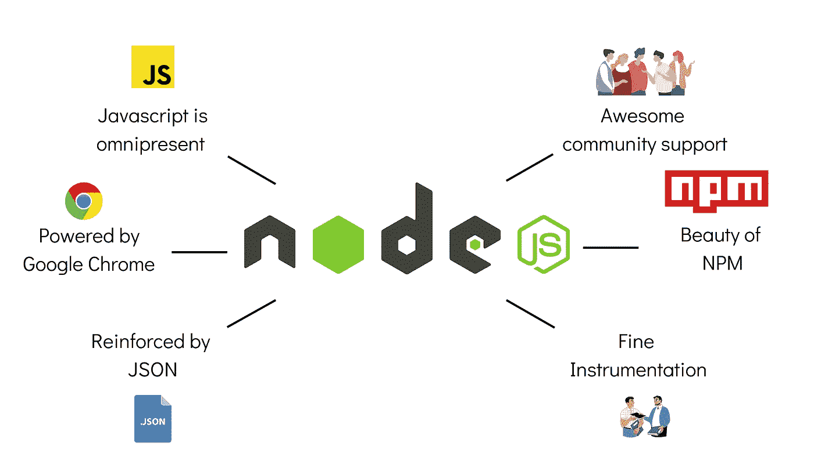

# 你可能错过的关于节点 JS 的事实

> 原文：<https://medium.com/codex/facts-about-node-js-you-might-have-missed-772267878d30?source=collection_archive---------8----------------------->

## 节点 JS 不是一个框架和更多…

Node.js 是一个服务器端运行时环境，用于构建快速且可伸缩的应用程序。它很轻便，可以让你在几分钟内创建一个 web 服务器。根据**栈溢出**统计，Node.js 以 50.4%的份额在世界技术领域绝对领先。那么，是什么让它如此受欢迎呢？

随着 **JavaScript** 的日益流行，开发人员对服务器端编程能力也有了需求。凭借回调概念和事件驱动，Node.js 朝着这个方向迈出了一大步。

在本文中，让我们打破一些关于 Node.js 的常见神话，并探索 Node.js 超越其竞争对手的一些领域。

# 神话和事实

在核心部分，Node.js 是一个可以编辑和调整的服务器引擎，它只有在你设置好之后才能工作。对它的请求作为一个循环(事件循环)来处理，这就是为什么 Node 本质上是一个运行时。但是，人们经常会对 Node.js 的开发产生错觉。以下是最常见的流言被终结了！

# 为什么要用 Node.js 进行开发？

Node.js 在某些方面非常有特色。可能，最重要的一点是它是一个服务器端平台。有了 Node，JavaScript 不仅仅局限于前端(在浏览器中工作)，还允许离开浏览器工作。以这种方式在服务器上运行代码会产生快速的处理能力。下面是在您的下一个项目中使用 Node.js 的更多理由。

## 1.Javascript 无处不在

让我把这个放在外面。JavaScript 是在浏览器中开发应用程序最简单的方式，也是最流行的方式。您可以用其他编程语言来实现，但是这并不容易，可能需要编译，或者使用不推荐的技术。

同样， **JavaScript 是 GitHub** 上最流行的语言之一。除了 JavaScript 之外，Node.js 的神奇之处在于，您也可以在服务器上进行开发！JavaScript 还可以跨多个操作系统运行，并消除它们之间的不一致性。与其他语言及其事件循环系统相比，例如 **Python** 和 **Ruby** ，JavaScript **被证明具有更好的性能**。

## 2.由谷歌 Chrome 支持

Node.js 在后端运行，由谷歌 V8 引擎提供支持，与谷歌 Chrome 相同的运行时在前端执行 JavaScript。

那有什么好的？竞相推进 JavaScript 的开发团队已经使它成为最快和最动态的运行时之一。谷歌自己也自豪地将 Node.js 列在其他系统引擎强国之列，所以这很了不起！

## 3.由 JSON 加强

既然有更实用的 JSON，为什么还要为 XML 标记疯狂和失眠呢？ **JavaScript 对象符号，**因此，**是一种健壮且流行的数据交换格式**。它很简单，允许开发人员快速构建 API。实际上，它是 JavaScript 的支柱之一。

在编程的早期，浏览器中的动态数据必须用 JavaScript 小心处理。通用 JSON 的引入催生了 NoSQL 数据库，如 MongoDB。它原本只是为 JS 设计的，但现在是国际标准。

## 4.令人敬畏的社区支持

Node.js 社区是开放和友好的，可以共享任何代码包。节点伦理允许并欢迎这种方法，使得这样做变得简单。**任何作者都可以在公共库中发布代码或创建模块**。在法律术语中，有麻省理工学院的开源许可证在起作用，处理所有的知识产权问题。

仅在 NPM，你就可以找到大约 475，000 个代码包，它已经从包管理器发展成了一个仓库。因此，当您面临 Node.js 开发的挑战/任务时，很可能已经有了解决方案。

## 5.NPM 之美

默认情况下，节点程序包管理器(NPM)包含在节点中。它实际上是大多数 Node.js 部署系统的核心，在它的帮助下，Node 生态系统在最近几年得到了显著扩展。NPM 由一个命令行和包的数据库(注册表)组成，它管理项目的本地包和公共 JavaScript 工具。

## 6.精密仪器

Node.js 提供了良好的工具、文档和最佳实践。这旨在帮助应用程序开发的每个阶段，实现最佳性能和生产就绪性。

# Node.js 伟大是为了什么？

虽然对于 Node.js 的适当使用还存在一些争议，但是 Node 在哪些领域会受到影响呢？下面是几个例子。

## 闲谈

一个最典型的实时应用程序，一个消息聊天应用程序显示了 Node.js 的所有优点。多用户，大流量，密集的数据和跨设备运行。

## 服务器端 web 应用

由于 HTML 的原因，这不是 Node 的典型用法，尽管如果将 Node.js 和 **Express.js** 配对，您可以在服务器端创建一些经典的 web 应用程序。同样，这是一个有争议的话题，但是如果你的应用程序 CPU 计算量很低，你当然可以完全用 JavaScript 来构建它。

## 数据流

利用 HTTP 请求和响应基本上是数据流的事实，我们可以使用 Node.js 创建一些积极的特性。例如，在上传文件时处理文件，例如用于音频/视频编码。

## 监控仪表板

为了收集关于网站访问者和可视化的实时数据，您可以很好地使用 Node.js 来制作系统仪表板。用户统计和即时查看他们正在做什么的能力，对企业来说不是很好吗？

# 结论

Node.js 可能不是完美的解决方案，但是它是用 JavaScript 构建服务器端 web 应用程序的一个很好的工具。NodeJS 一直在发展和扩展它的用途。它相对来说比较容易上手，但足以处理今天的 web 开发任务。这是一个经济高效、资源高效的系统，用于构建网站、网络/移动集成 API 和独立软件。

如果您有任何问题或建议，请随时联系我。您可以在这些社交媒体平台上关注我— [LinkedIn](https://www.linkedin.com/in/ab-satyaprakash/) ， [YouTube](https://www.youtube.com/channel/UCJ6D0HS8c9Il-eX5lGbAyGg) ， [Twitter](https://twitter.com/AbSatyaprakash) ， [Instagram](https://www.instagram.com/absatyaprakash/) 了解更多更新内容！

**一如既往！黑客快乐！😇**

[加入我的电子邮件列表，获得更多精彩的教程和编程博客](https://absatyaprakash01.medium.com/subscribe) ❤️