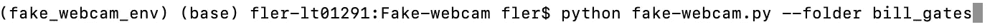
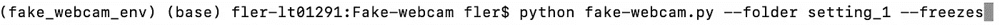

# 使用 Python 为您的在线会议制作假网络摄像头

> 原文：<https://medium.com/codex/fake-webcam-for-your-online-meetings-with-python-755556d7667b?source=collection_archive---------0----------------------->

想象一下。您正在参加一个在线会议，由于这样或那样的原因，您并不真的想打开网络摄像头。但是你看到其他人都戴着它。所以你觉得有义务，你很快整理好你的头发，确保你的衣服看起来合适，你打开相机，不情愿地。我们都经历过。

我有好消息。在 Python 的帮助下，强制性网络摄像头的暴政可以结束了。我将向您展示如何为您的在线会议创建一个假的网络摄像头，看起来像这样:

当然脸不一定是比尔·盖茨的，可以是自己的录音。

现在，我将向您展示如何用 Python 对此进行编码。在文章的最后，我会解释你如何为自己使用这个假的网络摄像头。

## 制作一个简单的假网络摄像头

首先我们要导入一些模块，特别是 openCV。

接下来，我们将创建一个从视频中提取所有帧的函数:

现在我们有了框架，我们可以创建一个循环来一个接一个地显示它们。当我们到达最后一帧时，我们将开始向后播放视频，然后当我们到达第一帧时，我们将再次向前播放，我们将永远重复这一过程。这样就不会出现从最后一帧到第一帧的突然过渡(但是要注意不要被看到熵反转)。我们还可以按“q”来停止网络摄像头。

有了这个，我们已经有了一个简单的网络摄像头，可以永远无缝播放。

但我们不必就此止步。

**添加不同的模式**

如果我们的假网络摄像头化身不只是被动地盯着看，那就更有说服力了。例如，有时在会议中你需要点头表示同意，或者微笑，或者说话，或者做其他事情。因此，我们希望我们的网络摄像头有多种“模式”，我们可以随时通过按键盘上的一个键切换到这些模式。

为此，你需要为每种模式做一个简短的记录，例如，你只是微笑。然后，我们可以从每个视频中读取帧，并将它们存储在字典中。当我们检测到一个按键(例如，“s”切换到“微笑模式”)，我们将活动模式更改为新的模式，并开始播放相应视频的帧。

默认情况下，我把切换到某个模式的键盘命令设为该模式名称的第一个字母。现在我把这个‘change _ mode’函数作为一个黑盒，但是我稍后会解释它。

这里我按“n”进入点头模式

## 优化过渡

所以我们想从一个视频切换到另一个视频，比如从正常模式切换到点头模式。如何以最佳方式从一个过渡到另一个(即尽可能平稳地过渡)？

当我们进行转换时，我们希望转到与当前模式最相似的新模式框架。

为此，我们可以首先定义图像之间的距离度量。这里我使用一个简单的欧几里德距离，它查看两幅图像的每个像素之间的差异。

有了这个距离，我们现在可以找到与当前图像最近的图像，并切换到这个图像。例如，如果我们想要从正常模式转换到点头模式，并且我们在正常视频的第 132 帧，我们将知道我们必须转到点头视频的第 86 帧，以具有最平滑的可能转换。

我们可以预计算所有这些最佳转换，针对每一帧以及从每一个模式到每一个其他模式。这样我们就不必每次想切换模式时都要重新计算。我还会先压缩图像，这样计算时间会更短。我们还将存储图像之间的最佳距离。

现在我可以展示“change_mode”函数，它从预先计算的字典中检索要转换到的最佳帧。我这样做是为了如果你按下“s”来切换到微笑模式，再次按下它将切换回正常模式。

为了让我们的过渡更加无缝，我们可以添加的另一个改进是，不要总是立即切换模式，而是等待一个更好的过渡机会。例如，如果我们的化身在点头，我们可以等到头部通过中间位置再转换到正常模式。为此，我们将引入一个时间窗口(这里我将其设置为 0.5 s)，以便在切换模式之前，我们将在该窗口内等待最佳的转换时间。

现在我们的过渡更加顺畅了。但是，它们有时还是很明显的。因此，另一个想法是有目的地向视频添加冻结，就像不稳定连接可能发生的那样，并使用它们来掩盖过渡(我们将使冻结持续时间与两个图像之间的距离成比例)。我们还将添加随机冻结，这样模式就不会变得明显。所以我们增加了这些新的线:

使用或不使用这些冻结作为一种选择。好了，现在我们真的已经为这些转变打下了基础。我们还可以在网络摄像头上添加什么？

## 语音检测

一个有趣的事情是增加语音检测，这样当我们说话的时候头像也会说话。

这是使用 pyaudio 完成的。在这个 stackoverflow 线程中感谢 Russell Borogove，我从其中获得了大部分代码。基本上，这个想法是看一段时间内麦克风发出的声音的平均振幅，如果它足够高，就可以认为我们一直在说话。最初这段代码是用来检测敲击声的，但是它也可以很好地检测声音。

现在我们可以将它添加到主循环中。我这样做是为了在切换回正常模式之前，我们需要在一定数量的连续帧中检测到没有声音，这样我们就不会切换得太频繁。

现在，当我们通过麦克风说话时，我们可以让我们的化身开始和停止说话。我把它做成可以通过按“v”来激活或关闭语音检测。

这些都是我到目前为止实现的功能。但我欢迎进一步改进的建议。

## 如何使用假网络摄像头

现在告诉你如何为自己使用所有这些。

首先，从[这里](https://github.com/FrancoisLeRoux1/Fake-webcam)下载所有代码。

你要做的是录制几段你自己的视频(在我的 Mac 上，我使用 Photo Booth 应用程序来录制)，并将它们放在“视频”文件夹内的一个新文件夹中。你可以为不同的设置创建不同的文件夹，例如，你穿不同的衬衫，或者你的头发看起来不同。

这些视频可以而且应该很短(我用的是大约 10 秒的视频)，否则如果你用长视频，计算最佳过渡可能需要很长时间。你需要一个名为“正常”的视频，这将是你的默认模式。然后，如果你想让你的虚拟形象说话，你就必须录一段名为“说话”的视频，视频中你在说一些乱七八糟的话。在此之后，你可以记录任何你想要的其他模式(例如，“微笑”，“点头”，“再见”，“等等)。默认情况下，激活/停用这些模式的命令将是其名称的第一个字母(例如，对于“微笑”按“s”)。

然后你将不得不计算最佳转换。为此，只需运行脚本 compute-transitions.py

这需要几分钟时间。

然后，当你完成后，你就可以启动你的假摄像头了。为此，运行 fake-webcam.py 脚本。您需要在“视频”中指定您的视频所在的文件夹。您还可以指定是否要使用冻结。

所以现在你应该让你的假相机运行。接下来，您可以将其设置为在线会议的网络摄像头。为此我使用了 [OBS](https://obsproject.com) 。

选择右侧 Python 窗口作为源，然后单击启动虚拟相机。

现在，您应该能够在您最喜欢的在线会议应用程序中选择这个虚拟摄像头作为您的网络摄像头。

就这样，现在享受不用让自己在会议上看起来像模像样吧！