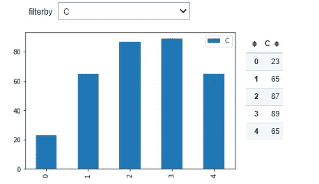

# ipywidgets 的奇幻世界

> 原文：<https://medium.com/codex/fancy-world-of-ipywidgets-e3301de58bd7?source=collection_archive---------7----------------------->


瓦斯·索什尼科夫在 [Unsplash](https://unsplash.com?utm_source=medium&utm_medium=referral) 上的照片

作为数据科学家，我们总是需要以一种他们不会迷失在代码中的方式向观众解释我们的发现。我们没有太多的选择，我们最好的朋友是笔记本，即 Jupyter 笔记本。

Jupyter 笔记本真的提供了一个很好的环境来解决问题并在过程中记录下来，并且以一种让非技术利益相关者感觉他们正在阅读博客文章的方式来呈现结果。这太棒了，至少在理论上是这样。但事实是，一些数据科学家(就是我)无法停止挖掘数据，尝试许多替代模型和参数，希望找到指标的微小增加，将发现留在身边，很难证明真正的观点。

虽然我知道 [ipywidgets](https://ipywidgets.readthedocs.io/en/stable/) 已经存在很多年了，但我还是在过去的几个月里体验了它们，并看到它们确实将笔记本带到了一个终极水平。现在我无法阻止自己将库默认导入到每个新笔记本中。我不打算写它是怎么安装的，你可以在这里找到它[。相反，我想展示我的经历，告诉你它是如何改变你的工作方式的。](https://ipywidgets.readthedocs.io/en/latest/user_install.html)

现在，让我们从基础开始，导入库并添加一些交互性。向代码中添加交互性最简单的方法是@interact 装饰器。这个装饰器允许处理参数，而不需要每次都运行单元。让我们看看我们如何能做到这一点。

```
from ipywidgets import interact
[@interact](http://twitter.com/interact)
def calculate(x=2):
    print(x**2)
```


是的，我明白了，你不能用这个演示太多。让我们继续。

会议中几乎总是有两种人，沉迷于图表的人和沉迷于桌子的人。因此，在这种情况下，我们可能需要用表格来显示图表。但是把它们一个接一个地展示出来并不是最漂亮的方式。所以看看这个。

```
from ipywidgets import interact, HBox, VBox, Output
import pandas as pd
import matplotlib.pyplot as plt[@interact](http://twitter.com/interact)
def chart_and_table(filterby=['A','B','C']):
    df = pd.DataFrame({'A':[23,45,26,43,67], 'B':[25,65,85,74,56], 'C':[23,65,87,89,65]})

    o1, o2 = Output(), Output()
    scene = HBox([o1,o2])
    display(scene)

    with o1:
        df[[filterby]].plot(kind='bar')
        plt.show()
    with o2:
        display(df[[filterby]])
```



我们首先创建一个虚拟数据帧来显示。然后创建两个[输出](https://ipywidgets.readthedocs.io/en/latest/examples/Widget%20List.html?highlight=Output#Output)对象来逐个显示图表和表格。然后把它们放到一个 [HBox](https://ipywidgets.readthedocs.io/en/latest/examples/Widget%20List.html?highlight=HBox#HBox) 对象中，这个对象允许我们显示水平堆叠的窗口小部件。这里堆叠的小部件是输出。我们可以添加尽可能多的对象，并将它们与 VBox 相结合，以显示您需要的任意数量的输出。一个例子如下:

```
from ipywidgets import interact, HBox, VBox, Output, HTML, Layout
import pandas as pd
import matplotlib.pyplot as plt[@interact](http://twitter.com/interact)
def chart_and_table(filterby=['A','B','C']):
    df = pd.DataFrame({'A':[23,45,26,43,67], 'B':[25,65,85,74,56], 'C':[23,65,87,89,65]})

    style="""
        <style>
            .style_a {background-color:#fafaaa}
            .style_b {background-color:#faaafa}
            .style_c {background-color:#aafafa}
        </style>
    """
    display(HTML(style))

    o1 = Output(layout=Layout(width='400px'))
    o2 = Output(layout=Layout(width='200px')) 
    o3 = Output()
    o4 = Output()
    scene = HBox([o1,
                  o2,
                  VBox([o3, o4])
                 ])
    display(scene)

    with o1:
        df[[filterby]].plot(kind='bar')
        plt.show()
    with o2:
        display(df[[filterby]])
    with o3:
        if filterby=='A':
            o3.add_class('style_a')
        elif filterby=='B':
            o3.add_class('style_b')
        elif filterby=='C':
            o3.add_class('style_c')
        print('The selected filter is :', filterby)
    with o4:
        display(df)
```


你看，在单个单元格输出中，我们可以显示四种不同类型的信息。这为解释我们的发现带来了一个很好的机会，而不用在单元格之间滚动。这里，除了前面的显示，我们还添加了一个 [HTML](https://ipywidgets.readthedocs.io/en/latest/examples/Widget%20List.html?highlight=HTML#HTML) 对象，它不仅允许我们在显示输出中显示任何 HTML 代码，还允许我们插入 css 样式。在 HTML 对象中，我们放置了一些 css 样式，我们将使用这些样式根据所选的过滤器来改变输出的颜色。然后我们添加带有布局参数的布局对象来设置输出的宽度。最后，我们根据选择的过滤器将样式类添加到输出对象中。

到目前为止一切顺利。我们可以在细胞内建立一个微小的世界来玩我们的参数。一旦你感受到这种自由，你会渴望更多。现在，让我们看看更多的互动。这一次我们将把小部件的动作相互结合起来。让我们看看。

```
from ipywidgets import interact, HBox, VBox, Output, HTML, Dropdown, Button, Layout, Label
from IPython.display import display, clear_output
import pandas as pd
import matplotlib.pyplot as plt
import datetime as dt
class demo():
    def __init__(self):
        self.df = pd.DataFrame({'A':[23,45,26,43,67], 'B':[25,65,85,74,56], 'C':[23,65,87,89,65]})

        style="""
            <style>
                /* enlarges the default jupyter cell outputs, can revert by Cell->Current Outputs->Clear */
                .container { width:1020 !important; } 

                /* styles for output widgets */
                .o2 {width:400px; border:1px solid #ddd}
                .o3 {width:400px; border:1px solid #ddd}
                .o4 {width:400px; border:1px solid #ddd}
                .o5 {width:800px; }
                .o5 span {color:red !important}

                /* custom styles for testing */
                .style_A {background-color:#fafaaa}
                .style_B {background-color:#faaafa}
                .style_C {background-color:#aafafa}
            </style>
        """
        display(HTML(style))
        self.o1 = Output(layout=Layout(width='400px'))

        self.o2 = Output() 
        self.o2.add_class('o2')
        self.o3 = Output()
        self.o3.add_class('o3')
        self.o4 = Output()
        self.o4.add_class('o4')
        self.o5 = Output()
        self.o5.add_class('o5')
        # create a scene for displaying the outputs, 
        # Output1 on the top row, 2,3, and 4 stacked horizontally in the second row
        scene = VBox([self.o1,
                      HBox([self.o2, self.o3, self.o4]),
                      self.o5
                     ])
        display(scene)

        with self.o1:
            display(HTML('<h2>Demo</h2>'))

        with self.o2:
            self.dd_filter = Dropdown(description='Select Filter', options=['', 'A','B','C'])
            self.dd_filter.observe(self.fill_values)

            self.dd_values = Dropdown(description='Select Value')

            self.btn = Button(description='Run')
            self.btn.on_click(self.display_results)

            display(self.dd_filter, self.dd_values, self.btn)

    def fill_values(self,x):
        if x['type'] == 'change' and x['name'] == 'value':
            filter_by = x['owner'].value

            if filter_by=='':
                filter_values = []
            else:
                filter_values = self.df[filter_by].values
            self.dd_values.options = filter_values

    def display_results(self, x):
        filter_by = self.dd_filter.value
        filter_val = self.dd_values.value

        if filter_by=='':
            with self.o3:
                clear_output()
                print('Please select filter')
            return

        df_filtered = self.df[self.df[filter_by]>=filter_val]

        with self.o3:
            clear_output()
            lbl = Label(value=f'Filter by {filter_by}, with {filter_val}, found {df_filtered.shape[0]} observation(s)')
            lbl.add_class(f'style_{filter_by}')
            display(lbl)
            display(df_filtered)

        with self.o4:
            clear_output()
            df_filtered.plot(kind='bar')
            plt.show()

        with self.o5:
            clear_output()
            display(Label(value= f'Code last run {dt.datetime.now().strftime("%Y-%m-%d %H:%M:%S")}' ))

d = demo()
```

这次我们更进一步，利用面向对象编程的优势。我们创建一个类对象来存储所有的小部件并维护它们之间的交互。我们的类由三个函数组成。

第一个是“__init__”函数，一旦用 d=demo()行初始化了类，就会调用这个函数。在这个函数中，我们首先构造我们的数据帧，并把它赋给一个 df 变量，通过添加“self”使它在整个类中可访问关键词在前面。然后，我们创建样式和输出小部件，并像前面的例子一样显示它们。再次，我们把“自我”以提供类内的可访问性。与前面的例子不同，我们手动创建 Dropdown 小部件，而不是@interact decorator，并设置“observe”参数，以便能够跟踪它的 select 事件。我们将一个名为“fill_values”的函数传递给这个参数，并将根据 dataframe 的选定列填充第二个下拉列表值。一旦用户从这个下拉列表中选择了一个值，就会调用“fill_values”函数，并用该列下的值填充第二个下拉列表。

然后我们添加一个按钮来触发主作业“display_results”。单击此按钮后，调用“display_results”函数，首先从下拉列表中读取值，相应地过滤数据帧，清除输出 3、4 和 5 中的现有输出，并用所需的输出填充它们。

最后，借助 [Jupyter 笔记本扩展](https://github.com/ipython-contrib/jupyter_contrib_nbextensions)‘nb extensions’隐藏输入扩展，整个笔记本可以显示如下。


# 结论

如你所见，你只受限于你的想象力。你可以对你的发现进行令人印象深刻的演示，并轻松地保持观众的注意力，而不会迷失在你的草图单元中。

下面我放了一张我最新演示的截图，希望它有助于为这些小工具的使用提供一些直觉。


# 参考

 [## ipywidgets - Jupyter 小部件 7.6.2 文档

### 编辑描述

ipywidgets.readthedocs.io](https://ipywidgets.readthedocs.io/en/stable/index.html)