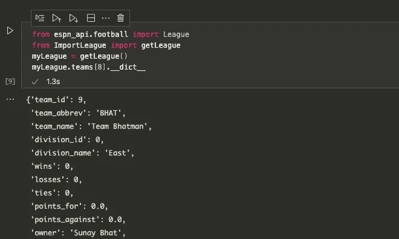
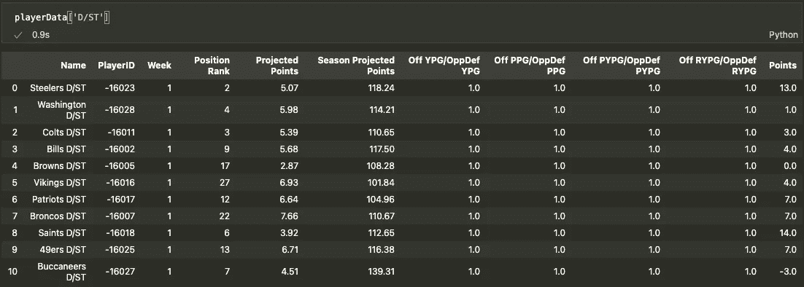
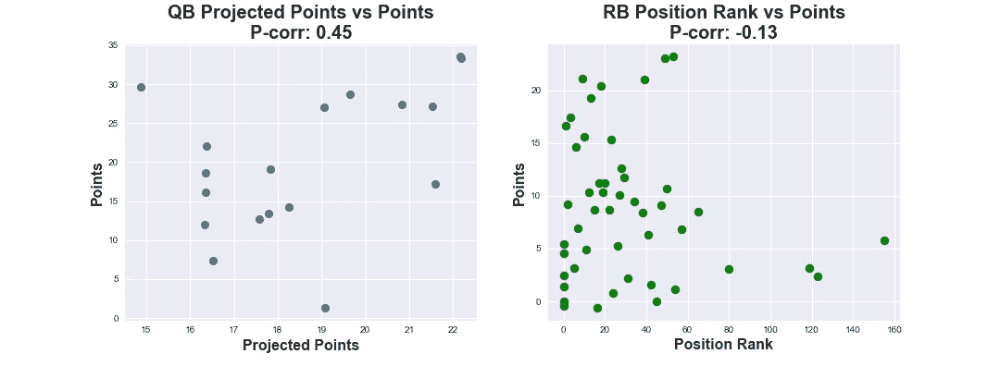
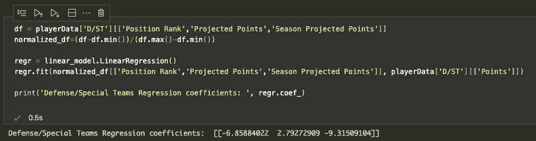

# 幻想与否:强化学习和幻想足球？(第一部分)

> 原文：<https://medium.com/codex/fantasy-or-not-reinforcement-learning-and-fantasy-football-part-1-9e4de960c891?source=collection_archive---------10----------------------->

## 将强化学习应用于梦幻足球的介绍和工具

[本好时](https://unsplash.com/@benhershey)

# **背景**

我加入了一个梦幻足球联盟，尽管我已经对跟随 NFL 失去了几乎所有的兴趣。我上一次玩《幻想》是在 4 年多以前，但是就在几天前我想不起最近的超级碗冠军了…那是坦帕湾。因此，我对这个赛季的糟糕表现并不感到兴奋。我决定做一些挖掘，看看我如何利用这个机会练习一些数据科学和机器学习技能。这是一个两部分系列的第一个故事，在这个系列中，我将尝试通过强化学习将机器学习应用到我的幻想联盟中。也许明年我可以加入一个联盟，花所有的时间计划惩罚，而不用担心阵容(不太可能)。

# 系列链接

1.幻想与否:强化学习和幻想足球？第 1 部分:将强化学习应用于梦幻足球的介绍和工具(当前)

[2。幻想与否:强化学习和幻想足球？第二部分:RL 结构和多臂强盗](/codex/fantasy-or-not-reinforcement-learning-and-fantasy-football-part-2-2a54fbed40a)

# **为什么要强化学习？**

如果你熟悉机器学习的各种范式，有监督的、无监督的和强化学习(RL)，你可能会在这里质疑 RL 的选择。我同意。如果你正在寻找信息丰富的统计数据来帮助你做决定，这肯定是一个监督和非监督方法似乎更优越的领域。事实上，我的模型很可能是这些方法的组合，最终目标是拥有一个半自主的代理，可以每周自己做出阵容决定(暂时忽略交易)。我相信这个最终目标比一个统计仪表板更有趣，因为 ESPN 和各种幻想提供者已经把它留在你的指尖。此外，我认为我们距离 RL 算法中的样本效率还有很长的路要走，以处理这些类型的应用，因此我将在这个项目中使用专家策划的大量简单和高级数据和功能。

# **数据/工具**

所有的编程都将在 Python 中完成([工作报告](https://github.com/SunayBhat1/Writing-Code/tree/main/Fantasy%20RL%20Series)，我将使用一个 [ESPN api 包](https://github.com/cwendt94/espn-api)，它是非常好的构建和记录。使用这个包本身就是一篇文章，Github repo 中包含的 [wiki](https://github.com/cwendt94/espn-api/wiki) 做得非常好，详细介绍了你可以从一个联盟中提取的所有特征和数据。它将所有的联赛、球员和项目数据抓取并排列在一个等级结构中。此外，我将从 ESPN [进攻](https://www.espn.com/nfl/stats/team/_/view/offense/table)和[防守](https://www.espn.com/nfl/stats/team/_/view/defense/table)统计页面中收集基本的团队信息。

工作中的 ESPN 空气污染指数截图。如果有人有任何疑问，我会自动起草。

# **方法**

我自然会采取“以球员为中心”的观点，因为幻想队是 6 个位置(缩写为 QB、RB、WR、TE、D/ST 和 K)的球员的集合，形成了 16 人名单(9 名现役，7 名替补)。球员通常是统计上独立的“单位”,在什么样的变量允许我们预测他们在接下来几周的得分潜力的背景下进行分析。

最初，环境模型应该是一组简单的线性回归权重(每个位置一个)，其中我使用以下一组变量，通过对已完成的每周得分数据进行训练来输出预计得分。经过几周的数据收集，这种情况肯定会改变。

*   职位等级(全部)
*   投影点(所有)
*   赛季预计积分(全部)
*   每场比赛的进攻码数/每场比赛允许的对手防守码数(全部)
*   每场比赛的进攻点数/每场比赛允许的对手防守点数(全部)
*   每场比赛的进攻传球码数/每场比赛允许的对手防守传球码数(QB，WR，TE，D/ST)
*   每场比赛进攻冲码数/每场比赛对手防守冲码数(RB，TE，D/ST)

ESPN 投影点将是输入之一，由于我不知道输入的所有细节，可能会有一些线性依赖关系。每周都会有更多关于实际得分的数据来更新这些模型，并有望改善预测。我将尝试处理时间序列每周数据的不同方式，以及使用更复杂的模型(如神经网络)来尝试和提高模型性能。下面是一个熊猫数据框架的截屏，其中包含合并的数据和几个变量的图表。请注意，所有的比率特征都是 1，因为到目前为止只有一个对手(“PPG”是对手的防御 PPG 允许的)。

第 1 周的防御/特殊团队特点和要点的表格截图

QB 预测分数和 RB 职位排名与第 1 周的实际分数(具有皮尔逊相关系数)

在这个阶段，更有用的应用可能是找到更精细和相关的数据，并将其与更复杂的模型相结合，以尝试获得更好的未来表现预测。相反，我将开始满足我对强化学习应用程序的好奇心，把它看作类似于[多臂强盗问题](https://www.analyticsvidhya.com/blog/2018/09/reinforcement-multi-armed-bandit-scratch-python/)。在我们的例子中，一个 RL 代理应该尝试有限数量的阵容变化(例如，不超过三个)，使用环境模型来预测我的团队下周的总得分，并推荐优化该奖励的阵容(奖励将是预测的点数与当前阵容的联盟预测的某个比率)。

简单地遍历所有的玩家组合并获得最大的总点数(这是代理最初会做的)是微不足道的。但是我选择 RL 代理范例，希望随着赛季的进行，增加更复杂的行为和使用更多的概率分析。几周后的下一个故事将有一个基本的 RL 代理，它有几周的数据可以用来建模。

线性模型的回归系数(带有一些目前无意义的变量)

# **最后的想法**

随着第一周的结束，我对这个项目的工作和测试一些基本的，希望是更复杂的 RL 方法感到更加兴奋。如果你有任何想法和建议，我很乐意听到，我会继续关注新的特性集和模型。这不会是一个每周一次的系列，但可能是整个赛季的 4-5 个故事，我在其中报告方法，分析和结果的进展。这周我不会分享任何代码片段，但是[工作 Jupyter 笔记本](https://github.com/SunayBhat1/Writing-Code/blob/main/Fantasy%20RL%20Series/RL_basic.ipynb)和 python 文件在我的 Github 里。

## **来源:**

[1]米歇尔·詹纳。基于模型的强化学习:理论与实践(2019)【https://bair.berkeley.edu/blog/2019/12/12/mbpo/ T2

【https://bair.berkeley.edu/blog/2019/12/12/mbpo/ 

[2]萨顿、理查德 s .和安德鲁 g .巴尔托。2018.*强化学习:简介*。第二版。自适应计算和机器学习系列。麻省剑桥:麻省理工学院出版社。

[3]https://www.espn.com/nfl/stats/team/_/view/ NFL 2021[EPSN 队总数据](https://www.espn.com/nfl/stats/team/_/view/)

**【Choudhary，Ankit】【4】。强化学习指南:用 Python 从零开始解决多臂土匪问题(2018)[https://www . analyticsvidhya . com/blog/2018/09/reinforcement-Multi-Armed-Bandit-Scratch-Python/](https://www.analyticsvidhya.com/blog/2018/09/reinforcement-multi-armed-bandit-scratch-python/)**