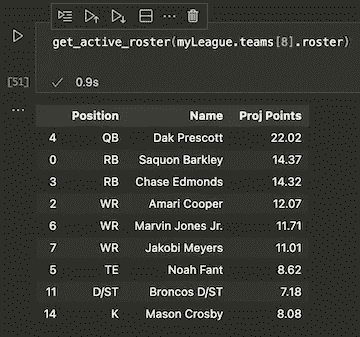
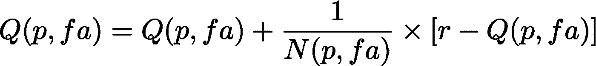
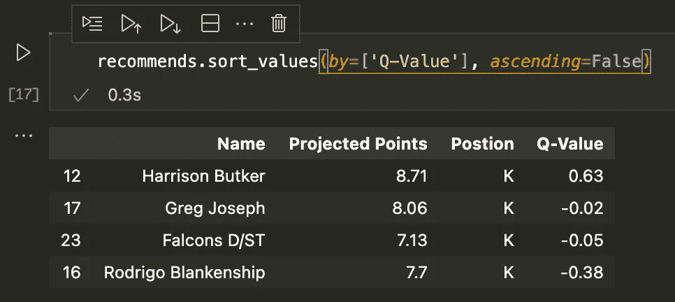

# 幻想与否:强化学习和幻想足球？(第二部分)

> 原文：<https://medium.com/codex/fantasy-or-not-reinforcement-learning-and-fantasy-football-part-2-2a54fbed40a?source=collection_archive---------6----------------------->

## RL 结构和一个简单的多臂 Bandit (MAB)实现

阿米尔·巴舍尔

# 背景

这是两部分系列的第二部分，第一篇文章[在这里](/codex/fantasy-or-not-reinforcement-learning-and-fantasy-football-part-1-9e4de960c891)。在那篇文章中，我提出了使用强化学习(RL)的想法，使用我自己的联盟数据(来自 [ESNP api](https://github.com/cwendt94/espn-api) ，在那里可以找到任何 ESPN 联盟)来推荐阵容。但是现在我们有了几周的数据，我将开始使用实际的 RL 技术。在这篇文章中，我们将坚持一个非常基础的 Multi-Armed Bandit 版本，同时简要地提到更复杂的方法可能会在后面出现。这主要意味着强化学习的练习，而不是试图产生比大多数幻想应用程序内置的有用建议更有意义的结果。

## **系列链接**

[1。幻想与否:强化学习和幻想足球？第 1 部分:将强化学习应用于梦幻足球的介绍和工具](/codex/fantasy-or-not-reinforcement-learning-and-fantasy-football-part-1-9e4de960c891)

2.幻想与否:强化学习和幻想足球？第 2 部分:RL 结构和多臂土匪(当前)

# 方法

## **MAB 简介**

多臂强盗 (MAB)是一个经典的入门 RL 问题，其中一集只是一个动作。介绍性的例子通常是一个代理(或土匪)玩许多老虎机，它必须发现提供最高平均奖励的老虎机。代理在动作之间进行选择，为每个动作形成一个值。在这样的环境中，状态和动作空间是相同的。随着对价值的信心随着足够多的行动而增加，行动选择将收敛到为代理提供最大回报的行动。

我们将设置和更新花名册视为这个问题的一个版本。代理人可以选择任何位置球员与任何自由球员交换。目前，我们忽略交易。(上个星期，我一直处于一个短的结尾…我可以订阅这个！)我们不会等待每周的结果来提供奖励，而是使用预测点数来代替这个初始练习。这很容易从每个玩家的 [ESPN API](https://github.com/cwendt94/espn-api) 中获得。在下一篇文章中，我们将用我们自己的点预测模型替换这个替身。

现在，你可能会注意到，我们可以很容易地对每个位置进行最大化，并迅速得出相同的答案。你可能是对的，但重点是把这当成一个 RL 问题。在下一篇文章中，我们将在这个框架中插入一个更有意义的概率模型。

## **幻想设定**

首先，我们将从我的实际球队名单中形成一个活跃的球员名单。由于我每周只能从总共 16 名球员(2 名 RBs，2 名 WRs，1 名 Flex 和所有其他位置的 1 名)中选择 9 名活跃球员，我需要为每个位置选择每个位置允许数量的最大预计得分者(n)。下面的函数就是这样做的，并返回一个 Pandas 数据帧和结果。注意，对于每个位置,“n”被硬编码为 Pandas 方法“nlargest”的输入。

通过最大化投影点数返回活动玩家名单

这是传入我的完整花名册时返回的数据帧:

现役花名册(基线队)

下一个主要步骤是定义行动空间。我已经生成了每个位置所有球员的数据框架。我将只查询自由球员，并将行动总数设置为可用球员总数。现在，我们将根据[萨顿和巴尔托教科书](http://incompleteideas.net/book/RLbook2020.pdf)第二章中的内容，格式化 MAB 算法的关键方面。首先，我将使用一个二维矩阵来形成 Q 表和 n 表(计算每个州的访问量)。第一个维度是被换出的位置(9 个空位)，第二个维度是该位置要换入的自由球员(每个自由球员的数量不同)。Q 和 n 表被调整到最大的自由代理池，但是我们将用低负值填充不必要的槽，所以它们被我们的动作选择标准忽略。实现在下面的代码片段中。

## 该算法

现在我们终于可以实现算法了。对于奖励，我们将首先使用“基线”活动花名册计算当前的预计总积分。每次交换都会产生一个新的总点数，我们从中减去基线。因此，回报是任何自由球员交换的预期积分提高。现在可能太简单了，但是当我们想要应用我们自己的投影点模型时，这是一个很好的起点。

我们将使用一个基本的 bandit 算法，它存储当前的 Q 值以及访问每个州或采取行动的次数(记住，对于这个 MAB 问题，州和行动是可以互换的)。使用下面的增量更新规则，我们可以连续地估计平均值，即使这个基本版本是确定的。 *Q* 是 Q 表， *N* 是访问量计数器表， *p* 是位置， *fa* 是要换入的自由代理， *r* 是奖励。

增量平均或 MAB 更新规则

这样，我们几乎拥有了实现完整算法的所有部分。我还有一个“get_action”函数，它将接受 E-greedy exploration 的 epsilon 值。如果随机生成的值低于ε，它将返回状态空间中的随机动作。否则，它将选择当前的最大值。由于环境目前是确定的，因为我们每次采取相同的行动都会得到相同的回报计算，所以我们只需要到达每个状态一次(采取每个行动一次)。但是我们已经建立了一个框架，来估计下一次的概率环境。下面，我有算法，运行 1000 集，ε值为 0.3，以确保每个状态空间至少达到一次。

# 结果和结论

## 结果呢

在运行了 1000 集之后，Q 表被完全填充。如果我们在整个表中取 4 个最大的参数，我们可以列出 4 个最高值的动作。在我们的情况下，这是自由球员的替代，提供了最大的增加，或最少的减少，如果没有增加。

来自基本 MAB 算法的顶级自由球员推荐

不出所料，只有一个动作会导致奖励增加，所有前 4 名推荐都是踢球者。如果我还没有达到或者非常接近预计的最高分，我将不会通过简单的自由球员交换来达到目的，从而组建一个劣质的团队。此外，踢球者有较低的点预测，我不会得到很多里程数的交换。因此，从踢球员交换和大量其他自由球员踢球员的角度来看，在我的踢球员下面有一个小的增加。

**结论**

所有这些仍然是微不足道的，用基本数学和许多其他方法很容易得到结果。但是更复杂的 RL 已经准备好了，它在更复杂的环境中会有用得多。人们可以应用神经网络来计算价值，或者形成我们自己的投影点数，作为更稳健结果的概率分布(特别是如果您使用重尾分布来说明一些玩家更可能出现的历史点数增加或减少)。在 ESPN 的应用程序中，这些被称为“繁荣”和“萧条”的概率，或者一个玩家得分远高于或低于他们预计得分的机会。远离简单的正态分布，希望这种模型将使模拟有趣，并阐明为什么把它作为基于模型的 RL 问题是有用的。同样，这可能不会击败你的应用内建议，但它可能会让你更深入地了解投影本身可能来自哪里。

本文代码的完整 Jupyter 笔记本可以在这个[链接](https://github.com/SunayBhat1/Writing-Code/blob/main/Fantasy%20RL%20Series/RL_basic.ipynb)找到。

这篇简单的关于 RL 和 ESPN api python 库的两部分介绍到此结束，我希望你从中找到一些有用的东西！

# 来源:

[1]多臂土匪。维基百科。[https://en.wikipedia.org/wiki/Multi-armed_bandit](https://en.wikipedia.org/wiki/Multi-armed_bandit)

[2]萨顿、理查德 s .和安德鲁 g .巴尔托。2018.*强化学习:简介*。第二版。自适应计算和机器学习系列。麻省剑桥:麻省理工学院出版社。

[3]https://github.com/cwendt94/espn-api EPSN API

**【4】Choudhary，Ankit。强化学习指南:用 Python 从零开始解决多臂土匪问题(2018)[https://www . analyticsvidhya . com/blog/2018/09/reinforcement-Multi-Armed-Bandit-Scratch-Python](https://www.analyticsvidhya.com/blog/2018/09/reinforcement-multi-armed-bandit-scratch-python/)**