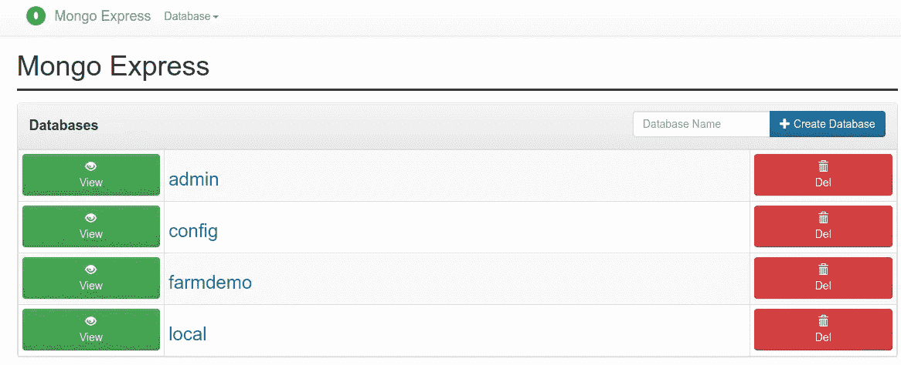
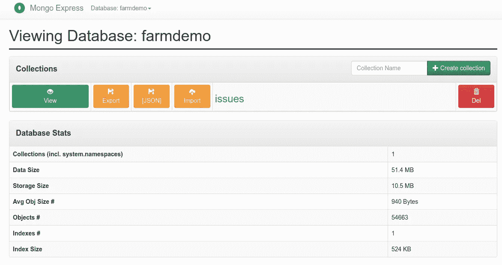
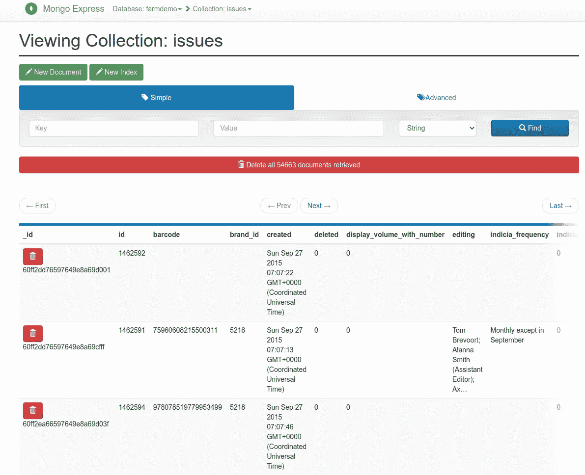

# 使用 Docker Compose 创建一个场栈开发环境——第 1 部分，共 3 部分:MongoDB

> 原文：<https://medium.com/codex/farm-stack-with-docker-compose-part-1-mongodb-54cc65e31636?source=collection_archive---------8----------------------->

# 介绍

今年，我开始利用与 [React](https://reactjs.org/) 前端和 [MongoDB](https://www.mongodb.com/) 数据库(FARM)配对的 [FastAPI](https://fastapi.tiangolo.com/) Python 框架开发应用程序。在之前的开发中，我主要使用 Flask Python 框架，前端使用 JavaScript 库，如 JQuery 和 Handlebars，或者使用 MySQL 数据库的 Jinja 模板。如果我没有使用 Flask 或 FastAPI 这样的后端框架，我就是在帮助一家公司开发他们自己的框架。

我喜欢 FastAPI，因为它内置了一个易于使用的文档框架。文档也是我测试 API 的一种方式。

至于使用 MongoDB 作为数据库，我发现使用 Python 很容易，因为 BSON 文档类似于 dict 类型的对象。此外，在我的职业生涯中，我大部分时间都在使用关系数据库，如 Microsoft SQL Server 和 MySQL，我越来越喜欢通过将所需数据添加到单个文档中来减少标准化的需要。尤其是考虑到存储比我开始职业生涯时更具成本效益。我还发现 MongoDB 聚合管道足以满足基本的报告需求。

至于前端的 React，我必须将它用于我正在构建的一些应用程序集成。例如，Shopify 应用程序使用 Next.js 和 React for applications。

我在装有 Ubuntu Linux 的笔记本电脑上做了很多开发工作。因此，我没有在笔记本电脑上安装这些技术，而是使用 Docker Compose 创建应用程序堆栈。如果我将工作转移到我的 Windows Surface 笔记本电脑上，我可以使用相同的 docker-compose.yml 和相应的文件快速启动并运行。

在这个系列中，我将分享我用 Docker Compose 构建农场栈的经验。本系列的第一部分将重点关注栈的 MongoDB 部分。并且本系列的后续部分将建立在彼此的基础上。

# 你需要什么

## Docker 撰写

您需要在系统上安装 Docker Compose。要在您的系统上安装 Docker Compose，请参考[https://docs.docker.com/compose/install](https://docs.docker.com/compose/install/.)/

## 文字编辑器

您将需要运行您最喜欢的文本编辑器来修改本系列中使用的文件和脚本。任何文本编辑器都可以。在我的 Linux 系统上，我使用 gedit 或 VIM。没有判断。用更容易的。

## GitHub 知识库

您可以剪切并粘贴本演示中的代码。您也可以直接从我的 GitHub 库下载本教程中使用的代码。这个库可以从 https://github.com/chupati/farm-part-1 的[克隆而来。](https://github.com/chupati/farm-part-1)

# 运行堆栈的 MongoDB 部分

一旦你从[https://github.com/chupati/farm-part-1](https://github.com/chupati/farm-part-1)下载了这个库，你可以在你的终端或者命令提示符下输入下面的命令。您必须位于与文件“docker-compose.yml”相同的目录中

`docker-compose up`

您可以使用上面的命令开始运行，而无需进一步阅读本系列。要通过浏览器访问数据库，请转到 [http://localhost:8081](http://localhost:8081)

我将在下面讨论 GitHub 库的组件，这样你就可以参考 MongoDB 堆栈的每个部分的功能。

# Docker 编写配置文件

文件“docker-compose.yml”是用于运行堆栈的指令。在这一部分中，我们将重点关注“docker-compose.yml”文件的 MongoDB 部分。“docker-compose.yml”文件的源代码可以在[https://github . com/chupati/farm-part-1/blob/main/docker-compose . yml](https://github.com/chupati/farm-part-1/blob/main/docker-compose.yml)中找到。您也可以剪切并粘贴以下部分的内容。

## docker-compose.yml 的源代码

```
version: '2'
services:
  mongo:
    image: mongo
    restart: always
    environment:
      MONGO_INITDB_ROOT_USERNAME: root
      MONGO_INITDB_ROOT_PASSWORD: OTNmYTdjYmZkMjE5ZmYzODg0MDZiYWJh
    volumes:
      - ./data/mongo:/data/db
      - ./data/mongo-init:/docker-entrypoint-initdb.d
    ports:
      - "27017:27017"
  mongo-express:
    image: mongo-express
    restart: always
    ports:
      - 8081:8081
    environment:
      ME_CONFIG_MONGODB_ADMINUSERNAME: root
      ME_CONFIG_MONGODB_ADMINPASSWORD: OTNmYTdjYmZkMjE5ZmYzODg0MDZiYWJh
```

## 版本

我选择用于这个栈的 Docker Compose 配置的版本是 2。这由文件的第一行表示。您可以在[https://docs . docker . com/compose/compose-file/compose-file-v2/](https://docs.docker.com/compose/compose-file/compose-file-v2/)找到关于该特定版本的文档。

***版本配置:***

```
version: '2'
```

## 服务

我们将在这里放置 MongoDB 部分的配置。我们将为 MongoDB 运行两个服务。这些服务被称为“mongo”和“mongo-express”。服务“mongo”是栈中实际的 MongoDB 部分。服务“mongo-express”是用于方便的 web 用户界面，可以用来连接到 MongoDB 服务器。如果您熟悉 MongoDB，您可以使用您首选的 MongoDB 客户端。

## 图像

每个服务的图像部分将确保我们使用来自公共 Docker hub 存储库的“mongo”和“mongo-express”图像。mongo 的图片可以在 https://hub.docker.com/_/mongo 的[找到，mongo-express 的图片可以在 https://hub.docker.com/_/mongo-express 的](https://hub.docker.com/_/mongo)[找到。](https://hub.docker.com/_/mongo-express)

***蒙哥服务形象配置:***

```
image: mongo
```

***Mongo-Express 服务镜像配置:*** 安装

```
image: mongo-express
```

## 重新开始

对于“mongo”和“mongo-express”服务,“重启”选项将设置为“始终”。这将确保服务在失败时重新启动。

```
restart: always
```

## 环境

我们使用环境变量来保存数据库用户名和密码的值。您可以在上面列出的“mongo”和“mongo-express”Docker hub 映像 URL 中获得环境变量列表。

***Mongo 服务环境配置:***

```
environment:
 MONGO_INITDB_ROOT_USERNAME: root
 MONGO_INITDB_ROOT_PASSWORD: OTNmYTdjYmZkMjE5ZmYzODg0MDZiYWJh
```

***Mongo-Express 服务环境配置:***

```
Initial Installationenvironment:
 ME_CONFIG_MONGODB_ADMINUSERNAME: root
 ME_CONFIG_MONGODB_ADMINPASSWORD: OTNmYTdjYmZkMjE5ZmYzODg0MDZiYWJh
```

**港口**

这个环境将确保 MongoDB 端口 27017 和 Mongo-Express 端口 8081 都是公开的，并且可以在主机上使用。

***Mongo 服务端口配置:***

```
ports:
  - "27017:27017"
```

***Mongo-Express 服务端口配置:***

```
ports:
  - 8081:8081
```

## 卷

为了确保 MongoDB 数据的持久性，我们映射了主机上存储 MongoDB 数据的目录。在我们的例子中，我们将使用存储库的“data/mongo”。如果您没有映射一个卷来存储数据，那么“mongo”服务容器将在每次重新启动时没有数据。

我们还将把一个安装目录映射到“mongo”服务中的“/docker-entrypoint-initdb.d”目录。这个目录包含一个安装脚本，该脚本运行“mongoimport”将初始数据安装在一个压缩数据文件中，该文件每行包含 JSON 条目。我们一会儿将进入初始安装。

***Mongo 服务卷配置:***

```
volumes:
  - ./data/mongo:/data/db
  - ./data/mongo-init:/docker-entrypoint-initdb.d
```

# 初始安装

安装与运行服务是一样的。您只需在终端或命令提示符下键入以下内容。

```
docker-compose up
```

如果没有检测到“data/mongo”目录，那么将运行脚本文件 data/mongo-init/install.sh。安装脚本可以在[https://github . com/chupati/farm-part-1/blob/main/data/mongo-init/install . sh](https://github.com/chupati/farm-part-1/blob/main/data/mongo-init/install.sh)中找到。

***data/mongo-init/install . sh 的源代码:***

```
echo IMPORTING COLLECTION
tar -xzvf /docker-entrypoint-initdb.d/issues.tar.gz — directory /tmp
mongoimport — authenticationDatabase=admin --username=$MONGO_INITDB_ROOT_USERNAME --password=$MONGO_INITDB_ROOT_PASSWORD --db=farmdemo --collection=issues --file=/tmp/issues.json
echo “CLEANING UP”
rm /tmp/issues.json
echo DONE IMPORTING
```

文件“data/mongo-init/issuse.tar.gz”将被解压缩，并使用上面安装脚本中的“mongoimport”命令导入。“mongoimport”命令将数据定向到“farmdata”数据库和“issues”集合。

当您运行该脚本时，当您查看 docker-compose 命令输出时，您应该会看到类似下面的一行。Docker 合成输出中有很多数据，因此很容易被遗漏。

> 2021–07–29t 16:58:02.897+0000 54663 文档已成功导入。0 个文档导入失败。

## 数据描述

为了处理初始数据，我创建了一个导入文件，其中包含 2015 年至 2021 年出版的选定漫画出版商的问题。数据是在[https://www.comics.org/](http://www.comics.org)从“伟大漫画”数据库下载的。

数据文件位于“data/mongo-init/issues.tar.gz”。导入数据会创建一个名为“farmdemo”的数据库，集合“发布”在该数据库中。

# 结果

Docker 容器全部运行后，您可以访问位于 [http://localhost:8081](http://localhost:8081) 的 MongoDB 服务用户界面。

页面加载后，您将看到“farmdemo”数据库。如果您单击数据库，您将看到已经为您加载了“问题”集合。在本系列的下一部分中，当我们讨论我们正在构建的 Docker Compose FARM 堆栈的“FastAPI”部分时，我们将使用“issues”集合。本系列的第二部分即将推出，将重点关注 FARM 栈的 FastAPI 部分。

***MongoDB Mongo-Express Web 界面:***



***Mongo-Express Web 界面 farmdemo 数据库页面:***



***Mongo-Express Web 界面问题集合页面:***

