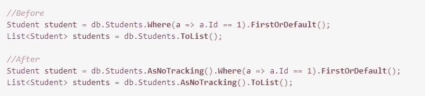
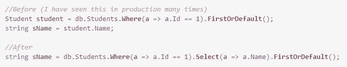
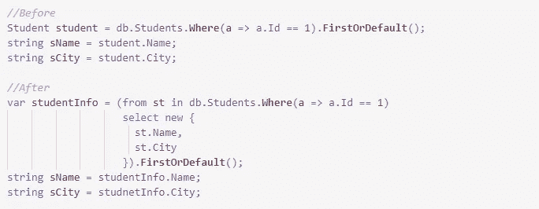
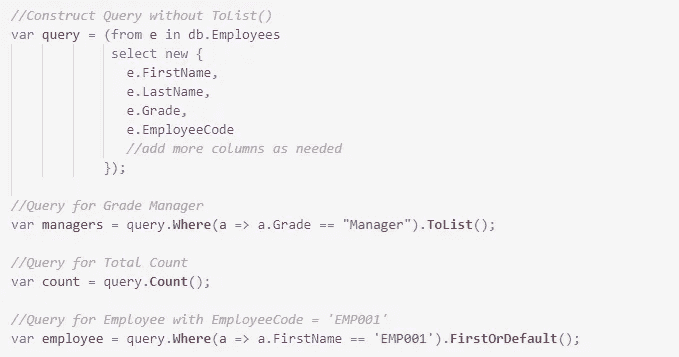
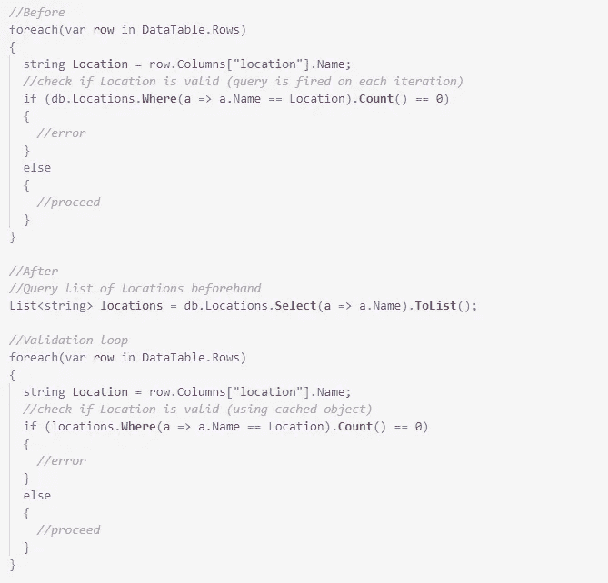

# 实体框架中的快速高效内存查询

> 原文：<https://medium.com/codex/fast-and-memory-efficient-querying-in-entity-framework-ebf906d9e6cb?source=collection_archive---------4----------------------->

有一些简单而有用的方法可以加速我们的实体框架查询。我们只需要知道什么时候用什么。


我正在给一个公司客户做演示，展示一个新软件开发的计划。他们的 IT 人员询问了我们将用于数据库操作的技术堆栈。我的回答是 SQL Server +实体框架。他吓坏了！他担心性能问题，因为数据库将会非常庞大。因为他不是一个软件人，他的看法是基于他从别人那里听到的。他没有 100%错，但是有些信念需要被挑战。

我向他保证，实体框架的性能并不像他可能听说的那样差，而且很大程度上取决于编写代码的团队/个人。我向他解释了我将在本文中涉及的一些技巧。经过深入的讨论，我能够让他相信 EF(实体框架)比大多数人知道和使用的要多得多。这个应用程序在几个月之后就部署好了，并且从那以后一直运行得很顺利，每天都有大量的数据涌入和流出。

这里有一些易于使用的技巧来提高实体框架的性能:

# 使用 AsNoTracking()

每次我们使用 EF 调用一个实体或列表，EF 都会通过将对象存储在内存中来跟踪它们。每当我们打电话给 db。SaveChanges()，EF 确定这些更改以生成要触发的查询。这是正常的行为，没什么特别的。

然而，在很多情况下，我们查询数据的目的是只读的。在这种情况下，我们不希望实体框架跟踪变化。我们通过在表名后添加**asnottracking()**来实现这一点。这减少了内存消耗并加快了执行速度。你可以这样做:



在实体框架查询中使用 AsNoTracking()

# 选择单列

我见过很多代码，人们查询整个对象，而他们只需要一个列值。例如，我们可能需要根据 StudentId 查询学生的姓名。让我们来看看如何做到这一点:



从实体中选择单列

这非常有用，尤其是当底层对象有很多列时。使用。Select()使 EF 只使用 SELECT 语句中的一列来构造查询。

# 选择多列

有些情况下，您可能需要不止一列，但仍然不需要整个对象。在这些情况下，只查询必需的列而不是查询整个对象是有意义的。



选择导致复杂类型实体的多个列

# 无需代码重复的按需查询

有些情况下，出于不同的目的，我们需要多次查询同一个表。例如，您可能需要获取等级为“经理”的员工列表，但您还需要员工总数。

通常情况下，我们会使用 Grade == "Manager "来执行一个查询，然后在没有任何过滤器的情况下执行另一个查询来计算雇员总数。

或者，您可以准备查询语句，而不使用。ToList()或。Count()或。查询末尾的 FirstOrDefault()。当您这样做时，不会对数据库触发查询。你可以多次使用这样生成的对象进行过滤、排序等。

虽然这可能不会为您节省另一次查询往返，但是可以简化代码并促进重用。



无需添加即可重复使用查询。ToList()

# 预先缓存对象

这是一个稍微复杂的案例，但值得注意，因为好处是巨大的。

假设我们的用户上传了一个 excel 文件来导入员工列表。excel 中的一列是 Location，我们需要在 Locations 表中检查用户输入的值是否有效。

位置表

```
+------------------------------------+
| Name             | State           |
+------------------------------------|
| Head Office      | Delaware        |
| Branch Office    | Wisconsin       |
+------------------------------------+
```

我们已经读取了 excel 文件，并将数据保存在数据表中。在添加雇员记录之前，我们遍历数据表中的行并验证每一行中的数据。

我们可以在循环之外获取位置列表并进行检查，而不是通过在循环内部查询来检查位置有效性。这将只触发一次位置查询，而不是每次循环迭代都触发自己的查询。



预先缓存对象以供重复使用

如果循环很长，这可以节省大量的数据库往返，并产生很好的结果。

我目前只有这些了。我希望这些技巧能帮助你在下一个项目中写出更好更有效的代码。如果你知道更多这样的建议，请在评论中分享，这样我们可以互相学习。

为了阅读我所有的故事，以及媒体上成千上万的其他作家，考虑选择媒体会员。如果你[使用我的链接](https://prashantio.medium.com/membership)加入，我将从你的加入费中获得佣金。祝你好运！