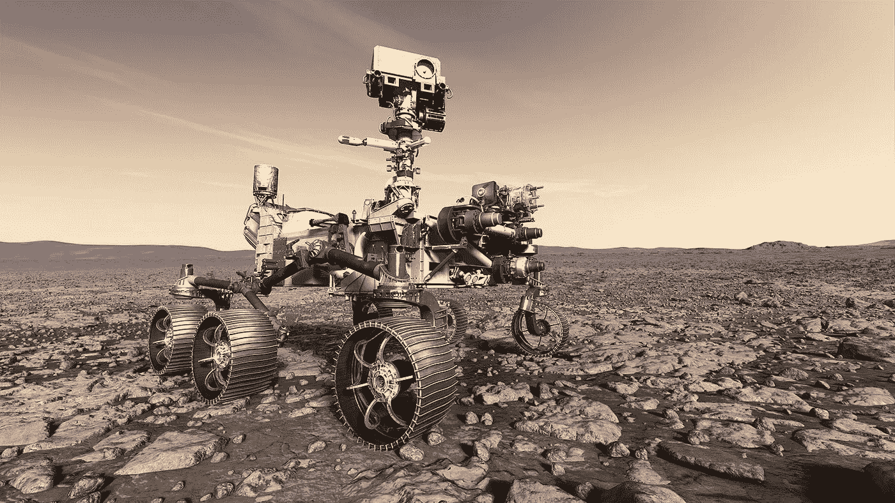

# “快速、廉价、失控”:罗德尼·布鲁克斯如何改变人工智能

> 原文：<https://medium.com/codex/fast-cheap-and-out-of-control-how-rodney-brooks-transformed-ai-3ace192f9a67?source=collection_archive---------17----------------------->

美国宇航局/JPL 加州理工学院提供的美国宇航局火星 2020 探测器的艺术家再现

也许你有一个 Roomba，一个小型自主真空吸尘器机器人，可以在没有监督的情况下清洁地板，或者你可能关注火星漫游者的发展，这是一种帮助绘制火星表面并进行一系列实验的机器人车辆。这两个项目之间有什么联系？

制造 Roomba 的 iRobot 公司是罗德尼·布鲁克斯的联合创始人，他也参与了多年来在火星上进行实验的 Rover 系列机器人。

罗德尼·布鲁克斯出生于 1954 年，是澳大利亚机器人专家、作家和企业家，曾任麻省理工学院机器人学教授和计算机科学与人工智能实验室主任。布鲁克斯是机器人公司 iRobot、Rethink Robotics 和 Robust AI 的联合创始人。

布鲁克斯在澳大利亚的阿德莱德长大，对技术和机器人很感兴趣，由于远离任何技术中心，他不得不学习自己组装原始电脑来玩游戏。1968 年，他看了电影《T2 2001:太空漫游》，他被电影中描绘的计算机哈尔迷住了。当读到麻省理工学院教授马文·明斯基是该片导演斯坦利·库布里克的顾问时，他决定要进入麻省理工学院。

在获得澳大利亚弗林德斯大学的数学硕士学位和斯坦福大学的计算机科学博士学位后，他两次申请麻省理工学院的研究职位，但都被拒绝，然后获得了人工智能和机器人专业的任命。

布鲁克斯认为，行为研究更适合机器人学，而不是将计算视为人工智能的指导概念。

1989 年，他与安妮塔·m·弗林(Anita M. Flynn)合著了一篇名为“**快速、廉价和失控:机器人入侵太阳系**”的论文，描述了机器人技术的一种替代方法——能够从环境中学习的自主机器人。论文提出了可用于太空任务的不同类型的机器人，从可以自己行走的六足机器到 1 到 2 公斤重的小型自主漫游车。这些机器人将能够模仿蚁群的组织，减少任务中发生事故或失败的几率。

1997 年，Brooks 和他的工作出现在埃罗尔·莫里斯的一部纪录片中，这部纪录片的标题也是“快速、廉价、失控的 T8”。

在这部电影中，布鲁克斯说:“*我喜欢观察每个人在做什么，找到一些他们都在含蓄地假设但他们甚至没有意识到他们在假设的共同事物，然后否定那个事物……我看过昆虫行走的录像带，它们甚至都不稳定。他们一直在摔倒。这就是我要否定的东西。每个人都含蓄地假设一个行走的机器必须有稳定性，所以我否定了这一点。我说，让我们有一个行走的机器，它甚至不用担心稳定性，它能够倒下。*

在 Brooks 早在 1989 年发表的论文《大象不会下国际象棋(T3)》中，Brooks 已经指出，与其他脊椎动物在大约 4 . 5 亿年中积累的经验相比，人类在大约 20，000 年的历史中收集的智力相对“微不足道”。根据布鲁克斯的说法，机器人根据“专家”人类远程发送的指令在其他星球的未知地形上导航，不可能胜过公山羊的技能，这是数百万年的经验形成的。

从 1997 年被任命为麻省理工学院人工智能研究实验室主任到 2010 年退休，布鲁克斯和他的学生为广泛的项目设计了机器人，从火星漫游者到为清理雷区而设计的机器人。

根据**连线**(1997 年 7 月 25 日太空中**看到他的工作)中的一篇文章，最终，罗德尼·布鲁克斯基于行为的机器人技术的一些应用被美国国家航空航天局用于火星漫游者。然而，美国宇航局仍然倾向于通过喷气推进实验室的科学家传输的远程命令来驱动旅居者号。**

布鲁克斯目前正专注于他的公司 Robust AI 的工作，该公司为非结构化环境设计机器人。最近，他展示了他的机器人在伊拉克寻找和拆除街道人行道上的炸弹的例子，或者在福岛核反应堆高辐射环境中充满碎石的空间中移动的例子。

在最近接受《IEEE Spectrum》**(**[**【https://www.youtube.com/watch?v=yiOFMg3cnn0】**](https://www.youtube.com/watch?v=yiOFMg3cnn0)**)**杂志采访时，布鲁克斯谈到了人工智能的未来:“*很难对人工智能机器的本质做出长期预测，就像很难对电子产品做出长期预测一样……许多技术专家看到了两种可能的结果之一， 要么一切都完蛋了，我们制造的机器只想接管一切……要么这些机器会让生活变得美好，我们都会写诗，吃葡萄，生活会变得美好。 没有事情会像我们期望的那样糟糕，也没有事情会像我们期望的那样好，我认为它会在中间的某个地方。*”