# 利用统一网络快速定位文本(FOTS)

> 原文：<https://medium.com/codex/fast-oriented-text-spotting-with-a-unified-network-fots-ac5626c81f33?source=collection_archive---------5----------------------->

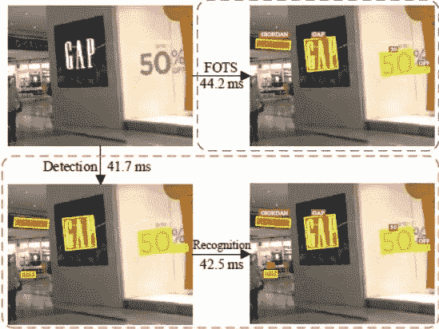

由于在文档扫描、机器人导航和图像检索等领域的实际应用，从图像中检测和识别文本(也称为文本定位)是深度学习研究人员多年来一直在研究的一个非常有用和具有挑战性的问题。迄今为止，几乎所有的方法都包括两个独立的阶段:1)文本检测 2)文本识别。文本检测只是找出文本在给定图像中的位置，根据这些结果，文本识别实际上从文本中识别字符。由于这两个阶段，需要训练两个独立的模型，因此预测时间有点长。由于测试时间较长，这些模型不适合实时应用。与此相反，FOTS 通过同时检测和识别文本，使用统一的端到端可训练模型/网络来解决这个两阶段问题。它在文本检测和识别任务之间使用共享的卷积特征，学习更多的通用特征并改进测试时间，使得它可以在实时应用中有用，例如从较高 FPS 的视频流进行 OCR。FOTS 还改进了对具有对齐/旋转文本的场景的文本检测，因为它有一个名为“RoIRotate”(感兴趣区域旋转)的特殊组件，该组件通过保持纵横比不变来旋转对齐的文本，然后应用文本识别。

# 内容

1.  商业问题
2.  ML 问题公式化
3.  用于问题的损失
4.  数据来源和概述
5.  电子设计自动化(Electronic Design Automation)
6.  数据生成
7.  模型
8.  模特培训
9.  部署
10.  结论
11.  未来的工作
12.  参考

# 1.商业问题

在计算机视觉领域，阅读自然图像中的文本已经引起了越来越多的关注。由于这个问题是计算机视觉和自然语言处理的结合，它在文档分析、场景理解、机器人导航、图像检索、自动驾驶汽车等方面有着广泛的实际应用。。这也是最具挑战性的任务之一，因为现实生活中的图像文本有不同的字体、大小/比例和对齐方式。此外，它必须在有限的时间限制。这个问题试图在几秒钟内找到文本。

# 2.ML 问题公式化

从自然图像中提取文本的问题可以表述为两个阶段的过程:1)文本检测/定位 2)文本识别。文本检测可以进一步公式化为边界框回归和文本的每像素分类(无论该像素是否是文本的一部分)。FOTS 结合了这两个阶段，并允许训练一个端到端的模型，以最小的损失进行准确的文本检测和识别。

# 3.用于问题的损失

文本检测有两个损失:骰子损失和 IoU 损失

## 骰子损失

了解清晰边界检测的骰子损失。为什么骰子损失是比交叉熵损失好得多的选择？当使用交叉熵损失时，标签的统计分布在训练准确性中起着很大的作用。标签分布越不平衡，训练就越困难。虽然加权交叉熵损失可以缓解这一困难，但改善并不显著，也没有解决交叉熵损失的本质问题。在交叉熵损失中，损失被计算为每像素损失的平均值，并且每像素损失被谨慎地计算，而不知道其相邻像素是否是边界。因此，交叉熵损失只考虑微观意义上的损失，而不是全局考虑，这对于图像级预测是不够的。现在骰子损失考虑像素是否是边界。

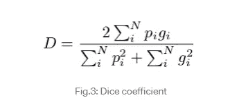

这里，pi 表示预测边界框，g_i 是地面实况。pi 和 g_i 的值将是 1 或 0，这意味着像素是否是边界。因此，分母是预测的和地面真实的总边界像素，分子是正确预测的像素的总和，因为它仅在 pi 和 g_i 与 1 匹配时增加。

## 欠条损失

在目标检测任务中，我们试图引导计算机在给定的图像数据中预测目标及其位置。为了实现这一点，我们试图制定一种机制，通过用“矩形”符号(通常称为边界框)包围一个对象来模仿“定位”该对象的行为。这些边界框，通常标注为 4 点值，表示边界框坐标的特定角点/中心点或其宽度/高度。注释的常用格式是(左、上、右、下)、(左、上、宽、高)或(center_x、center_y、宽、高)。因此，用于对象检测任务的深度学习被专门设计成通过对定位部分进行回归来预测与这些点相关的值。早期基于 Ln 范数的损失被用作成本函数。因此，Rezatofighi 等人在 2019 年提出了第一种基于 IoU 的包围盒回归损失方法。公式是:

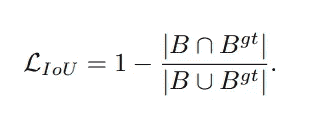

## 文本识别丢失— CTC 丢失

CTC 损失

CTC 丢失:CTC 代表连接主义时间分类。模型如何在输入和输出之间对齐以定位图像中的每个字符并将它们转换成文本？这就是反恐委员会发挥作用的地方。CTC cost 函数允许 RNN 生成如下输出:CTC 在字符之间引入空白标记来分隔它们，它这样做是为了分隔单个字符，以便没有空白标记的重复字符将折叠成一个字符。为了计算 CTC 损失，在每个时间戳，网络输出可能标签值的概率分布。如果我们独立地随机选择任何一个标签，这将给出一个坍塌成地面真理的输出序列的可能性有多大。CTC 损失是这个概率的负对数

# 4.数据来源和概述

为了训练端到端 FOTS 模型，如原始论文所建议的，应使用以下数据集:

[SynthText 数据集:](https://www.robots.ox.ac.uk/~vgg/data/scenetext/)这是一个合成生成的数据集，其中 word 实例被放置在自然场景图像中，同时考虑到场景布局。这是一个非常大的数据集，包含 80 万张不同文本的图片。

[ICDAR-2015](https://iapr.org/archives/icdar2015/index.html?p=254.html) 数据集:这是真实世界的数据集，包含来自可穿戴相机的图像。与 SynthText 数据集相比，该数据集相对较小(只有 1000 个训练图像)。

由于 SynthText 数据集足够大，该论文建议在其上训练整个模型，然后适应真实世界的图像，该模型可以在 ICDAR-2015 数据集上进行微调。

# 5.探索性数据分析

*让我们先来看看 SynthText 数据集:*

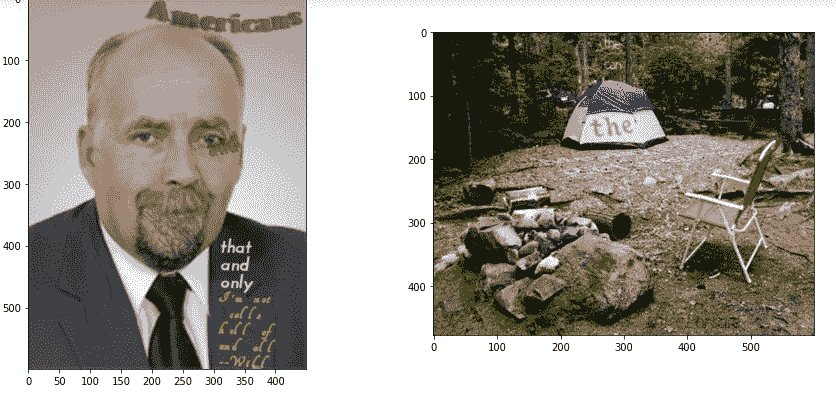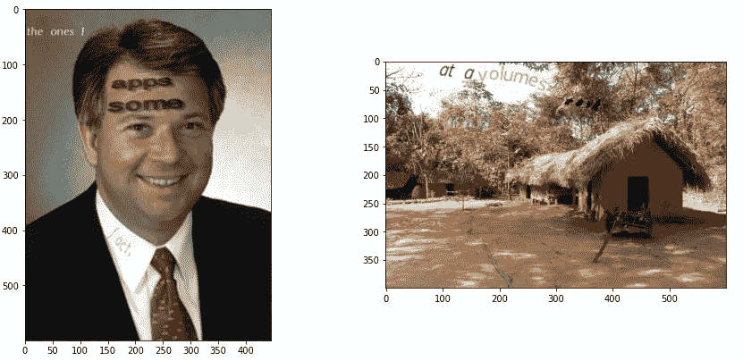

**观察:**

1.  随机文本写在图像的随机位置。

2.每个图像的像素大小都不同。

***先说图像的宽度***

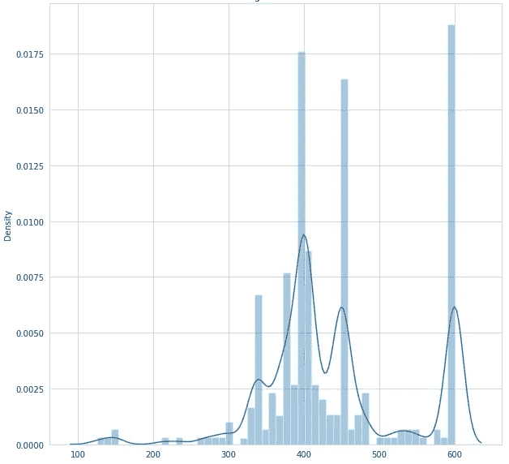

宽度直方图

**观察:**

1.  大多数图像的宽度在 300 到 500 之间。
2.  很少有图像的宽度达到或超过 600。
3.  宽度小于 315 的图像大约不到 20%。

***现在身高特征***

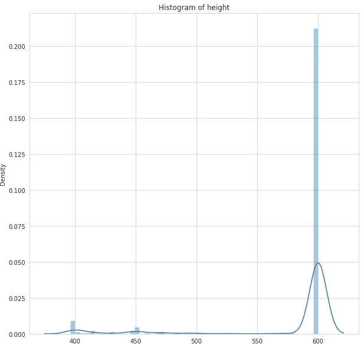

**观察:**

1.  大多数图像的高度为 600 或更高。
2.  很少有身高低于 400 的图片。

***现尺寸特征:***

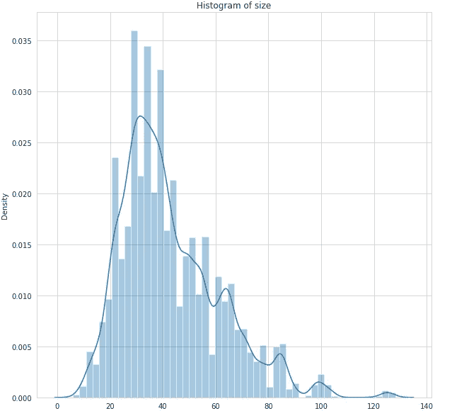

**观察:**

1.  大多数图像的大小在 20 到 80 之间。
2.  所有图像的平均大小是 40 字节
3.  很少有图像的尺寸大于 80。

***可视化图像上的边界框***

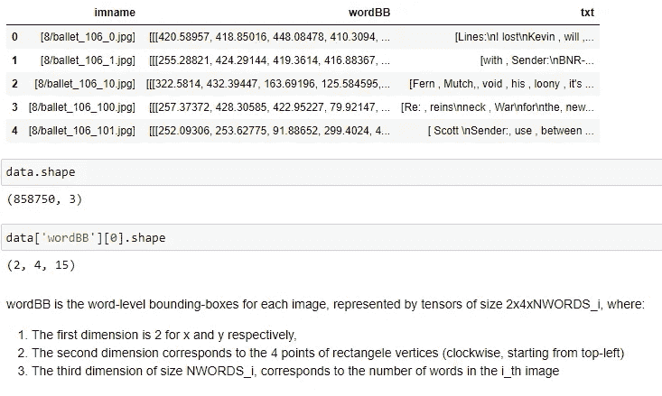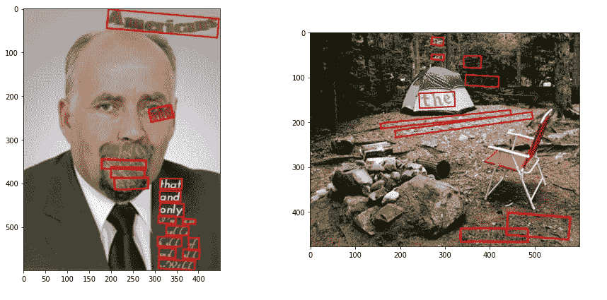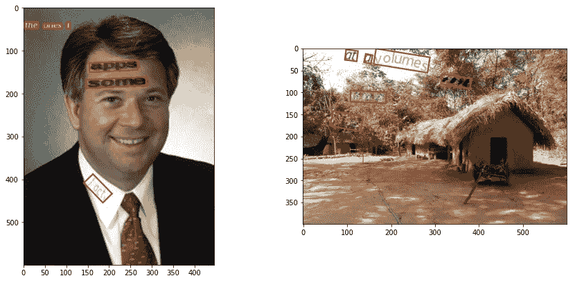

***包围盒上的 EDA***

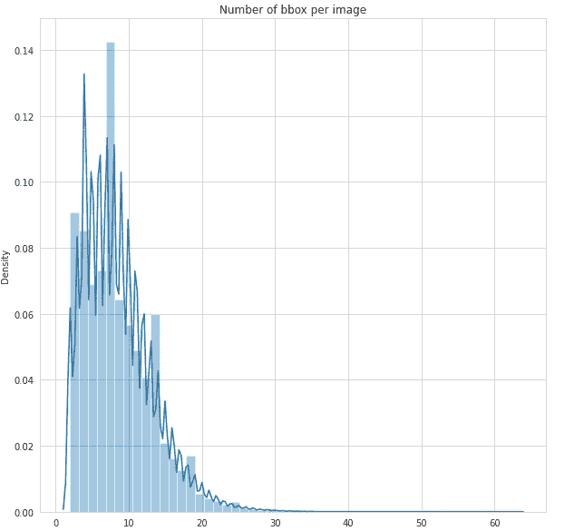

**观察:**

1.  大多数图像的边界框数量少于 15 个。
2.  大约 95%的图像具有不到 20 个边界框。
3.  每个图像的边界框的平均数量大约是 9。

***边框宽度:***

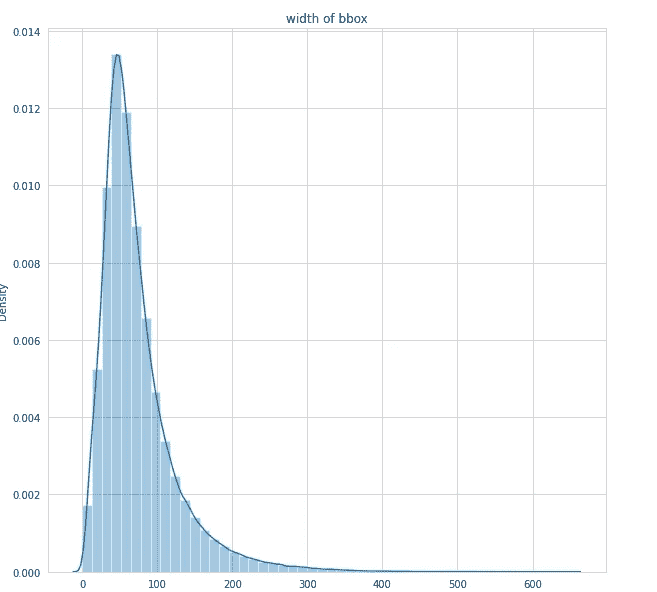

**观察:**

1.  大多数边界框的宽度在 50 到 200 之间。
2.  大约 90%的图像的边界框宽度小于 180。
3.  边界框的平均宽度是大约。80

***边框高度:***

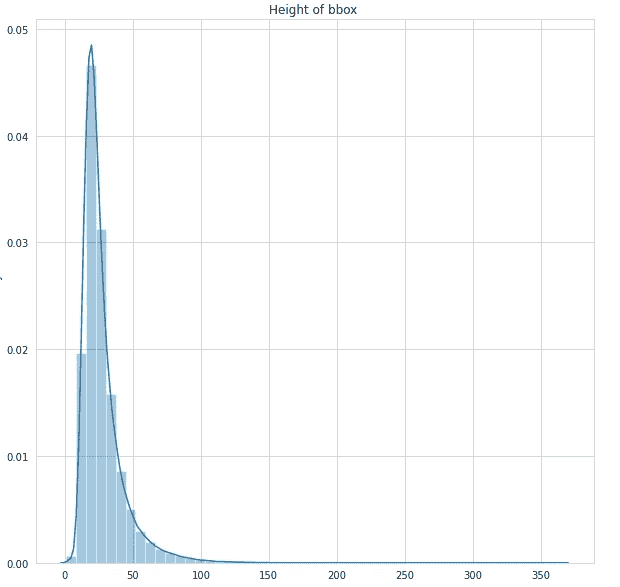

**观察:**

1.  大多数边界框的高度在 20 到 50 之间。
2.  高度大于 50 的边界框很少。
3.  边界框的平均宽度是大约。30

***包围盒大小:***

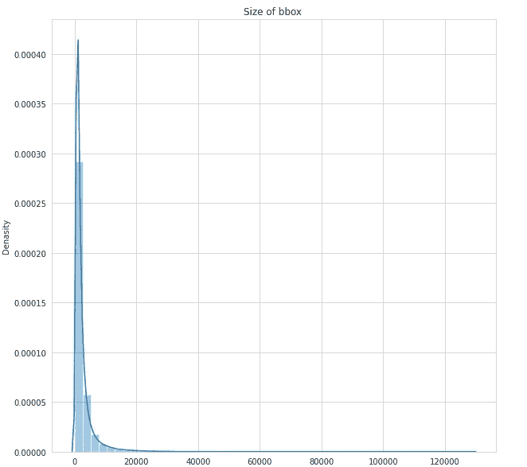

**观察:**

1.  大多数边界框的面积小于 20000。
2.  很少有边界框的面积大于 20000。
3.  边界框的平均面积约为。5000

*IC Dar 15 数据集上的 EDA*

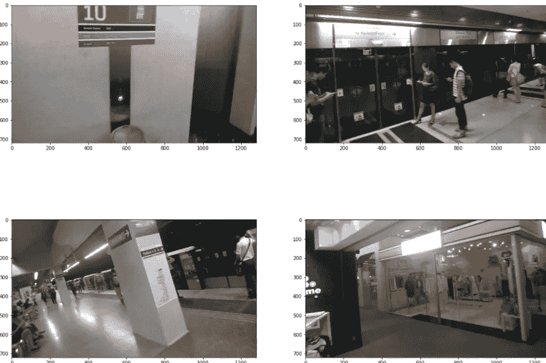

**观察:**

该 icdar 数据集包含宽度为 720、高度为 1280 的所有图像。这些也是真实世界的图像，与 SynthText 数据集相比，背景有些模糊，不太清晰。

**用边界框可视化图像**

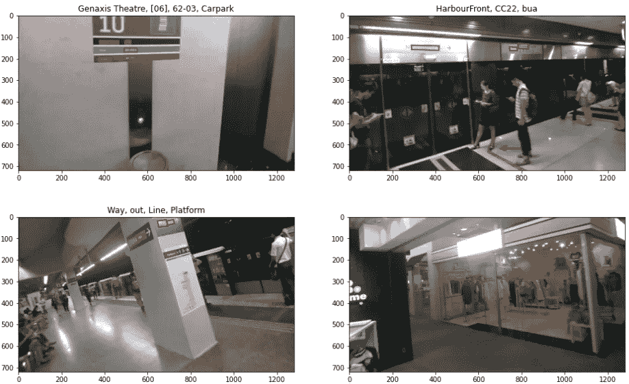

***每幅图像的包围盒数量:***

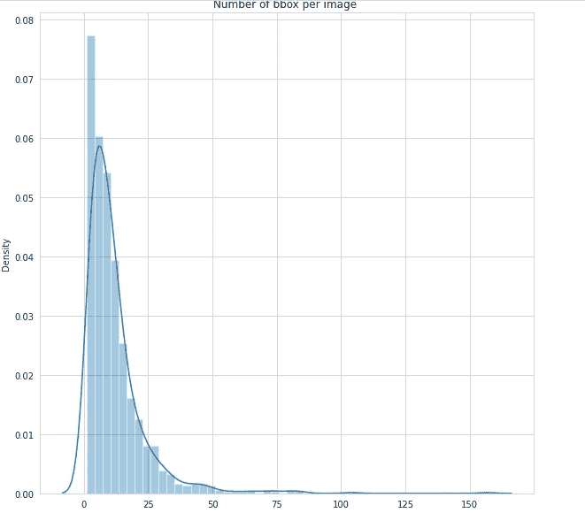

**观察:**

1.  每幅图像的边界框大多在 1 到 25 之间。
2.  大约 90%的焊接盒低于 30。
3.  每幅图像的平均边界框数量约为..8.

***边框宽度***

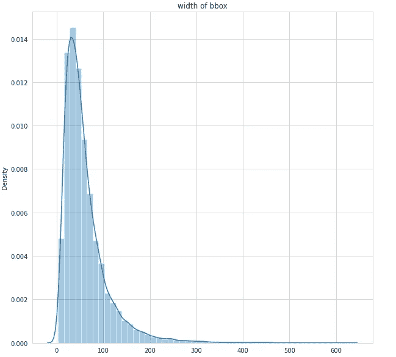

**观察:**

1.  大多数边界框的宽度在 30 到 100 之间。
2.  大约 95%的焊接盒低于 150。
3.  所有图像的平均宽度约为。60

**边框高度:**

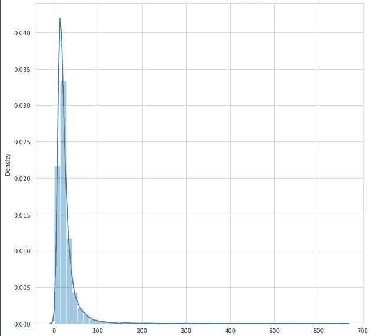

Bbox 的高度

**观察:**

1.  大多数边界框的高度在 10 到 60 之间。
2.  很少有宽度超过 60 的。
3.  所有边界框的平均高度约为。40
4.  大多数边界框的高度几乎相同。

***边框尺寸:***

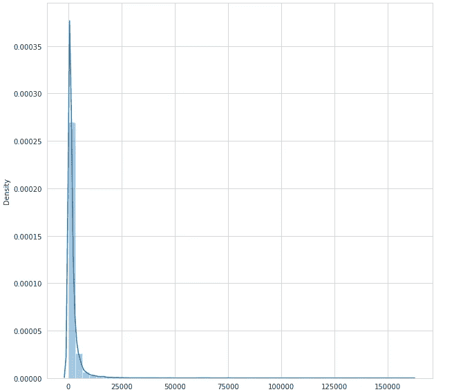

**观察:**

1.  大多数边界框的大小为 5000。
2.  很少有宽度超过 15000 的。
3.  几乎所有的边界框都有相同的大小。

# 6.数据预处理/地面实况生成

**用于文本检测的数据发生器**

为了训练 FOTS 模型的文本检测组件，需要为每个基本事实图像生成以下基本事实遮罩/图像。

1.  分数图:这是一个图像通道，表示给定图像中每个像素的像素是文本的一部分还是背景的一部分。以下是地面实况得分图和相应图像的示例:
2.  地理图:地理图包含 5 个遮罩/通道:对于作为文本一部分的每个像素，前 4 个通道预测其到包含该像素的边界框的顶部、底部、左侧、右侧的距离，最后一个通道预测相应边界框的方向。以下是这 5 个地理地图通道的可视化，以及相应的地面实况:
3.  训练遮罩:这是单通道图像，用于忽略非常小的边界框和没有来自训练和损失计算过程的抄本的边界框。

因此，在训练模型之前，必须生成以下基本事实:1)得分图，2)地理图，3)训练掩码，4)文本抄本，5)边界框列表

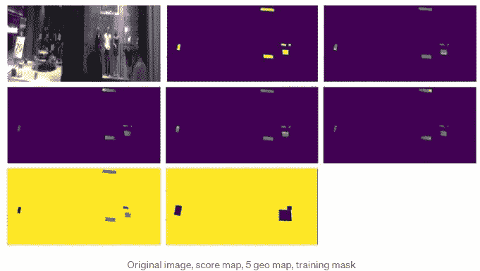

**数据生成器 FOT 文本识别**

在文本识别模型中，我们创建了两个生成器(训练和测试)。我们已经将图像转换为大小(64，128，3)，并将特定单词图像的单词转换为大小为 23 的矢量。在这里，我们为这些向量创建了词汇表，其中包含了构成一个单词的所有可能的字符。

# 7.建模

## FOTS 的整体建筑

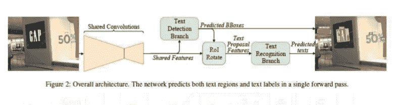

*共享卷积:*

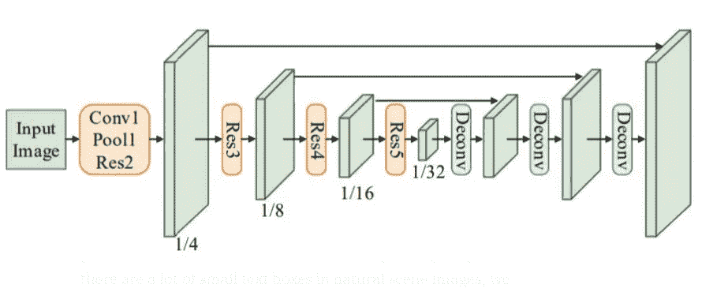

为了从图像中提取高级特征，使用共享卷积，这些卷积在图像网上预先训练，并使用 [Resnet50](https://iq.opengenus.org/resnet50-architecture/#:~:text=ResNet50%20is%20a%20variant%20of,explored%20ResNet50%20architecture%20in%20depth.) 作为其主干。共享卷积是其中共享相同权重的卷积层。上图显示了共享卷积的架构，其中第一个橙色块包含一个卷积层，随后是 max pool 层，最后是 resnet50 层。其他橙色块包含唯一的 resnet50 层架构。浅绿色块是相应块的输出要素。蓝色块是解卷积块，对相应的输出特征执行解卷积。由于自然场景图像中有许多小文本框，我们在共享卷积中将特征图从原始输入图像的 1/32 放大(解卷积)到 1/4。即它对输入特征进行上采样并增加图像或特征的大小。整个体系结构中使用的激活函数是 ReLu。另请注意，低级功能与高级功能地图直接相连，在上图中显示为黑色箭头。

*文本检测分支:*

对于文本检测分支，采用了高效且[准确的场景文本检测器(EAST )](https://arxiv.org/abs/1704.03155) 研究论文中的思想，其中文本检测分支使用全卷积网络作为文本检测器。这些卷积层具有用于分数图和地理图 5 个通道。一旦边界框由文本检测器分支提出，位置感知 NMS(非最大抑制)将被用于获得具有高于地面真实边界框的最高 IoU 的边界框。

下面是实现检测层的代码片段。

检测支路损耗代码:

*RoIRotate(感兴趣区域旋转):*

RoIRotate 对定向/对齐的特征区域应用变换，以获得轴对齐的特征图。ROI 使用双线性插值来计算输出值。该操作避免了 RoI 和提取的特征之间的不对准，此外，它使得输出特征的长度可变，这更适合于文本识别。这个过程可以分为两步。首先，仿射变换参数通过文本提议的预测或地面真实坐标来计算。然后，对每个区域的共享特征图分别进行仿射变换，得到文本区域的标准水平特征图。

这是 RoIRotate 过程的直观视图

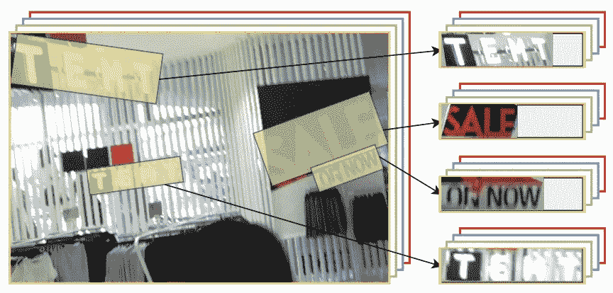

注意，上图只是为了形象化。RoIRotate 的实际实现对通过共享卷积而不是原始图像提取的特征图进行操作。

*文本识别分支:*

文本识别分支旨在使用由共享卷积提取并由 RoIRotate 变换的区域特征来预测文本标签。考虑到文本区域中标签序列的长度，LSTM 的输入特征仅通过原始图像沿宽度轴的共享卷积而减少两倍。否则，紧凑文本区域中的可辨别特征，尤其是窄字符的特征将被消除。我们的文本识别分支包括一个类似 VGG 的顺序卷积，一个只沿高度轴递减的集合，一个双向 LSTM，一个完全连接的最终 CTC 解码器。这部分主要类似于 CRNN，结构如下图所示

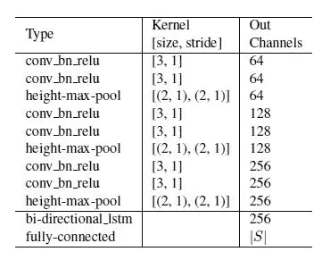

下面是识别分支的代码:

CTC 损失代码:

上面的 FOTS 架构工作如下，第一图像被馈送到共享卷积中，从共享卷积中提取共享特征。这些共享特征被馈送到文本检测分支，在那里我们预测和检测文本到图像中的边界框。共享卷积(共享特征)和文本检测分支(图像中文本的预测框)的输出被馈送到 RoI 旋转算子，该算子提取文本提议特征。这些特征然后被馈送到文本识别分支，该文本识别分支由递归神经网络(RNN)编码器和连接主义时间分类(CTC)解码器组成，用于识别和预测文本。最后，文本检测分支和文本识别分支的输出被合并到图像中，以预测边界框和边界框的预测文本。因为在这个网络中用于模型的所有 looses 都是可微分的，所以整个网络可以被端到端地训练。

现在我们已经了解了 FOTS，让我们问一下为什么使用 FOTS 来实现文本定位？

首先，与其他方法相比，FOTS 速度更快，因为 FOTS 同时实现了检测和识别。此外，文本识别监督迫使模型考虑字符的细节，FOTS 学习一个单词中具有不同模式的不同字符之间的语义信息。它还增强了具有相似模式的字符和背景之间的差异。

# 8.模特培训

由于 SynthText 数据集非常大，即 800k 图像(41GB ),由于计算能力较低，在所有数据上训练我们的模型是不可能的。因此，作为一个解决方案，我们从该数据集中随机选择 15k 张图像，并使用它们来训练我们的模型。

对于模型训练，基本上我们将整个训练过程分为两个部分:检测和识别。我们将分别训练这两个模型，即检测和识别，在推断结束时，我们将把这两个模型与 ROI 旋转结合起来。

在培训过程中，我们使用了各种 Tensorflow 回调，例如:

1.  **减少平台期回调** :-当我们的模型权重陷入局部最小值时，这用于减少学习率。
2.  **模型检查指向回调** :-用于训练时保存模型重量。
3.  **张量板回调** :-用于可视化张量板中层的损失和权重。

以下是该模型的一些预测:

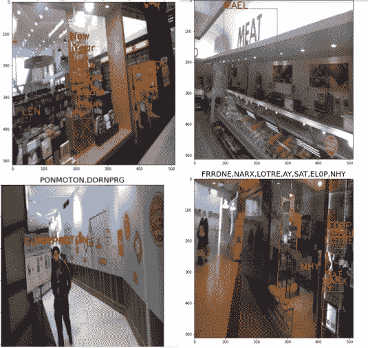

# 9.部署

# **10。结论:**

1.  我们可以看到，检测模型仍然做得很好，但识别模型的表现不是那么好。
2.  这是因为我们只从 SynthText 的 800k 图像中提取了 15k 图像用于检测，10k 图像用于识别，我们没有在 SynthText 的全部数据上训练我们的模型，因为它是 41GB 大的，需要高计算能力，并且因为较少的计算能力和资源使用那么多数据。
3.  检测和识别模型都可以在更多的数据上训练，以提供更好的结果。

# 11.未来工作:

1.  将利用完整的 SynthText 数据来训练检测和识别部分。
2.  处理检测部分以产生更精确的边界框。
3.  以更易读的形式组织代码。
4.  可以使用 NLP 方法层在识别层正确解码单词。

# 12:参考文献:

[https://arxiv.org/pdf/1801.01671.pdf](https://arxiv.org/pdf/1801.01671.pdf)

 [## 江西路宁/FOTS。PyTorch

### conda create-name fots-file spec-file . txt conda activate fots pip install-r reqs . txt #非常简单，对于单个 gpu…

github.com](https://github.com/jiangxiluning/FOTS.PyTorch)  [## 了解清晰边界检测的骰子损失

### 计算机视觉中边界检测任务的交叉熵损失的更好替代方案

medium.com](/ai-salon/understanding-dice-loss-for-crisp-boundary-detection-bb30c2e5f62b)  [## 应用课程

### 我们知道转行是多么具有挑战性。我们的应用人工智能/机器学习课程被设计为整体学习…

www.appliedaicourse.com](https://www.appliedaicourse.com/) 

你可以在我的 Github [**这里**](https://github.com/iaayushgupta/FOTS) **找到完整的代码。**

很高兴在 [**linkedin**](https://www.linkedin.com/in/aayush-gupta-925442190/) 上与您连线😃