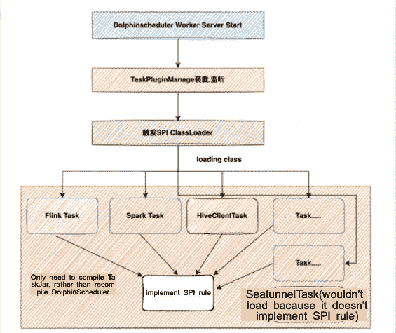

# 基于 Apache DolphinScheduler 的快速任务类型扩展|教程

> 原文：<https://medium.com/codex/fast-task-types-expanding-on-apache-dolphinscheduler-tutorial-9dd440c76cbe?source=collection_archive---------26----------------------->


# 背景

目前，调度器在大数据生态中起着不可或缺的作用。Apache DolphinScheduler 是 Apache 的一个顶级项目，是最稳定、最易于使用的调度系统之一。有了调度、分发、高可用性和易用性，随着业务的增长或更多组件用于各种需求，用户自然会希望快速、轻松、简洁地扩展 Apache Dolphinscheduler 任务类型。本文向您展示了如何轻松快速地扩展 Apache DolphinScheduler 任务。

# 作者简介


张百强

张百强是一名大数据开发工程师，他对研究实时计算、元数据治理和大数据基础组件感兴趣。

# 1 什么是 SPI？

SPI(服务提供者接口)是内置于 JDK 中的服务交付发现机制。大多数人可能很少使用它，因为它主要面向开发供应商，在 java.util.ServiceLoader 文件中有更详细的描述。SPI 的抽象概念是指服务实现的动态加载。

# 2 我们为什么要引入 SPI？

不同的企业可能有其需要由任务执行的组件，例如，企业使用大数据生态系统中最常用的工具 Hive 的方式不同。有的企业通过 HiveServer2 执行任务，有的使用 HiveClient 执行任务。考虑到 Apache DolphinScheduler 提供的开箱即用任务不支持 HiveClient 的任务，所以大部分用户会通过 Shell 执行。然而，与 TaskTemplate 相比，Shell 并不能很好地工作。所以，Apache DolphinScheduler 支持 TaskSPI，使用户能够根据自己的业务需求更好地定制不同的任务。

首先，我们需要了解 Apache DolphinScheduler 的任务迭代历史。在 DS 1.3.x 中，扩展一个任务需要重新编译整个 Apache DolphinScheduler，这是高度耦合的，所以在 Apache DolphinScheduler 2.0.x 中，我们引入了 SPI。我们前面提到过，SPI 的本质是动态加载一个服务的实现，所以我们再具体一点，把 Apache DolphinScheduler 的任务看作一个执行服务，我们需要根据用户的选择执行不同的服务。如果没有服务，就需要我们自己去拓展。相比 1.3.x 我们只需要完成我们的任务实现逻辑，然后遵循 SPI 规则，编译成 Jar 上传到指定目录，使用我们自己编写的任务。

# 3 谁在用？

a. Apache DolphinScheduler

一.任务

二。数据源

**b .阿帕奇·弗林克**

i. flink sql 连接器，在用户实现了一个 Flink 连接器之后，Flink 也是通过 SPI 动态加载的

**c .弹簧靴**

一、弹簧靴 spi

**d. Jdbc**

一、在 jdbc4.0 之前，开发者需要通过 forName("xxx ")加载基于类的驱动，jdbc4 也是基于 spi 机制来发现驱动提供者，可以通过在 META-INF/services/java 中指定实现类来公开驱动提供者。sql。驱动程序文件

**e .更**

*   **杜博**
*   **普通伐木**
*   **……**

# 4 什么是 Apache DolphinScheduler SPI 进程？



*注:SPI 规则*

*在将服务的具体实现编译成 JAR 时，我们需要在资源的 dir 下创建 META-INF/services/ folder，然后用服务的文件名创建一个全限定类名，这就是集成接口的全限定类名。里面的内容是实现类的完全限定类名。*

为了说明上图，我把 Apache DolphinScheduler 分成了逻辑任务和物理任务，逻辑任务指的是 DependTask、SwitchTask，物理任务指的是 ShellTask、SQLTask，都是执行任务的任务。在 Apache DolphinScheduler 中，我们一般会扩展物理任务，交给 worker 来执行，所以我们需要明白的是，当我们有不止一个 worker 时，我们要将自定义任务分发到每台有 Worker 的机器上，当我们启动 Worker 服务时，Worker 会启动一个 ClassLoader 来加载实现规则的相应任务库。注意，HiveClient 和 SeatunnelTasks 是用户定义的，但是只有 HiveTasks 是由 Apache dolphin scheduler TaskPluginManage 加载的。原因是 SeatunnelTask 不遵循 SPI 规则。SPI 规则在图上也有描述，或者可以参考 java.util.ServiceLoader 类，下面有一个简单的参考(摘录了部分代码):

```
public final class ServiceLoader<S> implements Iterable<S> {
    //scanning dir prefix
    private static final String PREFIX = "META-INF/services/";
 //The class or interface representing the service being loaded
    private final Class<S> service; //The class loader used to locate, load, and instantiate providers
    private final ClassLoader loader; //Private inner class implementing fully-lazy provider lookup
    private class LazyIterator implements Iterator<S> {
        Class<S> service;
        ClassLoader loader;
        Enumeration<URL> configs = null;
        String nextName = null; //......
        private boolean hasNextService() {
            if (configs == null) {
                try {
                    //get dir all class
                    String fullName = PREFIX + service.getName();
                    if (loader == null)
                        configs = ClassLoader.getSystemResources(fullName);
                    else
                        configs = loader.getResources(fullName);
                } catch (IOException x) {
                    //......
                }
                //......
            }
        }
    }
}
```

# 5 如何扩展数据源任务或数据源？

## 5.1 创建 Maven 项目

```
mvn archetype:generate \
    -DarchetypeGroupId=org.apache.dolphinscheduler \
    -DarchetypeArtifactId=dolphinscheduler-hive-client-task \
    -DarchetypeVersion=1.10.0 \
    -DgroupId=org.apache.dolphinscheduler \
    -DartifactId=dolphinscheduler-hive-client-task \
    -Dversion=0.1 \
    -Dpackage=org.apache.dolphinscheduler \
    -DinteractiveMode=false
```

## 5.2 Maven 依赖性

```
<! --dolphinscheduler spi basic core denpendence -->
 <dependency>
     <groupId>org.apache.dolphinscheduler</groupId>
     <artifactId>dolphinscheduler-spi</artifactId>
     <version>${dolphinscheduler.lib.version}</version
     <scope>${common.lib.scope}</scope>
 </dependency
 <dependency>
     <groupId>org.apache.dolphinscheduler</groupId>
     <artifactId>dolphinscheduler-task-api</artifactId>
     <version>${dolphinscheduler.lib.version}</version
     <scope>${common.lib.scope}</scope>
 </dependency
```

## 5.3 创建 TaskChannelFactory

首先，我们需要为任务服务创建工厂，其主要目标是帮助构建 TaskChannel 和 TaskPlugin 参数，并给出任务的唯一标识。ChannelFactory 连接 Apache DolphinScheduler 的任务服务组，帮助前后端交互构建 TaskChannel。

```
package org.apache.dolphinscheduler.plugin.task.hive; import org.apache.dolphinscheduler.spi.params.base.PluginParams;
import org.apache.dolphinscheduler.spi.task.TaskChannel;
import org.apache.dolphinscheduler.spi.task.TaskChannelFactory; import java.util.List; public class HiveClientTaskChannelFactory implements TaskChannelFactory {
    /**
     * Create a task channel and execute tasks based on it
     * @return Task Channel
     */
    @Override
    public TaskChannel create() {
        return new HiveClientTaskChannel();
    }
 /**
     * Returns the globally unique identifier of the current task
     * @return Task type name
     */
    @Override
    public String getName() {
        return "HIVE CLIENT";
    } /**
     * The front-end pages need to be rendered, mainly into

     * @return
     */
    @Override
    public List<PluginParams> getParams() {
        List<PluginParams> pluginParams = new ArrayList<>();
        InputParam nodeName = InputParam.newBuilder("name", "$t('Node name')")
                .addValidate(Validate.newBuilder()
                        .setRequired(true)
                        .build())
                .build();
        PluginParams runFlag = RadioParam.newBuilder("runFlag", "RUN_FLAG")
                .addParamsOptions(new ParamsOptions("NORMAL", "NORMAL", false))
                .addParamsOptions(new ParamsOptions("FORBIDDEN", "FORBIDDEN", false))
                .build(); PluginParams build = CheckboxParam.newBuilder("Hive SQL", "Test HiveSQL")
                .setDisplay(true)
                .setValue("-- author: \n --desc:")
                .build(); pluginParams.add(nodeName);
        pluginParams.add(runFlag);
        pluginParams.add(build); return pluginParams;
    }
}
```

## 5.4 创建任务通道

在我们有了工厂之后，我们将基于它创建一个 TaskChannel。TaskChannel 包含取消和创建两种方法，目前我们只需要关注创建任务。

```
void cancelApplication(boolean status);
 /**
     * Build executable tasks
     */
    AbstractTask createTask(TaskRequest taskRequest);public class HiveClientTaskChannel implements TaskChannel {
    @Override
    public void cancelApplication(boolean b) {
        //do nothing
    }
 @Override
    public AbstractTask createTask(TaskRequest taskRequest) {
        return new HiveClientTask(taskRequest);
    }
}
```

## 5.5 构建任务实现

通过 TaskChannel，我们获得了可以执行的物理任务，但是我们需要向当前任务添加相应的实现，以允许 Apache DolphinScheduler 执行您的任务。

从上图我们可以看到，基于 Yarn 执行的任务会继承 AbstractYarnTask，不需要 Yarn 执行的任务会直接继承 AbstractTaskExecutor，主要包含一个 AppID，以及 CanalApplication setMainJar。从上面可以看到，我们的 HiveClient 需要继承 AbstractYarnTask，在构建任务之前，我们需要构建适合 HiveClient 的 parameters 对象来反序列化 JsonParam。

```
package org.apache.dolphinscheduler.plugin.task.hive; import org.apache.dolphinscheduler.spi.task.AbstractParameters;
import org.apache.dolphinscheduler.spi.task.ResourceInfo; import java.util.List; public class HiveClientParameters extends AbstractParameters {
    /**
     * The easiest way to execute with HiveClient is to just paste in all the SQL, so we only need one SQL parameter
     */
    private String sql;
 public String getSql() {
        return sql;
    } public void setSql(String sql) {
        this.sql = sql;
    } @Override
    public boolean checkParameters() {
        return sql ! = null;
    } @Override
    public List<ResourceInfo> getResourceFilesList() {
        return null;
    }
}
```

实现参数对象后，让我们实现任务。示例中的实现相对简单，就是将用户的参数写入一个文件，通过 Hive -f 执行任务。

```
package org.apache.dolphinscheduler.plugin.task.hive; import org.apache.dolphinscheduler.plugin.task.api.AbstractYarnTask;
import org.apache.dolphinscheduler.spi.task.AbstractParameters;
import org.apache.dolphinscheduler.spi.task.request.TaskRequest;
import org.apache.dolphinscheduler.spi.utils.JSONUtils; import java.io;
import java.io.IOException;
import java.nio.charset.StandardCharsets;
import java.nio.file;
import java.nio.file.Path;
import java.nio.file.Paths; public class HiveClientTask extends AbstractYarnTask {
 /**
     * hive client parameters
     */
    private HiveClientParameters hiveClientParameters; /**
     * taskExecutionContext
     */
    private final TaskRequest taskExecutionContext; public HiveClientTask(TaskRequest taskRequest) {
        super(taskRequest);
        this.taskExecutionContext = taskRequest;
    } /**
     * task init method
     */
    @Override
    public void init() {
        logger.info("hive client task param is {}", JSONUtils.toJsonString(taskExecutionContext));
        this.hiveClientParameters = JSONUtils.parseObject(taskExecutionContext.getTaskParams(), HiveClientParameters.class); if (this.hiveClientParameters ! = null && !hiveClientParameters.checkParameters()) {
            throw new RuntimeException("hive client task params is not valid");
        }
    } /**
     * build task execution command
     *
     * @return task execution command or null
     */
    @Override
    protected String buildCommand() {
        String filePath = getFilePath();
        if (writeExecutionContentToFile(filePath)) {
            return "hive -f " + filePath;
        }
        return null;
    } /**
     * get hive sql write path
     *
     * @return file write path
     */
    private String getFilePath() {
        return String.format("%s/hive-%s-%s.sql", this.taskExecutionContext.getExecutePath(), this.taskExecutionContext.getTaskName(), this. taskExecutionContext.getTaskInstanceId());
    } @Override
    protected void setMainJarName() {
        //do nothing
    } /**
     * write hive sql to filepath
     *
     * @param filePath file path
     * @return write success?
     */
    private boolean writeExecutionContentToFile(String filePath) {
        Path path = Paths.get(filePath);
        try (BufferedWriter writer = Files.newBufferedWriter(path, StandardCharsets.UTF_8)) {
            writer.write(this.hiveClientParameters.getSql());
            logger.info("file:" + filePath + "write success.");
            return true;
        } catch (IOException e) {
            logger.error("file:" + filePath + "write failed. please path auth.");
            e.printStackTrace();
            return false;
        } } @Override
    public AbstractParameters getParameters() {
        return this.hiveClientParameters;
    }
}
```

## 5.6 符合 SPI 规则

```
# 1,Create META-INF/services folder under Resource, create the file with the same full class name of the interface
zhang@xiaozhang resources % tree . /
. /
└── META-INF
    └── services
        └─ org.apache.dolphinscheduler.spi.task.TaskChannelFactory
# 2, write the fully qualified class name of the implemented class in the file
zhang@xiaozhang resources % more META-INF/services/org.apache.dolphinscheduler.spi.task.TaskChannelFactory 
org.apache.dolphinscheduler.plugin.task.hive.HiveClientTaskChannelFactory
```

## 5.7 打包和部署

```
## 1,Packing
mvn clean install
## 2, Deployment
cp . /target/dolphinscheduler-task-hiveclient-1.0.jar $DOLPHINSCHEDULER_HOME/lib/
## 3,restart dolphinscheduler server
```

完成上述操作后，我们检查工作日志 tail-200 f $ Apache dolphin scheduler _ HOME/log/Apache dolphin scheduler-worker . log。

就这些啦~以上涉及的前端修改可以在 Apache dolphin scheduler-ui/src/js/conf/home/pages/Dag/_ source/form model/

# 加入社区

参与 DolphinScheduler 社区并为其做出贡献的方式有很多，包括:

文档、翻译、问答、测试、代码、文章、主题演讲等。

我们假设第一个 PR(文档、代码)是简单的，应该用来熟悉提交过程和社区协作风格。

所以社区整理了以下适合新手的问题列表:【https://github.com/apache/dolphinscheduler/issues/5689

非新手问题列表:【https://github.com/apache/dolphinscheduler/issues? q = is % 3A open+is % 3A issue+label % 3A % 22 volunteer+wanted % 22

如何参与投稿:[https://dolphin scheduler . Apache . org/en-us/community/development/contribute . html](https://dolphinscheduler.apache.org/en-us/community/development/contribute.html)

**GitHub 代码库:**[https://github.com/apache/dolphinscheduler](https://github.com/apache/dolphinscheduler)

**官网**:https://dolphin scheduler . Apache . org/

:dev@dolphinscheduler@apache.org 邮件列表

**推特**:@海豚时间表

https://www.youtube.com/channel/UCmrPmeE7dVqo8DYhSLHa0vA

**懈怠:【https://s.apache.org/dolphinscheduler-slack】T21**

**投稿指南:**https://dolphin scheduler . Apache . org/en-us/community/index . html

你的项目之星很重要，不要犹豫，点亮阿帕奇海豚调度❤️之星