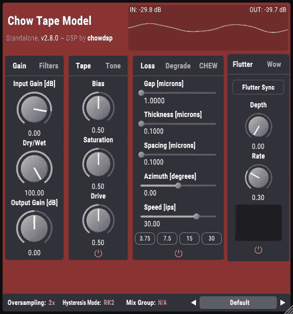
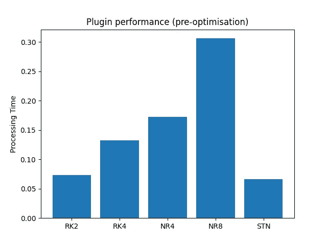
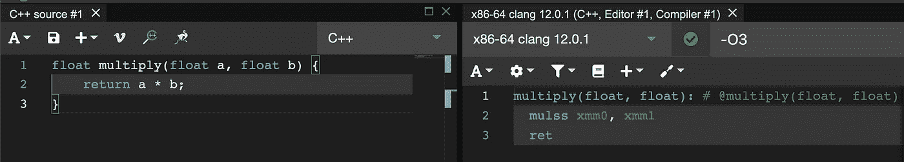
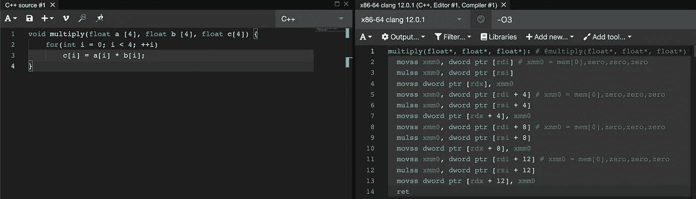
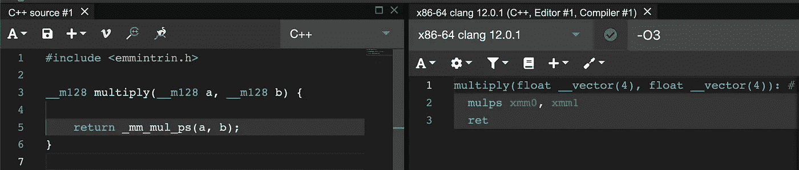
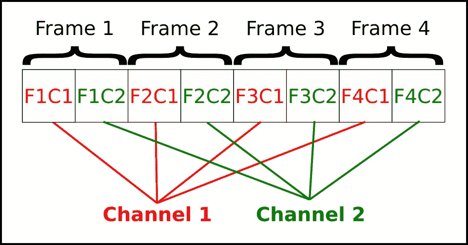
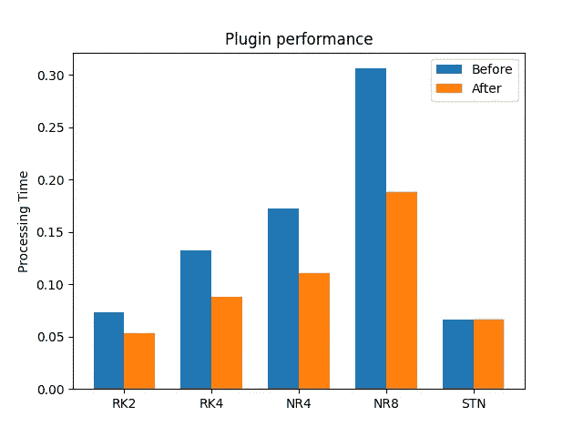

# 使用 SIMD 实现更快的磁带仿真

> 原文：<https://medium.com/codex/faster-tape-emulation-with-simd-49287d7b24cf?source=collection_archive---------6----------------------->

在过去的几年里，我一直在半定期地开发一个名为 [CHOWTapeModel](https://github.com/jatinchowdhury18/AnalogTapeModel) 的开源磁带仿真音频插件。在那段时间里，我收到了很多很棒的用户反馈，包括关于新 DSP 功能的想法，关于我自己可能没有发现的错误的报告，甚至有一个很棒的用户提供服务来帮助重新设计插件的 GUI(感谢 Margus！).



然而，我一次又一次收到的反馈是，这个插件“计算开销很大”，也就是说，它消耗了大量的计算资源。在某种程度上，这一结果是可以预期的，因为模拟磁带磁化过程背后的物理过程肯定不是一项微不足道的任务(参见我的 [2019 DAFx 论文](https://dafx2019.bcu.ac.uk/papers/DAFx2019_paper_3.pdf)。但是作为一个可能想在我的一个会话中使用 10-20 个插件实例的用户(在我的所有其他插件之上)，CHOWTapeModel 所需的计算能力可能足以成为切换到其他一些计算成本更低的插件来实现所需声音的理由。

由于我最近开始致力于发布 2.9.0 版本的 CHOWTapeModel，我决定自己去寻找可以提高插件性能的方法。这一搜索以[最近的提交](https://github.com/jatinchowdhury18/AnalogTapeModel/commit/b5f38990ed07d2e751149ad7b6d2e5adbe148a27)而告终，该提交将性能(在大多数处理模式下)提高了 30–60%。我想写下这一改进背后的思考过程，以帮助我自己更好地理解它们，并与其他任何可能感兴趣的人分享这些想法。

警告:下面将是一个相当技术性的讨论，假设你对 C++和计算机架构有一点背景知识。

# 插件真的有多快？

在开始改进之前，重要的是要找到一种可靠的方法来衡量插件的性能。虽然这个问题引发了关于测量软件性能的更广泛的讨论，但我认为对于音频处理来说，考虑“实时”性能很重要:例如，我的插件处理一秒钟的音频需要多长时间？如果我的插件需要 10 秒(平均)，那么它显然不能实时运行。如果我的插件平均需要 0.9 秒，它可能可以实时运行，但你可能无法在一个线程上运行多个插件实例。另外，如果*平均*时间为 0.9 秒，则“最坏情况”时间可能会大于 1 秒，这可能会导致听觉故障。

对于我的插件，我试图将最大处理时间定为 0.1 秒，这意味着插件的 10 个实例可以在一个线程上实时运行。由于我的笔记本电脑一次最多可以使用 8 个线程，所以理论上我可以有一个包含 80 个音轨的 DAW 会话，每个音轨在处理能力耗尽之前运行一个插件实例(假设我不想使用任何其他插件)。在一个真实的会话中，我可能不需要 80 首曲目，但我会想使用其他插件，加上 DAW 需要一点计算能力来完成自己的操作。

## CHOWTapeModel 有多快？

对于 CHOWTapeModel，性能在很大程度上取决于插件使用的“滞后模式”。在进行最近的改进之前，以下是 CHOWTapeModel 在 44.1 kHz 采样速率和 8 倍过采样(所有其他设置均为默认值)下，在每种模式下处理 1 秒音频所需的时间:

*   RK2: 0.073 秒
*   RK4: 0.132 秒
*   NR4: 0.172 秒
*   NR8: 0.306 秒
*   状态:0.066 秒



这里有几点需要注意。首先，我没有包括“V1”滞后模式，因为它在内部使用“RK4”处理。有关我如何生成这些性能度量的更多信息，请参见[基准测试工具](https://github.com/jatinchowdhury18/AnalogTapeModel/blob/master/Plugin/Source/Headless/Benchmarks.cpp)源代码。所有性能测量都是在一台配备英特尔酷睿 i7–9750h CPU、主频为 2.60GHz 的 MacBook 上进行的。

## 先前的工作

我应该在这里提到，我已经花了大量的时间来优化磁带仿真算法。事实上，回顾 2019 年 12 月的一些[论坛帖子，我记得在耗尽计算能力之前，我几乎无法运行一个插件实例。一路走来，我学到了很多优化技巧，包括如何缓存值，这样就不需要重新计算，](https://www.kvraudio.com/forum/viewtopic.php?t=536112)[无分支编程](https://youtu.be/bVJ-mWWL7cE)，如何读取不同 C++编译器生成的汇编代码。然而，有一个重要的优化技术我还没有能够应用到 CHOWTapeModel: SIMD 并行化。

# 什么是 SIMD？

SIMD 是[“单指令多数据”](https://en.wikipedia.org/wiki/SIMD)的缩写。基本思路如下。如果您给计算机两个数字，并告诉它将它们相乘(即 *a * b = c* ，它通常会经历以下步骤:

*   将第一个数字( *a* )存储在寄存器中
*   将第二个数字( *b* )存储在寄存器中
*   将两个寄存器的内容相乘，并将结果存储在第三个寄存器中( *c)*



用于将两个浮点数相乘的生成的程序集

现在让我们说，你有两组 4 个数字，你想让计算机将每组中的数字相乘。显而易见的方法是重复上述步骤 4 次，这自然需要 4 倍的时间来完成。



为 4 个浮点数相乘而生成的程序集

或者，SIMD 指令允许计算机在单个寄存器中存储多个值，从而实现以下方法:

*   将第一组中的四个数字存储在 SIMD 寄存器中
*   将第二组中的四个数字存储在 SIMD 寄存器中
*   将两个 SIMD 寄存器的内容相乘，并将结果存储在第三个 SIMD 寄存器中



将四个浮点数与 SIMD 寄存器相乘的生成的程序集

这使得计算机能够用相同数量的 CPU 指令将 4 个数字相乘，就像将单个数字相乘一样！这个过程通常被称为“矢量化”或“编写矢量化代码”。

## SIMD 指令集

据我所知，目前有三种常用的 SIMD 指令集。几乎所有的英特尔 CPU 都支持 SSE 指令集，该指令集支持 128 位 SIMD 寄存器:大到足以存储 4 个单精度浮点数(通常称为“浮点”)，或 2 个双精度浮点数(“双精度”)。AVX 指令集支持 256 位 SIMD 寄存器，宽度足以容纳 8 个浮点数或 4 个双精度数，但一些较老的英特尔 CPU 不支持。最后，用于 ARM CPUs 的 NEON 指令集支持 4 浮点和 2 双精度的 SIMD 寄存器，但双精度支持仅在最近的版本中可用(稍后会有更多介绍……)。

## SIMD 并行化的极限

虽然 SIMD 优化非常强大，但它的应用范围是有限的。一般来说，要并行完成两个操作，它们必须完全独立。例如，假设我有两个乘法运算， *a * b = c* 和 *c * d = e* 。我不能并行执行这些操作，因为第二个操作取决于第一个操作的结果！

考虑到这一点，音频处理中通常有两种情况可以进行 SIMD 优化。一个是如果你有一个“前馈”过程，这样输出只取决于当前和以前的输入。这种情况对于优化类似[卷积](https://github.com/hgomersall/SSE-convolution)、[延迟线插值](https://github.com/Chowdhury-DSP/chowdsp_utils/blob/master/DSP/Delay/chowdsp_DelayInterpolation.h#L253)或[神经网络](/mlearning-ai/real-time-neural-network-inferencing-for-audio-processing-857313fd84e1)的事情非常有用。另一种情况是，如果您有两个并行的音频流，例如，一个带有 4 个并行声部的合成器，或者一个多声道音频流。第二种情况对优化 CHOWTapeModel 很有用。

有趣的 SIMD 可视化

# 优化 CHOWTapeModel

因为 CHOWTapeModel 是为立体声处理配置的，所以这种优化背后的基本策略是通过插件的“滞后”部分并行处理立体声通道。

## 为什么不把整个插件并行化呢？

尝试并行化整个插件没有意义有几个原因。首先，在插件的几个部分中，两个通道之间的处理不是独立的，这意味着并行化是不可能的。第二，并行处理需要在处理之前将立体声通道“交织”到 SIMD 寄存器中，然后在处理之后对立体声通道进行去交织。这个操作会产生一点开销，所以在插件的不同部分之间不断地交错/去交错实际上会使插件慢一点！

滞后处理器是并行化的良好候选，因为立体声通道是独立处理的，并且处理器在计算上非常昂贵。由于处理非常昂贵，SIMD 并行化的好处远远超过交织/解交织通道的开销。



交错立体声音频

## 正在优化…

实现这种优化的实际工作需要几个步骤:

*   重构
*   转换操作以使用 SIMD
*   寻找特殊功能的替代品
*   衡量绩效

我不想太详细地讨论重构步骤(鼓励感兴趣的人阅读[提交](https://github.com/jatinchowdhury18/AnalogTapeModel/commit/b5f38990ed07d2e751149ad7b6d2e5adbe148a27))，但是大量的跑腿工作集中在将类成员函数转换成“自由”函数，这可以更容易地配置成采用浮点寄存器或 SIMD 寄存器。我想保持与非矢量化实现的向后兼容性，以便用于测试和比较。

为了将浮点运算转换为 SIMD 运算，在大多数情况下，用`[juce::dsp::SIMDRegister<double>](https://docs.juce.com/master/structdsp_1_1SIMDRegister.html)`替换`double`是一种简单的替换，但是有一些地方需要更多的注意，特别是条件语句。比如说我有一个数 *x* ，如果 *x > 6 我想加倍。*对于浮点数，我可以用三元运算符进行如下操作:

```
x = x > 6.0 ? x * 2.0 : x;
```

对于 SIMD 寄存器，这种类型的事情有点困难:

```
using Float = juce::dsp::SIMDRegister<double>;x = (((Float) 2.0 * x) & Float::greaterThan (x, (Float) 6.0)) — (x & Float::lessThanOrEqual (x, (Float) 6.0));
```

最后，滞后处理使用了几个特殊的数学函数，即`std::isnan()`和`std::tanh()`。为了让这些函数工作，我需要引入一个第三方库， [xsimd](https://github.com/xtensor-stack/xsimd) ，它包含这些操作的 simd 实现。

在完成上述所有步骤后，我能够编译 CHOWTapeModel 的改进版本，并在我的计算机上进行测试。唷！

## STN 模式呢？

有一种滞后模式，我必须作为一种特殊情况来处理。因为 STN 模式使用的神经推理引擎已经使用了 SIMD 优化，所以我不能再进一步优化它了。因此，使用该模式时的性能应该保持不变。

## 还有一个障碍…

不幸的是，还有一个绊脚石需要一些时间去克服。还记得之前我提到过 ARM NEON 指令集的某些版本不包含双精度浮点寄存器吗？JUCE SIMDRegister 实现就是在这种情况下开发的，目前不包含 ARM NEON 的双精度 SIMD 寄存器的矢量化实现。结果是，在配有 ARM CPUs 的设备上，包括 iPad 和新的 Mac M1 电脑，滞后处理的运行速度实际上会比非矢量化实现慢得多。

最终，我自己动手做了一个 [JUCE DSP 模块](https://github.com/Chowdhury-DSP/chowdsp_juce_dsp)的分支，并自己为 ARM NEON 实现了双精度 SIMD 寄存器。希望 JUCE 的人能在模块的未来版本中更正式地加入这种支持。

# 全部完成！

就是这样！我们已经完成了 CHOWTapeModel 的迟滞处理器的矢量化。现在是时候看看插件的实际性能到底有多好了:

*   RK2: 0.053 秒(提高了 38%)
*   RK4: 0.088 秒(提高 50%)
*   NR4: 0.111 秒(提高了 55%)
*   NR8: 0.188 秒(提高了 63%)
*   状态:0.066 秒(无变化)



总的来说，这是一个非常显著的改进！特别是，“NR8”模式在这次改变之前对我来说几乎是不可用的，所以现在它快了 1.5 倍以上，我希望能多使用一点。

# 最后…

现在优化已经完成，在发布 CHOWTapeModel 2 . 9 . 0 版之前，我还想做一些事情。与此同时，如果你等不及了，可以尝试一下插件的[夜间版本](https://chowdsp.com/nightly.html)，尽管要注意它们可能不稳定。

我知道这篇文章已经深入到编写低级 DSP 代码的内部，但是我希望你会感兴趣，感谢你一直坚持到最后！向前…