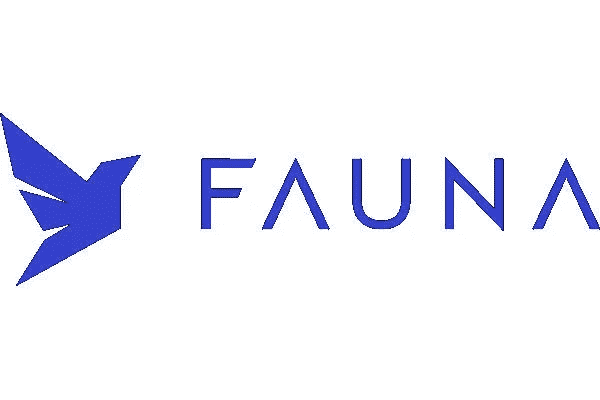

# 动物群:简介

> 原文：<https://medium.com/codex/faunadb-an-introduction-41d0bb171d5c?source=collection_archive---------5----------------------->

动物群是云上最受欢迎的未来数据库之一。它提供了惊人的灵活性和可伸缩性。

它可以用作具有分布式 ACID 事务的 OLTP 数据库，或者用作文档数据库或简单的基于键值的 NoSQL。它包括对可配置数据保留和分层多租户等企业功能的支持。