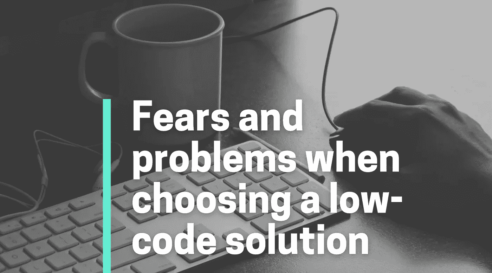

# 选择低代码解决方案时的恐惧和问题

> 原文：<https://medium.com/codex/fears-and-problems-when-choosing-a-low-code-solution-ad218eec8b64?source=collection_archive---------12----------------------->

如果你正在考虑使用一个低代码的解决方案，可能你已经问过这些问题了。

*   害怕低代码解决方案和它们的伸缩性问题值得吗？
*   低代码解决方案能从业务中抽取资金用于开发吗？
*   低代码会让程序员付出成本吗，如何最小化成本？
*   low-code 是否与它的创建者绑定，如何实现独立？

我想向大家展示我的观点，这是我在 IT 公司、金融科技公司和 IT 团队中 20 多年成功工作以及在金融科技公司使用低代码平台的经验所证实的。

选择低代码平台，许多公司面临一些与转换到它相关的问题。这既是对依赖供应商的恐惧，也是对获得错误解决方案的恐惧:没有预期结果的浪费金钱。此外，开发人员经常担心他们将不再受欢迎，并会失去工作。

一个客观且符合逻辑的方法将有助于消除选择错误平台的恐惧。这需要小而彻底的工作。

首先，你需要决定选择标准。平台具体会用来做什么？用于后端开发、API、网站、移动应用、日常自动化、ETL\ELT，还是其他？这将缩小潜在平台和供应商的范围。

> 不要选择一个你将成长为拥有大量功能的平台，这些功能可能只有在未来的某个时候才会派上用场。从高度专业化的解决方案开始。

然后建立对你的公司重要的标准。您将用于评估平台的每个标准和指标的权重是多少？在研究平台时，让相当数量的员工参与进来，他们将来会使用平台进行开发。

> 吸引那些会使用开发成果的人，也就是在这个平台上创建的应用。

最好是与每个平台独立合作——你不应该依赖广告口号、知名度或有吸引力的价格。使用几乎所有供应商都提供的免费试用期来确定平台是否满足您的需求。只有这样，选择才会客观，恐惧才会消散。

现在我将回答本文开头强调的问题。

## 害怕低代码解决方案和它们的伸缩性问题值得吗？

不，没什么可怕的。合适的平台将允许您足够灵活地扩展您的解决方案。例如，在我们公司，我们根据以下标准选择平台:它应该在任何服务器上同等有效地工作——云(AWS、GC、Azure)和内部部署，水平扩展，并具有平衡工具。检查缩放的可用性。事实上，它并不是在所有平台上都可用。仔细考虑平台是如何工作的:用什么语言开发，使用什么技术，规定了什么限制(几种技术都有其局限性和特殊要求)，以及其他特性。一些平台提供最终解决方案的源代码——这是一项重要的资产。

## 低代码解决方案能从业务中抽取资金用于开发吗？

这样的结果是可能的。因此，认真对待平台的选择非常重要。注意以下几点:许可和计费模式，平台在功能上有多丰富，你需要的。此外，界面应该足够用户友好，无需咨询平台供应商。仔细研究许可政策，并尝试计算 3-5 年的潜在成本，将您的增长考虑在内。

## **低代码会让程序员付出成本吗，如何最小化成本？**

同样，它强烈依赖于平台的特性。有些昂贵的产品每年花费数十万美元，但它们提供了非常广泛的特性、功能、出色的性能和灵活性。尽管如此，一些平台每年花费 1000 美元，并且具有狭窄的专业化，尽管它们相当充分地执行特定的任务。让我再次以我们公司为例。我们在选择平台时考虑了以下标准——总拥有成本(包括许可证成本、维护人员成本等)。)必须是经典开发的大约 10%。我们设法做到了这一点。

## **低代码是否绑定到它的创造者，如何实现独立？**

还是那句话，这个要看平台。例如，我们使用一个生成源代码的平台，您可以随意下载和使用该平台。更何况代码还算体面，是用 GO 写的。因此，如果在某个时候我们决定与这个平台提供商断绝关系，我们可以继续利用收到的代码。如果有必要，我们可以自己完善它。

# **结论**

不要害怕切换到低代码平台——这是一个值得深思熟虑的选择。逐步将该平台引入您的 IT 基础架构。让你自己和你的团队做好准备，因为低代码平台有一些局限性。大多数情况下，他们并不挑剔。根据对你来说重要的标准选择平台，一切都会好的！

我很乐意在评论中听到你对上述内容的看法，并随时通过 [LinkedIn](https://www.linkedin.com/in/yevgeniysamoilenko/) 与我联系。