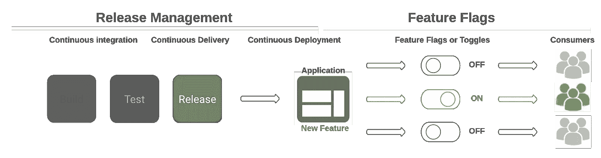
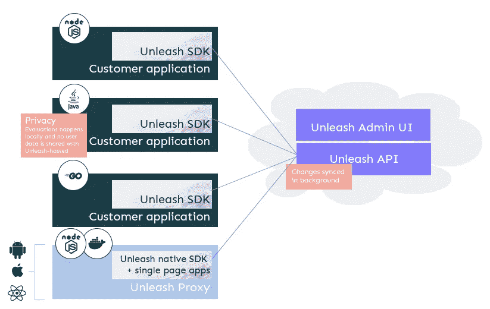

# 特征标志，什么？为什么？怎么会？

> 原文：<https://medium.com/codex/feature-flag-what-why-how-84bc1ea4107f?source=collection_archive---------1----------------------->

安德里亚斯·克拉森在 [Unsplash](https://unsplash.com/?utm_source=unsplash&utm_medium=referral&utm_content=creditCopyText) 上拍摄的照片

敏捷开发的速度衡量团队在冲刺阶段可以完成的工作量。可以用故事点、小时或天来衡量。团队的速度越快，交付的功能越多，给客户带来的价值就越多。Sprint velocity 是 Sprint 项目管理中评估和估计团队生产力的一个好方法。

速度的度量基于多种因素:持续集成(CI)过程、验证代码变更的时间、测试回归、安全性、交付，等等

在今天的世界里，产品经理希望在生产中尽可能快地开发特性，因此过程和工具必须跟上开发的速度。如果开发团队的速度比变更的质量快，结果可能是新特性部署的延迟，并可能降低公司在快速变化的市场中的竞争力。

幸运的是，为了避免这种情况，现在存在多种策略，如特征标志。它们是一个更广泛战略的重要组成部分，该战略旨在使应用程序适应技术和市场需求。

# 什么是特征标记？

特征标记概念(也称为特征切换或特征转换)被广泛认为是马丁·福勒、杰兹·亨布尔和脸书的工程团队的功劳。在连续交付的环境中，特性标志为一个框架提供了基础，该框架允许开发人员以更少的风险和更多的控制更快地发布软件。

从编码的角度来看，特性标记可以被看作是一个简单的“if”语句，它包装了一段新的代码。当“if”语句评估为真时，功能标志打开，然后应用新代码。

在一个真实的软件交付例子中，上面描述的‘if’语句将根据软件运行的环境进行不同的评估。例如，如果应用程序运行在 QA 服务器上，特性标志将返回 true，QA 团队将看到新功能以验证该功能。但是，如果代码在生产服务器上执行，特性标志将返回 false，功能将被隐藏。

特性标志在 CI 方案中起着关键的作用，在 CI 方案中，特性经常被部署，但不一定“发布”到产品中。

自 2018 年以来，很多组织在生产中使用这一概念。他们的目标是通过改进产品管理和发布管理之间的联系，从产品管理团队和开发团队中获得最佳效果。这个想法是将与运行时相关的问题的决策作为开发策略、DevOps 策略和产品策略的一部分。这些问题可以是:

*   谁应该在何时看到我们推出的新管理屏幕？
*   我们应该什么时候迁移到新的数据库？
*   新按钮应该出现在每个用户面前吗？它是否应该专用于特定的客户？

功能标志允许您在应用程序上远程启用功能，而无需重新构建/重新部署应用程序。它允许团队将代码部署到生产环境中，但不发布特性，直到它被鉴定并定义为生产就绪。特性标志可以针对特定的用户，以轻松地减少客户影响，并在 beta 测试人员的子集上运行生产测试。它的一个好的副作用是加快了开发团队的速度。

> 它们是“允许团队在不改变代码的情况下修改系统行为”的代码片段—马丁·福勒

也就是说，特性标志并不是所有情况下的正确解决方案，也不能解决交付管道中的所有问题。在实现它的时候要小心，否则你可能会得到一个比它需要的更复杂的交付管道。

# 为什么特征标记很重要？

功能标志在许多方面都很重要。第一个可能是将软件部署从特性发布中分离出来。它带来了将特性提交到产品的能力，同时选择客户中谁可以看到该特性。与使用源代码控制管理工具(SCM)中的分支来管理特性不同，特性可以在特定的环境中动态地打开或关闭，从而允许团队发布包含不应启用的特性的代码。

接受这个简单的想法为许多最佳实践奠定了基础，包括:

*   **连续部署/交付**:一天内将多个代码推向生产。
*   **主干/主线开发**:特性分支应该只为拉请求创建，而不是为长期特性开发创建。
*   不再有让事情停滞不前的发布列车。
*   **生产中的 QA/Perf 测试:**真正的 QA 和性能测试是在有生产流量的生产基础设施上进行的。不要浪费时间构建大量的性能实验室和试运行环境。
*   **实验**:了解一个新特性如何在 KPI 上移动指针。
*   **避免出现问题时的修复或回滚**:修复和代码回滚都很有压力，需要很长时间，并且会导致更多不必要的问题。相反，请关闭该功能。

一个目标可能是将代码中重要的决策逻辑推迟到运行时，在运行时我们会有更多的信息。第二是消除营销、产品和工程团队之间的依赖。持续地部署能够打开和关闭特性的代码，比开发一个过程来手动控制准备投入生产的特性要好。

许多人反对在生产中测试是好的，他们是对的，但是这种新的方法消除了在生产中由代码测试引入的风险，并且潜在地避免了对 QA 专用环境的管理。

在使用特性标志之前，应用了全有或全无的概念，这意味着要么所有客户都获得了该特性，要么一个都没有。所以在生产中测试代码的风险很高。功能标志允许用户一次向一小部分用户推出新功能。这使他们能够收集关于新功能的有价值的反馈和数据，而不会给整个客户群带来任何潜在的问题。

特性标志的另一个有趣的方面是能够在繁重的工作负载期间创建 kill switches 来提高应用程序的性能。断路开关是一种安全机制，用于在紧急情况下关闭某项功能，而该功能无法以常规方式关闭。

那么，为什么特性标记如此重要呢？因为它允许我们逐步推出新功能，首先向高级用户介绍新功能，从他们那里获得反馈并在向所有用户推出之前进行改进，而不会增加环境。

# 如何实现特征标志？

自从 Martin Fowler 引入特性标志以来，这个概念已经以不同的方式得到了改进。

如今，功能标志可以通过多种方式添加到代码中:

*   创建自己的库。
*   使用第三方特性标志库，可以考虑一个开源项目。
*   使用基于云的特征标志管理服务。
*   使用部署包中包含的配置文件，记住这并不意味着应用程序必须重启才能应用配置。
*   使用数据库并在运行时加载数据。

向应用程序添加特性标志或开发自己的库意味着增加复杂性和必须维护的代码。最糟糕的结果是增加技术债务，这显然不是目标。

因此，一个目标是拥有一个全面的功能标志管理策略，它包括几个组件:

*   用于切换新功能行为的切换点。
*   多个切换点组合在一起形成一个切换项目，它决定了项目的状态。
*   切换上下文提供必要的上下文信息(环境、特定用户等)。
*   易于识别和理解旗帜目标的命名策略
*   一个或多个激活策略，为特定用户、一小部分用户或 IP 启用某项功能。
*   一个切换报告，用于快速识别由功能标志管理引入的潜在技术债务
*   每次更改的历史记录，以确保在需要时快速回滚

必须控制和监控特征标志的实现才能有效。必须定义一个流程，以便在不影响客户的情况下在生产中启用某个功能。必须定期进行审计，以避免陈旧的特性并保持代码的整洁。

# 释放您的功能标志

今天，许多组织在生产中使用它，其中一些已经开发了自己的实现，并作为 SaaS 出售，如[闸门](https://floodgate.io/)、[发射黑暗](https://launchdarkly.com/blog/what-are-feature-flags/)、[分裂](https://www.split.io/product/feature-flags/)等，但也有一些有趣的开源项目可以轻松实现这个概念，如[释放](https://getunleash.io)。

Unleash 是一个基于客户端/服务器架构的开源功能管理平台。特性切换在作为应用程序的一部分运行并支持所有流行语言(Java、NodeJS、Go、Python 等)的客户端 SDK 中进行评估。服务器端由 API 和 UI 组成，API 保存所有功能切换及其配置，UI 由用于管理功能切换、定义新策略、查看指标等的仪表板组成。

*模式从* [*释放文档*](https://docs.getunleash.io/)

该架构可以在每个容器编排平台(如 [Kubernetes](https://artifacthub.io/packages/helm/unleash/unleash) )、裸机[主机甚至云中轻松部署和扩展，这要归功于企业版。](https://docs.getunleash.io/deploy/getting_started)

释放(免费计划)涵盖了轻松管理功能标志所需的大多数主要功能，例如:

*   布尔功能切换，通过仪表板轻松启用和禁用功能。
*   具有基于角色的访问控制的用户管理向困难任务的所有者开放访问以启用一个功能。
*   金丝雀和有针对性的发布，以改善持续部署
*   自定义激活策略，仅向特定客户启用某项功能
*   实验(A/B 测试)
*   重载情况下自动禁用功能的断路开关
*   审计日志，因为可观察性很重要
*   与其他流行工具(Slack、Teams、Datadog 等)的附加集成
*   管理技术债务的仪表板

这只是 free plan 中提供的一部分功能，几乎可以在任何地方部署。

将功能标志引入现有应用程序无疑是一个良好的开端。它使得通过板载仪表板实施和管理变得容易。[试试看！](https://www.unleash-hosted.com/demo/)

# 下一个？

如前所述，特性标志并不能解决所有问题，它通过将开发速度从产品生命周期中分离出来，为改进持续交付和部署管道带来了多种好处。

这个概念很强大，但是需要控制。例如，它需要控制和流程来启用新功能(谁可以启用新功能？它是如何测试的？是如何监控的？).特性标志需要开发团队特别注意，不要滥用它，避免增加技术债务。依靠现有的工具，如“释放”,也是减少潜在的技术债务的一个好的开始，这些债务有时是由特征标志引入的。保持干净，不要滥用！

有关特征标志原则的更多信息:

*   [释放网站](https://getunleash.io)
*   [特征标志介绍](https://featureflags.io/feature-flag-introduction/)
*   [马丁·福勒博客](https://martinfowler.com/articles/feature-toggles.html)
*   [闸门使用案例](https://floodgate.io/feature-flag-use-cases/)
*   [何时及为何使用特征标志](https://victorops.com/blog/when-and-why-to-adopt-feature-flags)
*   [针对非 Kubernetes 环境的自动特征标志自我修复](https://agardner.net/keptn-unleash-feature-flags/)(针对 Keptn 用户)
*   [带有释放和节点的特征标志](https://blog.logrocket.com/using-feature-flags-with-unleash-and-node-js/)
*   [释放 Kubernetes](https://kitchen.vibbio.com/blog/unleash-on-kubernetes-engine/)

# 关于作者

Hicham Bouissoumer —现场可靠性工程师(SRE) — DevOps

尼古拉斯·吉龙 —现场可靠性工程师(SRE) — DevOps