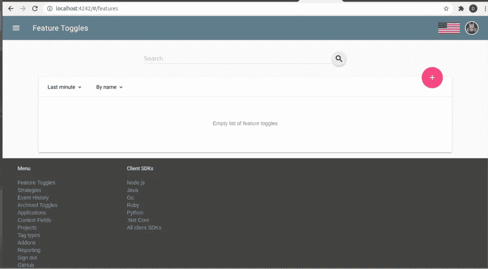
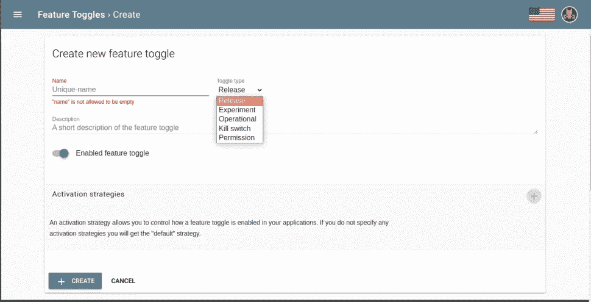

# 使用释放功能标记

> 原文：<https://medium.com/codex/feature-flagging-using-unleash-f7f9ef8a25a4?source=collection_archive---------9----------------------->

## 从技术角度看如何使用“释放”来利用有效的特征标记。

作者图片

对于需要快速进行多项测试的开发人员来说，特性标记是一项强大而必要的实践。但与此同时，有多种方法可以使用特性标志，而且它们并不完全相同。因此，在这个技术指南中，D3V 云认证的开发人员将了解如何使用“释放”来利用高效的特性标记。

# 什么是特征标记？

特性标志或切换使应用程序开发人员能够在运行时更改应用程序的功能，而不必编译代码。使用功能标志，开发人员可以通过在代码中引入功能标志来启用/禁用各种功能，并根据功能开关的值执行与功能相关的语句。

使用特性标志的两个最重要的优点是:

*   **更快的开发周期:**

特性标志本质上是开关，开发人员可以使用它来打开/关闭某些特性，并在不编译代码的情况下看到结果。这有助于开发人员在更短的时间内交付和测试新特性，从而加快开发周期

*   **有限的首次展示测试:**

通过不同形式的有限部署，包括 A/B 测试和 canary 部署，特性标志还可以用于在部署新特性时对测试进行更多的控制。

# 什么是释放？

Unleash 是一个带有内置 javascript 的开源特性标记解决方案，可以帮助您使用 REST API 创建和管理特性切换。释放服务器带有一个仪表板，开发人员可以通过它轻松地创建和启用/禁用浏览器切换。

释放 Vs 黑暗启动:用哪个？

正如我们所说的，有多种方式来使用特性标志，LaunchDarkly 是另一种方式。LaunchDarkly 总体上有更多的功能。但与此同时，对于严格寻找具有以下特征的软件的公司来说,“释放”是一个不错的选择:

*   开源
*   并且可以免费使用
*   并且想要管理必要的基础设施

如果这是你，那么好消息是——释放太棒了！尽管 LaunchDarkly 在纯粹的功能上胜出，但 leash 确实有一些强大的优势，包括:

*   **免费和开源:** Unleash 有一个免费和开源(Apache Licence 2.0)计划(除了付费计划之外)，这意味着你可以根据需要修改它的功能。
*   它允许您通过 REST APIS 访问其功能切换，允许 Unleash 与您选择的任何编程语言一起使用。
*   Java、Node、Go、Ruby、Python 和. NET 都提供了客户端库。
*   附带一个易于使用的 UI 仪表板，允许您管理标志。
*   它还带有一个 Docker 图像，因此可以通过将其部署在 Kubernetes 上进行水平缩放。
*   在各种切换类型和激活策略的帮助下，它为开发人员提供了启用/禁用特性标志的粒度控制。

# 使用释放功能标志

功能标志很容易上手，可以通过使用 Unleash 的仪表板来创建。只需单击加号(+)图标即可创建功能标志。

来源:[释放](https://docs.getunleash.io/)

来源:[释放](https://docs.getunleash.io/)

*   **名称:**为特征标志提供一个合适的名称。对标志使用命名约定将有助于您跨团队管理您的标志，这可以避免多个用户对标志使用相同的名称。要使用的命名约定之一可以是 application name . modulename . feature name。
*   这里有一个例子:对于一个在线餐馆订购系统，一个合适的标志名可以是 web . payments .
    cashondelivery。在这里，应用程序的名称是 web，它服务于前端，支付是模块，cashondelivery 是一个功能，可用于使用户在订单交付时通过现金支付。当一个特性的范围较大时，您可以将该特性划分为子特性，标志名可以是
    application name . modulename . feature name . sub feature
*   **描述:**为您团队的其他成员提供适当的描述，以了解特性标志的用途。
*   **选择**特征标志类型:Unleash 提供了 Unleash server 3.5 中可用的各种特征标志类型:

> Release Toggles:这种类型的特性标志适合基于主干的开发。在基于主干的开发中，所有的开发人员都致力于一个叫做主干的共享分支。释放切换允许向共享分支添加不完整的特征。
> 
> 实验切换:它们用于执行 A/B 测试。该标志将基于用户的特征来评估真或假。在控制流中，具有相同特征的不同用户将处于相同的执行路径下
> 
> 操作切换:它们用于系统的操作方面，例如，由于疫情，餐馆系统可以禁用货到付款支付，以支持非接触式交付。
> 
> Kill Switch:Kill Switch 可以通过降低系统功能来提高性能。在高负载下，不太重要的特征可以被禁用，并且只有重要的特征应该被返回给用户。
> 
> 权限切换:这些切换基于用户可用的权限来启用/禁用。

*   **选择激活策略:**激活策略使您能够精确控制应该激活哪个用户功能开关。以下激活策略可用:

> 默认:使用此策略，对所有用户启用切换。
> 
> userWithId:为在 userIds 列表中有 Id 的用户激活。
> 
> gradualRolloutUserId:在逐步推广策略中，某个特性将对其用户子集的某个百分比可用。具有 id 的用户一旦被激活，将具有一致的行为。这意味着属于该策略的类别 10%的用户也将使其特征为 20%启用。
> 
> gradalRollout
> SessionId:该策略与 gradualRolloutUserId 相同，唯一的区别是该策略是基于 SessionId 激活的。
> 
> gradualRollout
> Random:该策略随机启用特性切换。
> 
> flexible rollout:flexible rollout 策略是所有渐进策略的组合。
> 
> remoteAddress:如果一个请求来自一个预定义的 IP 地址列表，这个策略将启用一个特性切换
> 
> 应用程序
> 主机名:应用程序主机名策略为主机名在主机名列表中的客户机实例激活一个特性切换。

填写完所有必需的信息后，您就成功地配置了自己的特性标志。

# 正在总结…

对于需要测试不同特性和功能而不需要每次都部署代码的开发人员来说，实现特性标记是一项很好的技术。对于希望[采用 DevOps](https://www.d3vtech.com/services/cloudops/devops) 和[实现软件开发现代化](https://www.d3vtech.com/insights/when-to-modernize-12-signs-its-time-for-infrastructure-modernization)的公司来说，这是重要的一步。

开始使用功能标记也很容易，因为公司可以从两个流行的选项中进行选择:LaunchDarkly 和 Unleash。在本技术指南中，我们探索了使用带有释放功能标志的简单方法。即使是免费的开源计划 Unleash 也让开发人员能够对各种功能切换类型和激活策略进行精细控制，使他们能够快速推出和测试新功能。

如果您有兴趣了解更多关于使用 Unleash 进行功能标记的信息，以及贵公司如何修改开源平台以更好地满足您的需求，[立即联系我们的云认证工程师](https://www.d3vtech.com/contact)进行免费咨询。

*最初发表于*[*https://www.d3vtech.com*](https://www.d3vtech.com/insights/feature-flagging-using-unleash)*。*