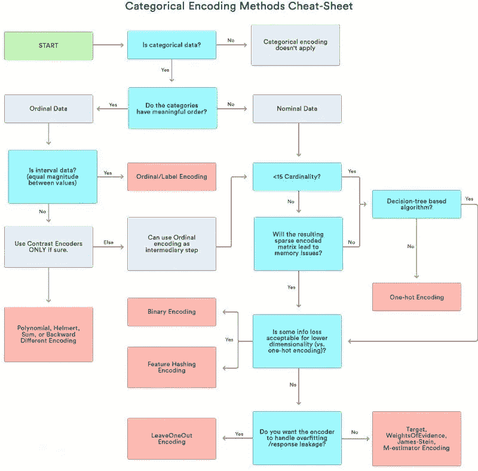
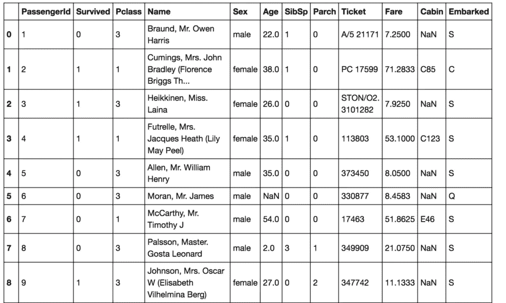
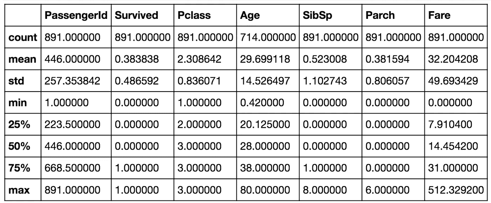
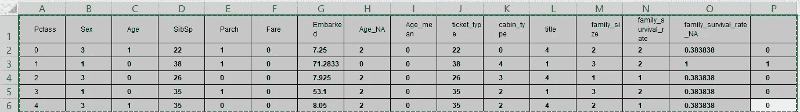

# Titanic 数据集:特征预处理-分类和顺序特征

> 原文：<https://medium.com/codex/feature-preprocessing-categorical-and-ordinal-features-61de71285c3?source=collection_archive---------6----------------------->

我们将涵盖分类和序数特征。特别是，每个模型类型将使用什么样的预处理？分类特征和顺序特征之间有什么区别，我们如何从中生成新的特征？



分类编码方法备忘单

首先，让我们看看泰坦尼克号数据集中的几行，并在这里找到分类特征。他们的名字是性、小屋和登船。



泰坦尼克号数据集



这些是常见的分类特征，但还有一个更特殊的特征，即 Pclass 特征。Pclass 代表票证类别，有三个唯一的值:一、二和三。它是有序的，或者说，有序的范畴特征。这基本上意味着它是以某种有意义的方式排序的。例如，如果头等舱比二等舱贵，或者头等舱应该比三等舱贵。在这里，我们应该注意序数和数字特征之间的区别。如果 Pclass 是一个数字特征，我们可以说第一类和第二类之间的差异等于第二类和第三类之间的差异，但是因为 Pclass 是序数，所以我们不知道哪个差异更大。由于这些数字特征，我们不能以另一种方式排序和整合序数特征，并期望得到类似的性能。

```
*# 1\. check if all values from test set are in train set* **columns** = **['Pclass', 'Sex', 'SibSp', 'Parch', 'Embarked']** for **column in columns:
    print(column)
    print(data_train[column]**.**unique())
    print(data_test[column]**.**unique())****Pclass
[3 1 2]
[3 2 1]
Sex
['male' 'female']
['male' 'female']
SibSp
[1 0 3 4 2 5 8]
[0 1 2 3 4 5 8]
Parch
[0 1 2 5 3 4 6]
[0 1 3 2 4 6 5 9]
Embarked
['S' 'C' 'Q']
['Q' 'S' 'C']**
```

序数特征的另一个例子是驾驶执照类型。要么是 A，要么是 B，要么是 C，要么是 d，再比如教育水平，幼儿园，学校，本科，学士，硕士，博士。这些类别按照越来越复杂的顺序进行排序，这可以证明是有用的。对分类特征进行编码的最简单方法是将其唯一值映射到不同的数字。

通常，人们把这个过程称为标签编码。这种方法在两个方面都能很好地工作，因为树方法可以分割特征，并提取类别中大多数有用的值。另一方面，非基于树的模型通常不能有效地使用这个特性。如果你想在神经网络上训练线性模型 kNN，你需要区别对待分类特征。为了说明这一点，让我们回忆一下这个话题开始时的例子。如果一的 Pclass 通常导致一的目标，二的 Pclass 导致零，三的 Pclass 导致一呢？这种依赖不是线性的，线性模型会被混淆。事实上，在这里，我们可以把线性模型预测，看到他们都在 0.5 左右。这看起来有点固定，但另一边有三个，我们将只进行两次分割，选择每个唯一值并独立达到它。因此，使用这些功能，这些条目可以获得更好的分数。

现在让我们来看看分类特征，并再次应用标签编码。让这成为着手的特征。虽然，在模型中使用它之前，我们不必对之前的特性 Pclass 进行编码。在这里，我们肯定需要这样做。这可以通过几种方式实现。

```
*# encode variables into numeric labels* **le** = **LabelEncoder()

columns** = **['Sex', 'Embarked', 'ticket_type', 'cabin_type', 'title']** for **col in columns:
    le**.**fit(data[col])
    data[col]** = **le**.**transform(data[col])

data**.**head()**
```



列上使用的标签编码器

首先，我们可以按字母顺序或排序顺序应用编码。解决这一特征的独特方式即 S、C、q。因此，可以编码为二、一、三。默认情况下，这被称为 sklearn works 的标签编码器。第二种方式也是标记编码，但略有不同。这里，我们按照出现的顺序对分类特征进行编码。例如，S 将变为 1，因为它在数据中是第一个。然后是 C，我们会把 C 变成 2。而最后一个是 Q，会改成三。

如果以某种有意义的方式对所有内容进行分类，这可能是有意义的。这是 pandas.factorize 函数的默认行为。我要告诉你的第三种方法叫做频率编码。我们可以通过将值映射到它们的频率来编码这个特征。甚至 30%对我们来说等于 C，50%等于 S，剩下的 20%等于 Q，我们可以相应地改变这些值:C 到 0.3，S 到 0.5，Q 到 0.2。这将保留关于值分布的一些信息，并且可以帮助线性和三个模型。如果值频率与其目标值相关，第一个人会发现这个特性很有用。而第二种方法由于同样的原因有助于减少分裂次数。关于频率编码还有一个重要的时刻。

如果你有多个相同频率的类别，那么在这个新特性中它们是不可区分的。我们可以在这里应用或运行分类来处理这种联系。做到这一点是可能的。还有其他方法来进行标签编码，我肯定鼓励您在构建它们时发挥创造力。我们刚刚讨论了标签编码、频率编码，以及为什么这对于基于树的方法很好。但我们也看到线性模型可能会与标签编码的特征发生冲突。识别非基于树的模型的分类特征的方法也非常简单。

我们需要在未来为每个独特的值编写新的代码，并在适当的位置放置一个代码。其他的都是零。这种方法被称为一键编码。让我们在这个简单的例子中看看它是如何工作的。所以在这里，对于 Pclass 特性的每个唯一值，我们只是创建了一个新列。因为，这对于线性方法、kNN 或神经网络很有效。此外，独热编码特征已经被缩放，因为最小特征是零，最大特征是一。

请注意，如果您关心的是不太重要的数字特征，并且一键编码使用了数百个二进制特征，那么树方法就很难有效地使用第一个特征。更准确地说，树方法会变慢，并不总是能改善结果。此外，很容易暗示，如果分类特性有太多的唯一值，我们将添加太多带有一些非零值的新列。为了有效地存储这个新数组，我们必须了解稀疏矩阵。

简而言之，我们可以只存储非零元素，从而节省大量内存，而不是为数组的每个元素分配 RAM 空间。如果非零值的数量远小于所有值的一半，那么使用稀疏矩阵是有意义的。稀疏矩阵在处理分类要素或文本数据时通常很有用。大多数流行的库可以直接处理这些稀疏矩阵，即 XGBoost、LightGBM、sklearn 等等。在弄清楚如何为基于树和非基于树的模型预处理分类特征之后，我们可以快速地看一下特征生成。特征生成的一个最有用的例子是几个分类特征之间的特征交互。这通常对非基于树的模型有用，即线性模型、kNN。例如，让我们假设目标依赖于类特征和性别特征。如果这是真的，线性模型可以针对这两种特征的每种可能组合调整其预测，并获得更好的结果。我们如何才能做到这一点？让我们通过简单地连接两个列中的字符串和一键编码 get 来添加这种交互。现在线性模型可以为每个交互作用找到最佳系数并进行改进。简单有效。更多关于功能交互的信息将在接下来的几周内发布，尤其是关于高级功能的主题。

现在，我们来总结一下这些特点。

1.  序数是分类特征的一种特殊情况，但其值以某种有意义的顺序排序。
2.  标签编码基本上将分类特征的唯一值替换为数字。
3.  在这个术语中，频率编码将唯一值映射到它们的频率。
4.  标签编码和频率编码通常用于基于树的方法。
5.  一键编码通常用于非基于树的方法。
6.  分类特征的交互可以帮助线性模型和 KNN。

它允许非基于树的模型考虑特征之间的交互，并进行改进。我们刚刚整理了分类特征的特征预处理，并快速查看了特征生成。