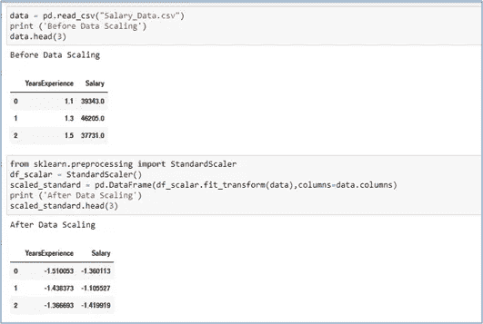
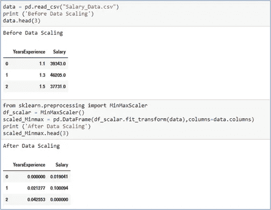
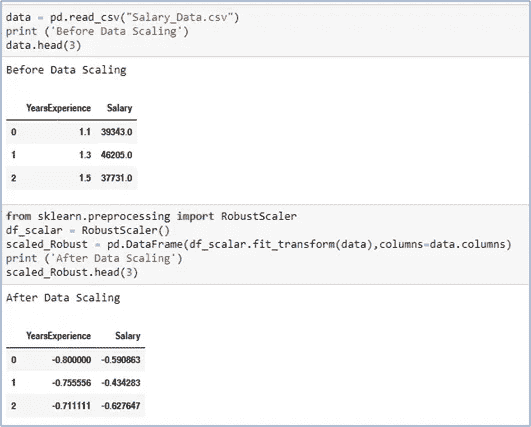
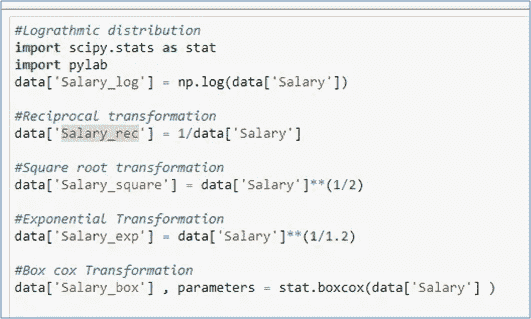

# 机器学习中的特征缩放

> 原文：<https://medium.com/codex/feature-scaling-in-machine-learning-e86b360d1c31?source=collection_archive---------5----------------------->

## [法典](http://medium.com/codex)

# **什么是特征缩放？**

F 特征缩放是数据预处理过程中的一个重要步骤，用于标准化数据集中存在的独立特征。通过标准化，我们的意思是扩展特性，使它们处于相同的范围内。有多种技术可以执行特征缩放。但是，首先，让我们理解为什么这么做很重要。

# **为什么特性缩放很重要？**

在一般情况下，数据集中的每个要素都有一些单位和量值。假设我们有两个特征——年龄和工资，其值如下表所示。机器学习模型将对具有高量值的特征给予高重要性，而对具有低量值的特征给予低重要性，而不考虑值的单位。在我们的例子中，模型将假设“年龄”>“工资”。

现在，让我们更深入地了解这一点，并理解特征缩放如何在不同的机器学习算法中有所帮助:

**1)** **梯度下降的概念** —在线性回归中，我们旨在找到最佳拟合线。为此，我们首先必须用梯度下降的概念找到全局最小值。而且，如果我们缩放数据，我们可以更快地达到这个全局最小值。

**2)** **基于距离的算法**–在 KNN、K-means 和分层聚类等算法中，我们使用欧几里德距离来查找最近的点，因此数据应针对所有特征进行缩放，以使权重相等。否则，在距离计算中，高量值的要素将比低量值的要素权重更大。

**3)** **正态分布假设**-有一些模型，如线性回归和逻辑回归，假设特征为正态分布。因此，我们需要应用一些变换，如对数变换、Box-Cox 变换、指数变换等等，使它们呈正态分布。

需要记住的要点:

1.  *有一些算法，如决策树和集成技术(如 AdaBoost 和 XGBoost ),不需要缩放，因为这些情况下的分割是基于值的。*
2.  *在将数据分成训练和测试后，执行特征缩放是很重要的。如果不这样做，就会出现从测试数据到训练数据的数据泄漏。*
3.  *如果我们计划使用 GridSerach CV 来超调参数，那么如果在交叉验证之前缩放训练数据将导致数据泄漏。这是因为；交叉验证进一步将训练数据分成附加的训练和测试数据。因此，建议使用带有 GridSerach CV 的管道，以便用数据预处理器更恰当地缩放数据。*
4.  *没有什么比最好的变换/缩放技术更好的了。这完全取决于数据的种类和你对业务的理解。*
5.  *可以看出，如果我们对数据进行缩放，准确性和性能通常会提高。*

# **如何进行特征缩放？**

我们将使用 SciKit-Learn 库来演示各种功能缩放技术。

**1)**标准定标器

在这种方法中，我们将所有特征放在一个相似的范围内，以 0 为中心，标准偏差为 1。在异常值的情况下，这个定标器技术将受到影响。因此，当要素呈正态分布时，使用它。

**标准定标器**= Xi–平均值(x)/标准偏差(x)

标准缩放器的 Python 代码

**2)**最小-最大缩放器

该估计器单独地缩放每个特征，使得它在给定的范围内，例如在零和一之间。这种技术主要用于深度学习，当分布不是高斯分布时也是如此。这个定标器对异常值也很敏感。

**最小-最大缩放器**= Xi–最小(x) /最大(x)–最小(x)

最小-最大缩放器的 Python 代码

**3)**鲁棒定标器

当我们的数据中有异常值时，这是一个非常稳健的技术。该缩放器移除中值，并根据分位数范围缩放数据。如果我们的数据包含许多异常值，使用平均值和标准差进行缩放将不起作用。因此，它使用四分位数范围来缩放数据。

**鲁棒定标器**= Xi–Q2(x)/Q3(x)–Q1(x)

鲁棒定标器的 Python 代码

**4)**高斯变换

高斯分布不过是正态分布。如果我们的特征不是正态分布的，我们可以应用一些变换使它们呈正态分布。我们可以使用 Q-Q 图来检查特征是否不是正态分布的。可以使用以下变换:

a.对数变换

b.相互转化

c.平方根变换

d.指数变换

e.博克斯-考克斯变换

高斯变换的 Python 代码

如果您有任何与功能缩放相关的独特经验，我期待您的评论和分享。感谢阅读。