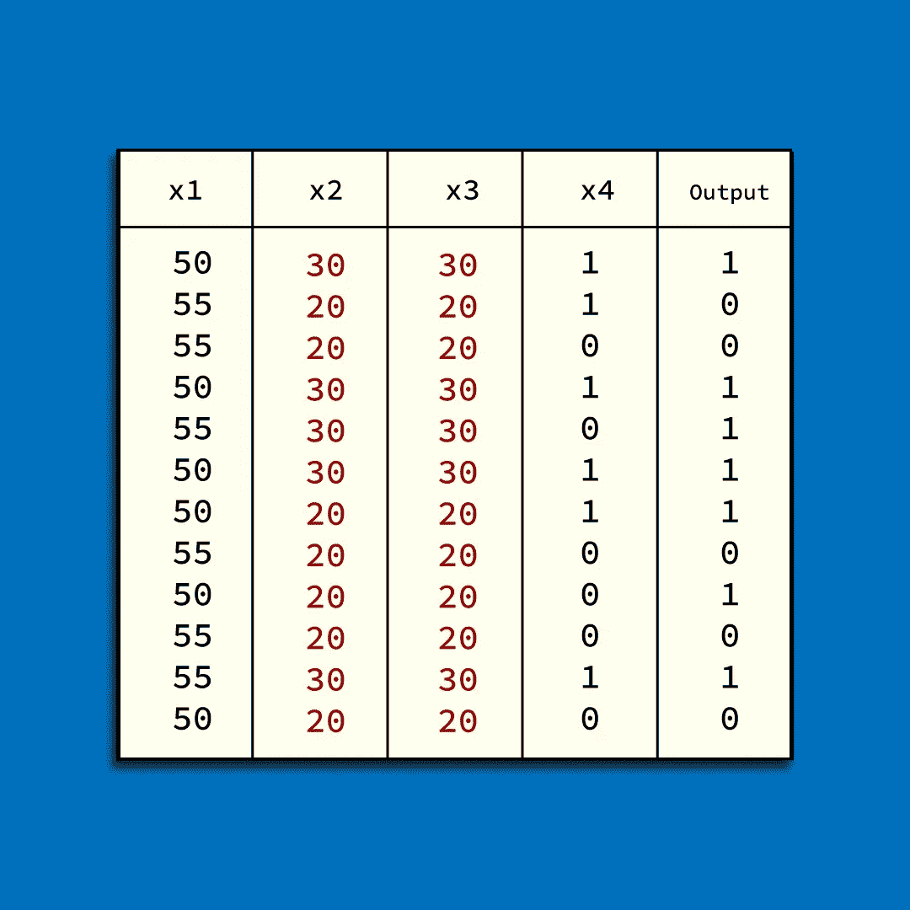
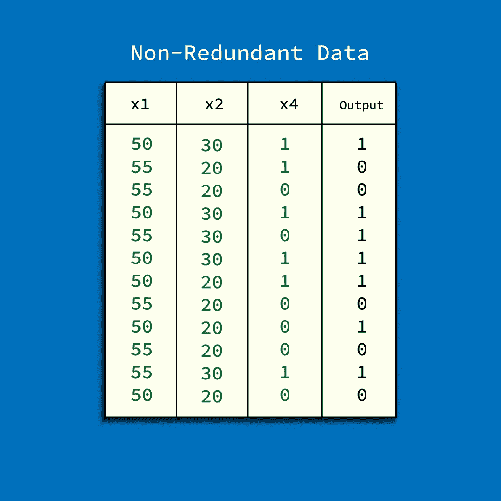
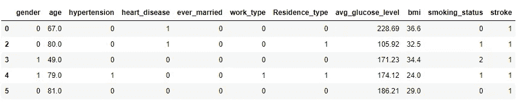
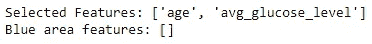
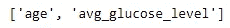
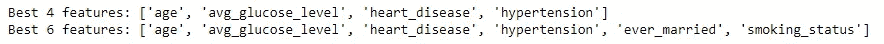

# 机器学习的特征选择算法

> 原文：<https://medium.com/codex/feature-selection-algorithms-for-machine-learning-35507679eab?source=collection_archive---------2----------------------->

## 选择正确的


对于机器学习模型，特征选择是一个可选但重要的预处理步骤。一种常见的做法是在收到机器学习模型数据时就输入这些数据。这是一个非常常见的新手错误，你从任何来源得到的数据总是包含错误。在继续训练模型之前，您必须对这些数据执行两个重要步骤。

1.  数据清理
2.  特征过滤/选择

我在其他文章中多次谈到数据清理，如果你想了解更多，那么你可以查看下面的[博客文章](https://writersbyte.com/featured-post/applied-data-science-with-python-and-pandas/?swcfpc=1)。

[](https://writersbyte.com/featured-post/applied-data-science-with-python-and-pandas/?swcfpc=1) [## Python 和熊猫的应用数据科学

### 数据科学是一项非常重要的技能，已经成为 21 世纪的必备技能。随着数据的增加…

writersbyte.com](https://writersbyte.com/featured-post/applied-data-science-with-python-and-pandas/?swcfpc=1) 

## 特征选择

然而，在本文中，我们将讨论如何从数据集中选择重要的输入要素，从而使其对输出的影响最小并降低数据的复杂性。

首先，让我们谈谈输入变量之间的相关性如何影响机器学习模型。

## 特征之间的相关性

假设您有一个包含以下 2 个要素的数据集，输出标记为 Y，如下图所示。



具有冗余特征的数据集

变量 x_2 和 x_3 在整个数据集中具有完全相同的值。机器学习模型学习对应于每个输出变量的输入变量中的给定模式。现在，对于具有高度相关性的变量(上图中的 x2 和 x3)，其中一个变量没有为我们的模型提供任何有价值的信息。这是因为它们具有相同的模式，就好像它们是相同的变量。



仅包含重要特征的精简数据集

由于这些变量中的一个没有给模型增加额外的信息，我们可以完全删除该特征。你可能会问，保留这样一个变量有什么坏处？

嗯…

1.  它不必要地增加了数据的维度。这增加了训练时间，我们可能会遇到[维数灾难](https://en.wikipedia.org/wiki/Curse_of_dimensionality)的问题。
2.  虽然在大多数模型中，保留该特征可能不会使模型变得“更糟”,但是这种高度相关的变量对不同模型的影响是不同的。这些可能会给模型带来混乱，从而降低性能。

如果你觉得我的工作有帮助，考虑在科菲上支持我。点击下面的图片。

[](http://ko-fi.com/moosaali9906)

点击图片以示支持

## 算法

在这一点上，它可能看起来很简单，只是从 2 个特性中随机删除一个特性。然而，在现实生活中，您很少会发现在整个数据集中显示完全相同的模式/值的变量，因此在移除一个变量或决定两个变量是否高度相关之前，还有一些事情要考虑。

这就是为什么有专门的算法为你决定，哪些变量要保留，哪些要删除。我们将讨论两个这样的算法。

## Boruta 特征选择

Boruta 特征选择算法最初是作为 r 的一个包引入的。它是一个非常有用的算法，可以定义自己的阈值，并从提供的数据集中为您提供最准确的特征。

关于 Boruta 的完整解释和实现可以在[这里找到](https://writersbyte.com/programming/boruta-feature-selection-explained-in-python/?swcfpc=1):

[](https://writersbyte.com/programming/boruta-feature-selection-explained-in-python/?swcfpc=1) [## 用 Python - WritersByte 解释 Boruta 特征选择

### 本文旨在解释，非常流行的，Boruta 特征选择算法。博鲁塔自动化的过程…

writersbyte.com](https://writersbyte.com/programming/boruta-feature-selection-explained-in-python/?swcfpc=1) 

Boruta 对提供的输入特征(每个特征列单独)进行混洗，然后将这些特征(称为阴影特征)与原始数据连接起来。此后，使用随机森林分类器训练完整的数据集。该分类器返回整个输入的特征重要性。然后，博鲁塔将阈值设置为**最强的混洗(阴影)特征。**

重要性级别低于最重要的混洗特征的任何真实特征被丢弃。Boruta 有一个 python 包可以帮助你计算特征。下面演示了它是如何工作的。

```
# install the package
!pip install boruta# import important libraries
import pandas as pd
from boruta import BorutaPy
from sklearn.ensemble import RandomForestRegressor
import numpy as np
```

现在，我们加载数据集并清理它，就像删除 NaN 值并将分类变量转换为数字表示一样。

```
#load data
heart_data = pd.read_csv("healthcare-dataset-stroke-data.csv")# converting to numericheart_data["gender"] = pd.factorize(heart_data["gender"])[0]
heart_data["ever_married"] = pd.factorize(heart_data["ever_married"])[0]
heart_data["work_type"] = pd.factorize(heart_data["work_type"])[0]
heart_data["Residence_type"] = pd.factorize(heart_data["Residence_type"])[0]
heart_data["smoking_status"] = pd.factorize(heart_data["smoking_status"])[0]# additional cleaning
heart_data.dropna(inplace =True)
heart_data.drop("id", axis =1, inplace = True)heart_data.head()
```

最终数据集如下图所示。



心脏中风数据集

现在让我们运行博鲁塔算法。

```
X = heart_data.drop("stroke", axis = 1)
y = heart_data["stroke"]# we will use the randomforest algorithm
forest = RandomForestRegressor(n_jobs = -1,max_depth = 10)
# initialize boruta
boruta = BorutaPy(estimator = forest, n_estimators = 'auto',max_iter = 50,)# Boruta accepts np.array 
boruta.fit(np.array(X), np.array(y))# get results
green_area = X.columns[boruta.support_].to_list()
blue_area = X.columns[boruta.support_weak_].to_list()
print('Selected Features:', green_area)
print('Blue area features:', blue_area)
```



博鲁塔算法的结果

因此，在 10 个原始特性中，Boruta 认为只有返回的 2 个特性是做出任何合理决策的最重要的特性。

## mRMR 特征选择

MRMR 代表*最大关联最小冗余。*当博鲁塔在这些特征中寻找最重要的特征时， **MRMR 确保选择的特征不仅在输入特征之间提供最小的相关性，而且与输出变量有很高的相关性**。

这个算法在下面的[论文](https://bmcbioinformatics.biomedcentral.com/articles/10.1186/s12859-016-1423-9)中首次介绍。

MRMR 以迭代方式工作，它首先会询问您想要保留多少个要素，然后在每次迭代中，它会计算 1 个与输出变量最相关且与数据集中的任何要素最不相关的要素。一旦选择了一个要素，就会将其从原始数据集中移除，并开始下一次迭代，直到 K(我们需要的要素数)次迭代完成。

我将在另一篇文章中解释算法的细节。现在，让我们看看它的 python 实现。

使用以下命令安装 python 包

```
!pip install mrmr_selection
```

你可以在官方的 [Github 库这里](https://github.com/smazzanti/mrmr)找到这个包的完整文档。

用法非常简单。

```
from mrmr import mrmr_classif
selected_features = mrmr_classif(X=X, y=y, K=2)
```

我将 K 设置为 2，只是为了看看所选择的特性是否与 Boruta 返回的匹配。

```
print(selected_features)
```



K=2 时由 MRMR 返回的特征

是的，我们有和上面的 Boruta 算法完全相同的特征。然而，使 MRMR 灵活的是，如果你认为 2 个功能可能不足以让你得到更好的结果，那么你可以选择使用你想要的。

让我们再进行几次测试。

```
# top 4 features
top_4 = mrmr_classif(X=X, y=y, K=4)
# top 6 features
top_6 = mrmr_classif(X=X, y=y, K=6)print("Best 4 features:", top_4)
print("Best 6 features:", top_6)
```



MRMR 为 k = 4 和 k = 6 返回的特征

## 结论

当内存资源不足时，特征选择是一个实时的保护程序，有时甚至可以帮助提高模型的性能。这是建立机器学习模型过程中必不可少的一步。

考虑在科菲问题上支持我。点击下面的图片。

[](http://ko-fi.com/moosaali9906)

点击图片以示支持

要了解更多关于机器学习的知识，你可以看看下面的文章。

[](https://writersbyte.com/featured-post/naive-bayes-python-implementation-and-understanding/) [## 朴素贝叶斯 Python 实现和理解

### 朴素贝叶斯是基于条件概率的贝叶斯定理的机器学习分类器。在这个…

writersbyte.com](https://writersbyte.com/featured-post/naive-bayes-python-implementation-and-understanding/) [](https://writersbyte.com/datascience/implementing-multi-variable-linear-regression-algorithm-in-python/?swcfpc=1) [## 多元线性回归 Python 实现。

### 机器学习算法在过去十年中获得了巨大的普及。今天，这些算法被用于…

writersbyte.com](https://writersbyte.com/datascience/implementing-multi-variable-linear-regression-algorithm-in-python/?swcfpc=1)