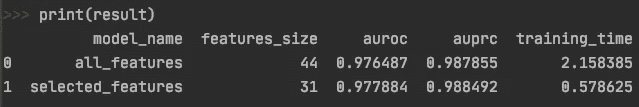
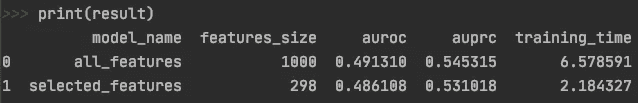

# 具有随机变量的特征选择

> 原文：<https://medium.com/codex/feature-selection-with-a-random-variable-5b9bb6558a66?source=collection_archive---------1----------------------->

## 一个让你选择前 n 个最重要特性的决定不那么武断的技巧


[维多利亚诺·伊斯基耶多](https://unsplash.com/@victoriano?utm_source=medium&utm_medium=referral)在 [Unsplash](https://unsplash.com?utm_source=medium&utm_medium=referral) 拍摄的照片

# 问题

特征选择主要集中在从模型中移除冗余或不相关的特征。该过程是可取的，因为它可以帮助减少模型训练的计算成本，并且在某些情况下，提高模型的预测性能。特征选择中的一个常见类别是嵌入式方法，它由具有自己的特征选择过程的算法实现。一些常见的算法是随机森林，XGBoost 或额外的树。这些基于树的模型根据特征在所有树中提高节点纯度的程度来对特征进行排序。在树的顶端选择的特征通常比在树的底端选择的特征更重要。

然而，**我们如何选择使用这些嵌入方法的最终重要特性列表的截止点仍然是任意的**:

*   我们选择前 n 个特征吗？如果是，为什么是 n 而不是其他数字？
*   我们是否选择重要性值(例如杂质的平均减少量)大于某个阈值的特征？如果有，这个门槛从何而来？

本文关注一个简单的技术，它有助于减少决策的随意性:

> **向候选特征集合附加随机变量(RV)** 。

# 建议

假设 RV 通过基于树的算法以类似于其他候选特征的方式被排序，我们**移除排序低于该 RV** 的所有特征。通俗地说，我们不想要预测能力低于 RV 的特征。我们想要比随机性更好的特征。

为了说明这个想法，我将该技术应用于来自 PMLB 的两个不同的数据集。

## 演示

首先，让我们加载数据集并初始化占位符，以存储我们想要监控的所有模型信息和指标，包括:特征集大小、训练时间、AUROC 和 AUPRC。

```
import numpy as np
import pandas as pd

from sklearn.metrics import roc_auc_score, precision_recall_curve, auc
from sklearn.model_selection import train_test_splitfrom xgboost import XGBClassifier
from time import time
from pmlb import fetch_data***# Fetch data & convert them into appropriate format***X, y = fetch_data(dataset_name, return_X_y=True)
X = pd.DataFrame(X)
y = pd.Series(y)***# Placeholder for model info & metrics*** model_names = []    
training_times = []    
features_set_size = []    
aurocs = []    
auprcs = []
```

现在，我们的功能选择过程可以分为三个主要步骤:

1.  根据均匀分布生成一个随机变量，然后将其追加到要素列表中。
2.  在这个包括 RV 的特征集上训练一个估计器(例如 XGBoost)。
3.  丢弃所有低于 RV 的特征。

```
***# Train-test split*** X_train, X_test, y_train, y_test = train_test_split(X, y, test_size=0.2)

***# Generate random variable from uniform distribution*** X_train["random"] = np.random.uniform(0, 1, len(X_train))***# Use XGBoost as base estimator for feature selector*** selector = XGBClassifier()
selector.fit(X_train, y_train)***# Select features ranked above RV*** df = pd.DataFrame({"feature": X_train.columns,
                   "importance": selector.feature_importances_})
rv_importance = df[df["feature"] == "random"]["importance"].iloc[0]
sel_cols = df[df["importance"] > rv_importance]["feature"].tolist()***# For 2 sets of models: one w/ all candidate features and one w/     selected features*** for model_name in ["all_features", "selected_features"]:
    if model_name == "all_features":
       feature_set = [i for i in X_train.columns if i != "random"]
    else:
       feature_set = sel_cols
    new_X_train = X_train.filter(feature_set)
    new_X_test = X_test.filter(feature_set)
    num_features = len(feature_set)

    start = time() ***# Fit estimator on training set*** model = XGBClassifier()
    model.fit(new_X_train, y_train)

   ***# Validate on test set*** y_scores = model.predict_proba(new_X_test)[:, 1]

   ***# Append metrics results to placeholder*** training_times.append(time() - start)  
   model_names.append(model_name)
   features_set_size.append(num_features)
   aurocs.append(roc_auc_score(y_test, y_scores))
   p, r, _ = precision_recall_curve(y_test, y_scores)
   auprcs.append(auc(r, p))

result = pd.DataFrame({"model_name": model_names, 
                       "features_size": features_set_size, 
                       "auroc": aurocs, 
                       "auprc": auprcs,
                       "training_time": training_times})
```

## 结果

用`dataset_name = "tokyo1"` (n_features = 44，n_observations = 959):



将要素选择应用于 PMLB 中的“tokyo1”数据集时的结果数据框

鉴于 XGBoost 的随机性，在多次运行中，所选特性的数量会略有不同。运行相同的代码片段时，结果可能会有所不同。然而，该技术总体上有助于减少特征的数量，从而减少训练时间，同时仍然保持类似的预测性能。

让我们将这个过程应用于一个高维数据集(n_features = 1000，n_observations = 1600)。



PMLB“配子 _ 上位性 _ 2 _ Way _ 1000 atts _ 0.4H _ EDM _ 1 _ EDM _ 1 _ 1”结果数据帧

由于该数据集最初具有更大的要素集，因此要素选择过程的效果更加明显。特征数量减少到原来的 30%。训练时间显著减少，而预测性能保持不变。

这就是你要做的，又一个添加到你的特性选择工具箱的巧妙技巧:)。