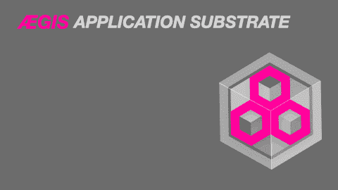

# 联合微服务

> 原文：<https://medium.com/codex/federated-applications-ba396d6925b1?source=collection_archive---------1----------------------->

## 从许多，一个

## 什么是联合微服务？

联合微服务是联合应用程序中可独立部署的组件。在联邦应用程序中，组件在运行时从多个网络位置和存储库中加载。它们不是由单个团队开发的，也不是由单个代码库构建的。多个联合应用程序…