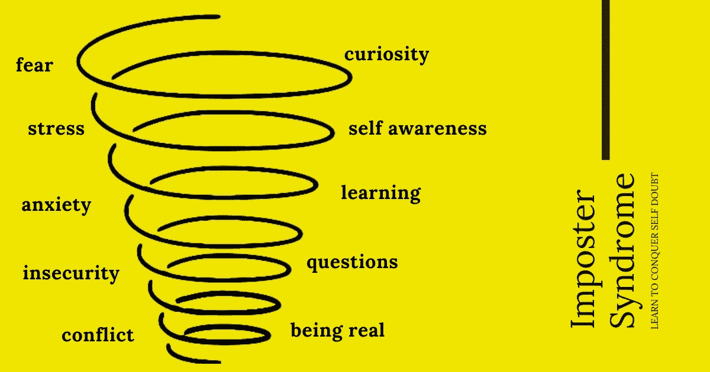

# 感觉到冒名顶替综合症了吗？你并不孤单

> 原文：<https://medium.com/codex/feeling-the-imposter-syndrome-youre-not-alone-cd48d961726a?source=collection_archive---------5----------------------->

## [法典](http://medium.com/codex)

> 阿尔伯特·爱因斯坦曾经说过:“我学得越多，我就越意识到我有多少不知道。”

软件工程是一条当你开始理解一些东西时感觉良好的道路，直到你意识到你真的不理解。编程领域是不断变化和发展的。有时候，你可能会觉得你永远也抓不住…