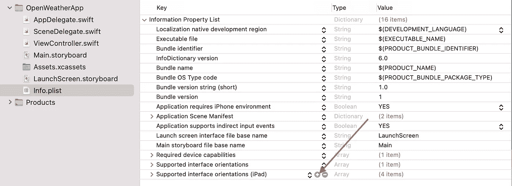
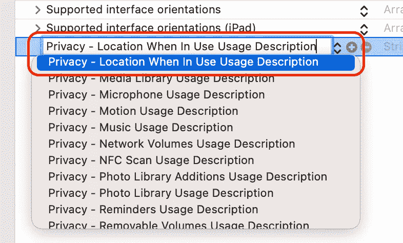
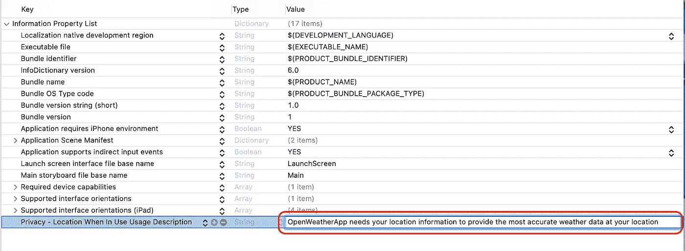
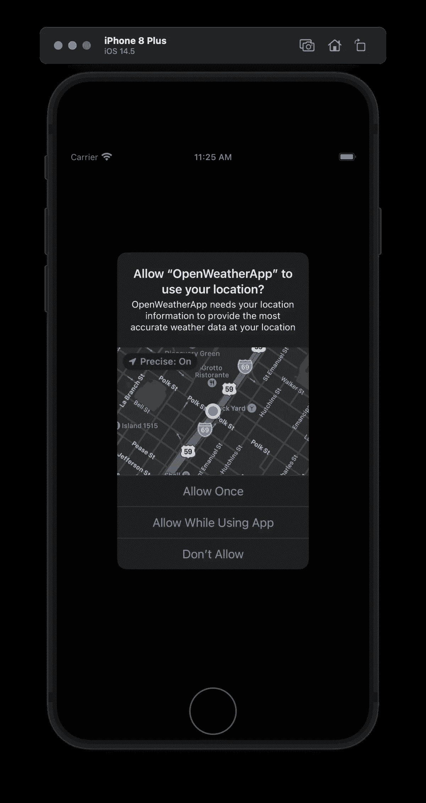
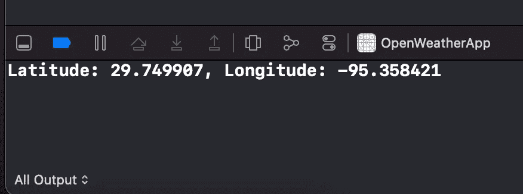
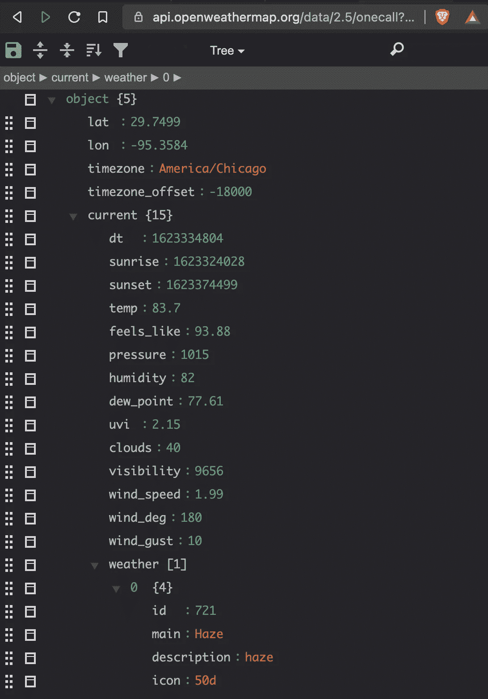
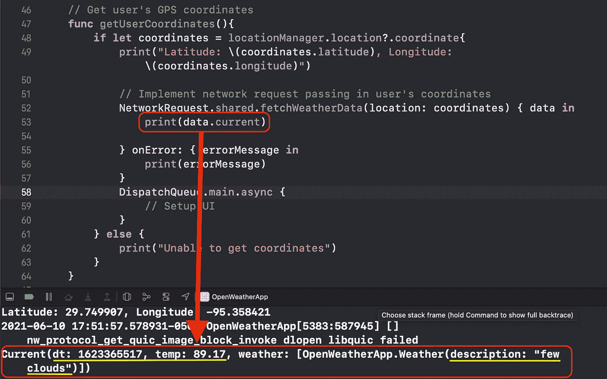
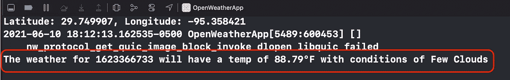
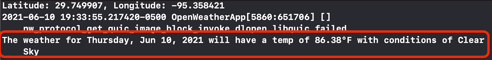

# 使用 URLSession 和 CoreLocation 从 API 端点获取数据— Swift 5.4

> 原文：<https://medium.com/codex/fetch-data-from-api-using-urlsessiontask-and-users-gps-coordinates-b8f56234f28d?source=collection_archive---------4----------------------->

来源: [Pixabay](https://www.pexels.com/photo/time-lapse-photography-of-blue-lights-373543/)

我最喜欢的 iOS 开发功能之一是连接到 API 端点和使用 CoreLocation，特别是用户的 GPS 坐标。构建一个使用用户的 GPS 坐标来确定他们周围数据的应用程序并没有什么了不起的。无论是寻找餐馆、公园还是著名的地标，将用户的 GPS 坐标融合到 API 端点来传递用户正在寻找的信息都非常有趣。

长期以来，我个人一直使用 AlamoFire 和 SwiftyJSON 第三方库来查询 API 端点并处理接收到的 JSON 数据。这两个库就像豌豆和胡萝卜一样，它们被广泛使用也就不足为奇了。然而，当有本地语言的更新时，我读到的第三方库*破坏*越多，我就越确信要坚持使用本地库和它们的方法来避免这样的风险。此外，我正专注于成为一名专业的 iOS 开发人员，而寻求这类专业人员的公司正在寻找在原生库中的经验。为了有更好的机会成为一名 iOS 开发人员，我需要确保我在本地库和方法方面的知识得到很好的提升，所以我决定继续使用 URLSession 和 JSONDecoder。我必须说，在使用 URLSession 和 JSONDecoder 之后，我发现它并没有那么糟糕。

也就是说，我将带您了解如何使用 URLSession 查询 API 端点，使用 CoreLocation 查询您自己的 GPS 坐标，并使用 JSONDecoder 处理接收到的 API 数据。我们将使用 OpenWeatherMap API 端点，所以如果你想跟进，请前往 [OpenWeatherMap 注册一个帐户](https://home.openweathermap.org/users/sign_up)并获得一个 API 密钥。

**那么下面是我们需要做的事情的大纲:**
1。设置 LocationManager 以检索用户的位置
2。获得用户的许可以获取他们的 GPS 位置
3。设置网络请求以连接到 OpenWeatherMap 的 API 端点
4。构建一个数据模型来匹配端点的响应
5。用 JSONDecoder
6 解码数据响应。重构网络请求以接受用户的 GPS 坐标，并确保正在查询用户位置的数据。
7。打印出一份可读的天气报表，包括星期、日期、当前温度和天气状况。

让我们从访问用户的位置开始。我们需要实现各种函数和委托方法。我将使用 Storyboard 打开一个干净的 Xcode 项目。在默认的 *ViewController.swift* 文件中，添加以下代码行:

正如您在 viewDidLoad()方法中看到的，我们希望在应用程序加载后立即触发 checkLocationServices()函数，以便它可以发现位置服务是否已设置。如果没有设置定位服务，它会为我们处理。在 checkLocationServices()函数中添加以下代码:

我们要求这个函数做的是检查 LocationServices 是否已启用，将 ViewController 指定为负责人(委托人)来检查 LocationServices 是否已启用，并将精确度设置为最佳的。如果没有启用定位服务，我们可以提醒用户如何在 iOS 设置应用程序中启用定位服务。

既然我们让 ViewController 负责设置 LocationManager，那么它需要请求用户允许获取他们设备的 GPS 坐标。幸运的是，有一个 LocationManager 委托函数处理这个名为**的 location manager(diddupdatelocations:)**:

*checkLocationAuthorization()*函数是一种确定如何处理**类型的简洁方法。我们可能遇到的授权状态**选项。让我对每个选项做一个简单的概述:
**-。受限:**此状态与 iOS 中的家长控制相关，用于限制儿童使用的 iOS 设备。可以理解的是，父母反对他们的孩子分享他们的位置，所以这种状态选项是非常合理的。如果必须使用设备的位置数据，我们会触发一个 UIAlertController 事件，通知用户需要他们的位置服务的重要性。我建议将用户链接到你的应用程序的隐私政策页面。
**-。notDetermined:** 该状态与用户没有选择是否允许应用程序使用他们的位置有关。这种状态几乎从未使用过，因为大多数应用程序已经确定它已经访问或不访问定位服务，但这是一个很好的故障保险。如果**。未确定的**状态是活动的，我们触发**requestwhenuinuseaauthorization()**位置管理器方法来请求用户对其位置的许可。
- **。拒绝:**这个状态是不言自明的。这种活跃状态明确限制了应用程序使用用户的位置数据。就像**一样。受限**状态，如果用户想要使用应用程序，并且必须使用用户的位置数据，我们可以使用 UIAlertController 来触发一个事件，通知用户如何允许应用程序访问他们设备的位置数据。
- **。authorizedWhenInUse:** 这种状态也是不言自明的，用户允许应用程序使用他们设备的位置数据。这里是我们触发函数集的地方，它继续访问和使用用户的位置数据。在这种情况下，触发获取设备的 GPS 坐标的功能以及在用户移动时监控位置的位置管理器委托功能。

既然我们已经设置了我们的函数来确定位置授权状态，我们必须配置应用程序的 **Info.plist** 文件，在该文件中它向用户请求权限。如果没有此设置，应用程序将在构建时崩溃，并将抛出一个控制台错误，通知您 Info.plist 文件没有正确配置，无法继续向用户请求权限。

前往应用项目的项目导航器，选择**信息列表**。选择 Info.plist 后，您将看到一个预定义键的列表，以及与它们相关的类型和值。我们要再加一个键。

将鼠标悬停在最后一个列出的键上，并点击左侧所示的 **+** 符号。这将允许您添加新密钥。

开始输入**隐私**，使用时选择**位置选项使用说明**，找到后回车添加。

添加后，您将需要添加一个 String 类型的键，通知用户为什么需要使用他们的位置数据的权限。这就是当应用程序加载时触发位置管理器委托方法时，将弹出的 UIAlert，让他们知道我们正在寻求他们的许可。作为值，我添加了 *OpenWeatherApp 需要您的位置信息，以提供您所在位置的最准确的天气数据*。

既然我们已经更新了 Info.plist 来请求用户的位置数据权限，那么让我们返回到 **ViewController.swift** 文件，将我们的**checkLocationAuthorization()**函数添加到适当的委托方法中，该方法触发并确定我们是否可以获取用户的位置。为此，将**checkLocationAuthorization()**函数添加到**locationmanagerdichangeauthorization(_ manager:)**方法中。

在构建和运行我们的应用程序之前，我们需要配置 **getUserCoordinates()** 函数，以确保我们有权访问用户的位置，并将他们的坐标打印到调试控制台。记住，该功能是在**时触发的。授权状态**为**。授权时间使用**。这很容易设置和构造，允许我们在确认我们确实有用户的 GPS 坐标后，触发从 OpenWeatherMap 端点获取天气数据的网络请求:

在上面的函数中，您可以发现在调用网络请求并完成从 API 端点下载数据之后，我们可以在主线程中的何处更新 UI。

现在是关键时刻了，看看我们是否能够 **1)** 请求用户允许获取他们的 GPS 坐标并 **2)** 打印坐标。继续运行您的应用程序。

如果一切按计划进行，您应该会看到类似下面的屏幕。使用 App 选项时，可以选择**允许。**

将会出现一个空白屏幕，这很好，因为我们没有添加任何 UI 元素，但是检查 Xcode 控制台。您应该会看到如下所示的纬度和经度坐标。

如果您希望查看您所在位置的坐标，您可以谷歌您所在城市的 *GPS 十进制坐标*，并在位于**功能>位置>自定义位置**的模拟器位置配置中手动输入这些坐标，然后重新运行您的应用程序。对于更精确的 GPS 坐标，您可以在 iOS 设备上构建并运行您的应用程序。

现在我们已经获得了 GPS 坐标，是时候编写网络请求来查询 OpenWeatherMap API 端点了。然而，在我们将这些放在一起之前，我喜欢编写数据模型来容纳从端点查询的数据。我这样做只是因为数据模型需要在网络请求中实现。让我们从那个数据模型开始吧！

下面是来自 OpenWeatherMap API 端点的**当前**天气 JSON 层次的截图。您可以找到每分钟、每小时和每天的天气数据，但对于这个演示，我们将只关注当前的天气数据。如果您希望拥有其他 3 种天气数据类型，您可以随时修改数据模型以适应它们。

对于这个演示，我只对终端的几个参数感兴趣。您可以容纳所有参数，但我重点关注的几个参数是***【dt】******temp***和 ***描述*** 。Int 类型的 DT 是自 1970 年以来的秒数，所以我们稍后将创建一个函数来将其转换为更容易阅读的日期。Int 类型的 *Temp* 是温度，String 类型的 *Description* 是当天的天气情况。

在左边，您会发现为适应上述三个参数而编写的数据模型。第一个名为 **WeatherData** 的结构是初始端点响应，您将在其中捕获当前数据。我已经创建了一个名为 *current* 的 current 类型的变量。在此之下，我创建了另一个名为 **Current** 的结构来关联上面的结构。在这个结构中，我添加了 3 个变量:Double 类型的 ***dt*** 、Double 类型的 ***temp*** 和【weather】类型的 ***weather*** 。如果你参考 JSON 层次结构，你会看到**天气**是一个带有嵌套参数的数组，这就是为什么 ***天气*** 的类型是【天气】。我创建了另一个名为 Weather 的结构，其中有一个名为 **description** 的 String 类型的变量，以适应前面结构中的[Weather]类型。**请注意**，变量名需要与 API 端点的参数名一对一匹配，否则在调用端点时会收到响应错误。

现在我们已经建立了模型，让我们处理查询 OpenWeatherMap API 端点的网络请求。创建一个名为 *NetworkRequest.swift* 的新 Swift 文件。最初，该文件会默认导入*基础*库，但是我们需要导入*核心位置*。导入 CoreLocation 后，我要写两个 typealias 声明。我喜欢使用 typealias，因为它使代码更具可读性。一会儿你就知道了:)

为了帮助在整个应用程序中全局重用网络请求功能，我将使用一个包含 URLSession datatask 的单例类结构:

如您所见，fetchWeatherData 函数接受 CLLocationCoordinate2D 类型的参数和两个完成处理程序结果 onSuccess 或 onError。对于这两个结果，我们传入前面编写的 typealias 声明。

现在我们已经设置了网络请求，让我们回到 **ViewController.swift** 文件来实现这个单例函数。在文件中，找到 getUserCoordinates()函数。在函数内部，我们将调用 fetchWeatherData(location:)singleton 函数，将**坐标**常量传入**位置**参数。突出显示 OnApiSuccess 代码位置标记，然后按 enter 键。将变量命名为*数据*。对于 OnApiError code place mark，点击回车，将字符串命名为 *errorMessage* :

将 print 语句添加到 onSuccess 块中，以打印出**数据。这将把查询的数据从 OpenWeatherMap API 端点打印到控制台。如果有某种错误，向 onError 块添加一个 print 语句来打印错误消息。**

构建并运行应用程序。您应该可以在控制台上看到当前的天气数据。请注意，控制台中的结果值会有所不同，因为天气条件可能与我的不同；只要你看到印有数值的 **dt** 、 **temp** 和 **description** ，你就处于良好状态:

现在我们已经打印了数据，让我们将三个端点参数中的每一个参数分配给我们可以轻松使用的属性:

我创建了三个属性:date、temp 和 weatherCondition(字符串类型)。将 *data.current.dt* 赋值给 ***date*** 和 *date.current.temp* 赋值给 ***temp*** 。因为当涉及到天气描述时，我们正在处理数组中的嵌套数据，所以我们需要为 循环配置一个 ***来访问描述参数，并将值赋给 **weatherCondition** 变量。在 ***for*** 循环块后，添加以下打印语句: ***print("天气\(日期)将有一个温度为\(temp) F 的条件为\(weatherCondition！。大写))*** 。构建并运行您的应用程序。您应该会看到与以下打印语句类似的格式副本:***

现在，有一点很明显，dt 的值没有被正确地格式化为人类可读的日期。我们希望看到有日期的一周中的某一天。所以让我们继续努力:

从上面可以看到，我创建了一个名为 current date from(UNIX date:Double？)接收一个类型 Double 值并返回一个可读的日期。然而，这个日期的问题是它太专业了。它将输出类似***2021–06–10 23:46:19+0000***的日期和时间。我们希望能够显示星期几。这就是 ViewController 类之外的日期扩展的用武之地。这有助于我们定制一个更加格式化的日期和日子，在用户界面上看起来更整洁。结果将类似于***2021 年 6 月 10 日星期四*** 。如果你好奇还能返回什么其他日期格式，请看我一直引用的这个 Stack Overflow [post](https://stackoverflow.com/a/52297497/12773302) 。

让我们回到 getUserCoordinates()函数内部，修改声明的 ***日期*** 常量。目前配置为:
let date = data . current . dt。
让我们使用新的 currentDateFrom(unixDate:) func 并键入 Date dayAndDate()函数。将声明修改为:
*let date = self . current date from(UNIX date:data . current . dt)？。dayAndDate()。*我们现在做的是将 Double 类型的 data.current.dt 的值作为参数传入*current date from(UNIX date:)*函数，它返回可读的日期和时间。不止于此…现在我们追加了日期类型 *dayAndDate()* 函数，它将结果自定义为星期几和日期(月、日、年)格式。现在，修改后的 NetworkRequest 函数应该如下所示:

构建并运行您的应用程序，您应该会在控制台上看到以下内容:

注意日期是如何被很好地格式化的，并且在 UILabel 中可读性更好。

现在，作为对您的一个挑战，在 print 语句下面，添加*dispatch queue . main . async {…}*代码块。在这个代码块中，你开始更新 UI，这将是你的应用程序的主线程，你应该更新 UI。

这将结束使用 URLSession 和 JSONDecoder 从 API 端点下载数据的演示，同时利用用户的 GPS 坐标。如果你遇到困难或碰壁，请随时联系我。感谢阅读！

编码快乐！